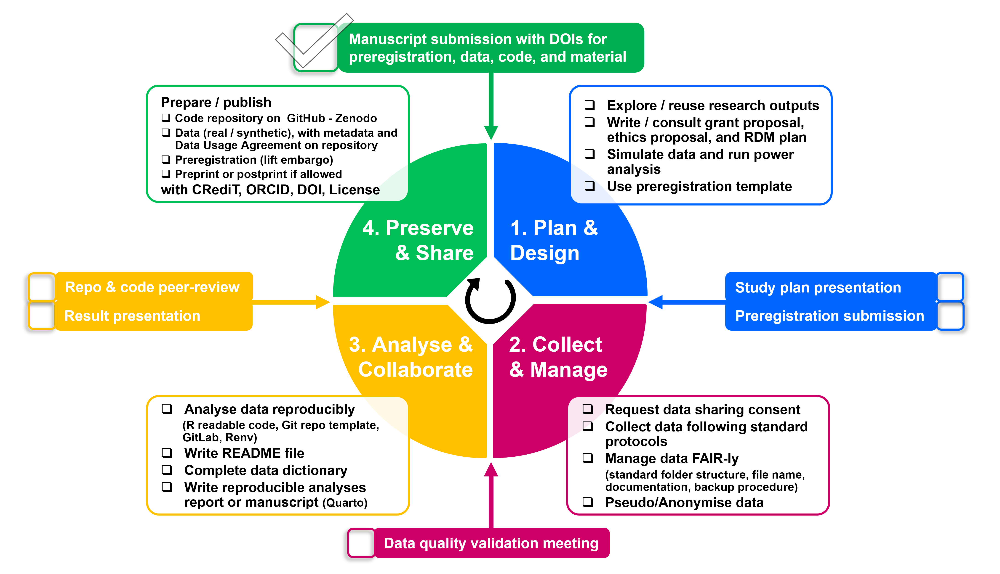

::: {.callout-note collapse="true" title="Instructor notes"}
- Bring empty name tags and board markers.
- At the end, collect the name tags (and bring them along next time)
- Add the Moodle task where students submit their p-hacking results.
- Submit the CREP application
:::

## Overview

| Topic                                            | Duration | Notes                                                                                                 |
| :----------------------------------------------- | :------: | ----------------------------------------------------------------------------------------------------- |
| Introduction                                     |    5     | Ankündigung: Zeitslot: 10:00 (s.t.) -13:00, aber bis 14:00 freihalten. Alle in Moodle eingeschrieben? |
| Empra Formalia                                   |    25    | [Slides](../slides/Empra-Orga/Empra-Orga.qmd).                                                        |
| Students' introduction                           |    15    |                                                                                                       |
| Threats to credible research lecture, part 1     |   100    |                                                                                                       |
| Break                                            |    15    |                                                                                                       |
| Introduce the replication target study proposals |    15    |                                                                                                       |
| Explain Homework                                 |    5     |                                                                                                       |

: {.striped}

## Personal Introduction

- Your name
- Where do you originally come from, and where do you live now?
- Why did you choose psychology?

## What will we cover in the course? The research cycle

*([Figure](https://zenodo.org/records/17661040) by Malika Ihle, CC-BY 4.0)*

## Threats to credible research lecture - part 1

Join the live survey: <https://partici.fi/33173261>

{width=200}

## Homework

- "individual" means: Everybody does the task on their own and uploads an individual report/result.
- "group" means: The working group submits a joint document.
- "collaborative" means: Everybody contributes to a single joint online document, or the group makes a joint decision.

### Homework 1 (collaborative; 5 min each)

**Can I trust the quality of product (when I do not have access to all information)?**

Take the strategies from both buyers and sellers from the "Used Car Exercise" and transfer them to scientific publications as the product of which the quality should be checked. Maybe not all strategies can be transferred, and probably not all possible strategies do exist yet. Be creative!

Example:

| Used Cars                                                                        | Scientific publications                                                              |
| -------------------------------------------------------------------------------- | ------------------------------------------------------------------------------------ |
| Do a test drive to check whether the claim of the seller ("no noise") is correct | Do a reproduction to check whether the claim of the authors is (numerically) correct |
|                                                                                  |                                                                                      |

Do this in the collaborative Etherpad in Moodle.

### Homework 2 (individual)

- Create an [ORCID ID](https://orcid.org). You can use "Ludwig-Maximilians-Universität München" as affiliation.
- Create an [OSF](https://osf.io) account (use your real name; link your ORCID ID).

### Homework 3 (collaborative)

Decide which study we want to replicate.

