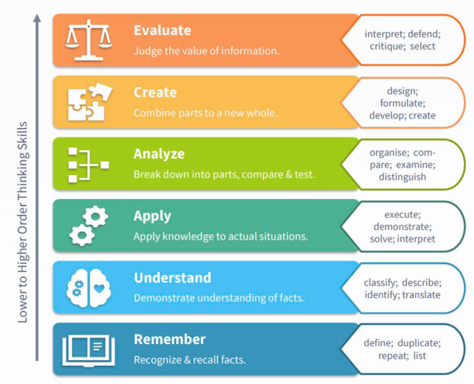

## 
{.img-full}

::: footer
Image created by ChatGPT
:::


##  You last AI usage

Think about the last time you used generative AI. Write down in bullet points:

- What was the task you gave?
- Why did you use AI (instead of doing it yourself)?
- Did you personally learn something through the AI usage? If yes, what?
  

## Two extreme positions
### ... and a middle ground

:::{.incremental}

- Full rejection: "Every AI usage is like plagiarism. AI will first kill your cognitive abilities and down the road kill humanity."
- Full surrender: "No need to think myself. I have three subscriptions of all major AI providers, they are now doing the work for me."
- An intermediate position:
  - AI will not go away.
  - There are both detrimental misuses and useful applications.

::: {.callout-box .fragment}
But what is a "responsible/functional usage" in the context of university teaching?
:::

:::


## Useful / not useful?

::: {.quiz-card}

::: {.quiz-badge}
QUIZ
:::

You want to learn Italian for your next holiday. You are using Duolingo, and realize that you can complete the little homework assignments much faster when you paste the task into ChatGPT and copy the result. (And you also get a much better score.)

::: {.quiz-options-box}

::: {.quiz-options-title}
Choose one answer
:::

☐ Useful 👍

☐ **Not** useful 🤮
:::
:::


# Three AI uses of a learner

## (A) "AI as a crutch"

You delegate tasks which you are not able to do yourself.

AI improves immediate output and speed, but can reduce learning, transfer, or independent problem-solving.

➡︎ Performance gains while using the tool, but no personal growth.

::: {.callout-important}
Many AI-related studies do not properly distinguish performance *while using the tool* and learning gains.
:::

::: footer
Salomon et al. (1991). Partners in Cognition: Extending Human Intelligence with Intelligent Technologies. *Educational Researcher, 20(3)*, 2–9. <https://doi.org/10.3102/0013189X020003002>
:::

## The AI Crutch
### Even detrimental for your cognitive abilities?

::: {.incremental}
- Excessively offloading cognitive tasks to genAI risks reducing active cognitive engagement, which is crucial for deep encoding (thorough integration of knowledge into memory), effective retention (long-term storage) and meaningful transfer
- AI use for argumentative essay writing can foster “metacognitive laziness”
  - meta-cognition = independently judge the quality of work, identify areas that need improvement, actively regulate own learning process
- Reduces intrinsic motivation: The joy of working through a problem and then solving it yourself
- When you take the tool away, performance can be worse than when you never had the tool [(Bastani et al., 2024)]{.smallnote}

:::

::: footer
quoted from Yan et al. (2025). Distinguishing performance gains from learning when using generative AI. *Nature Reviews Psychology, 4(7)*, 435–436. <https://doi.org/10.1038/s44159-025-00467-5>. See also Bastani et al. ([2024](https://papers.ssrn.com/sol3/papers.cfm?abstract_id=4895486))
:::

## ZEIT Artikel
### "[Ich habe mich selbst als KI nachgebaut. Sieht nicht gut aus für mich](https://www.zeit.de/2026/26/ki-agent-telefon-kommunikation-stimme-alltag-freunde)":

::: {.smaller .incremental}
- "In den vergangenen Wochen hat sich das Verhältnis zwischen mir und meinem Agenten grundlegend verschoben. Ich hatte ihn erschaffen, weil ich mir einen persönlichen Assistenten gewünscht habe. Aber jetzt fühlt es sich fast so an, als sei ich selbst der Assistent eines unberechenbaren Talkmasters."
- "Die eigentliche, anspruchsvollere Arbeit übernimmt jetzt mein Agent. So sind wir zu einem verblüffend effizienten Team geworden: Ich füge mich in meine Degradierung und übernehme die Hilfs- und Zuarbeiten."
- "»Ich fürchte, KI hat das Potenzial, uns selbst robotischer zu machen«, sagt Frey. Je mehr an Denkarbeit, an Kreativität und Fantasie wir an die Maschine abgeben, so seine Sorge, desto schematischer, gedankenärmer und maschineller werden wir selbst."
:::


## (B) "AI as a tool/ co-worker"

- You delegate subtasks to AI which you could perform yourself.
- As a supervisor, you are able to evaluate the quality of the outputs and can redirect the tool
- AI use makes you more efficient


## (B) "AI as a tool/ co-worker"
### "Intellektuelle Souvernänität"

> Intellektuelle Souveränität ist die Fähigkeit zum freien und selbstbestimmten Handeln in der Wissensaneignung und Wissensproduktion sowie die Fähigkeit, autonom zu denken und Entscheidungen selbst argumentativ zu begründen.

::: footer
Wissenschaftsrat (2026): Intellektuelle Souveränität: Empfehlungen für die Hochschulbildung in Zeiten von generativer KI; Köln. <https://doi.org/10.57674/1evx-t906>
:::

## (C) "AI as a tutor, not solver"

AI provides explanations, feedback, individualized pacing, and reflective support that can improve durable learning ("scaffolding").

➡︎ Lasting cognitive benefit after the tool is gone.

::: footer
Salomon et al. ([1991](https://doi.org/10.3102/0013189X020003002)). TED talk Sarkar (2015): [How to stop AI from killing your critical thinking](https://www.ted.com/talks/advait_sarkar_how_to_stop_ai_from_killing_your_critical_thinking)
:::

## The roles of AI in Statistik 1 seminar

::: {.incremental}
- **Crutch**: You copy and paste the task of the R-Tutorial into 🤖 and paste the answer into your homework sheet. It works, but you have no idea how it works.
- **Tutor**: You first try to complete the task yourself. When you are stuck, you ask 🤖 to help you by guiding you step by step through the process.
- **Tool**: You know how to program in R, and solved the task yourself. Last minute, you want to make the resulting plot very pretty and use 🤖 for styling options.
:::

##  Going back to your own AI use

<https://partici.fi/33173261>

{width=200}


## Simple Answers about New Technologies

{.img-full}

::: footer
[XKCD 1289 "Simple Answers"](https://xkcd.com/1289/). CC-BY NC 2.5
:::


## Theses
### (1) Writing is thinking

> New boss: “You’re good at writing notes.”
> 
> Me: “Thank you, it helps me to remember so I have been writing summaries for many years.”
> 
> New boss: “You should try CoPilot and see what it can do.”
> 
> Me: “Well I enjoy summarizing my notes, and it helps me to learn and remember.”
> 
> New boss: “Let me show you something I did in CoPilot.”
> 
> Ugh. Writing it myself helps me LEARN and REMEMBER. Why are these AI zombies so intent on changing a process that is helpful to me? Feeding notes through CoPilot won’t benefit me when it’s the act of writing that works for me.

::: footer
Neumann, R. (2026). KI in der Wissenschaft — Die Abkürzung des Denkens? <https://www.laborjournal.de/blog/?p=15093>; Toot from <https://zeroes.ca/@VeeRat>
:::


## Theses
### (2) AI competence is not "better prompting"

... but rather:

- critical thinking skills
- emotional competency: How can I trust in my own creativity? How can I keep up my intrinsic motivation?
- "Critical Artificial Intelligence Literacies (CAILs) is the collection of ways of thinking about and relating to so-called artificial intelligence (AI)." [(Guest et al., 2025)]{.smallnote}

::: footer
Guest et al. (2025). Towards Critical Artificial Intelligence Literacies. *Zenodo*. <https://doi.org/10.5281/zenodo.17786243>
:::

## Theses
### (3) Using AI as a delegate: Only as a competent supervisor

You should be ...

1) able to complete a task yourself and 
2) have the knowledge to evaluate someone else's work. 

Only then you can responsibly use AI to speed up your work.
Open question: How much knowledge is enough?


## Theses
### (3) Using AI as a delegate: Only as a competent supervisor

Note: According to Bloom's thinking Skill Taxonomy, "Evaluate" is the *highest* level!

{.img-full}


## Theses
### (4) Crutch? Only for one-shot tasks

Use AI only as a crutch for one-shot tasks - things you know that you will never do again (or not very often).

## Wrap-up

:::: {.columns}
::: {.column width='40%'}
**Theses**

(1) Writing is thinking
(2) AI competence is not "better prompting"
(3) Using AI as a delegate: Only as a competent supervisor
(4) Crutch? Only for one-shot tasks
:::

::: {.column width='60%'}
**Discussion questions**

- What do you want to get out of your years in university? Do you actually want to learn something?
- GTD: Is AI use cognitively detrimental in the long run? (We forget how to use our brain)
- How much dependency on US tech-oligarchs do we accept?
- How much water consumption, CO2 emissions, and destruction of our environment do we accept for creating useless AI slop?
:::
::::


## I want AI to do my laundry so that I can do arts and music
### Reality:

{.img-full}

::: footer
Found on Mastodon; I could not find the original source (AFAIK a Dutch newspaper)
:::


## Resources

- [23 TrainingThings for AI-assisted instructional design](https://zenodo.org/records/17237958)


<!-- Footer insert below -->
```{r child="../../common/lastslide.qmd"}
```
