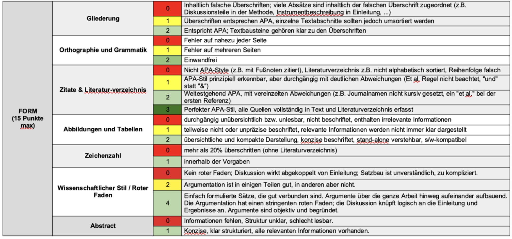

<!-- Dauer: 25 min. -->

## Ziele
### Wissenschaftliches Arbeiten und Denken in der Psychologie kennenlernen 

- Eine empirische Fragestellung entwickeln
- Eine Studie planen und durchführen
- Die Daten auswerten
- Einen wissenschaftlichen Bericht verfassen

## Ziele
### Kerncurriculum "Gute wissenschaftliche Praxis" 

- **Stichprobenplanung**, in der Regel eine a-priori Poweranalyse
- **Präregistrierung** der Hypothesen, Operationalisierungen, Stichprobenplanung und der statistischen Analysemethode
- **Open Data** (mit Codebuch): Offene Daten als Standard für vertrauenswürdiges Forschen
- **Reproduzierbare Analyseskripte**

## Ziele
### (1) Eine empirische Fragestellung entwickeln

- Der Weg zu einer interessanten, empirisch prüfbaren Fragestellung
- Forschungsthema: Durch das Empra vorgegeben
- Literaturrecherche: Was gibt es schon? Wo sind die Forschungslücken?
- Entwicklung von prüfbaren Hypothesen

## Ziele
### (2) Eine Studie planen und durchführen

::: {.smaller}
- Studiendesign entwickeln:
  - Operationalisierung von Konstrukten
  - Stichprobe planen (Population, Stichprobengröße -> Poweranalyse)
  - Experimentelles Design: Wie kann man kausale Effekte messen? Evtl. Kontrolle von Störvariablen
- Praktische Versuchsplanung
  - Akquise Vpn
  - Material entwickeln
  - Experimentalsoftware programmieren
- Präregistrierung: Hypothesen, Design, Operationalisierung, Analysen
- Durchführung der Datenerhebung: Rekrutierung, Erhebung, Betreuung
:::

## Ziele
### (3) Die Daten auswerten

- Wir arbeiten mit R
- Datenkodierung und –aufbereitung
  - das Preprocessing reproduzierbar machen
  - Anonymität berücksichtigen
- Statistische Auswertung
  - Deskriptivstatistik
  - Zu den Hypothesen passende Analysen rechnen
  - Analysen durch reproduzierbare Skripte nachvollziehbar machen


## Ziele
### (4) Einen wissenschaftlichen Bericht verfassen

- Kommunikation der Forschung in die Fachöffentlichkeit
- Den Prozess nachvollziehbar machen: Quarto als reproduzierbare Art, einen Bericht zu schreiben
- Aufbau eines wissenschaftlichen Artikels:
  - Einleitung
  - Methode
  - Ergebnisse
  - Diskussion
- Bericht = Hausarbeit als Prüfungsleistung


## Formalia des Empras

::: {.smaller}
- Unterricht in Kleingruppen (UK) mit 9 ECTS-Punkten
- ≙ 3 Vorlesungen mit Klausur bzw. 3 Seminare mit Referat & schriftlicher Ausarbeitung
- ≙ 12h Zeitinvestition pro Woche (Präsenz + Vor- und Nachbereitung)
- Anwesenheitspflicht: max. 2 Fehlstunden ohne Attest
- Lektüre der für den jeweiligen Termin angegeben Literatur bzw. gründliche Erledigung der zugeteilten Aufgaben
- Aktive Mitarbeit bei der Datenerhebung
- Anforderungen für Hausarbeit (siehe nächste Folie)
:::


# Hausarbeit

## Hausarbeit
### Formalia

::: {.smaller}
- Schriftgröße 12pt, Zeilenabstand 1.5x
- 15.000 Zeichen +/- 20% (Zählung inkl. Leerzeichen; ohne Deckblatt, Referenzen und Anhänge)
- Deckblatt: Titel, Datum, Name, Matrikel-Nr., Name der Veranstaltung
- Wenn Sie in `apaquarto` schreiben:
  - das exportierte PDF ist von der Formatierung her gut so wie es ist (Sie brauchen nicht das Deckblatt, Zeilenabstand etc. anpassen).
  - Schreiben Sie Datum, Matrikel-Nr. und Name der Veranstaltung in die *Author Notes*.
- Kein Inhaltsverzeichnis
- Mindestens 5 Publikationen zitieren
- Zitate & Literaturverzeichnis nach [APA-Richtlinien](http://owl.english.purdue.edu/owl/resource/664/01/) (6. oder 7. Version)
- Die Links zu Präregistrierung, Repositorium mit Open Data, Open Code, etc. kommen an den Anfang des Methodenteils
:::


## Hausarbeit
### Formalia: Titelseite in `apaquarto` erstellen

```yaml
---
title: "Mein Emprabericht"
author:
  - name: Felix Schönbrodt
    corresponding: true
    orcid: "0000-0002-8282-3910"
    email: "felix.schoenbrodt@psy.lmu.de"
    affiliations:
      - id: "lmu"
        name: "Ludwig-Maximilians-Universität München, Munich, Germany"
        department: "Department of Psychology"
        ror: "https://ror.org/05591te55"
        url: "https://www.lmu.de/"
author-note:
  correspondence-note: |
    Matrikelnr.: 123456789. This is the final report for the course
    'Forschungsorientiertes Praktikum I', submitted on 2026-08-22.
format:
  apaquarto-pdf:
    documentmode: man
    a4paper: true
    pdf-engine: lualatex
    keep-tex: false
bibliography: Empra2026.bib
---
```


## Hausarbeit
### Abgabe 

- Als PDF-Datei per Email an den Dozenten – Empfang wird bestätigt
- Abgabetermin: Wird noch bekannt gegeben; typischerweise 3 Wochen vor Beginn des nächsten Semesters (also Mitte März im WS bzw. Mitte September im SS)
- Zwei Versionen einreichen:
  - Vollständige Version (Dateiname: IhrNachname_Empra_Jahr.pdf) – z.B.: „Schmid_Empra_2026.pdf“
  - Anonymisierte Version, bei welcher der Name auf dem Deckblatt gelöscht ist (Dateiname: Matrikelnummer_Empra_Jahr.pdf)
    - Diese Version wird benotet.
    - Dateiname z.B.: "98234034_Empra_2026.pdf"
    - Sie können in `apaquarto` einfach eine anonyme Version erzeugen, indem Sie im YAML-Header `mask: true` angeben (siehe [Anleitung](https://wjschne.github.io/apaquarto/writing.html?q=anonym#masked-citations-for-anonymous-peer-review))


## Hausarbeit
### Bewertungsschema

Seit der PStO 2025 gibt es keine Note mehr, sondern nur noch *bestanden/nicht bestanden*.

::: {.callout-warning  icon=false title="❓ Hinweis"}
Sind Studierende mit einer früheren PStO hier, die eine Note brauchen?
:::

Die Leistung wird standardisiert nach einem [Bewertungsschema](img/Orientierungshilfe_Notenvergabe_Empra_0.3.pdf) bewertet. Das ist auch eine Checkliste, was am Ende alles in den Bericht rein muss.




## Hausarbeit
### Nutzung von KI-Tools (ChatGPT etc.)

- KI-Tools sind Realität und können in der wissenschaftlichen Arbeit unterstützend eingesetzt werden. Niels Van Quaquebeke hat eine schöne [Übersicht](https://docs.google.com/document/d/1mb4SWtqyi1iEGCn2uTnHkPHqW3UoQr8b0xv5_81a-4Y/edit).
- Es muss jedoch klar sein, was die Eigenleistung des/der Studierenden ist, und dass die Verantwortung für den Inhalt der Arbeit beim Autor bzw. der Autorin liegt.
- Am Ende der Hausarbeit müssen Sie entsprechend zwei Erklärungen anhängen:
  - eine Eigenständigkeitserklärung (siehe nächste Folie)
  - eine ergänzende Erklärung zur Nutzung von generativer KI und KI-gestützten Technologien im Schreibprozess anhängen (siehe übernächste Folie).

## Hausarbeit
### Eigenständigkeitserklärung

> Hiermit erkläre ich, dass ich die vorliegende Arbeit selbstständig und ohne fremde Hilfe verfasst habe. Ich habe keine anderen als die angegebenen Quellen und Hilfsmittel benutzt und alle wörtlich oder sinngemäß übernommenen Stellen als solche kenntlich gemacht.
> 
> Ort, Datum, Unterschrift


## Nutzung von KI-Tools: Selbsterklärung (deutsch)

::: {style="font-size: 40%;"}
> **Erklärung zur Nutzung von generativer KI und KI-gestützten Technologien im Schreibprozess**
> 
> Bei der Erstellung dieser Arbeit habe ich folgende/s Tool/s verwendet: [NAME TOOL / DIENST]. 
> Art der Nutzung [bitte ankreuzen]:
> 
> - [ ]	Verbesserung der sprachlichen Qualität und Lesbarkeit
> - [ ]	Schreibassistent z.B. zum Erstellen von Inhaltsverzeichnissen, Gliederungen, ersten Sätzen und Absätzen
> - [ ]	Auffinden von relevanten Zitaten, die als solche gekennzeichnet sind
> - [ ]	Auffinden von relevanten wissenschaftlichen Quellen, die als solche gekennzeichnet sind
> - [ ]	Übersetzung von Zitaten oder Textabschnitten, die als solche gekennzeichnet sind (etwa: „Translated with DeepL“)
> - [ ]	Zusammenfassung von Information
> - [ ]	Texttranskription von Audio- oder Videodateien
> - [ ]	Erstellen von Bild- oder Videomaterial
> - [ ]	Erstellen bzw. verbessern von Programmiercode (bspw. R- oder Python-Code)
> - [ ]	Recherche zu Begriffen
> - [ ]	Erstellen von Begriffsdefinitionen
> - [ ]	Sonstiges [bitte erläutern]: 
>
> Nach der Nutzung dieses Tools bzw. Dienstes habe ich den Inhalt überprüft, nach Bedarf bearbeitet und ich übernehme die volle Verantwortung für den Inhalt dieser Arbeit. Ich bestätige, dass diese Arbeit keine längeren Passagen (z.B. Zusammenfassung/Abstract der Arbeit, ganze Absätze im Text) an rein KI-generiertem Text enthält.
:::


## Statement on the use of generative AI and AI-assisted technologies in the writing process

::: {style="font-size: 40%;"}
> **Statement on the use of generative AI and AI-assisted technologies in the writing process**
> 
> In writing this paper, I have used the following tool/s: [NAME TOOL / SERVICE].
> I used it for the following purpose/s:
> 
> - [ ] improving linguistic quality and readability
> - [ ] writing assistance e.g. for generating table of contents, outlines, first sentences and paragraphs
> - [ ] finding relevant citations (correctly marked as such)
> - [ ] finding relevant scientific sources (correctly marked as such)
> - [ ] translation of citations or text passages (correctly marked as such, e.g. “translated with DeepL”)
> - [ ] summarizing information
> - [ ] transcribing assistance from audio or video
> - [ ] generating or optimizing programming code (e.g. R- or Python-Code)
> - [ ] researching terms
> - [ ] generating term definitions
> - [ ] other [please specify]: 

>
> After using this tool or service, I reviewed and edited the content as needed and I take full responsibility for the content of this paper. I certify that this paper does not contain lengthy passages (e.g. summary/abstract, or full paragraphs) of purely AI-generated text.
:::


<!-- Footer insert below -->
```{r child="../../common/lastslide.qmd"}
```
