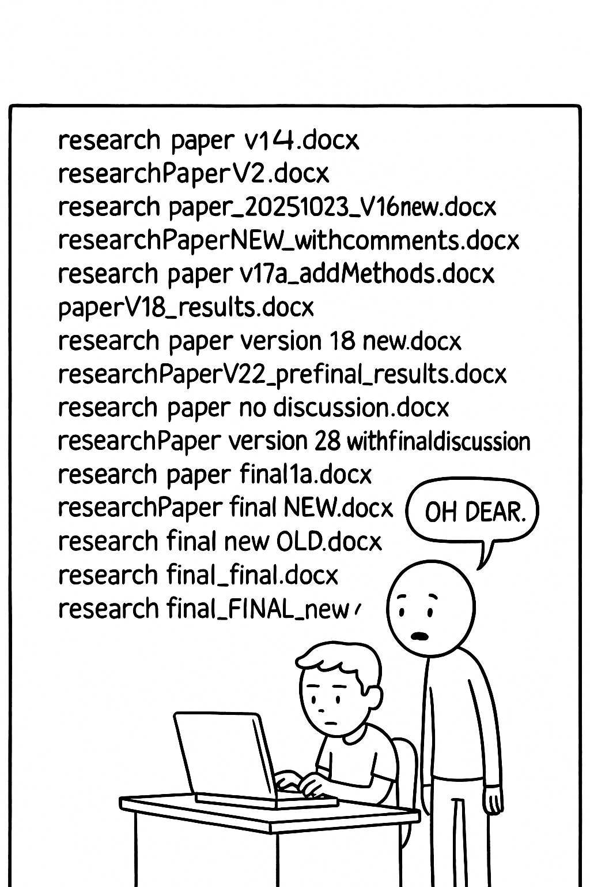
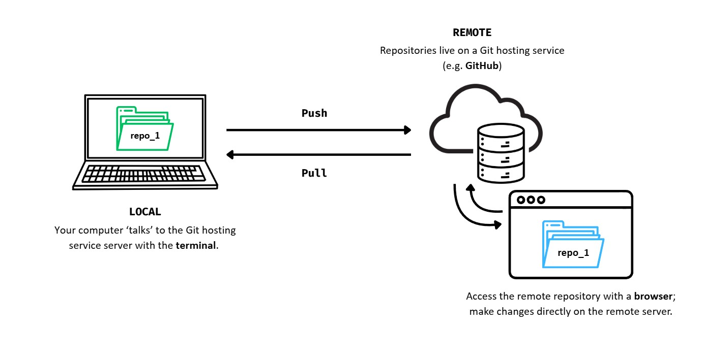
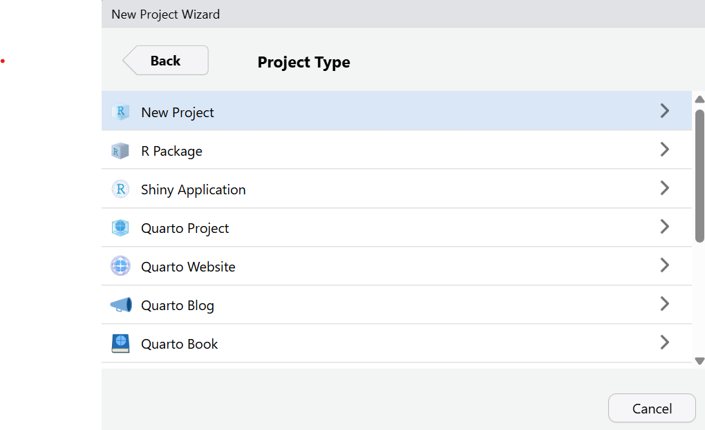
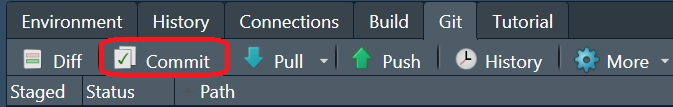

<!-- 
Possible future improvements:

1. The commit messages in the screenshots from the Git tab in RStudio are not in imperative mode. We should follow our own best practices. (Not dramatic, can be changed with 2)
2. I think the Git interface in RStudio is not good. Very often it cannot resolve merge conflicts which are automatically resolved in other desktop apps, such as Github Desktop. I would change to a dedicated Git app. I suggest:
- https://github.com/sourcegit-scm/sourcegit (community maintained, all open source)
- Github Desktop (also open source, but closely tied to Github and Microsoft)

 -->

## Licence

<br>

<p style="text-align:center;">
  
</p>

<div style="background-color: #f0f0f0; padding: 0.05em; border-radius: 2px; font-size: 0.6em;">
This work was originally created by [Mike Croucher ](https://github.com/mikecroucher) under a CC-BY-SA 4.0 [Creative Commons Attribution 4.0 International License](https://creativecommons.org/licenses/by-sa/4.0/deed.en). It was subsequently adapted by [Malika Ihle](https://www.osc.uni-muenchen.de/about_us/coordinator/index.html) during her time at Reproducible Research Oxford. This current work by Sarah von Grebmer zu Wolfsthurn, Peter Edelsbrunner and Malika Ihle is licensed under a CC-BY-SA 4.0 [Creative Commons Attribution 4.0 International SA License](https://creativecommons.org/licenses/by-sa/4.0/deed.en). It permits unrestricted re-use, distribution, and reproduction in any medium, provided the original work is properly cited. If you remix, transform, or build upon the material, you must distribute your contributions under the same license as the original.
</div>

::: {.notes}
**Presenter Notes**: The Creative Commons Attribution–ShareAlike 4.0 license, or CC BY-SA 4.0, allows others to copy, share, and adapt a work in any medium, including for commercial purposes. These permissions are broad and cannot be withdrawn as long as the license terms are followed. The main requirement is attribution: users must give appropriate credit to the original creator, provide a link to the license, and clearly indicate whether any changes were made, without implying endorsement by the original author. In addition, the ShareAlike condition means that if someone modifies or builds upon the work, the resulting material must be distributed under the same CC BY-SA 4.0 license, or a compatible one. Finally, users are not allowed to apply legal or technical restrictions, such as DRM, that would prevent others from exercising these same rights.
:::

---

## Contribution statement

<br>

**Creator**: Von Grebmer zu Wolfsthurn, Sarah ({fig-alt="orcid logo"}[0000-0002-6413-3895](https://orcid.org/0000-0002-6413-3895))

**Reviewer**: Schönbrodt, Felix ({fig-alt="orcid logo"}[0000-0002-8282-3910](https://orcid.org/0000-0002-8282-3910))

**Consultant**: Edelsbrunner, Peter ({fig-alt="orcid logo"}[0000-0001-9102-1090](https://orcid.org/0000-0001-9102-1090))

::: {.notes}
**Presenter Notes**: These are the **presenter notes**. You will a script for the presenter for every slide. In presentation mode, your audience will not be able to see these presenter notes, they are only visible to the presenter. 

**Instructor Notes**: There are also **instructor notes**. For some slides, there will be pedagogical tips, suggestions for activities and troubleshooting tips for issues your audience might run into. You can find these notes underneath the presenter notes.

**Accessibility Tips**: Where applicable, this is a space to add any tips you may have to facilitate the accessibility of your slides and activities. An example for an accessibility tip could be: When demonstrating Git commands, speak aloud what you are typing. Do not rely solely on the terminal output or visual cues on the screen.
:::

---


## Prerequisites

::: {.callout-important}
Before completing this submodule, please carefully read about the prerequisites.
:::

<br>

<div style="font-size: 0.4em;">
| Prerequisite   |  Description  | Link/Where to find it   |
|------------|------------|------------|
| Basic computer literacy | Making a folder; creating, saving or renaming files | - |
| Laptop/PC with internet access | Admin rights for download/install | - |
| R and RStudio installed | Latest versions of both R and RStudio |  [https://posit.co/download/rstudio-desktop/](https://posit.co/download/rstudio-desktop/) |
| Basic R skills | 3.2 Introduction to R - Part I | LINK |
| Advanced R skills | 3.3 Introduction to R - Part II | LINK |
| GitHub account | Free account for GitHub | Join at [https://github.com/join](https://github.com/join) |
</div>

::: {.notes}
**Presenter Notes**: The basic requirements to follow these slides are a laptop or desktop with admin rights to download and install software, and the latest installations of R and RStudio. Basic knowledge on R and RStudio, ideally as demonstrated through the completion of the two previous submodules R Part I and Part II is also a prerequisite. Specifically, learners are expected to have an intermediate familiarity with R, for example with data wrangling, reshaping, subsetting, plotting and creating basic R functions. Finally, for this submodule, learners will need their own GitHub account, which is free to create on github.com.


<!-- TODO: I wonder if this proposed lesson plan could/should be on a visible slide.
It is easy to miss for instructors ... 
Maybe add a reminder before or at the slide "Creating an RStudio Project" that from here on (optionally) the homework starts SvG: added a note on the landing page about the length of this lesson and that a lesson plan can be found in the instructor notes at the beginning! -->
**Instructor Notes**: Before you get started on this submodule with your audience, you need to ensure that the audience fulfills these criteria. **Additional important tip**: This submodule is designed for a 3-hour slot. If you are planning to deliver these slides synchronously in a class of 90 minutes, here is a proposed lesson plan for + homework assignment):

-	3 minutes to situate this new class within the overall course, clarify questions from the previous class etc. 

-	5 minutes for the WHY of version control
  - Use of interactive tools and group discussions to work out what challenges learners face and to get the curious about version control as a potential solution
  
- 	5 minutes for pre-content survey + survey discussion to explore how familiar learners are already with version control

- 	5 minutes introduction to Git and GitHub, exploration of the Git - GitHub workflow
- 	Remaining class (approx 60 minutes left): **Setting up Git** (= slides until the break)

- 	5 minutes before the end: Final survey (currently pre-break survey) to check where people are at

- 	2  minutes before the end: Homework assignment discussion
      	- **RStudio Project and Git** (aka all content after the break in the slides as they are now): <br>
          1.	Creating an RStudio Project <br>
          2.	Setting up practice project <br>
          3.	Getting your project under version control <br>
          4.	Making changes to your project <br>
          5.	Committing changes <br>
          6.	Connecting the local repository to GitHub

:::

---

## Questions from the previous submodule

<br>
<br>

<div style="background-color: #f0f0f0; padding: 0.1em; border-radius: 5px; font-size: 1em; text-align: center;">

Any remaining questions about the most recent content and/or practical exercises?

</div>

::: {.notes}
**Presenter Notes**: Are there any questions that were left unanswered from the previous session?

**Instructor Notes**: <br>
- **Aim**:  This slide is dedicated to clarifying questions from the previous submodule and/or to discuss assignments. You may need to add slides depending on the homework assignment and if you could already foresee difficulties. This reflection moment is critical for the learning process to ensure that learners are on the same page and have been able to achieve the learning goals of the previous workshop.
:::

---

## Where are we at?

**Previously**:

-  Familiarization with the basics of R
-  More advanced R skills: data manipulation, reshaping, functions, plotting
-  Using R for your own scientific work

<div style="background-color: #f0f0f0;">
**Up next**:

- Facing challenges in our workflow and how to solve them
- Enhancing reproducibility and our own accountability
- Facilitating collaboration
</div>


::: {.notes}
**Presenter Notes**: In the previous two sessions, we have familiarized ourselves with R and RStudio. We have learned what we can use R for and we tested some features of R in RStudio, such as data manipulation, reshaping, functions, plotting etc. Next, what we want to use this session is once again use these skills within RStudio, but with a stronger focus on enhancing the reproducibility of our work. We also want to increase our own responsibility for the steps we are taking within the research process. We will start to learn about tools that can help us to facilitate collaboration across different parties and maybe even disciplines, and we will put a special focus on being transparent in every step so that our methods and decision making process is clear to others that come across our work. 

**Instructor Notes**: <br>

- **Aim**: Place the topic of the current submodule within a broader context.

- Remind learners what you are working towards and what the bigger picture is.
:::

---

## Learning goals

::: incremental
- **Understand** the problem(s) that can be solved by version control
- **Install** and **configure** Git 
- **Set up** the connection between your computer and GitHub
- **Create** an RStudio Project under version control for a reproducible workflow
- **Make** changes within RStudio and **commit** changes locally
- **Connect** local and remote repositories for your work
:::
  
::: {.notes}
**Presenter Notes**: In this session, we will focus on the following elements. Do not worry if these terms sound unfamiliar to you at this point, we will go through each step one by one. <br>

- **Understand** the problem(s) that can be solved by version control <br>
- **Install** and **configure** Git  <br>
- **Set up** the connection between your computer and GitHub <br>
- **Create** an RStudio Project under version control for a reproducible workflow <br>
- **Make** changes within RStudio and **commit** changes locally <br>
- **Connect** local and remote repositories for your work <br>

**Instructor Notes**:

- **Aim**: Formulate specific, action-oriented goals learning goals which are measurable and observable in line with Bloom's taxonomy (Anderson et al., 2001; Bloom et al., 1956)


**Accessibility Tips**:

- Place an emphasis on the **verbs** of the learning goals and choose verbs that align with the skills you want to develop or assess.

:::

---

## Key terms and definitions

- **Reproducible workflows**: 
- **RStudio Project**:  
- **Git**: 
- **GitHub**: 
- **Repositories**: 

::: {.notes}
**Presenter Notes**: These will be some key terms we will explore more today. Do not worry if some of them do not sound familiar to you yet. I want you to first write down in the next two minutes for yourselves what each of these concepts means to you. Then, take 3 minutes to discuss with your neighbour what you have collected. Finally, let us discuss as a group. There are no right or wrong answers. 

**Instructor Notes**: Base yourself on conceptual change theory and examine existing concepts in relation to some key terms. Use the think-pair-share paradigm: **1) THINK**: learners first write down for themselves what they understand by these concepts. **2) PAIR**: form pairs among your learners and have them discuss their current understanding of these concepts. **3) SHARE**: Ask for volunteer pairs to share they conclusions and thought process. <br>
Compare the descriptions provided by the learners: Are there any visible divergences or central aspects that they did not mention or mentioned differently? Re-examine the formation of new concepts at the end of the lesson. 

**Accessibility Tip**: Note that this slide only works for a synchronous in-class setting. Skip if appropriate. 
:::

---

## Key terms and definitions

:::incremental
- **Reproducible workflows**: Structured process ensuring that the methods can be consistently repeated by others using the same approach, data and tools
- **RStudio Project**: A way to store all files related to one R project in one place (R scripts, files, workspace, history, ...) via a so-called .Rproj file
- **Git**: Version control system that tracks and manages changes to files and code [(an open source tool)]{.note}
- **GitHub**: Cloud-based version control platform for hosting Git repositories which includes collaboration features [(a free but commercial platform owned by Microsoft)]{.note}
- **Repositories**: Git terminology for a folder where the contents of the folder are being tracked by Git
:::

::: {.notes}
**Presenter Notes**:

- **Reproducible Workflows**: A reproducible workflow refers to a structured process that ensures methods can be consistently repeated by others. This means that anyone who follows the same steps, using the same data and tools, should be able to achieve the same results. Reproducibility is essential in science and research because it helps verify findings, promotes transparency, and allows others to build on your work. By creating workflows that are transparent, well-documented, and accessible, you ensure that your research is both credible and trustworthy.

- **RStudio Project**: An RStudio Project is a convenient way to organize all the files related to a specific R project in one centralized location. This includes not only your R scripts but also any data, workspace settings, history, and outputs. By creating a project in RStudio and a corresponding .Rproj, you make it easier to maintain a consistent working environment, ensuring that everything you need is in one place. This organization is especially useful when sharing projects with collaborators or when you need to continue working on a project at a later time, as it simplifies managing dependencies and avoids issues related to missing files or incorrect paths.


- **Git**: Git is a popular version control system that helps you track and manage changes to your files and code. With Git, you can create commits, which are snapshots of your project at specific points in time. This makes it easy to monitor your progress, and roll back changes if needed. Git also supports branching, allowing you to work on new features or experiments without affecting the main project. Git’s decentralized nature means that each contributor has a full copy of the project’s history, ensuring robust tracking and flexibility.

- **GitHub**: GitHub is a cloud-based platform built on top of Git that facilitates version control and collaboration. It hosts Git repositories online, making it easy to share your code with others, contribute to open-source projects, and track issues or bugs. GitHub offers additional features like pull requests, which allow collaborators to propose changes to a project and review those changes before they are merged into the main codebase. It also provides tools for project management, documentation, and continuous integration, making it an essential tool for modern software development and collaboration.

- **Repositories**: Git terminology for a folder whose content is tracked by Git

:::

---

# Some realistic challenges in our (study and work)lives ...

---

## Challenge 1: Document and project management

```{=html}

<div style="display: flex; align-items: flex-start; gap: 0.5em;">

  <!-- Left side: single image -->
  <div style="flex: 1; text-align: center;">
    
  </div>
  
```

  <!-- Right side: bullet points -->
  <div style="flex: 1;">

<br>
<br>

**Multiple versions** of the same project/document "floating" around on your PC.

<br>

::: {.callout-note}
## Sound familiar?
What is your current **document naming and management** strategy?
:::

  </div>

</div>


::: {.notes}
**Presenter Notes**: So here we see our typical student — they’ve got 100 versions of the same file on their laptop. This might look funny, but we have all been there, whether it’s a paper draft, a dataset, or an analysis script. File and data management is hard, and we have to somehow juggle multiple versions of files, so it is easy to lose track of which version is the “right” one.

**Instructor  Notes**: Adjust the example to tailor it to the main file type of your audience. Perhaps even show your own data organisation system from a project from many years ago to make learners relate more. Ask for volunteers to describe their current document management strategies.
:::

---

## Challenge 2: When hardware fails

Laptop dies, files are accidentally deleted.

{fig-align=center width=30% fig-alt="hardware fails"}

::: {.callout-note}
Mentally raise your hand if this happened to you before.
:::

::: {.notes}
**Presenter Notes**: Here is once again our student, who is the victim of one of the most common threats to good science: hardware failure. It could be a coffee spill, a dropped laptop, a lost USB drive, or a hard disk crash, all different flavors of the same disaster and very realistic scenarios in student and researcher life. 

**Instructor  Notes**: Describe an example from your own research or student career and describe the impact it had at the time. This is another reason why version control systems like Git, especially when used with remote hosting services such as GitHub, are so powerful. They do not just track your changes; they back up your work in multiple locations, so even if your laptop meets an unfortunate end, your work does not.
:::

---

## Challenge 3: "What on earth did I do again..?"

Projects evolve, it is easy to **forget** what we last changed or did on the project. 

{fig-align=center width=20% fig-alt="hardware fails"}

::: {.notes}
**Presenter Notes**: This might yet be another problem that could be familiar to some of you: You have a new assignment and it reminds you of an old assignment. You decide to copy that folder over but are now wondering what the last thing you did was and how you solved the assignment last time. Sometimes it takes months or years until you come back to your old project, and it is almost impossible to remember why we made certain changes, what data we used, or how the results were produced, especially if all we have are scattered files in random folder with no context.

**Instructor  Notes**: Additional presenter notes for clarity: We’ve all opened an old project and thought, “What was I even doing here?” Without clear records, it’s impossible to remember how results were produced or why changes were made. This is where Git comes in, because changes are tracked and years later, you see exactly what you did and why. 
:::

---

## Challenge 4: "But I just wanted to try to ..."

Especially with coding, trying new ideas can **break** your code.

{fig-align=center width=30% fig-alt="burning PC"}


::: {.notes}
**Presenter Notes**: This is another situation that some of you may recognise: we are working on some code, we make a "small" change to try something new or to add a small new feature and suddenly nothing works anymore.

**Instructor  Notes**: Without version control, it is hard to get back to a working state or see what went wrong. Git makes this safe: you can experiment on a branch, and if it fails, simply return to the last working version.
:::

---

##  Who is familiar with these problems?

a. Inconsistent data and file management aka **I cannot find my files**
b. Hardware failures (coffee spill, laptop dropped, lost laptop, broken USB) aka **my work is lost**
c. Extended periods of time between project actions aka **I forgot what I was working on**
d. Experimentation with new features aka **I tried something and my laptop is now smoking**
e. All of the above
f. None of the above (are you *sure*?)


::: {.notes}
**Presenter Notes**: Your turn: Who is familiar with these problems? 

**Instructor  Notes**: Prepare an interactive survey in advance, e.g., by using Particify, to make this part more interactive. Closely examine the answers given and create a shared understanding that many students in class are experiencing similar issues. 

**Accessibility Tip**: Note that an interactive online survey only works for a synchronous in-class setting. Skip this slide as appropriate.
:::

---

# A realistic solution to these challenges?

---

## Version control

:::incremental
"Version ... *what?*"

- **Version control** = system that **records changes** to files **over time** by recording the difference between two files
- **Tracks modifications** and edits
- Helps you **manage different versions**
- Allows you to **recover previous versions**
:::


::: {.notes}
**Presenter Notes**: Version control is a system that records changes made to files over time. Specifically, it saves the **difference** between two files It enables you to track the history of modifications, making it easy to see who changed what, when, and why. This is particularly valuable when working on code or large projects with many files, as it helps you manage different versions, and recover previous versions if something goes wrong. With version control, you can safely experiment with new changes without fear of losing important work, as you can always revert to a stable version of the project. 

**Instructor  Notes**: Take your time with this section as it explains the WHY of version control. Learners should recognize their own challenges and be curious about how exactly one could overcome these challenges. More importantly, they should get a first idea how version control could be a tool to overcome their *own* challenges and that therefore it could be beneficial for *them personally*.   
:::

---

## Before we start: Survey time!

 

::: {.notes}
 **Instructor Notes**: For a more interactive delivery, use free tools such as [Particify](https://www.particify.de/en/)] to create interactive surveys before you deliver this lesson. The pre-submodule survey serves to examine learners' prior knowledge about version control and related concepts. Note that this survey cannot be completed in an asynchronous setting because the survey results cannot be displayed. 

**Accessibility Tip**: Note that this slide only works for a synchronous in-class setting. Skip the survey as appropriate.
:::

##  

**What is your level of familiarity with version control?**

a. I have never heard of it before.
b. I have heard of it but have never worked with it.
c. I have a basic understanding and some experience with it.
d. I am very familiar and have worked with it extensively.


##  

**Which of the following concepts or skills do you feel confident in? (Select all that apply.)**

a. Git
b. GitHub
c. Repositories
d. RStudio Project
e. I am not sure about any of these concepts.

##  

**How comfortable are you with using Git for version control?**

a. 1 = Not comfortable at all
b. 2
c. 3
d. 4
e. 5 = Very comfortable

---

## Discussion of survey results

<br>

<div style="background-color: #f0f0f0; padding: 0.1em; border-radius: 5px; font-size: 1em; text-align: center;">

What do we see in the results?

</div>

::: {.notes}
**Presenter Notes**: Let us have a look at these results. 

**Instructor Notes**:

- **Aim**: Briefly examine the answers given to each question interactively with the group. Use visuals from the survey to highlight specific answers. If *everyone* selects Git and GitHub in the question concerned with the familiarity with these concepts, keep your explanations and definitions short: “okay, you have heard about X, so I will only briefly revisit this”. If the majority of learners state that they are currently extremely uncomfortable with using Git, provide reassurance that they are in the right spot. If many people are extremely comfortable with all concepts, ask them if they would prefer going through the slides and tasks by themselves.

**Accessibility Tip**: Have people work in pairs if someone did not bring their phone/does not have a phone. This survey also cannot be completed in an asynchronous setting. 
:::

---

## Git: What is it?

:::incremental

**Git** is a free and **open source software**. With Git, you can: 

- **Track changes** to files across folders over time, seeing what was changed, when and by whom
- **Collaborate** efficiently within a team as multiple people can work on the same folders and files
:::


{fig-align=center width=10% fig-alt="git logo"}

::: {.notes}
**Presenter Notes**: Diving into the solution to some of the chalenges with discussed earlier, Git is a popular version control system that helps you track and manage changes to your files and code. With Git, you can create commits, which are snapshots of your project at specific points in time. This makes it easy to monitor your progress, roll back changes if needed, and collaborate effectively with others. Git also supports branching, allowing you to work on new features or experiments without affecting the main project. Git’s decentralized nature means that each contributor has a full copy of the project’s history, ensuring robust tracking and flexibility.

**Instructor  Notes**: Examine the conceptual understanding of this term before proceeding.   
:::

---

## GitHub: What is it?

:::incremental
**GitHub** is a **cloud-based version control platform** that uses Git to track changes and hosts Git repositories.

- Allows multiple people to **collaborate** on the same project
- Collaborators can **share** repositories, code etc. and ask for **feedback**, initiate discussions and point out bugs and issues
- GitHub **stores** all files remotely, making it accessible from anywhere
:::

::::: columns
::: {.column width="30%"}
{fig-align=center width=60% fig-alt="github logo"}
:::
::: {.column width="70%"}
::: {.fragment}
::: {.callout-note}
GitHub is a free but commercial platform owned by Microsoft. A similar functionality is provided by GitLab, Codeberg, and other providers; some of them open source and non-commercial.
:::
:::
:::
:::::

::: {.notes}
**Presenter Notes**: GitHub is a cloud-based platform built on top of Git that facilitates version control and collaboration. It hosts Git repositories online, making it easy to share your code with others, contribute to open-source projects, and track issues or bugs. GitHub offers additional features like pull requests, which allow collaborators to propose changes to a project and review those changes before they are merged into the main codebase. It also provides tools for project management, documentation, and continuous integration, making it an essential tool for modern software development and collaboration.

**Instructor  Notes**: Examine the conceptual understanding of this term before proceeding.  
:::

---

## The Git - GitHub workflow

{fig-align="center" width=600 fig-alt="Git - GitHub workflow"}

::: {.notes}
**Presenter Notes**: Let's break down the basic steps of how Git and GitHub work together:

- **Local repository (aka your computer)**: When you start working on a project, you create a local repository on your computer. This is simply a folder where all your project files are kept. Git helps you track changes to these files over time by taking snapshots of them every time you save or modify something important. For example, imagine you're writing code or working on a document. Each time you make significant changes, you can use Git to save a snapshot (called a commit) of your work. This allows you to keep track of your progress, go back to previous versions if needed, and see what changes have been made.

- **Remote repository (GitHub)**: While your local repository is on your computer, GitHub is a platform on the internet that hosts your project remotely. Think of GitHub as a cloud-based storage for your project, where you can store the most up-to-date version of your work. Having a remote repository on GitHub is also helpful if you’re collaborating with others. Instead of sending files back and forth, everyone can work on the same project from their own computers and update GitHub with their changes.

- **Pushing changes to GitHub**: Once you have made changes to your files and are happy with them, you can push those changes to the remote repository on GitHub. To "push" means to send your local changes to GitHub, making them available to anyone else who is working on the project. Think of pushing like uploading your updated work to the cloud.

- **Pulling changes from GitHub**:If you are collaborating with others, or if someone else has made changes to the project, you will need to make sure your local project is up-to-date. To do this, you can pull the latest version from GitHub. Pulling means downloading the latest version of the project from GitHub to your computer. This ensures that you have all the recent changes made by others, and it helps avoid conflicts when multiple people are working on the same project at the same time.


**Instructor  Notes**: Take your time when explaining this workflow. If this slide is still too difficult to grasp, here is an even simpler explanation:

- Starting a project: You create a new project on your computer and initialize a local repository to start tracking your changes with Git.

- Making changes: You write code or update documents. Every time you reach an important milestone, you save those changes with Git by making a commit.

- Pushing to GitHub: When you’re ready to share your progress with others (or back it up), you push your changes to GitHub. Now, your work is safely stored online.

- Pulling updates: If someone else is working on the project or you’ve been away for a while, you can pull the latest changes from GitHub to your computer. This keeps your local copy in sync with everyone else’s work.
:::

---

## #explainlikeIamfive

<br>
<br>

<div style="background-color: #f0f0f0;">
In pairs, explain the Git - GitHub workflow to your partner. What is the difference between **pushing** and **pulling**?
</div>

::: {.notes}
**Presenter Notes**: In pairs, I would like for you to explain to each other, in simple terms, what the Git-GitHub "workflow" entails. What role does Git play locally versus GitHub remotely? How does pushing and pulling connect the two? And what is the difference between the two?

**Instructor Notes**: Use this as an informal assessment moment to gauge if the general concepts of pulling and pushing are clear. Ask for one or two volunteer pairs who would explain the workflow in their own words to the rest of the audience. Then, make a transition into the practical aspect of this class. 
:::


## What is a "Git Forge"?

- Git handles *version tracking* locally and across repositories. 
- A git forge adds a web-based layer and *collaboration features* on top of Git, such as:
  * Access control (permissions, teams)
  * Pull/Merge requests (propose and review changes)
  * Issue tracking (bug reports, tasks)
  * Code review tools (comments, approvals)
  * CI/CD integration (automated testing and deployment)
  * Web interface (browse code, history, diffs)

::: {.callout-note}
Git = the engine that tracks changes<br>
Git forge = the full collaboration platform built around that engine (GitHub, GitLab, Codeberg, ...)
:::


# How to use Git: Let's git started!

---

## Installing Git: Windows

To install Git on Windows: 

- Download Git from [http://git-scm.com/downloads]( http://git-scm.com/downloads) 
- Download and run .exe file
- Accept all the default settings and keep clicking `Next`

::: {.notes}
**Presenter Notes**: To install Git on Windows, first visit http://git-scm.com/downloads
 and download the latest version of Git. Once the download is complete, run the .exe installer file. During the installation process, simply accept all the default settings and continue clicking ‘Next’ until the installation is finished. There's no need to make any changes to the default options unless you have specific preferences. This will set up Git on your Windows machine with minimal effort.

**Instructor  Notes**: Work alongslide your learners from a new laptop that does not have Git installed yet and leave enough time for learners to follow along. Check in regularly to detect issues. Whenever technical issues need to be dealt with, ask around if anyone experienced may jump in so you do not have to solve everything yourself. 
:::

---

## Installing Git: MacOS

To install Git on MacOS: 

- Install the `homebrew` command line tool from [https://brew.sh](https://brew.sh). This is a tool to install other software.
- In the terminal, run `brew install git`
- Accept the prompts appearing the terminal

::: {.notes}
**Presenter Notes**: To install Git on macOS, begin by visiting http://git-scm.com/downloads and downloading the latest version of Git. On the download page, select the first option that suggests installing Git via Homebrew, which is a package manager for macOS.
 
**Instructor  Notes**: Work alongslide your learners from a new laptop that does not have Git installed yet and leave enough time for learners to follow along. Check in regularly to detect issues.  
:::

---

## Installing Git: Ubuntu

To install Git on Ubuntu: 

- Paste the following line into your terminal:

```{.bash filename="Terminal"}
sudo apt-get install git-core
```

::: {.notes}
**Presenter Notes**: To install Git on Ubuntu, open your terminal and paste the following command: sudo apt-get install git-core. This command will install Git using Ubuntu's package manager. You may be prompted to enter your password to authorize the installation. Once the process is complete, Git will be successfully installed on your system. 

**Instructor  Notes**: Leave enough time for learners to follow along. Check in regularly to detect issues.    
:::

---

## Configuring Git

**Step 1**: By default, Git is used through the **command line** interface, but can be used through RStudio (later in this session).

- **Windows**: Open Git Bash (start menu > *Git Bash*)
- **MacOS**: Open the *Terminal app*
- **Linux**: Open your distribution’s *terminal emulator*

::: {.notes}
**Presenter Notes**: Git can be configured through the command line interface. Later, we will be able to use Git through RStudio, which we will cover later in this session. To configure Git via the command line, follow these steps depending on your operating system:

 - On Windows, open Git Bash by searching for it in the Start menu (just type "Git Bash" and select it).

- On macOS, open the Terminal app, which you can find in the Applications > Utilities folder or search for using Spotlight.

- On Linux, open your distribution's terminal emulator (for example, GNOME Terminal, Konsole, or another terminal application specific to your Linux distribution).

Once you’ve opened the terminal, you'll be ready to start configuring Git through the command line.

**Instructor  Notes**: Make sure to leave enough time for learners to find the terminal corresponding to their operating system.   
:::

---

## Configuring Git

**Step 2**: Next, enter the following commands with your email one after the other (hitting ENTER after each command):

```{.bash filename="Terminal"}
git config --global user.email "you@youremail.com"
git config --global user.name "Your Name"
```

::: {.notes}
**Presenter Notes**: We will continue configuring Git. In the command line, type the following commands, one after the other, and hit enter after each command. Make sure to replace the email in quotes with your own email, and the name in quotes with your own full name. Do not remove the quotes.

**Instructor  Notes**: Upon successful execution, learners should see no output from these commands. Emphasize the importance of using their own email addresses and names in quotes. Also highlight that the commands need to be typed **EXACTLY** as is, as the command line is highly sensitive to spelling, capitalization, punctuation and empty spaces. 
:::

---

## Securing the connection between your computer and GitHub

You need to identify yourself and your machine to GitHub before interacting with GitHub repositories.

- **SSH keys** are a common way to manifest your identification to GitHub

::: {.callout-important}
**SSH keys** come in pairs, a public key that gets shared with services like GitHub, and a private key that is stored only on your computer. *Never share your private key!*

If the keys match, you’re granted access. Setting up the SSH key has to be executed once per GitHub account and for **each** computer you will use to connect to GitHub. 
:::

::: {.notes}
**Presenter Notes**: Before you can interact with GitHub repositories, GitHub needs to recognize you and your machine. This is important to ensure that only authorized users can access and make changes to repositories. One common way to authenticate yourself and your machine is by using SSH keys.

SSH keys work by pairing a public key with a private key. The public key is shared with GitHub and stored on their servers, while the private key stays securely on your computer. When you try to connect to GitHub, it checks if the public and private keys match. If they do, you’re granted access.

Note that setting up SSH keys is something you only need to do **once** per GitHub account. However, you will need to set up separate keys for each computer you use to connect to GitHub. This ensures that every device you use has its own secure authentication.

Remember, once the SSH keys are set up, they streamline your workflow with GitHub, allowing you to securely push, pull, and interact with repositories without needing to repeatedly enter your credentials.

**Instructor  Notes**: Depending on the technical experience of the audience, go into more or less details about SSH keys. Stress that you need SSH keys to secure the connection between a specific computer and a specific GitHub account.   
:::

---

## Checking for existing SSH key pair

**Step 1**: Before generating a new SSH key pair, check for existing keys in your .ssh directory.

- **Windows**: Open Git Bash (`Windows start menu` > type `Git Bash` into search bar)
- **MacOS**: Open Terminal App
- **Linux**: Open your distribution’s (or any other) terminal emulator

::: {.notes}
**Presenter Notes**: Before creating a new SSH key pair, it is important to check if you already have one. If you already have an SSH key pair, there is no need to generate a new one. You can simply use the existing key, which can save you time and avoid disrupting any current connections you have set up.In this first step we will check for an existing SSH key on different operating systems:

- **For Windows**: Start by opening Git Bash. You can find it by searching for "Git Bash" in the Start menu. Once it's open, navigate to the .ssh directory to see if a key already exists.

- **For macOS**: On a Mac, open the Terminal app. You can find it by searching for "Terminal" in Spotlight or by navigating to Applications > Utilities. From there, you can check the .ssh folder to look for any existing keys.

- **For Linux**: If you are using Linux, open any terminal emulator you prefer, whether it's the default terminal for your distribution or a third-party app. Then, check the .ssh directory for any existing SSH keys.

**Instructor  Notes**:  Make sure to leave enough time for learners to follow the instructions based on their operating system.   
:::

---

## Checking for existing SSH key pair

**Step 2**: Enter the following command to list the content of the ssh directory:

```{.bash filename="Terminal"}
ls ~/.ssh
```

::: {.callout-tip title="A Note for Nerds" .smaller}
- `ls` = "list" files in a directory
- `~` = home directory of the current user
- `.ssh` = folder where SSH keys are stored
:::

::: {.notes}
**Presenter Notes**: The second step is to list the contents of the .ssh directory. This will allow you to see if any SSH keys are already present.
To do this, open your terminal (or Git Bash on Windows) and enter the following command: ls ~/.ssh. This command will display a list of files located in the .ssh directory. If you already have SSH keys, you will likely see files such as id_rsa (private key) and id_rsa.pub (public key), or similarly named files like id_ed25519 and id_ed25519.pub.

**Instructor  Notes**: Ask your audience to review the outputs of this command and to compare it to the following slide.   
:::

--- 

## Checking for existing SSH key pair

**Step 3**: If there are existing ssh keys, they are named like this (you can have multiple keys):

```{text}
id_rsa.pub
id_ecdsa.pub
id_ed25519.pub
```

::: {.callout-important}
If you already have an SSH key pair, you can skip the section on how to generate a new SSH key pair. If you don’t have an existing public and private key pair (which is to be expected!), or if you receive an error that ~/.ssh doesn’t exist, that this file location doesn’t exist, or that you can’t access this folder, go ahead and generate a new SSH key pair.
:::

::: {.notes}
**Presenter Notes**: If there were already an SSH key pair, the command line output would be one of the ones indicated on this slide. In that case, it means that you already have an SSH key pair. You can therefore skip the section on how to generate a new SSH key pair. 

However, if you do not have an existing public and private key pair (which is to be expected!), or if you receive an error that ~/.ssh does not exist, that this file location does not exist, or that you cannot access this folder, we will go ahead and generate a new SSH key pair as our next step.

**Instructor  Notes**: If there is an existing SSH key pair, learners can skip the section on how to generate a new SSH key pair. If there is no existing public and private key pair (which is to be expected!), or if there is an error message saying that ~/.ssh doesn’t exist, that this file location doesn’t exist, or that the folder cannot be accessed, learners can proceed with the generation of a new SSH key pair.  
:::

---

## Generating a new SSH key pair

**Step 1**: In the command line, type the following (replacing the email here with your *own* email) to create a new SSH key pair with your email as a label:

<br>

```{.bash filename="Terminal"}
ssh-keygen -t ed25519 -C "your_email@email.com"
```

<br>

::: {.callout-tip}
Pay close attention to spacing and capital letters while typing. 
:::


::: {.notes}
**Presenter Notes**: As the first step to creating a new SSH key pair, type the following into the command line, replacing the email here with your *own* email to create a new SSH key pair with your email as a label: ssh-keygen -t ed25519 -C "your_email@email.com. Pay close attention to spelling!

**Instructor  Notes**: Learners need to pay close attention to spacing and capital letters while typing.   
:::

---

## Generating a new SSH key pair

**Step 2**: When prompted to *Enter a file in which to save key*, press ENTER to accept the default file location. That should give you this prompt:

<br>

```{text}
Generating public/private ed25519 key pair.  
Enter file in which to save the key (/Users/username/.ssh/id_ed25519):
```

::: {.notes}
**Presenter Notes**: In the next step, When prompted to *Enter a file in which to save key*, press ENTER to accept the default file location. That should give you this prompt you see in these slides:
Generating public/private ed25519 key pair.  
Enter file in which to save the key (/Users/username/.ssh/id_ed25519):


**Instructor  Notes**: Remind your audience to check the output of the command.   
:::

---

## Generating a new SSH key pair

**Step 3**: Next, you are asked to provide a passphrase in the terminal (see the next slide for more information!). 

```{text filename="Terminal"}
Enter passphrase (empty for no passphrase):  
Enter same passphrase again:
```

<br>

::: {.callout-warning}
When you type passwords in the command line, **nothing** is displayed, you are however still typing in the background. This is **normal behaviour** by the command line.
:::

::: {.notes}
**Presenter Notes**: Next, you are asked to provide a passphrase in the terminal. Protecting your keys with a password is optional but highly recommended. Start typing the password next to the first prompt. Note that your input will be **invisible** and you will feel like you are not typing. This is **normal** behaviour. Just enter your password regardless. Re-confirm the password at the second prompt and press ENTER.

**Instructor  Notes**: Emphasize the normal behaviour of the terminal that your audience is unable to see anything they type and that there is no need for concern.   
:::

---

## Some notes on passphrases ...

::: {.callout-note}
Creating a passphrase is an **optional extra-layer of protection**, as it protects your keys with a password. However, you will need to type that password everytime you use your SSH key, which can get annoying. In a high-security environment, add a passphrase. For typical research use cases, you can skip that step (simply press ENTER without adding a passphrase).
:::

::: {.callout-important}
If you lose your SSH key passphrase, **there is no way to recover it**. You'll need to generate a brand new SSH keypair. Therefore, when you create your passphrase for your ssh key, **please write it down immediately** so that you do not forget, ideally in a **password manager**.
:::

::: {.notes}
**Presenter Notes**: This part is very important. If you lose your SSH key passphrase, **there is no way to recover it**. You'll need to generate a brand new SSH keypair. Therefore, when you create your passphrase for your ssh key, **please write it down immediately** so that you do not forget, ideally in a **password manager**.

**Instructor  Notes**: Emphasize that remembering your SSH key passphrase is crucial, ideally learners should save this in a password manager or save the password in a location where they can easily find it when needed.    
:::

---

## Generating a new SSH key pair

**Step 4**: When the key generation is complete, you should see the  confirmation below. 


```{.small-text filename="Terminal"}
Your identification has been saved in /Users/username/.ssh/id_ed25519.
Your public key has been saved in /Users/username/.ssh/id_ed25519.pub.
The key fingerprint is:
SHA256:6nr/zo0g7Bz7WMRwy34maBhQy1UZyX47gT+egRdlIhs your_email@email.com
The key's randomart image is:
+--[ED25519 256]--+
|    .o++         |
|   o oF . o      |
|  . o+ =.+.      |
|   .  + += .     |
|    .  +S++      |
|   . ..oB=       |
|    . ++*=.      |
|     o.==* o     |
|    .o.o+** .    |
+----[SHA256]-----+
```


::: {.notes}
**Presenter Notes**: When the key generation is complete, you should see the  confirmation below. This indicates that you have successfully generated your new public SSH key pair. 

**Instructor  Notes**: Encourage your learners to compare their output with the output on the slides.   
:::

---

## Generating a new SSH key pair

::: {.callout-note}
**Done!** You have successfully **generated your public SSH key pair**.
:::

::: {.notes}
**Presenter Notes**: Congratulations! You have successfully **generated your public SSH key pair**.

**Instructor  Notes**: Take a break here and check-in with your learners if there were any issues or difficulties.
:::

---

## Adding the SSH key to GitHub account

**Step 1**: Tell GitHub about your new public key. In the terminal, please hit ENTER after typing: 

```{.bash filename="Terminal"}
cat ~/.ssh/id_ed25519.pub
```

<br> 

::: {.callout-important}
Be careful: do not copy the content of your *private* key, but your **public** key. Your public key ends with .pub.
:::

::: {.notes}
**Presenter Notes**: Now that you have generated your SSH key pair and confirmed it is there, it is time to tell GitHub about the new public key. This will allow you to securely connect to GitHub.
To begin, we need to display the contents of your public key. This is the key that you will share with GitHub. In your terminal, type the following command: cat ~/.ssh/id_ed25519.pub
Once you hit Enter, this command will print the contents of your public key to the terminal, which should end in .pub. The public key that you just generated in the previous steps is what you will use to authenticate your machine with GitHub, and it is safe to share it.

**Instructor  Notes**: Emphasize the importance of that learners only copy the content of the public key, which ends with .pub. They should **not copy their private key**. The private key should remain private at all times. Sharing the private key could compromise their security, so they should always double-check that they are looking at the correct key. 
:::

---

## Adding the SSH key to GitHub account

**Step 2**: The output should be something like below. This is the output that needs to be copied in its **entirety**. 

```{text filename="Terminal"}
# The output looks like this. The characters after ssh-ed25519 will be different for you, however.
ssh-ed25519 AAAAC3NzaC1lZDI1NTE5AAAAIFEKiimOpcayfHhlbjmnIBAUX74FY/o20k9yFA16XOLm your_email@email.com
```

<br>

::: {.callout-important}
**Copy the contents** of the output to your clipboard.
:::


::: {.notes}
**Presenter Notes**: After printing your public key in the terminal, you need to copy the contents of the output to your clipboard. 

**Instructor  Notes**: Highlight that the  characters after ssh-ed25519 will be different for each learner and the email will match the email the learners have added on an individual basis. 
:::

---

## Adding the SSH key to GitHub account

**Step 3**: 

:::: columns
::: {.column width="50%"}

- Login to [github.com](github.com)
- Navigate to your account settings by clicking on your profile photo (top right) and selecting `Settings`
- Click on `SSH and GPG keys` (left sidebar)
- Click on the green button `New SSH key` or `Add SSH key`.
:::
::: {.column width="50%"}
{fig-align="center" width=500 fig-alt="Add SSH key"}
:::
::::

::: {.notes}
**Presenter Notes**: Now that you have your public key copied, it is time to add it to your GitHub account. This third step will enable you to authenticate your computer securely when interacting with GitHub. Here is how to do it:

- Log in to GitHub: Start by logging into your GitHub account at github.com.

- Go to your account settings: Once you’re logged in, navigate to your account settings. To do this, click on your profile picture in the top right corner of the page. A dropdown menu will appear—select Settings.

- Access SSH and GPG keys: On the left-hand sidebar of the settings page, you’ll see an option labeled SSH and GPG keys. Click on that to go to the section where you can manage your SSH keys.

- Add a new SSH key pair: In the SSH and GPG keys section, click the green button that says New SSH key or Add SSH key. This will open a form where you can paste your public key.


**Instructor  Notes**: Switch to GitHub and give learners enough time to follow along.  Highlight that they should compare the steps with the images in the following slides.  
:::

---

## Adding the SSH key to GitHub account

**Step 4**: 

- In the `Title` field, add a descriptive label for the new key, e.g. something that would identify the device you just connected
  - For example, if you’re using a personal laptop, you might call this key “Personal MacBook Air”. 
- Paste the contents of your clipboard into the Key text box
- Hit the green `Add key` button to save. Enter your GitHub password if prompted.

::: {.notes}
**Presenter Notes**: Now that you are on  GitHub in the correct section to add a new SSH key, here is what you need to do next:

- Give a label to the key: In the “Title” field, add a descriptive label for the key. This helps you easily identify which device the key belongs to in the future. For example, if you're adding a key for your personal laptop, you might label it “Personal MacBook Air” or something similar. This makes it clear which device the SSH key pair is associated with.

- Paste your public SSH key: Next, paste the contents of your clipboard (the public key you copied earlier) into the Key text box. Make sure the entire key is pasted in—starting from ssh-ed25519 and ending with your email address.

- Save the key: Once everything looks good, click the green Add key button to save the new key. If GitHub asks you to confirm your identity, enter your GitHub password to complete the process.

**Instructor  Notes**: Go through these steps slowly and demonstrate where learners have to add the title and where they have to paste the SSH key pair they copied earlier. Remind them that if they are prompted for the password, they will **not see** the password when they are typing.  
:::

---

## Adding the SSH key to GitHub account

**Step 4**: continued

{fig-align="center" width=600 fig-alt="Configure SSH key pair for PC"}

---

## Adding the SSH key to *ssh-agent*
### (optional step, only necessary if you keep getting asked for your key)

Managing your ssh keys is done via the [ssh-agent](https://smallstep.com/blog/ssh-agent-explained/) software.

::: {.callout-note}
Depending on your system, the following might not be necessary. On most GNU/Linux distributions and MacOS, your key will be automatically added to the ssh-agent after the first time you enter it. 

Only if you keep getting asked for your key each time you want to clone or push to a GitHub repository, you can follow the instructions on the next slides.

Otherwise fast-forward to [Testing the GitHub connection](#testing-the-github-connection)
:::

::: {.notes}
**Presenter Notes**: Now that you've added your SSH key to GitHub, the next step is to ensure that your SSH key is being managed securely on your local machine. This is where ssh-agent comes in. It is a software tool running in the background that handles your SSH keys, ensuring they are loaded and available when needed. By adding your key to ssh-agent, you ensure that the key is available for authentication without needing to re-enter the passphrase each time you interact with GitHub or other services that require SSH authentication.

**Instructor  Notes**: Adapt the level of depth of your explanationas a function of the technical skills of your audience.  
:::

---

## Adding the SSH key to ssh-agent

**Step 1**: In the command line, start the ssh-agent with this command: 

```{.bash filename="Terminal"}
eval "$(ssh-agent -s)"
```

This should give you this:

```{text}
Agent pid 59566
```

::: {.notes}
**Presenter Notes**: Call up the ssh-agent and add this command. Compare your output to the output above. The command starts the ssh-agent in the background and sets up the necessary environment variables, allowing it to manage your SSH keys, ensuring they are available for authentication without requiring you to enter your passphrase each time you connect to a remote server or GitHub.

**Instructor  Notes**: Follow along with your learners and check in regularly for issues.  
:::

---

## Adding the SSH key to ssh-agent

**Step 2**: Add your SSH key to the ssh-agent by typing the entirety of this command:

```{.bash filename="Terminal"}
ssh-add ~/.ssh/id_ed25519
```

::: {.notes}
**Presenter Notes**: Now that you called up the ssh-agent and it is running, the next step is to add your SSH key to it. This allows the agent to securely manage your key for authentication. In the terminal, type the following command:
ssh-add ~/.ssh/id_ed25519. This command tells the ssh-agent to load your SSH key (id_ed25519) into memory, so it is ready to use when connecting to services like GitHub. After running this, the key will be available for SSH connections without you needing to re-enter your passphrase each time.

**Instructor  Notes**:  Check in regularly for any issues.
:::

---

## Testing the GitHub connection {#testing-the-github-connection}

**Step 1**: “Ask” GitHub at the command line if our connection is accepted with the following code:

```{.bash filename="Terminal"}
ssh -T git@github.com
```

::: {.notes}
**Presenter Notes**: Now that your SSH key is added to both GitHub and the ssh-agent, it is time to test if everything is working correctly. To do this, open your terminal and enter the following command: ssh -T git@github.com. This command sends a test SSH request to GitHub to check if your key is properly set up.

**Instructor  Notes**: Leave enough time to complete this step and check in for any issues.  
:::

--- 

## Testing the GitHub connection

**Step 2**: When asked about *fingerprinting*, type *yes*, then press ENTER to receive this output: 
```{text}
> Hi USERNAME! You've successfully authenticated, but GitHub does not
> provide shell access.
```

<br>
<br>

::: {.callout-important}
## **This is it!**
You have set up a new SSH key pair and successfully let GitHub know your identity to connect your computer to your GitHub account. These steps will only have to be repeated when you change computers. Let the fun begin!
:::

::: {.notes}
**Presenter Notes**: After sending the test SSH request, you will potentially get asked about fingerprinting, to which you type yes and press ENTER. Then, if everything is configured correctly, GitHub will respond with a success message, like "Hi [your username]! You've successfully authenticated." 

**Instructor  Notes**: If there is an issue, GitHub will let learners know so that troubleshooting can be done.
:::

---

## RECAP: Setting up Git

**What have we done so far?**

::: incremental
- Installed Git ✅
- Configured Git ✅
- Secured a connection between PC and GitHub via SSH key pair ✅
- Added SSH key pair to GitHub account ✅
- Tested the connection between your machine and GitHub ✅
:::

::: {.callout-note}
## Ready!
Your Git and GitHub setup is now secure and ready to use!
:::

::: {.notes}
**Presenter Notes**: Looking back, we have successfully completed the following steps:

- Installed Git: We have made sure Git is installed on your machine, so you can manage your repositories and interact with GitHub.

- Configured Git: We have set up your user name and email in Git, ensuring that commits are properly attributed to you.

- Secured a connection between your PC and GitHub via an SSH key pair: We generated a public SSH key pair and established a secure connection, allowing us to authenticate without needing a username and password each time.

- Added SSH key pair to your GitHub account: We uploaded the public SSH key to GitHub, enabling GitHub to recognize and trust your PC for secure access.

- Tested the connection: Finally, we ran a test to confirm that the SSH connection between your machine and GitHub works as expected.

With these steps complete, **your Git and GitHub setup is now secure and ready to use**!

**Instructor  Notes**: Check in with your learners if they have followed along and if they know where they are at.   
:::

---

## Pre-break survey

Brief check-in: **Your Turn!**


::: {.notes}
**Presenter Notes**: Before we head into the break, let us do a quick check-in to see where we are at. Scan this QR code and select the pre-break survey option. Answer a few questions to check your current understanding of version control and the topics we discussed in this first part of the class. 

**Instructor Notes**: Make use of Particify or another free software for this part. This pre-break survey serves to examine learners' current understanding of key concepts of the submodule. Guidance on interpreting the results:

- If more than 80% of the learners select the correct response option, show which one it is and move on.

- If less than 80% of answers are correct, let them discuss with each other for 1-2 minutes which one they selected, and why, and afterwards let them re-take the question. If they`re above 80% correct the second time, move on, else show the correct response and explain why it is correct (plus maybe why the others are not).

- If more than 30% select a specific distractor answer, discuss it in class.

**Accessibility Tip**: This slide only works in a synchronous setting, skip if appropriate. Ensure to prepare the survey in advance.
:::

---

**What is the main purpose of using Git in a project?**

a. To edit code directly on GitHub
b. To automatically test and debug programs
c. To track changes and collaborate on code with version control
d. To back up files to the cloud without version history


::: {.notes}
**Instructor Notes**: C is the correct answer: Git is a version control system that helps you track changes, manage versions, and collaborate with others on the same project safely.
:::

---

**Why do we add an SSH key to our GitHub account when setting up Git?**

a. To store our Git username and password on the computer
b. To allow our computer to connect securely to GitHub without entering a password each time 
c. To make Git automatically commit our changes
d. To enable GitHub to edit our files directly on our computer


::: {.notes}
**Instructor Notes**: B is the correct answer: Adding an SSH key lets your computer authenticate with GitHub securely, so you can push and pull code without typing your password every time.
:::

---

# Break! 15 minutes

::: {.notes}
**Instructor Notes**: Adapt the break time as appropriate. If you are following the recommended lesson plan, the remaining slides are intended to be the homework assignment for your learners. Skip to overview slide (slide 96) and wrap up the lesson. Thoroughly explain the homework assignment and leave enough time for any questions.  
:::

---

<!-- TODO: Do we need this slide? I thought the survey results are discussed directly after doing the survey (before the break) SvG: we had discussed with Peter that he thought it was more helpful to have the discussion after the break. We can discuss this if you like? -->
## Post-break survey discussion

<br>

<div style="background-color: #f0f0f0; padding: 0.1em; border-radius: 5px; font-size: 1em; text-align: center;">

What do we see in the results?

</div>


::: {.notes}
**Presenter Notes**: Let us have a look at these results. 

**Instructor Notes**:

- **Aim**: Briefly examine the answers given to each question interactively with the group. Use visuals from the survey to highlight specific answers. Serves to clarify concepts and aspects that are not yet understood. Highlight specific answers given during the survey.

**Accessibility Tip**: Have people work in pairs if someone did not bring their phone/does not have a phone. This survey also cannot be completed in an asynchronous setting. 
:::

---

## RStudio Project: What is it?

:::incremental

**Local folder** used to organize your work within a self-contained R storage.

- Contains all files related to project: R scripts, source files, location of the R working directory, RStudio workspace ...

- Includes shortcut to open the project directly in RStudio
:::

::: {.notes}
**Speaker notes**:

- RStudio Projects simplify working with multiple files

- A project is a folder on your computer that contains all files related to a specific analysis project and a shortcut that allows you to open the project directly in RStudio.

**Instructor Notes**: Open RStudio in the mean time and ask your learners to do the same. 
:::

---

## Creating an RStudio Project

**Step 1**: Create a new project in RStudio as follows: `File`> `New Project` > `New Directory`

{fig-align="center" width=600 fig-alt="Create RStudio Project"}

::: {.notes}
**Presenter Notes**: As a first step, we want to create a new project in RStudio as follows: `File` > `New Project` > `New Directory`.

**Instructor  Notes**: Demonstrate in your own RStudio how to generate a new project.  
:::

---

## Creating an RStudio Project

**Step 2**: In the New Project Wizard screen, click on `New project`:


{fig-align="center" fig-alt="new R project"}

::: {.notes}
**Presenter Notes**: As a second step, in the New Project Wizard screen, click on `New project`. 
:::

---

## Creating an RStudio Project

**Step 3**: Give your project a name (e.g.’my_first_test_repo’) and ensure that `Create a git repository` is ticked. Next, click on `Create Project`.

{fig-align="center" width=700 fig-alt="Create new repo"}

::: {.callout-note}
RStudio will create a new folder containing an empty project and set it as the new R working directory.
:::


::: {.notes}
**Presenter Notes**: Give your project a name (e.g.’my_first_test_repo’) and ensure that *Create a git repository* is ticked. Next, click on **Create Project**. 
:::

---

## Creating an RStudio Project: Important files

Two files are created in the otherwise empty project:

- **.gitignore**: Specifies files that should be ignored by the version control system (e.g. sensible data files that should not be made public, or documentation that you don’t need version controlled).
- **my_first_test_repo.Rproj**:  Configuration information for the RStudio project.

{fig-align="center" width=600 fig-alt="Project files"}

::: {.notes}
**Presenter Notes**: When you create a new project, two important files are automatically created. The first is the .gitignore file, which tells Git to ignore certain files, such as sensitive data or documents that do not need to be tracked by version control. This helps keep your project clean and secure. The second file is my_first_test_repo.Rproj (depending on how you named your porject file), which contains configuration information for your RStudio project. This file helps RStudio remember your project settings and keeps everything organized, making it easier to work on your project.
:::

---

## Setting up a small practice project

We will now generate a small project to practice version control on. 

<br>

**Step 1**: Download dataset to practice analyses on.

<div style="text-align:center;">
  <a href="assets/example_data.csv" download>
    <button style="padding:10px 20px; border:none; border-radius:8px; background:#007ACC; color:white; font-size:20px; cursor:pointer;">
      ⬇️ Download dataset (.csv)
    </button>
  </a>
</div>

::: {.notes}
**Presenter Notes**: We are now going to create a small project to practice using version control.
The first thing we will do is download a dataset that we can use for practicing analysis. This will give us something to work with as we learn how to track changes and manage versions of our project using Git.

**Instructor  Notes**: Make the practise dataset available for participants. Use download button on slides or provide dataset separately. 
:::

---

## Setting up a small practice project

**Step 2**: Create a new R script `File` > `New File` > `R script` and save it as *myscript.R*. Then add the code below to your R script.

```{.R filename="myscript.R"}
mydata = read.csv("example_data.csv")
plot(mydata$xdata,mydata$ydata)
```

::: {.notes}
**Presenter Notes**: Next, create a new R script by going to `File -> New File -> R script` in RStudio. Once the script is open, save it as myscript.R. After saving the file, add the code provided to your R script. This will be the starting point for your practice project.

**Instructor  Notes**: Emphasize that the code needs to be copied as is, and that your audience needs to pay attention to spelling and that the file name of the practise data matches the code.
:::

---

## Setting up a small practice project

**Step 3**: Run the code and check your directory. It should now contain four files: 

{fig-align="center" width=600 fig-alt="Directory files"}

::: {.notes}
**Presenter Notes**: Run the code and check your directory in the bottom right panel. It should now contain four files: the .gitignore fle, the RStudio Project file, the example data .csv file and your R script. 

**Instructor  Notes**: Run the code by pressing Ctrl + Enter on a Windows PC, and Command + Enter on a MacOS.  
:::

---


## Getting your project under version control: Key concepts

Before we do the first action, one orientation point:

::: incremental
- The **Git pane** in RStudio is your control center for version control
- It shows which files changed and what Git knows about them
- This is where you *stage*, *commit*, review *history*, and *sync* with GitHub (all actions will be explained in the following slides)
:::

---

## Getting your project under version control

**Step 1**: Find the git version control pane in the top right corner of RStudio in the `Git` tab. 

{fig-align="center" width=600 fig-alt="Git pane"}

::: {.notes}
**Presenter Notes**: Find the git version control pane in the top right corner of RStudio in the `Git` tab and click on it. 

**Instructor  Notes**: If the Git tab does not appear, try one of the following options:

- In order to see the Git tab in the upper right pane in RStudio, one must create an RStudio project, as follows. Starting from the RStudio main panel, there is **no git tab** prior to loading a project.

- Click *View->Panes->Zoom Git*, to make it appear.

- Check your Git installation.
:::

---

## Getting your project under version control: Key concepts

Before we click anything, two terms matter:

::: incremental
- **Untracked** = a file exists, but Git is not yet tracking its versions
- **Staged** = changes are selected and prepared for the next commit
- Think of staging as choosing what goes into your next snapshot
:::

---

## Getting your project under version control

**Step 2**: Hover the mouse pointer over the yellow `?` marks in the Git tab, you’ll see a tooltip telling us that the file is **untracked**. This means that Git is not tracking versions of this file yet. Tick `staged` for each file. 

{fig-align="center" width=600 fig-alt="Git staging"}

::: {.notes}
**Presenter Notes**: We now what to perform what is called *staging* our files. Staging is like preparing your changes before saving them. When you make changes to a file (like adding new code), Git doesn't automatically track those changes. To tell Git which changes you want to save, you "stage" them. In RStudio, you can do this by selecting the changes you want to keep and clicking "Stage" in the Git tab. In this step, hover the mouse pointer over the yellow *?* marks in GitHub, you’ll see a tooltip telling us that the file is **untracked**. This means that git is not tracking versions of this file. Tick **staged** for each file.  
:::

---

## Getting your project under version control: Key concepts

Now the next key idea:

::: incremental
- A **commit** is a saved snapshot in your project history
- It records the staged changes at one meaningful point in time
- Commits let you review what changed and return to earlier states if needed
:::

---

## Getting your project under version control

**Step 3**: Our staged files are now ready for the first **commit**. Click on the `commit button`. 

{fig-align="center" width=500 fig-alt="Git commit"}


::: {.notes}
**Presenter Notes**: In a next step, we want to *commit* our changes. Committing is when you actually save the changes to your Git history. After staging your changes, you create a "commit," which is like taking a snapshot of your project at that moment. When you commit, you also write a short message describing what changes you made (e.g., "added new analysis to script"). This helps you keep track of what’s been done over time and allows you to go back to previous versions if needed. Taken together, staging is selecting the changes you want to keep, and committing is actually saving those changes with a description for future reference.

**Instructor  Notes**: Check if staging and committing have been understood as concepts before continuing.   
:::

---

## Getting your project under version control: Key concepts

Every commit needs a message:

::: incremental
- A **commit message** explains what changed (and ideally why)
- Good messages are short, specific, and useful for your future self. They start with a verb in imperative mode, such as: Add, Fix, Improve
- Example: *Add first analysis script and dataset import*
:::

---

## Getting your project under version control

**Step 4**: Specify a **commit message**, which is a brief description of the changes you made. For now, we will add the commit message  *First commit*. Then click on `Commit`. 

{fig-align="center" width=600 fig-alt="First git commit"}

::: {.notes}
**Presenter Notes**: You want to specify what changes exactly you have made. This can be done via a *commit message*. Writing a good commit message is essential for keeping track of the changes you make to your project. Clear and concise commit messages help you and others understand the purpose of each change, making it easier to review or roll back changes later.


**Instructor  Notes**: Here are some tips for writing helpful commit messages:

- Be clear and specific: A commit message should clearly describe what changes you've made. Instead of something vague like "updated script," be specific—like "Add data cleaning steps to the script" or "Fix typo in analysis code."

- Use the imperative mood: Commit messages are usually written in the imperative mood, as if giving a command. For example, instead of "I added a new function," say "Add function to calculate summary statistics." This keeps messages consistent and to the point.

- Keep it brief: Your commit message does not need to be long. Aim for a short, clear description. If the change requires more explanation, you can provide additional details in the commit body (though a short, effective title is usually enough).

- Describe the Why, not just the What: If you are fixing a bug or adding a feature, include why you made the change. For example, "Fix issue where NA values caused the analysis to fail" is more useful than just "Fix bug."

:::


---

## Getting your project under version control

**Step 5**: Check the message from git. If no errors appear, everything is fine. Click on close - finished! 

{fig-align="center" width=600 fig-alt="Git feedback"}

---

## Making changes

Now we want to make some actual changes to practise using Git and to show how Git handles modifications of files. <br>

**Step 1**: Add the following code to your existing R script:

```{.R filename="myscript.R"}
# some guesses for the parameters.
p1 = 1
p2 = 0.2

# do the fit
fit = nls(ydata ~ p1*cos(p2*xdata) + p2*sin(p1*xdata), data = mydata, start = list(p1=p1,p2=p2))

#Plot the fitted line
new = data.frame(xdata = seq(min(mydata$xdata),max(mydata$xdata),len=200))
lines(new$xdata,predict(fit,newdata=new))
```


::: {.notes}
**Presenter Notes**: Now that we have set up our RStudio project, it is time to make some actual changes to practice using Git and see how it handles modifications in files. First, open your existing R script (e.g., myscript.R), and add the  code to it. 

**Instructor  Notes**: Copy- Paste the code from the slides or pay attention that the code is identical if typed by hand.   
:::

---

## Making changes

**Step 2**: Change the command that plots our data in this file. 

<br>

Change the line

```{.R filename="myscript.R"}
plot(mydata$xdata,mydata$ydata)
```

to 

```{.R filename="myscript.R"}
plot(mydata$xdata,mydata$ydata,col='red')
```

and run this code. 

::: {.notes}
**Presenter Notes**: Change the command that plots our data in this file. Speifically, change the line plot(mydata$xdata,mydata$ydata) to 
plot(mydata$xdata,mydata$ydata,col='red') and run this code by pressing Ctrl + Enter. 

**Instructor  Notes**: Remind learners to run their code at the end. 
:::

---

## Making changes: Optional Exercise

**Step 3** (optional): Create another R file with `File` > `New File` > `R script`. Save as *simulation_script.R*. Then add and run the code below in the new R script: 

```{r simulate}
#Simulate some data
plot(rnorm(100,0,1))
```

 
::: {.notes}
**Instructor  Notes**: Optional exercise for more advanced learners if they finished before the others. 
:::

---

## Committing changes

Click on the `git` tab in the top right corner. Two files appeared, the script we modified and the new script.

<br>

**Step 1**: Click on the `staged` box to stage changes for the *first* script.


{fig-align="center" width=600 fig-alt="git staging"}

::: {.notes}
**Presenter Notes**: Now that you have clicked on the Git tab in the top right corner of RStudio, you should see two files listed: the script you just modified (e.g., myscript.R) and any new scripts that were added if you completed the optional exercise. For the script you modified first, click on the staged box next to it. This marks your changes as ready for the next step, which is committing the changes to your Git history. Do not stage the second script for now. Once you have staged your changes, you're all set to commit them and save a snapshot of your progress.

**Instructor  Notes**: Ask a learner to explain the concept of staging to check for comprehension of the concept behind it.  
:::

---

## Committing changes

**Step 2**: Click on `Diff` for a reminder summary of what changed. Then add a commit message and click `commit`. 

{fig-align="center" width=600 fig-alt="git difference"}

::: {.callout-important}
Remember that Git track *differences* between two files. Lines that have been added are green. Lines that have been removed are red.
:::

::: {.notes}
**Presenter Notes**: Now that your changes are staged, it is time to commit them. First, click on `Diff` to view a summary of what exactly has changed in your script. This gives you a quick reminder of the edits you made. Once you have reviewed the changes, add a brief and concise commit message that describes what you have done, like "Add plot to visualise XX" Finally, click commit to save these changes to your Git history.
With that, your changes are now securely recorded in your Git project!


**Instructor  Notes**: Leave enough time for learners to review the Diff tab and the changes they made. This is a critical step in the process of understanding version control in RStudio.   
:::

---

## Practical exercise 1

- [ ] If you have not already done so, create a second R script and save it in your RStudio project folder. 
- [ ] Stage the second script and write a new commit message. 
- [ ] In the git tab, press the `History` button to review the change and commit history of your files. 


::: {.callout-note}
By default, the history search feature will show all files added, changed, or deleted for each commit. This can be extremely useful for finding bugs or looking back to how your project looked a few months ago. However, it is often more practical to review the changes made to a single file over time; this enables, for example, clear tracking of the evolution of data cleaning and analysis steps in your project.
:::

::: {.notes}
**Presenter Notes**: If you have not already done so, create a second R script and save it in your RStudio project folder. Stage the second script and write a new commit message. In the git tab, press the **History** button to review the change and commit history of your files.

**Instructor  Notes**: Ensure that learners save the second script in the same RStudio project folder as the first script.   
:::

---

## Connecting the local repository to GitHub

The project is now under version control. Time to create a **new GitHub repository** and **upload** to GitHub!

<br>

**Step 1**: Log into GitHub and go to your profile page. On the `repositories` tab, click `New`. 

{fig-align="center" width=600 fig-alt="new GitHub repository"}

::: {.notes}
**Presenter Notes**: Now that your project is under version control in RStudio, the next step is to connect it to your GitHub account so that you can upload your project and access it online. First, log into your GitHub account and go to your profile page. Once you are there, click on the `Repositories` tab. From this page, click the `New` button to create a new GitHub repository.
Creating this new repository on GitHub will allow you to upload your local project to GitHub, making it accessible from anywhere and easier to share or collaborate on. After the repository is created, you can connect it to your local RStudio project in the next steps.

**Instructor  Notes**: Learners should be logged into their GiutHub accounts at this point. 
:::

---

## Connecting the local repository to GitHub

**Step 2**: Give the repository a name and click `Create Repository`. 

{fig-align="center" width=200 fig-alt="new GitHub repository"}

::: {.notes}
**Presenter Notes**: Give the repository a name and click `Create Repository`. 
:::

---

## Connecting the local repository to GitHub

**Step 3**: Configure the repository in the `Quick Setup` screen.
Select the `SSH` tab and make sure the  url shown in the blue box should start with git@github.com. 

::: {.notes}
**Presenter Notes**: After creating the new repository, you will be directed to the Quick Setup screen. Here, you need to configure the repository for SSH access. Select the SSH tab, and make sure the URL shown in the blue box starts with git@github.com. This ensures that your project will be connected securely to GitHub using SSH, allowing you to push and pull changes without needing to enter your username and password every time. Once you have confirmed this, you are ready to link your local repository to the new GitHub repository.

**Instructor  Notes**: In version control, pushing and pulling refer to how you sync your local project with a remote repository, like GitHub.

- **Pushing** means uploading your changes from your local project to the remote repository. When you push, you are sending your latest commits (the saved changes) to GitHub, making them available for others or for backup.

- **Pulling** means downloading the latest changes from the remote repository to your local project. If someone else has made changes to the project or you’ve worked on it from another computer, pulling updates your local version with those new changes.

- In short, pushing uploads your work, and pulling brings in updates from others.  
:::

---

## Connecting the local repository to GitHub

**Step 4**: Copy the commands from the `or push an existing repository from the command line` to your clipboard with the GitHub copy button. 

{fig-align="center" width=200 fig-alt="quick setup GitHub"}

::: {.notes}
**Presenter Notes**: After selecting the SSH tab and confirming the URL, you’ll see a section titled `... or push an existing repository from the command line`. This section provides the commands you need to connect your local project to the newly created GitHub repository. Click the `copy`button next to the commands to copy them to your clipboard. These commands will be used in your terminal to link your local repository to GitHub and push your changes.

Once you have copied the commands, you can paste them into your terminal to complete the connection between your local project and the GitHub repository.

**Instructor  Notes**: Make sure that learners are clear the email address will be tailored to each individual user.
:::

---

## Connecting the local repository to GitHub

**Step 5**: Go to RStudio, navigate to the `git` tab and Click on `More` > `New Terminal`. 

{fig-align="center" width=200 fig-alt="RStudio new terminal"}

::: {.notes}
**Presenter Notes**: Now, go to RStudio. In the Git tab, click on `More` > `New Terminal`. This will open a new terminal window within RStudio, where you can paste the commands you copied from GitHub.

**Instructor  Notes**: Help learners paste the commands pasted from GitHub.   
:::

---

## Connecting the local repository to GitHub

**Step 6**: Paste the git commands from your clipboard into the terminal and press enter to execute them. Insert your SSH passphrase if prompted or type 

```{text}
yes
```

when a sentence about continuing to connect appears in the terminal.

{fig-align="center" width=200 fig-alt="Confirm connection with GitHub"}

::: {.notes}
**Presenter Notes**: The terminal is where you will paste and then run the Git commands to link your local repository to GitHub and push your changes. Paste the git commands from your clipboard into the terminal and press enter to execute them. Insert your SSH passphrase if prompted or type yes when a sentence about continuing appears.  
:::

---

## Connecting the local repository to GitHub

**Step 7**: Check that your local repository with your RStudio Project appears on your GitHub profile (please refresh the page once).

::: {.callout-note}
You only need to upload your local repository **once** to GitHub. In the subsequent section, we explain how to sync (or **push**) your local changes in your RStudio project with the remote repository you just created on GitHub.
:::

::: {.notes}
**Presenter Notes**: Check that your local repository with your RStudio Project appears on your GitHub profile. For this, you will need to refresh the GitHub page. Important: You only need to upload your local repository **once** to GitHub. In the subsequent section, we explain how to sync (or **push**) your local changes in your RStudio project with the remote repository you just created on GitHub.

**Instructor  Notes**: Ensure that learners do not leave out the refreshing of the GitHub page. Check that your learners have followed the steps so far and check in with them about any issues.
:::

---

## Making changes: Adding a README to your RStudio Project

Imagine that as a follow-up step, we want to add a README file to the RStudio project folder. 

<br>

::: {.callout-note}
A README file is a short document that explains what your R project is about and can be viewed as a sort of *Welcome Guide*. It usually includes things like:

- What the project does and who made it
- What files or data are included
- How to use or run the code
- Any special setup or packages needed 
:::

---

## Adding a README to your RStudio Project

**Step 1**: In RStudio, click on `File` > `New File` > `Text File`. Add the following text to the file and save it as **README.md**:

```{.md filename="README.md"}
# My Example Repo

This repo is used to demonstrate GitHub to users of R and R Studio.
```

::: {.notes}
**Presenter Notes**: As a next step, we want to add a README file. In RStudio, go to *File > New File > Text File*. This will open a blank text file.
Next, add the given text to the file and save the file as README (in capital letters by default).  

**Instructor  Notes**: Highlight that learners need to **save** the file.  
:::

---

## Adding a README to your RStudio Project

**Step 2**: In the **git** tab, you should see the new **Readme.md** file (and only that one!). Stage the file and press **commit**. 


{fig-align="center" width=200 fig-alt="Stage README file"}

::: {.notes}
**Presenter Notes**: In the **git** tab, you should see the new **Readme.md** file (and only that one!). Stage the file and press **commit**. 

**Instructor  Notes**: Encourages your learners to revise the process of staging and committing again.   
:::

---

## Adding a README to your RStudio Project

**Step 3**: Add a new commit message and press `Commit` in the bottom right corner.


{fig-align="center" width=200 fig-alt="Commit README file"}

::: {.notes}
**Presenter Notes**: Add a new commit message and press **Commit** in the bottom right corner.

**Instructor  Notes**: Regularly check for questions or issues.   
:::

---

## Adding a README to your RStudio Project

**Step 4**: **Push** the changes to upload to GitHub by pressing the button in the top right corner with the green arrow pointing upwards.


{fig-align="center" width=200 fig-alt="Push README file"}

::: {.notes}
**Presenter Notes**: **Push** the changes to upload to GitHub by pressing the button in the top right corner with the green arrow pointing upwards.

**Instructor  Notes**: Demonstrate the location of the green upward arrow in RStudio.  
:::

---

## When to stage and commit?

::: {.callout-important}
**Great question!** The point of version control is to have a **track record** of changes and that you can undo/redo any changes at any time. Therefore, you should stage and commit your changes to version control whenever you finished a clear, logical "unit", e.g.:

- Added a code chuck or function
- Cleaned your dataset
- Created a new figure
- Updated a paragraph
:::

---

## RECAP: Version control in RStudio with Git

:::incremental
**What have we done so far?**

- Created an RStudio Project in a local repository ✅
- Created files for the project (code, downloaded data etc.) ✅
- Added version control to our project in the local repository ✅
- Made changes and commit these changes locally ✅
- Connected the local repository with a remote repository ✅
- Synchronised ( = *pushed* ) the local changes to the remote repository ✅
:::

::: {.notes}
**Presenter Notes**: Congratulations! We have successfully completed the following steps to set up and manage our project with Git:

- First, we created an RStudio Project in a local repository, where we’ll store all the files related to our project.

- Then, we added the necessary files for the project, such as the R script and any downloaded data.

- After that, we enabled version control for our project by adding Git to the local repository, allowing us to track changes.

- We made some changes to our files and committed those changes locally, saving snapshots of our progress.

- Next, we connected our local repository to a remote GitHub repository, making it possible to store and share the project online.

- Finally, we synchronized our local changes with the remote repository by pushing them to GitHub, ensuring our work is safely stored and accessible.

**With these steps, we have set up a complete version control workflow for our project, both locally and on GitHub.**

**Instructor  Notes**: Check in with your learners about questions.  
:::

---

## OVERVIEW: The Git/GitHub workflow

::: {.callout-important}
## What do I need to do?

1. Make changes locally
2. Stage changes locally
3. Commit changes locally with a commit message
4. Push local changes to the remote repository on GitHub
:::

<br>

Once you have brought your local repository under version control and connected the remote repository, you will find yourself **repeating the same steps** above **over and over**.

::: {.notes}
**Presenter Notes**: Once your local repository is under version control and connected to a remote repository on GitHub, you will follow a repeated workflow to keep everything updated. By following this workflow, you ensure that your project remains organized, and all changes are properly tracked both locally and on GitHub. Here is the process:

- **Make changes locally**: Start by editing your files, whether it is updating code, adding new content, or modifying existing data.

- **Stage changes locally**: After making changes, you’ll select which changes you want to keep by staging them. This prepares them for committing.

- **Commit changes locally** with a commit message: Once your changes are staged, you commit them with a message that explains what was changed. This helps keep track of your project’s history.

- **Push local changes to the remote repository** on GitHub: Finally, after committing, you push your changes to GitHub, syncing your local work with the remote repository and making it available online.

:::

---

## Activity: One-Minute Paper!

<br>
<br>
<br>

<div style="background-color: #f0f0f0;">
**Why is version control important and useful?** *Take one minute to write down your thoughts on some paper.*
</div>


::: {.notes}
**Presenter Notes**: To conclude this class, a question for you: Why is version control important and useful? Think for yourselves for a few moments, then write down your thoughts. You have one minute for this. 

**Instructor Notes**: Use the one-minute paper activity for this task. 
You will get immediate insight into whether learners understood the broad lines of the usefulness of Git and GitHub. 
:::

---

## Why is version control important and useful?

:::incremental

**Some thoughts ...**

- **Tracks** every change in your R project and acts as a “time machine” for your code/files

- **Makes mistakes easy to fix** because you can revert to earlier versions anytime

- **Improves reproducibility** by seeing *what* changed, *when*, and *why* it changed

- **Provides a backup via GitHub** for easy sharing and access anywhere
:::

::: {.notes}
**Presenter Notes**: Using Git with your R project offers several key benefits:

- Tracks every change: Git keeps a record of every modification you make to your project, acting like a “time machine” for your code and files. This allows you to see how your project evolves over time.

- Makes mistakes easy to fix: If something goes wrong, you can easily revert to an earlier version of your project, making mistakes much easier to fix without losing progress.

- Improves reproducibility: With Git, you can track what changes were made, when they were made, and why. This helps you maintain a clear record of your work, which is especially useful for reproducing results or sharing your process with others.

- Provides a backup via GitHub: By pushing your project to GitHub, you create a secure backup of your work. Plus, you can easily share your project and access it from anywhere.

- **In short, Git not only helps manage changes and mistakes but also enhances the reproducibility and accessibility of your work.**

**Instructor Notes**: <br>
- **Aim**: To work out the relevance of the topic to your learners.
- In an interactive setting, discuss how the new skills could be applied in practice with specific examples.
- Examine downfalls and practical obstacles.
:::

---

## Reflection

<br>
<br>
<br>

<div style="background-color: #f0f0f0;">
Take 10 minutes now to reflect upon where in your **own current or future research** you could use Git. Write then the steps you will need to implement what you have learned here in that project and which barriers you may face” (e.g., technical, project partners/supervisors, etc.)
</div>

::: {.notes}
**Presenter Notes**: Let's do a brief reflection question to conclude this session. Take 10 minutes now to reflect upon where in your **own current or future research** you could use Git. Write then the steps you will need to implement what you have learned here in that project and which barriers you may face” (e.g., technical, project partners/supervisors, etc.).

**Instructor Notes**: By this point, we touched upon long term sustainability, and this reflection task may help a bit preparing for that. This task gets learners thinking about applying it to their own research projects, even if they are only hypothetical at this point. 
:::

---

## Assignment: Practising the workflow

- [ ]  In a new local folder, create a new RStudio Project named **git_practice**.


- [ ]  Download the practise_data.csv file and save it in your project folder

<div style="text-align:center;">
  <a href="assets/practise_data.csv" download>
    <button style="padding:10px 20px; border:none; border-radius:8px; background:#007ACC; color:white; font-size:20px; cursor:pointer;">
      ⬇️ Download dataset for the assignment
    </button>
  </a>
</div>

This is a dataset containing the number of athletes that participated in the Summer Olympics over the years. 

::: {.callout-tip}
When creating the new RStudio project, make sure to check `Create a git repository`.
:::

::: {.notes}
**Presenter Notes**: To consolidate what we have discussed and explored today, here is the homework assignment. In a new local folder, create a new RStudio Project named **git_practice**. Download the practise_data.csv file and save it in your project folder. This is a dataset containing the number of athletes that participated in the Summer Olympics over the years. Next, create a new R script and write code to read in data, inspect the data and plot the number of athletes over time. Stage and commit changes. Create a new repository on GitHub and connect it with your new local repository. Push your changes to GitHub and check your work. 

**Instructor Notes**:

- **Aim**: Explain the homework assignment and the rationale behind the homework. Provide the dataset as separate file or via slides. 

- Examine whether/how it will be assessed

- Mention scoring rubrics, if applicable

- Design a peer-review system for assignments to place learners in the role of reviewer and author
:::

---

## Assignment: Practising the workflow

(cont.)

- [ ]  Create a new R script and write code to read in data, inspect the data and plot the number of athletes over time
- [ ] Stage and commit changes
- [ ] Create a new repository on GitHub and connect it with your new local repository
- [ ] Push your changes to GitHub


::: {.callout-tip}
For the plot, use geom_line() to plot the number of athletes at the Summer Olympics over the years.
:::


::: {.notes}
 
**Instructor Notes**: Learners should demonstrate: 
- A working Git-enabled RStudio project

- A clear commit history showing each logical step

- The final project pushed to GitHub (if possible)

- Example code:
ggplot(athletes, aes(x = Year, y = Athletes)) +
  geom_line(color = "blue", size = 1) +
  geom_point(color = "red", size = 2) +
  labs(
    title = "Number of Athletes in the Summer Olympics",
    x = "Year",
    y = "Athletes"
  ) +
  theme_minimal()

Example code:

```{.R filename="R Console"}
data <- read.csv("data.csv")
head(data)
summary(data)
plot(data$xdata, data$ydata, 
     main = "Simple Scatterplot", 
     xlab = "xdata", 
     ylab = "ydata")
```

:::

---


## Take-home message

<br>
<br>

<div style="background-color: #f0f0f0;">
**What are you taking away from today?**
</div>


<br>
<br>

::: {.callout-tip}
## Keep practising!
It is all about practise until you develop a routine.
:::

::: {.notes}
**Presenter Notes**: Let's collect as a group. What are you taking away from today? 

**Instructor Notes**:

- **Aim**: End lesson on clear take-home message that are interactively compiled by learners.
:::

---

## To conclude: Survey time!


::: {.notes}
**Presenter Notes**: Before we end for today, let us do a quick check-in to see where we are at now at the end of class. Scan this QR code and select the finishing survey option. Answer a few questions to check your current understanding of version control and the topics we discussed today. 
 
**Instructor Notes**: Prepare this survey in advance in Particify or the software of your choice. 

- **Aim**: This post-submodule survey serves to examine learners' current knowledge about the sumodule's topic.

- Use identical questions as in the pre-submodule survey to be able to directly compare

- Exchange the QR-code to match your own survey and test beforehand. 

**Accessibility Tip**: This slide is only applicable to a synchronous classroom setting. Skip if not applicable.

:::

---

**Which of the following concepts or skills do you *now* feel more confident about in relation to version control? (Select all that apply)**

a. Git
b. GitHub
c. Repositories
d. RStudio Project
e. I am (still) not sure about any of these concepts.

---

**On a scale of 1 to 5, how comfortable are you with using Git for version control? (1 = Not comfortable at all, 5 = Very comfortable)**

a. 1

b. 2

c. 3

d. 4

e. 5

---

## Discussion of survey results

<br>

<div style="background-color: #f0f0f0; padding: 0.1em; border-radius: 5px; font-size: 1em; text-align: center;">

What do we see in the results and how do they compare to the previous ratings?

</div>

::: {.notes}
**Presenter Notes**: Discussion of the survey results, particularly the second question for comparison. 

**Instructor Notes**:

- **Aim"**: Briefly examine the answers given to each question interactively with the group.

- Use visuals from the survey to highlight specific answers.
:::


---

## Always remember ...

{fig-align=center}

---

## Help and support

:::incremental

If you get stuck, there is plently of help available:

- [Using Git with RStudio](https://jennybc.github.io/2014-05-12-ubc/ubc-r/session03_git.html) for an introductory overview
- [Git Guides on staging and committing](https://github.com/git-guides/git-commit) for an overview of the workflow
- [Git and GitHub learning resources](https://docs.github.com/en/get-started/start-your-journey/git-and-github-learning-resources) for free interactive courses built in GitHub
- [Git Cheatsheet](https://education.github.com/git-cheat-sheet-education.pdf) featuring tips on installation, setup, staging, committing and pushing
- [The LMU OSC RStudio/Git tutorial](https://lmu-osc.github.io/Introduction-RStudio-Git-GitHub/updates.html) for similar exercises and advanced materials
:::

::: {.notes}
**Presenter Notes**: There is always help out there! Here are some resources where you can get and find help. 

**Instructor Notes**: Highlight particularly relevant resources for your learners. 
:::

---

# Thanks! <br>
Ready for the next session? 😊

---

## Troubleshooting

Some general pointers on where learners could run into issues:

- **Mistyping the Git commands**: Correct spelling (including spaces) matters, else Git will not recognize the command

---

