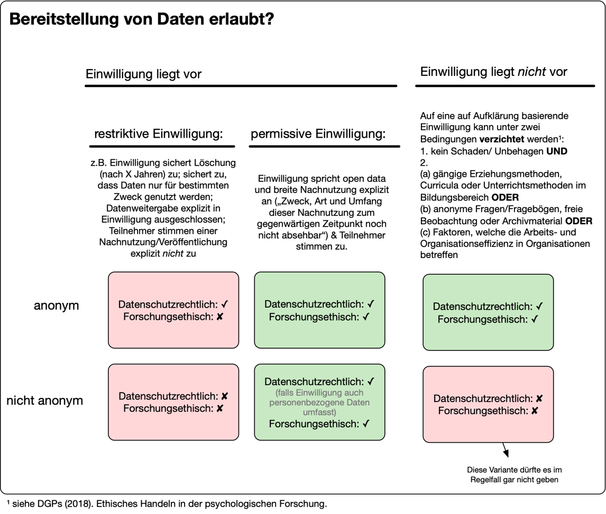
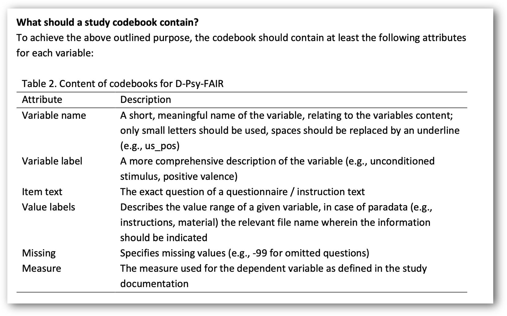
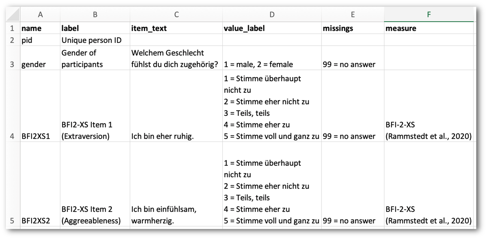
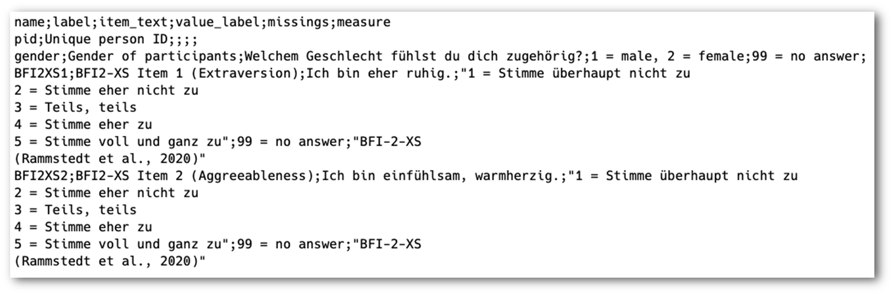
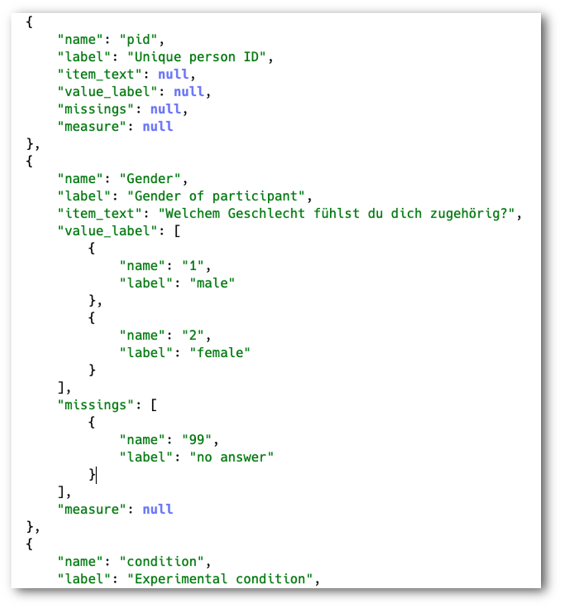
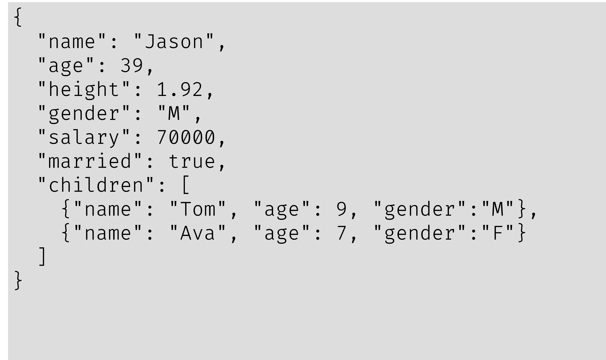
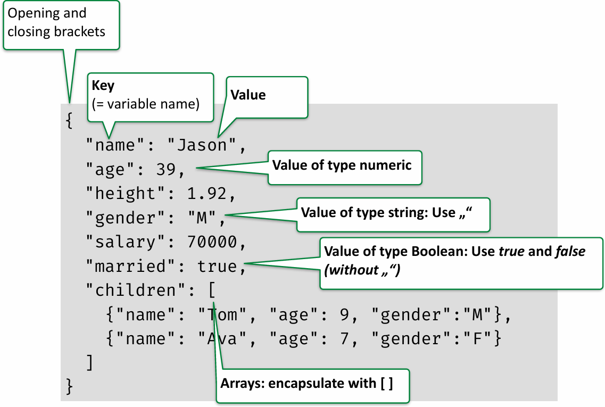
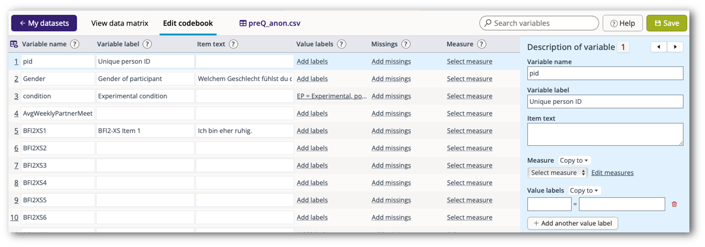

{fig-align="center" width="70%"}

# How to Codebook

## How to Codebook

::: {.smaller}
See the [D-Psy-FAIR](https://psycharchives.org/en/item/fe055282-d722-4468-8a8f-01e0cc3c0607) standard (developed by Blask et al from the Leibniz-Institute Psychology)
:::



::: {.smaller}
Save in a human-readable (e.g., .csv) and in a machine-readable (e.g., .json) format!
:::

## How to Codebook

**Excel file:**  
Human-readable: :white_check_mark: :white_check_mark:  
Machine-readabe: <span style="color: orange;">~</span>  
Accessible: :thumbsdown:



## How to Codebook

**csv file:**  
Human-readable: <span style="color: orange;">~ (raw)</span> :white_check_mark: (after import)  
Machine-readable: :white_check_mark: <br>
Accessible: :white_check_mark:



## How to Codebook

:::: {.columns}

::: {.column width="45%"}
**json file:**  
Human-readable: <span style="color: orange;">~ (raw)</span>  
Machine-readable: :white_check_mark: :white_check_mark:  
Accessible: :white_check_mark:
:::

::: {.column width="55%"}

:::

::::

## Excursus: json file format



## Excursus: json file format



## How to Codebook: Manual

* Step 1: Create your codebook as a csv file  
[– e.g., create it in Excel first, then export as .csv file]{.smaller}
* Step 2: Import into R and convert it to a json file
```{r, eval=FALSE, echo=TRUE}
library(jsonlite)
df <- read.csv("codebook.csv")
json <- toJSON(df, pretty = TRUE)
write_json(json,"codebook.json")
```
* Step 3: Save both codebook files in the /doc subfolder of 
your project
* Step 4: Upload both the .csv and the .json-file to the 
repository

## How to Codebook: DataWiz2



<div style="text-align: center;">
<https://datawiz2.dev.zpid.de>
</div>

## How to Codebook

* Resources:
* Video (51 min.): ["PTOS 9: Einführung in das Forschungsdatenmanagement mit D-Psy_FAIR“](https://zpid.cloud.panopto.eu/Panopto/Pages/Viewer.aspx?id=a8a6b29f-959e-44b2-b829-af5500be5bc7)  
[– siehe v.a.: „Schritt 2: Ein Codebuch erstellen“ ab 29:27]{.smaller}


<!-- Footer insert below -->
```{r child="../../common/lastslide.qmd"}
```
