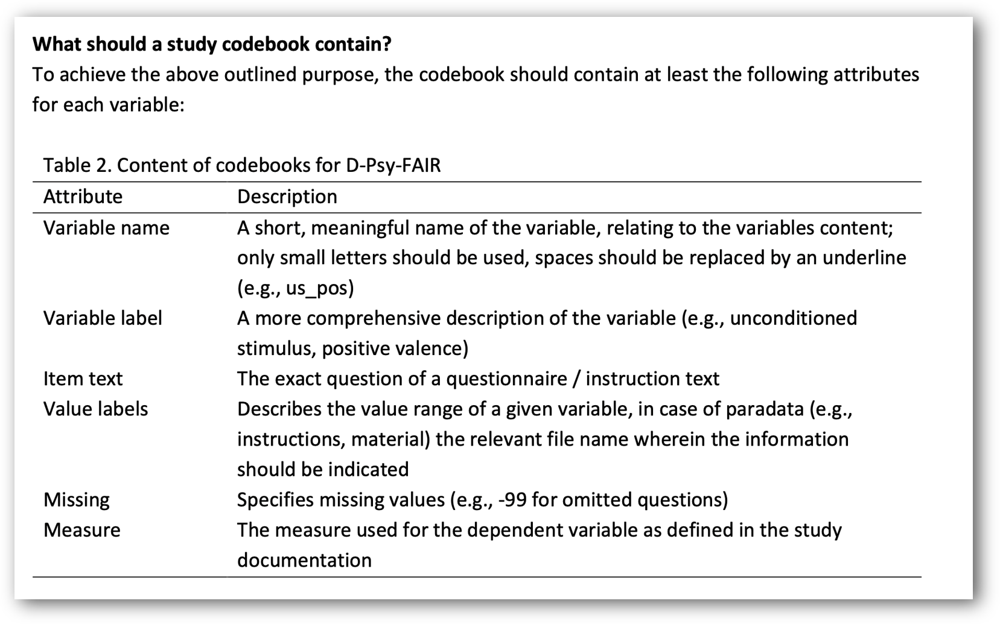
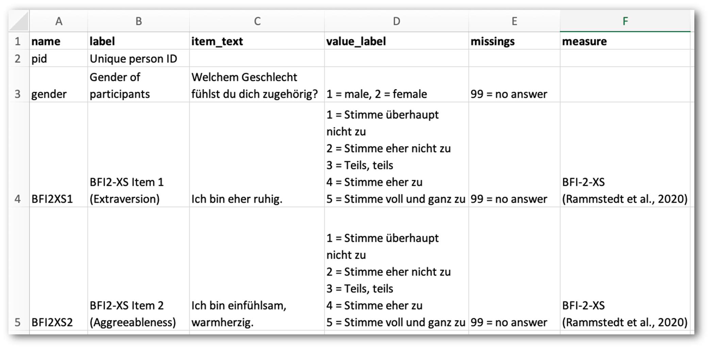
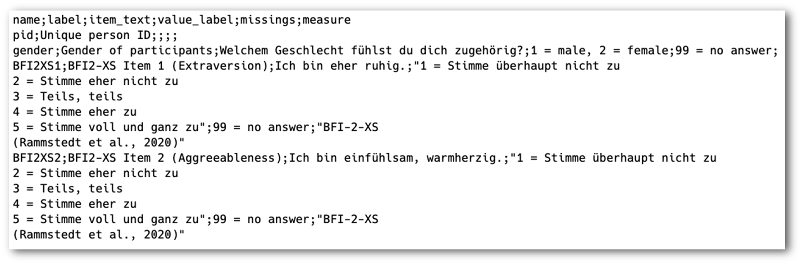
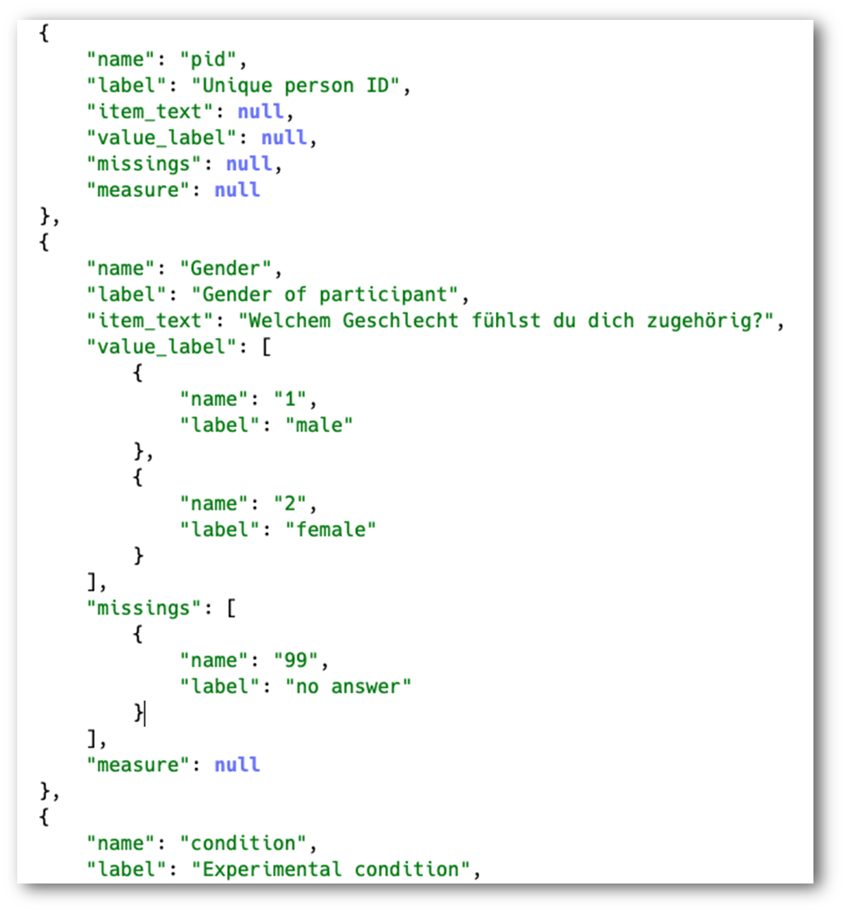
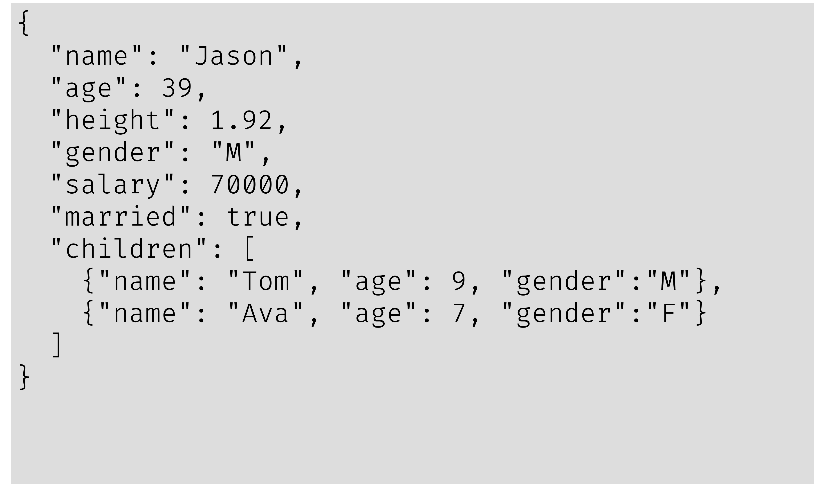
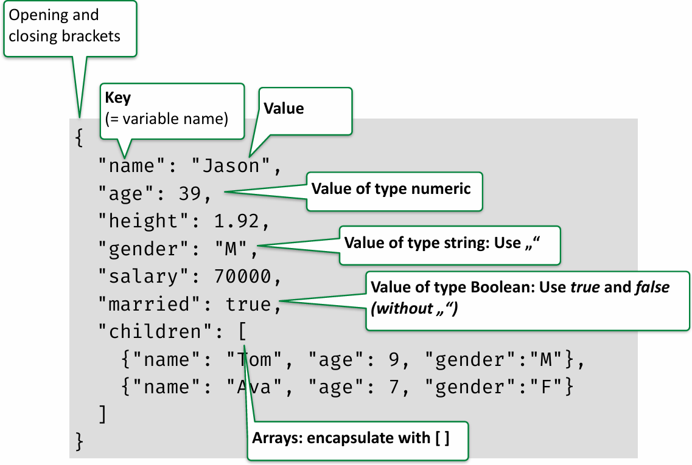
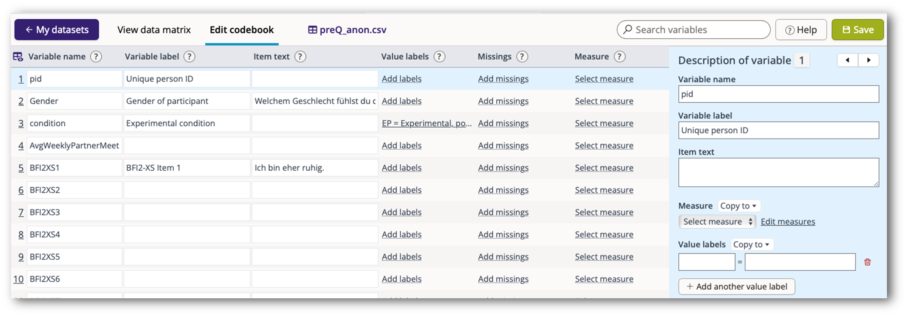

# How to create a codebook aka. data dictionary

## How to Codebook

::: {.smaller}
See the [D-Psy-FAIR](https://psycharchives.org/en/item/fe055282-d722-4468-8a8f-01e0cc3c0607) standard (developed by Blask et al from the Leibniz-Institute Psychology)
:::



::: {.smaller}
Save in a human-readable (e.g., .csv) and in a machine-readable (e.g., .json) format!
:::

## Codebook: Which file format?

**Excel file:**  
Human-readable: :white_check_mark: :white_check_mark:  
Machine-readabe: <span style="color: orange; font-weight: bold;">~</span>  
Accessible: <span style="color: orange; font-weight: bold;">~</span>



::: {.smallest}
(Note re: "Accessible": Proprietary file format; but as it is a widely used format, there are multiple open source apps which can open it).
A better alternative is the open `.ods` spreadsheet format (e.g. from LibreOffice)
:::


## Codebook: Which file format?

**csv file:**  
Human-readable: <span style="color: orange; font-weight: bold;">~ (raw)</span>  :white_check_mark: (after import)  
Machine-readable: :white_check_mark: <br>
Accessible: :white_check_mark:




## Codebook: Which file format?

:::: {.columns}

::: {.column width="45%"}
**json file:**  
Human-readable: <span style="color: orange; font-weight: bold;">~ (raw)</span>  
Machine-readable: :white_check_mark: :white_check_mark:  
Accessible: :white_check_mark:
:::

::: {.column width="55%"}

:::

::::

## Excursus: json file format



## Excursus: json file format



## How to Codebook: Manual

* Step 1: Create your codebook as an Excel or LibreOffice spreadsheet file  
* Step 2: Export it as a `.csv` file
* Step 3: Import into R and convert it to a `.json` file
```{r, eval=FALSE, echo=TRUE}
library(jsonlite)
df <- read.csv("codebook.csv")
json <- toJSON(df, pretty = TRUE)
write_json(json,"codebook.json")
```
* Step 4: Save both codebook files in the `/doc` subfolder of 
your project
* Step 5: Upload both the `.csv` and the `.json`-file to the 
repository

## How to Codebook: DataWiz2



<div style="text-align: center;">
<https://datawiz2.beta.zpid.org>
</div>

## How to Codebook

* Resources:
* Video (51 min.): ["PTOS 9: Einführung in das Forschungsdatenmanagement mit D-Psy_FAIR“](https://zpid.cloud.panopto.eu/Panopto/Pages/Viewer.aspx?id=a8a6b29f-959e-44b2-b829-af5500be5bc7)  
[– siehe v.a.: „Schritt 2: Ein Codebuch erstellen“ ab 29:27]{.smaller}


<!-- Footer insert below -->
```{r child="../../common/lastslide.qmd"}
```
