<!-- Dauer: 25 min. -->
<!-- Dauer: na ja, mit vielen Anekdoten dauert es bei mir auch mal 1h -->

## Open Science in the research process

<!-- Insert blank lines -->
<br>

<div style="text-align: center;">
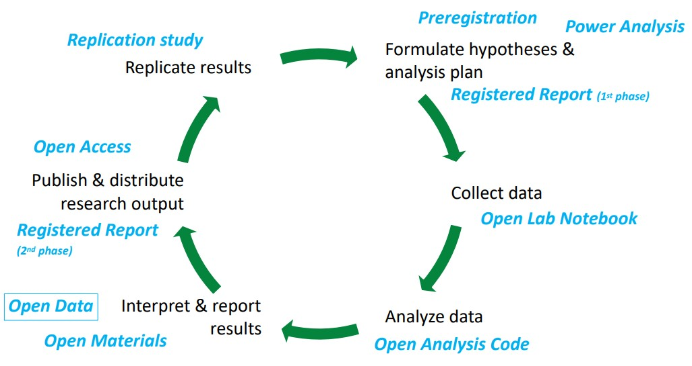{width=750px}
</div>


::: footer
get all material here: [https://osf.io/zjrhu/](https://osf.io/zjrhu/)
:::

# Why open data?

## Why open data?
### 1. Nullius in verba

::: columns
::: {.column width="70%"}

- take nobody's word for it
- Motto of the oldest scientific
  society (Royal Society, founded 1660)
- Science is not built upon blind
  trust, but on verifiability.
- "Organized skepticism"
  (Merton, 1947)
:::
::: {.column width="30%"}
{width=300px}
:::
:::

::: {.callout-important style="font-size: 32px;"}
Only when raw data (and other research material) are shared organized skepticism can be enacted, and science can really be self-correcting. Open data is one part of good scientific practice.
:::


## Why open data?
### 2. Efficiency and Inclusiveness

- Speedy responses in outbreaks; share rare and hard-to-collect data

<div style="text-align: center;">
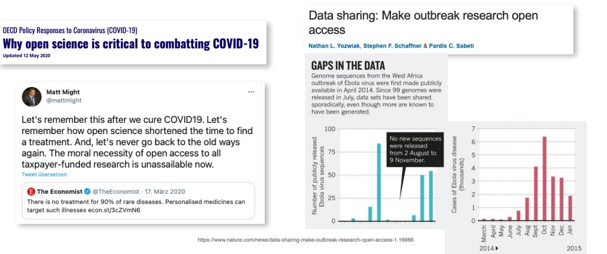{height=260px}
</div>

::: {.callout-important style="font-size: 32px;"}
The covid-19 pandemic has shown how fast scientific progress can be when we share our data and knowledge freely, and that free knowledge is a moral imperative.
:::


## Why open data?
### 3. Public money = public good

<div style="text-align: center;">
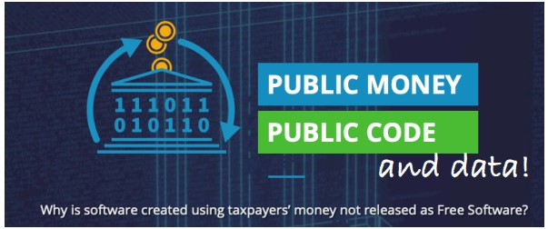{ width=600px}
</div>

::: footer
[https://publiccode.eu/en/](https://publiccode.eu/en/)
::: 

::: {.callout-important style="font-size: 32px;"}
Publicly funded research data does not belong to the researcher who collected it. S/he has the right of primary usage, but after that the data should be considered a public good (of course respecting privacy rights and applicable copyrights).
:::


## Why open data?
### 4. Data persistence

::: columns
::: {.column width="60%"}
- never lose data due to a crashed hard disk drive
:::
::: {.column width="40%"}
<div style="text-align: center;">
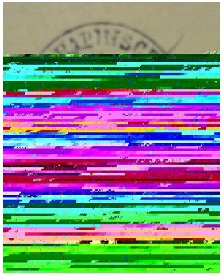{width=200px}
</div>
:::
:::


::: {.callout-important style="font-size: 32px;"}
A publicly funded repository is the right place for long term storage of research data – not your private USB stick, your personal university website (that vanishes after you change affiliation), or the journal’s online supplemental material that hides the data behind a paywall.
:::


## Why open data?
### 5. More and more funders and journals demand it.

<div style="text-align: center;">
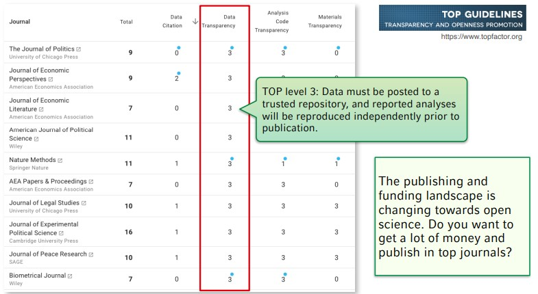{width=750px}
</div>


# What is open data?

## What is Data?

<!-- Insert blank lines -->
<br>
<br>
<br>

> "The recorded factual material commonly retained by and
accepted in the scientific community as necessary to validate
research findings." (EPSRC, 2018)


<div style="text-align: center;">
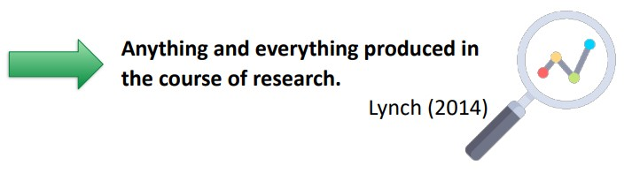
</div>

::: footer
Icon from [flaticon.com](https://www.flaticon.com/) by freepic
::: 


## What is Data?

<!-- Insert blank lines -->
<br>

<div style="text-align: center; margin-top: -40px;">
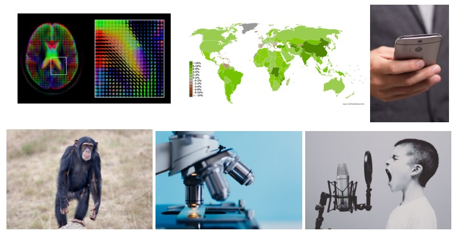{width=750px}
</div>

::: {.smaller}
<div style="text-align: center;" "margin-top: -40px;">
➙ we need field-specific definitions: What constitutes "research data"?
</div>
:::

::: footer
::: {.smallest}
Pictures from [en.wikipedia.org/w/index.php?curid=36808161](en.wikipedia.org/w/index.php?curid=36808161); [pixabay.com](pixabay.com); [pxhere.com/en/photo/1192476](pxhere.com/en/photo/1192476); [pxhere.com/en/photo/914805](pxhere.com/en/photo/914805); [pxhere.com/en/photo/595225](pxhere.com/en/photo/595225);
[commons.wikimedia.org/wiki/File:Gdp_real_growth_rate_2007_CIA_Factbook.PNG](commons.wikimedia.org/wiki/File:Gdp_real_growth_rate_2007_CIA_Factbook.PNG)
:::
::: 


## Example: Psychology

<!-- Insert blank lines -->
<br>
<div style="text-align: center;">
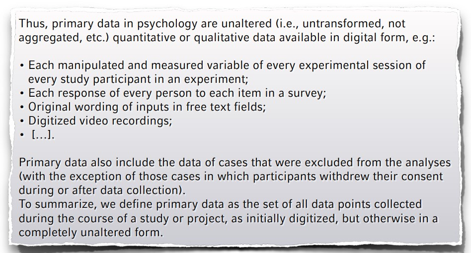{width=750px}
</div>

<div style="text-align: center;">
::: {.smaller}
Recommendations of the German Psychological Association, [https://psyarxiv.com/24ncs/](https://psyarxiv.com/24ncs/)
:::
</div>

::: {.attribution style="font-size: 12px;"}
[https://osf.io/preprints/psyarxiv/vhx89](https://osf.io/preprints/psyarxiv/vhx89)
:::


## Not only open, but FAIR

<!-- Insert blank lines -->
<br>
<div style="text-align: center;">
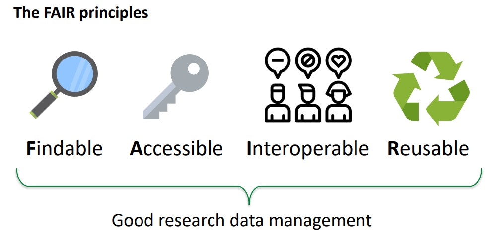{width=650px}
</div>

::: footer
Icon from [flaticon.com](https://www.flaticon.com/) by freepic, mynamepong, monkik <br>       FORCE11(2011)
:::


# Balancing values: <br> Three fields of tension with <br> (human subject) data

## Balancing values

<!-- Insert blank lines -->
<br>

<style>
.balance-container { display: flex; flex-direction: column; align-items: center; gap: 10px; margin-top: 10px; }
.balance-row { display: flex; justify-content: center; align-items: center; gap: 20px; margin-bottom: 20px; }
.balance-box { border-radius: 12px; padding: 15px 20px; width: 340px; height: 110px; text-align: center; font-size: 24px; display: flex; align-items: center; justify-content: center; box-shadow: 0 4px 8px rgba(0,0,0,0.1); line-height: 1.3; }
.balance-box p { margin: 0; padding: 0; }
.box-blue { background: #e3f2fd; border: 2px solid #90caf9; color: #0d47a1; }
.box-green { background: #e8f5e9; border: 2px solid #a5d6a7; color: #1b5e20; }
.balance-arrow { font-size: 40px; color: #555; font-weight: bold; display: flex; align-items: center; }
.balance-arrow p { margin: 0; padding: 0; transform: translateY(-4px); }
</style>

::: {.balance-container}

::: {.balance-row}
::: {.balance-box .box-blue}
Open Data, public interest, entitlement to publicly funded data
:::
::: {.balance-arrow}
↔
:::
::: {.balance-box .box-green}
Privacy rights of research subjects
:::
:::

::: {.balance-row}
::: {.balance-box .box-blue}
Right of first usage, incentives to collect data in the first place
:::
::: {.balance-arrow}
↔
:::
::: {.balance-box .box-green}
Optimal and efficient gain of knowledge by data reuse
:::
:::

::: {.balance-row}
::: {.balance-box .box-blue}
Reproducibility and verifiability of published analyses
:::
::: {.balance-arrow}
↔
:::
::: {.balance-box .box-green}
Protect original authors against inadequate burden and potential attacks
:::
:::

:::


## Balancing values 1

<!-- Insert blank lines -->
<br>

::: {.balance-row}
::: {.balance-box .box-blue}
Open Data, public interest, entitlement to publicly funded data
:::
::: {.balance-arrow}
↔
:::
::: {.balance-box .box-green}
Privacy rights of research subjects
:::
:::


- Privacy rights > openness; but also: "legitimate interest" of
  research
- Ask participants for a broad consent of open reuse
- Restrict access with "scientific use files"; publish aggregated data (e.g., ratings of videos)   without the primary data (videos)
- Sharing something > sharing nothing
- As open as possible, as restricted as necessary


## Balancing values 2

<!-- Insert blank lines -->
<br>

::: {.balance-row}
::: {.balance-box .box-blue}
Right of first usage, incentives to collect data in the first place
:::
::: {.balance-arrow}
↔
:::
::: {.balance-box .box-green}
Optimal and efficient gain of knowledge by data reuse
:::
:::

- Right of first usage, possibility of embargo
- At the end of the day (resp., the embargo), all data are as open as possible
- Incentivize data sharing


## 

<div style="text-align: center;">
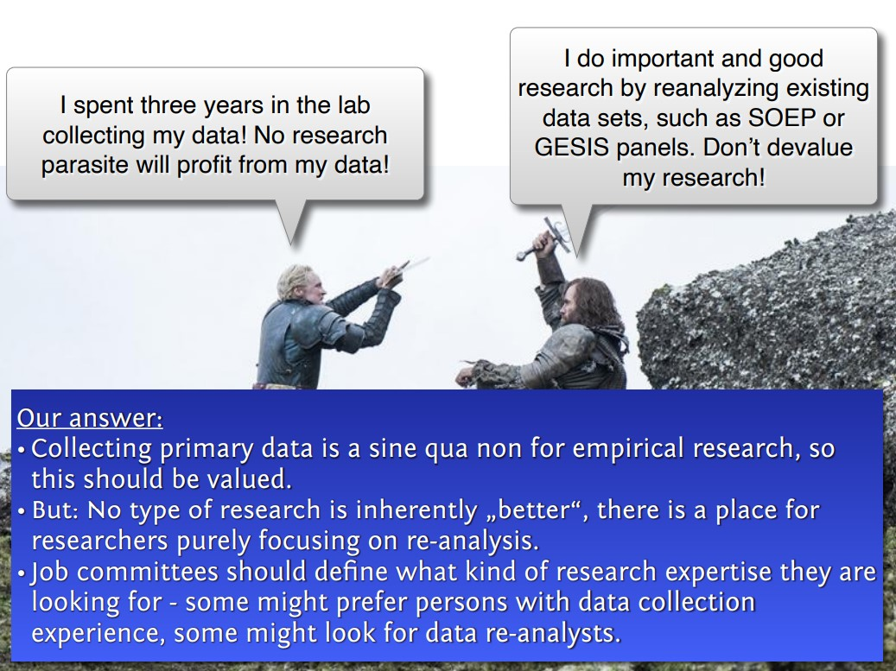{width=750px}

</div>

## -

<div style="text-align: center;">
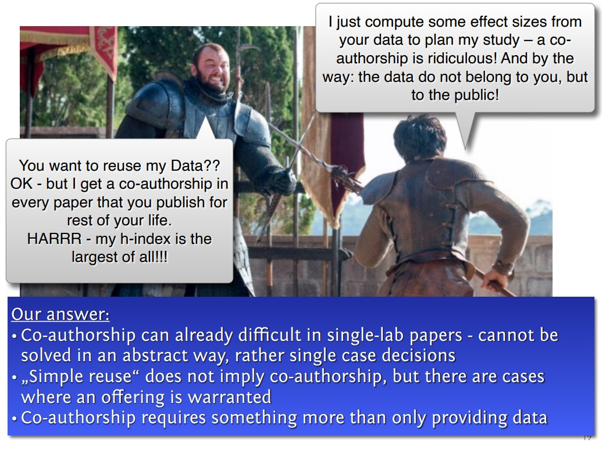{width=750px}

</div>

## Balancing values 3

<!-- Insert blank lines -->
<br>

::: {.balance-row}
::: {.balance-box .box-blue}
Reproducibility and verifiability of published analyses
:::
::: {.balance-arrow}
↔
:::
::: {.balance-box .box-green}
Protect original authors against inadequate burden and potential attacks
:::
:::

- Primary focus: openness and transparency. Correcting
  errors is painful, but a necessary condition for doing
  science
- Data providers should be informed if their data are
  going to be reused or reanalyzed ➙ allows to prepare a
  reaction


## Balancing values 3

<!-- Insert blank lines -->
<br>

::: {.balance-row}
::: {.balance-box .box-blue}
Reproducibility and verifiability of published analyses
:::
::: {.balance-arrow}
↔
:::
::: {.balance-box .box-green}
Protect original authors against inadequate burden and potential attacks
:::
:::

- Problematic asymmetry:
  - Data provided ➙ often errors get detected
  - No data provided ➙ no errors are detected (because not
    possible). Default assumption: "Everything is OK. Perfect paper,
    because no errors are spotted!"
- Making oneself vulnerable is good for science, and should also be
  good for reputation!
- Change default assumption?
  "No data ➙ Probably erroneous analysis."


## Success stories

<!-- Insert blank lines -->
<br>

<div style="text-align: center; margin-top: -40px;">
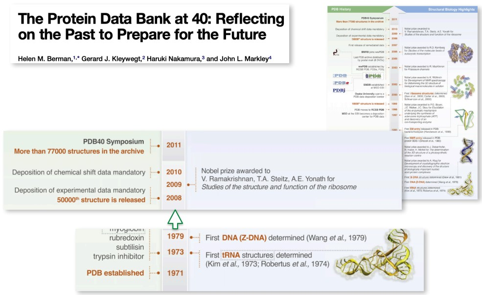{width=750px}

</div>

::: footer
[https://www.cell.com/action/showPdf?pii=S0969-2126%2812%2900018-4](https://www.cell.com/action/showPdf?pii=S0969-2126%2812%2900018-4)
:::


## When are you allowed to share the data?
### Consider both: Privacy & Research Ethics

::: {.callout-note}
(German slide, as this refers to German rules. Things might be different in other countries and other institutions!)
:::

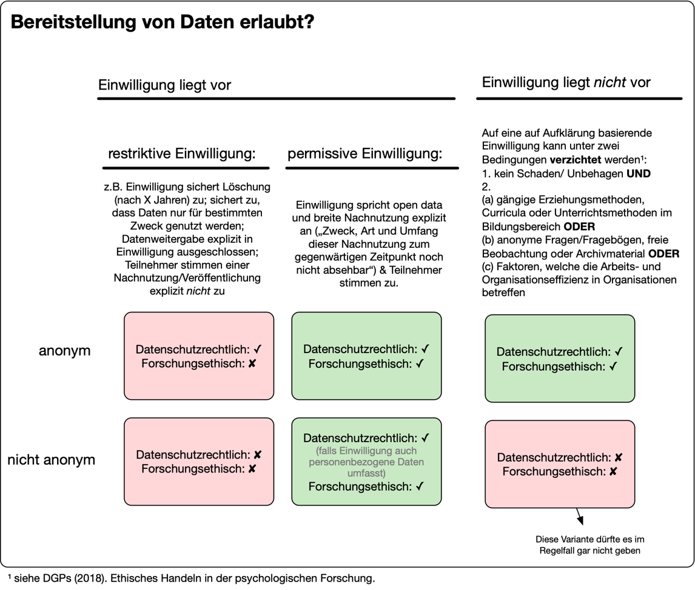{fig-align="center" width="80%"}


<!-- Footer insert below -->
```{r child="../../common/lastslide.qmd"}
```
