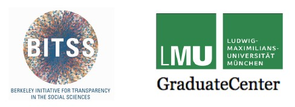

<!-- Dauer: 25 min. -->


## Advocatus Diaboli

:::: {.columns}
::: {.column width="30%"}
{width=200px}
:::
::: {.column width="70%"}

<!-- Insert blank lines -->
<br>
But...<br>
... preregistration keeps me from conducting exploratory research!

<!-- Insert blank lines -->

::: {.fragment .fade-up}
<br>

- Improving your confirmatory research does not mean that you have to refrain from doing          exploratory research
- You can also preregister your exploratory research (e.g., planned analysis methods)
:::
:::
::::

::: footer
Icons from [flaticon.com](flaticon.com) by EucalypIcons, Smashicons, and Freepic
:::


## Advocatus Diaboli

:::: {.columns}
::: {.column width="30%"}
{width=200px}
:::
::: {.column width="70%"}

<!-- Insert blank lines -->
<br>
But...<br>
... preregistration takes so much time!

<!-- Insert blank lines -->

::: {.fragment .fade-up}
<br>
<br>

- Actually it might even save you time during data analysis / interpretation.
- Preregistration mostly changes the order of the research process (e.g., think about how to      analyze your data before / after you collect them).
:::
:::
::::


## Advocatus Diaboli

:::: {.columns}
::: {.column width="30%"}
{width=200px}
:::
::: {.column width="70%"}

<!-- Insert blank lines -->
<br>
But...<br>
... someone will steal my ideas!

<!-- Insert blank lines -->
::: {.fragment .fade-up}
<br>
<br>

- On the contrary. By preregistering your ideas you mark them as yours! If anyone still dares to   steal them, it will be very easy to point this out as scientific misconduct.
- On some repositories (e.g., OSF), you can put an embargo on the preregistration. Then the preregistration is not publicly visible for a period of up to 4 years.
:::
:::
::::


## Advocatus Diaboli

:::: {.columns}
::: {.column width="30%"}
{width=200px}
:::
::: {.column width="70%"}

<!-- Insert blank lines -->
<br>
But...<br>
... what if I (or my students) make mistakes in the
preregistration?

<!-- Insert blank lines -->
::: {.fragment .fade-up}
<br>

- Everyone makes mistakes, no need to be embarrassed!
- You can always deviate from your preregistered analysis if you give a good justification.
- If you make your preregistration open and someone finds a mistake, consider yourself lucky      because this spares you finding it out when it is too late.
:::
:::
::::


## Advocatus Diaboli

:::: {.columns}
::: {.column width="30%"}
{width=200px}
:::
::: {.column width="70%"}

<!-- Insert blank lines -->
<br>
But...<br>
... someone could preregister multiple hypotheses
and take the preregistration that fits the data best!

<!-- Insert blank lines -->
::: {.fragment .fade-up}
<br>

- That would be easy-to-spot scientific misconduct (compared to not-so-easy to spot HARKing       without prereg)
- If more than one hypothesis is preregistered you will need a lot of luck that you have a        "perfect-fit" preregistration
:::
:::
::::


## Advocatus Diaboli

:::: {.columns}
::: {.column width="30%"}
{width=200px}
:::
::: {.column width="70%"}

<!-- Insert blank lines -->
<br>
But...<br>
... people preregister stuff and then deviate
significantly from the preregistration. What is it good for then?

<!-- Insert blank lines -->
::: {.fragment .fade-up}
<br>

- As a reviewer, it should make you vigilant about the quality of the paper → require             justifications for deviations from the preregistration
- As a reader, you will be able to judge the quality of results (do they come from confirmatory   or exploratory research?)
- It helps you to spot QRPs.
:::
:::
::::


## Advocatus Diaboli

:::: {.columns}
::: {.column width="30%"}
{width=200px}
:::
::: {.column width="70%"}

<!-- Insert blank lines -->
<br>
But...<br>
... I am doing qualitative research and none of the
quantitative templates fits my way of working!?

<!-- Insert blank lines -->
::: {.fragment .fade-up}
<br>

- That the templates do not fit perfectly does not mean you cannot conduct a preregistration.
- Try to explain: What are your hypotheses? How do you want to investigate them? What will your
  data look like? How do you plan to evaluate the data? → Try to minimize degrees of freedom and   you have met the goal.
:::
:::
::::


## Credentials

::: {.smaller}
The creation of this workshop material was partially funded by the Berkeley Initiative for Transparency in the Social Sciences (BITSS) Catalyst Program. For more information, please visit [www.bitss.org](https://www.bitss.org/), sign up for the BITSS blog, and follow BITSS on Twitter [@UCBITSS](https://twitter.com/UCBITSS). We also kindly thank the LMU GraduateCenter for their support.

<div style="text-align: left;">
{width=350px}
</div>

These slides were created by Angelika Stefan, Julia Brandt, and Felix Schönbrodt. The work is licensed under a [Creative Commons Attribution 4.0 International License](https://creativecommons.org/licenses/by/4.0/). *That means, you can reuse this slides in your own workshops, remix them, or copy them, as long as you attribute the original creators.*

<small style="text-align:left;">
[![CC-BY-SA 4.0][cc-by-sa-image]][cc-by-sa]

[cc-by-sa]: http://creativecommons.org/licenses/by-sa/4.0/
[cc-by-sa-image]: https://licensebuttons.net/l/by-sa/4.0/88x31.png
[cc-by-sa-shield]: https://img.shields.io/badge/License-CC%20BY%20SA4.0-lightgrey.svg
</small>
:::


<!-- Footer insert below -->
```{r child="../../common/lastslide.qmd"}
```
