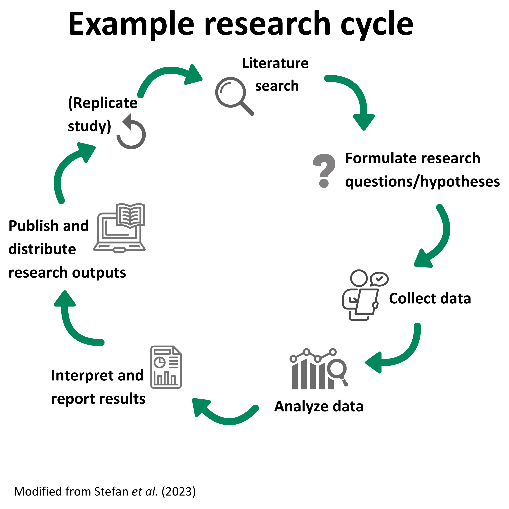
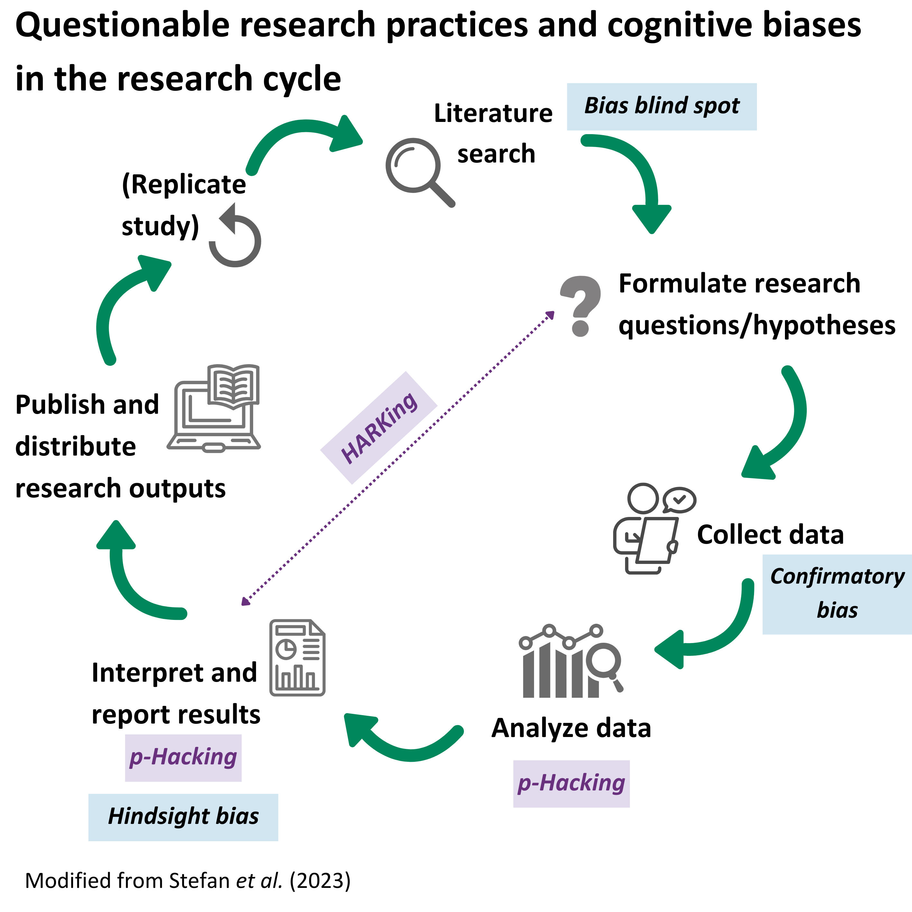
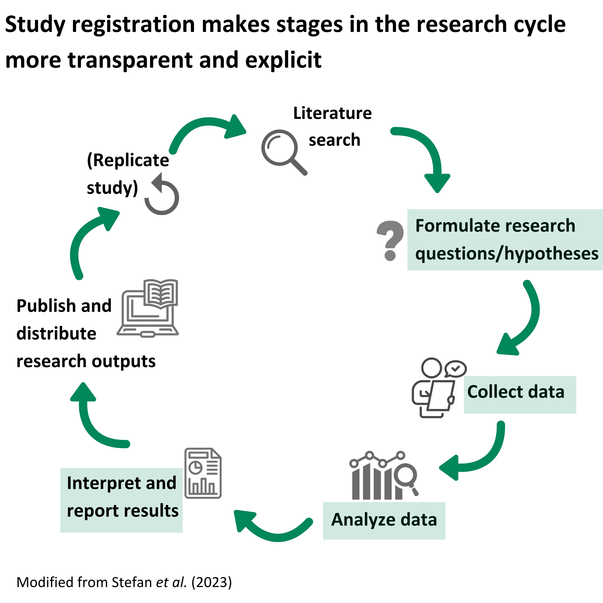
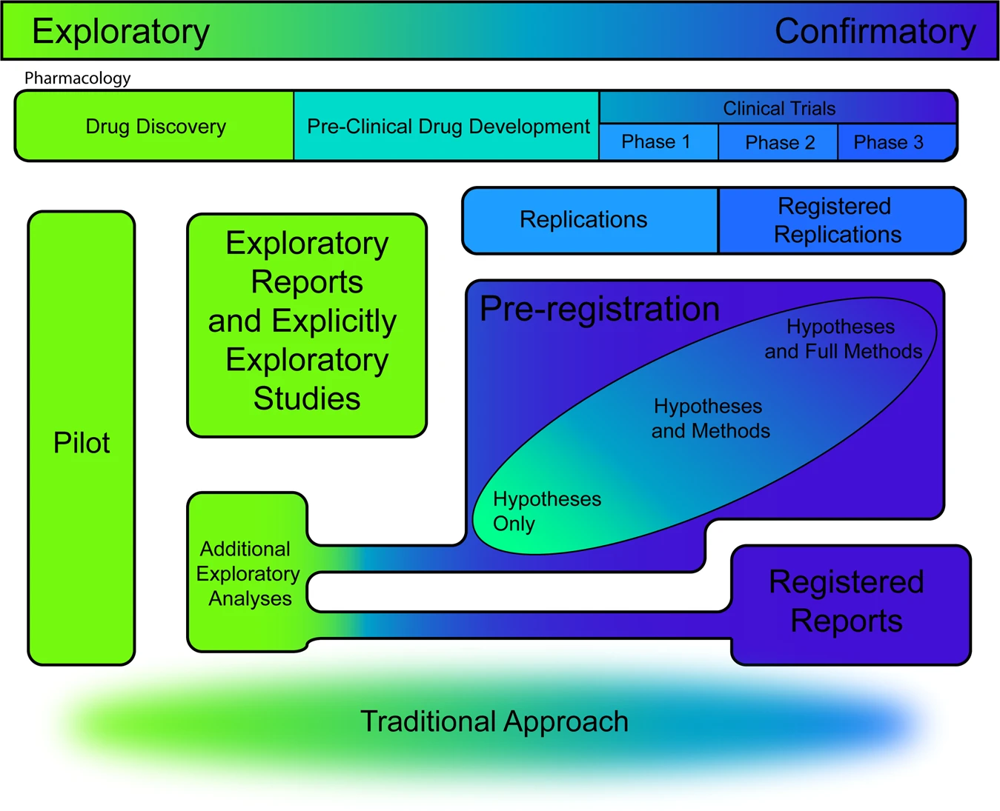
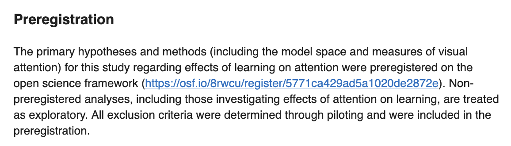
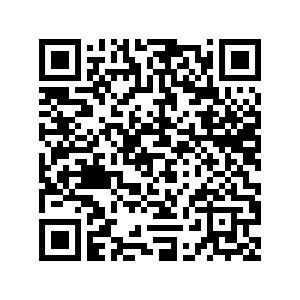
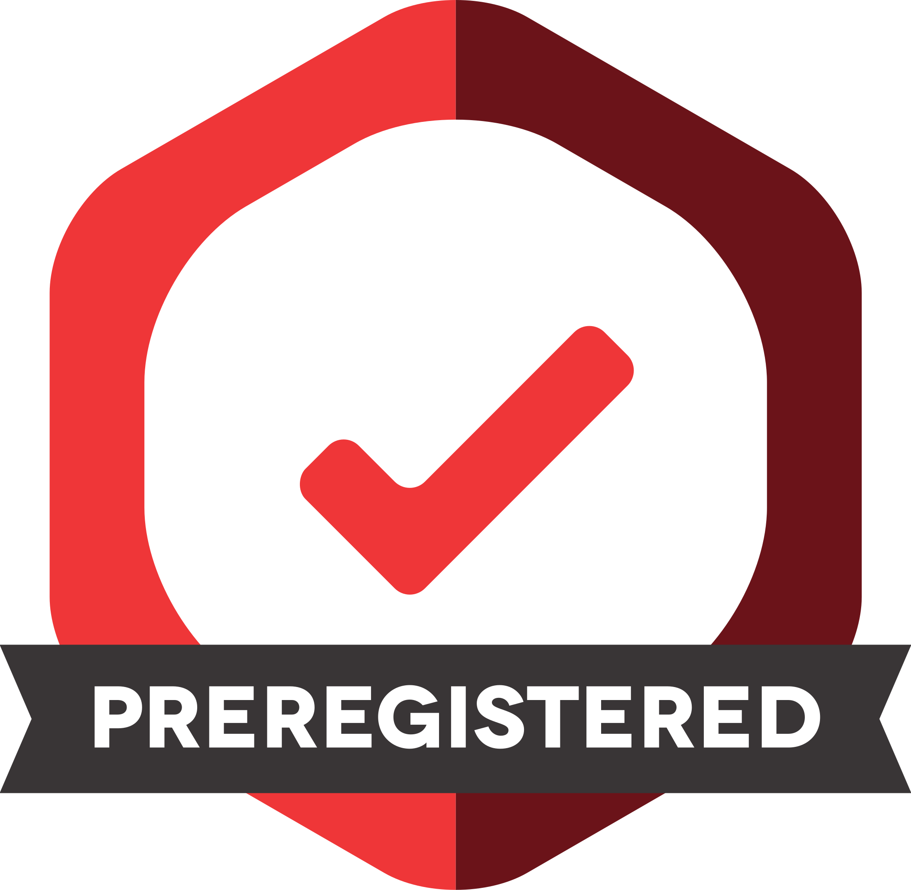

## Credit statement and licence

**Creator**: Sara Lil Middleton (
0000-0001-5307-8029)

**Reviewer**: Malika Ihle (
0000-0002-3242-5981)

**Acknowledgments**: Gracia Prum (
orcid), Dejana Damjanovic (
orcid)

<br> <br>

::: {style="font-size: 0.6em;"}
This work by Sara Lil Middleton and Malika Ihle is licensed under a
CC-BY 4.0 [Creative Commons Attribution 4.0 International License](#0).
:::

::: notes
*Speaker Notes:*

These are the **speaker notes**. You will a script for the presenter for
every slide. In presentation mode, your audience will not be able to see
these speaker notes, they are only visible to the presenter.

*Instructor Notes:*

There are also **instructor notes**. For some slides, there will be
pedagogical tips, suggestions for activities and troubleshooting tips
for issues your audience might run into. You can find these notes
underneath the speaker notes.
:::

------------------------------------------------------------------------

## Prerequisites

::: callout-important
Before completing this submodule, please carefully read about the
necessary prerequisites.
:::

-   Familiarity with the steps in the research life cycle, the different
    types of variables (independent, dependent and covariates)

::: notes
*Speaker Notes:*

*Instructor Notes:*

Learners require a device with internet access
:::

------------------------------------------------------------------------

## Your study registration journey

<br> <br> From: *“I am not sure what study registration is or why it is
important”* <br> <br> To: "*“I feel empowered to adopt the principles
and practices of study registration"*

::: notes
*Speaker Notes:*

This journey aims to take you from the what or why is study registration
important? to feeling empowered to adopt key principles of study
registration

*Instructor Notes:*

Communicating the overall learning outcomes as a journey helps embed the
step by step build up of complexity of the topic (i.e. moving along
Bloom's Taxonomy levels)
:::

------------------------------------------------------------------------

## Before we start: Results of survey!

::: notes
*Speaker Notes:*

Let's take a look at the results of the short survey that was sent out
before class. We will then compare our answers at the end of class.
:::

------------------------------------------------------------------------

**1. How familiar are you with the practice of study registration?**
<br> <br> (1 to 5 scale: **1** = Never heard, **2** = Basic knowledge,
but cannot describe in detail, **3** = Some knowledge and can discuss,
**4** = Some knowledge, can discuss and relate to with other issues,
**5** = Extensive knowledge)

-   [ ] 1. Never heard of it

-   [ ] 2. Basic knowledge, but cannot describe in detail

-   [ ] 3. Some knowledge and can discuss

-   [ ] 4. Some knowledge, can discuss and relate to with other issues

-   [ ] 5. Extensive knowledge

::: notes
*Speaker Notes:*

How familiar are you with the practice of study registration? Scale runs
from 1 to 5 where 1 = never heard of it and 5 = extensive knowledge.
:::

------------------------------------------------------------------------

**2. How would you rate your confidence to carry out a registration for
your study?** <br> <br> (1 to 5 scale: **1** = Not confident at all,
**2** = Slightly confident, **3** = Somewhat confident, **4** = Very
confident, **5** = Completely confident)

-   [ ] 1. Not confident at all

-   [ ] 2. Slightly confident

-   [ ] 3. Somewhat confident

-   [ ] 4. Very confident

-   [ ] 5. Completely confident

::: notes
*Speaker Notes:*

How would you rate your confidence to carry out a registration for your
study? Scale runs from 1 to 5 where: 1 = Not confident at all and 5 =
Completely confident)
:::

------------------------------------------------------------------------

**3. What words come to mind when you think of study registration?**

::: notes
*Speaker Notes:*

3\. What words come to mind when you think of study registration?
:::

------------------------------------------------------------------------

## Where are we at?

::: notes
*Speaker Notes:*

Here are the results from the survey

*Instructor Notes:*

Briefly examine the answers given to each question interactively with
the group on particify

Use visuals from the survey to highlight specific answers.

Make it clear to the group that there will be a similar post-submodule
survey to examine understanding and learning progress.
:::

------------------------------------------------------------------------

## Learning goals

**Aim**: Examine study registration as an open science practice, its
links to addressing questionable research practices and discuss common
challenges with doing a study registration. <br> <br>

There are **four** sections to this submodule:

-   **Section 1**: Introduction to study registration

-   **Section 2:** How to do a study registration

-   **Section 3:** Challenges and opportunities of study registration

-   **Section 4:** Wrap up and building a registration toolkit

::: notes
*Speaker Notes:*

The over all aim of this submodule is to examine study registration as
an open science practice, its links to addressing questionable research
practices and discuss common challenges with doing a study registration

There are four sections to this submodule where the first two sections
focus on the key context of study registration and practical steps of
registering a study and the third section focuses on crowd-sourcing the
merit and concerns about study registration and ways to address
challenges.

We will end with a wrap up session and think about what next.

*Instructor Notes:*

Giving the whole overview at the start of the session provides learners
with structure and clarity about what to expect.
:::

------------------------------------------------------------------------

### Section 1: Learning goals and overview

Section 1 is all about learning the key terms and definitions and to get
you thinking about the *what* and the *why* of study registration. <br>
<br>

Activity: Reflection question and quiz <br> <br>

After completing section 1 you should be able to:

-   **Recognize** the context of why registration exists as an open
    science practice

::: notes
*Speaker Notes:*

After completing section 1 you should be able to:

-   **Recognize** the context of why registration exists as an open
    science practice

The main activity is a self reflection exercise
:::

------------------------------------------------------------------------

### Section 2: Learning goals and overview

Section 2 is all about learning about the steps involved in a study
registration <br> <br>

Activity: "Improve the answer" (own and group work)

After completing section 2 you should be able to:

-   **Identify** the key components of a study registration
-   **Describe** the differences between study registration and
    registered reports
-   **Practice** improving a component of a study registration

::: notes
*Speaker Notes:*

After completing section 2 you should be able to:

-   **Identify** the key components of a study registration
-   **Describe** the differences between study registration and
    registered reports
-   **Practice** improving a component of a study registration

The main activity is a improving elements of study registration
:::

------------------------------------------------------------------------

### Section 3: Learning goals and overview

Section 3 is all about addressing some common barriers to study
registration <br> <br>

Activity: Perspective mapping and discussion (whole class)

After completing section 3 you should be able to:

-   **Explain** the perceived barriers to doing a study registration
-   **Identify** key benefits of study registration

::: notes
*Speaker Notes:*

Activity: Perspective mapping (whole class) After completing

section 3 you should be able to:

-   **Explain** the perceived barriers to doing a study registration
-   **Identify** key benefits of study registration

The main activity is a documenting our perceived pros and cons of study
registration
:::

------------------------------------------------------------------------

### Section 4: Learning goals and overview

Section 4 we will summarize key learnings <br> <br>

Activity: Build up your registration toolkit! (individual work) Optional
activity: quiz!

After completing section 4 you should be able to:

-   **Propose** an action that follows the principles of study
    registration that one can implement

::: notes
*Speaker Notes:*

In the final section you should be able to:

-   **Propose** an action that follows the principles of study
    registration that one can implement

The last activity you will work individually to build up your study
registration toolkit!
:::

------------------------------------------------------------------------

## Section 1: Introduction to registration

::: notes
*Speaker notes:*

Let's start get started with section 1 where will look at the context of
why study registrations exist.
:::

------------------------------------------------------------------------

## Warm up question to get us started!

In your research project, when do you typically *think about* the type
of *analysis* you use?

-   [ ] A. As you collect your data
-   [ ] B. After you have collected all your data
-   [ ] C. As you plan your study

1.  *Reflect* on the question on your own
2.  We will *share* our answers in class

::: notes
*Speaker Notes:*

To get us to think about our current ways of working, I would like us
think about our current or past research project and reflect on this
question: In your research project, when do you typically think about
the type of analysis you use?

A. As you collect your data B. After you have collected all your data C.
As you plan your study

We will then share our some of our thoughts as a class.

*Instructor Notes:*

*Activity delivery mode:* Suitable for in person, online and hybrid
teaching formats: Provide learners with a minute to think and then
submit their answers anonymously on a pre-prepared Particify poll.
Project the results of the question on the board/share screen (if
online). Remark on the most popular answer and invite 1 or 2 learners to
share their experiences related to the question if they feel comfortable
sharing.

*Pedagogical add on:* This self reflection question invites learners to
reflect on their own workflows. It also primes them for the practice of
registration being about reframing or front loading research planning in
advance of collecting data.
:::

------------------------------------------------------------------------

## When we think about analyses

-   *Where* in the research life cycle we think about analyses
    influences how we *interpret* and *report* our findings

-   It is also important to think about the type of research approach of
    your study

::: notes
*Speaker Notes*:

*Where* in the research life cycle we think about analyses influences
how we *interpret* and *report* our findings

-   It is also important to think about the type of research approach of
    your study
:::

------------------------------------------------------------------------

## Research cycle stages

::: {style="text-align: center;"}

:::

::: notes
*Speaker Notes:*

Here we have key stages of a research cycle

Starts with a literature search, reviewing the literature on the chosen
topic. Then stating research questions and any hypotheses After that
comes data collection, analysis and interpretation, before the research
findings are reported. Replicating study is also an option.
:::

------------------------------------------------------------------------

## Approaches to research

There are different ways to do research depending on what information
you are trying to gather. Research can be:

-   **Qualitative** (interview study, focus groups, ethnographic)
-   **Review-based** (systematic, narrative)
-   **Intervention/experimental** (randomized control trials, factorial
    design)
-   **Observational** (case study, natural experiment, longitudinal)

::: callout-tip
Being able to understand the different research approaches, study
designs and key concepts will help provide context for the steps
required to do a study registration.
:::

::: notes
*Speaker Notes:*

There is no single one way to do research! It all depends on what
information you are trying to gather. The research cycle diagram from
earlier can look a little different depending on the approach.

Different research approaches include:

-   **Qualitative** for example studies based on interviews, focus
    groups, ethnographic accounts
-   **Review-based** for example systematic and narrative reviews
-   **Intervention/experimental** such as randomized control trials or
    factorial design
-   **Observational** for example case studies, natural experiments,
    longitudinal studies
:::

------------------------------------------------------------------------

## Qualitative research

-   Qualitative research approaches focus on examining the meanings,
    experiences, and *perspectives* of individuals or groups

-   Data collection involves primary, first-hand, *text-based* data that
    is analyzed using specific interpretive methods.

::: notes
*Speaker Notes*:

Qualitative research approaches focus on examining the meanings,
experiences, and perspectives of individuals or groups

-   Data collection ivolves primary, first-hand, text-based data and
    analyze it using specific interpretive methods.

*Instructor notes:*

Instructors should provide examples of different research approaches
that their class can relate to.
:::

------------------------------------------------------------------------

## Review-based research

-   Review-based research involves collating and *synthesizing*
    previously *published* work on a topic.

-   These approaches can be used to generate *new insights* and identify
    *knowledge gaps*.

-   Reviews can be more or less done *systematically*, with systematic
    review and meta-analyses having well-established protocols (e.g.
    [PRISMA guidelines](https://www.prisma-statement.org/))

::: notes
*Speaker notes*:

Review-based research involves collating and synthesizing previously
published work on a topic.

These approaches can be used to generate new insights and identify
knowledge gaps.

Reviews can be more or less done systematically, with systematic review
and meta-analyses having well-established protocols (e.g. [PRISMA
guidelines](https://www.prisma-statement.org/))

*Instructor notes:*

Instructors should provide examples of different research approaches
that their class can relate to.
:::

------------------------------------------------------------------------

## Intervention and experimental research

-   Intervention and experimental research approaches are closely
    related. They involve *deliberate manipulations* to a physical
    *entity* (e.g. individuals, groups, organisms) intended to *measure
    changes* to that entity.

-   Intervention studies typically focuses on the *application* of a
    treatment or action to observe its effect

-   Experiments involve *controlled conditions* to test specific
    *hypotheses*.

-   A hypothesis is an unproven statement relating the connection
    between variables

::: notes
*Speaker notes:*

Intervention and experimental research approaches are closely related.
They involve *deliberate manipulations* to a physical *entity* (e.g.
individuals, groups, organisms) intended to *measure changes* to that
entity.

-   Intervention studies typically focuses on the *application* of a
    treatment or action to observe its effect and we may be more
    familiar with them in the medical field.

-   Experiments involve *controlled conditions* to test specific
    *hypotheses*.

-   A hypothesis is an unproven statement relating the connection
    between variables

*Instructor notes:*

Instructors should provide examples of different research approaches
that their class can relate to.
:::

------------------------------------------------------------------------

## Observational research

-   Observational research gathers information about individuals or
    populations *without manipulating* the environment or variables.
-   Researchers observe and collect data on subjects as they *naturally
    occur* in their usual settings.

::: notes
*Speaker notes:*

Observational research gathers information about individuals or
populations *without manipulating* the environment or variables.

Researchers observe and collect data on subjects as they *naturally
occur* in their usual settings.

*Instructor notes:*

Instructors should provide examples of different research approaches
that their class can relate to.
:::

------------------------------------------------------------------------

## Hypothesis generating vs testing

-   Hypothesis *generating* vs *testing* are two modes of research
    inquiry that influence study designs and underpin the practice of
    study registrations

-   Hypothesis generating:

    -   exploratory, discovery-focused research (asks questions like:
        what is happening? Why is it happening, How is it happening?)

-   Hypothesis testing:

    -   confirmatory, justification-focused research (asks questions
        like: what does X do to Y?)

::: callout-note
The *distinctions* between hypothesis generating vs testing research are
often not clearly differentiated in *practice*, which leads to
*questionable research practices* and *reduced credibility* of research.
:::

::: notes
*Speaker notes:*

Hypothesis *generating* vs *testing* are two modes of research inquiry
that influence study designs and underpin the practice of study
registrations

-   Hypothesis generating:
    -   also referred to as exploratory or discovery-focused research
        (asks questions like: what is happening? Why is it happening,
        How is it happening?)
-   Hypothesis testing:
    -   also known as confirmatory or justification-focused research
        (asks questions like: what does X do to Y?)
:::

------------------------------------------------------------------------

## Questionable research practices (QRPs)

-   Questionable research practices (QRPs) are a set of *intentional* or
    *unintentional* behaviors where researchers distort study findings.
    Examples include p-hacking and HARKing (Parsons et al. 2022)

::: callout-note
## Definitions

-   **HARKing**: Hypothesizing after the results are known (HARKing) is
    a QRP where a researcher changes their hypothesis based on or
    informed by the results, but present their hypothesis as if it were
    a priori [@kerr1998].
-   **p-Hacking**: A QRP which describes the many ways researchers can
    artificially increase the likelihood of obtaining a statistically
    significant result [@pennington2023].
:::

::: notes
*Speaker notes:*

Questionable research practices often shortened to QRPs are a set of
*intentional* or *unintentional* behaviors where researchers distort
study findings. Examples include p-hacking and HARKing

-   HARKing: Hypothesizing after the results are known (HARKing) is a
    QRP where a researcher changes their hypothesis based on or informed
    by the results, but present their hypothesis as if it were a priori.

-   p-Hacking: A QRP which describes the many ways researchers can
    artificially increase the likelihood of obtaining a statistically
    significant result
:::

------------------------------------------------------------------------

## Researcher biases

-   There are wide range of *cognitive biases* (e.g. hindsight bias,
    confirmatory bias, bias blind spot) that lead to systematic
    differences in how we perceive information and make decisions.

-   It highlights that we are all human and it is important to be
    *aware* of how cognitive biases *influence* how we do our research!

::: callout-note
## Definitions

-   **Hindsight bias**: The tendency to frame *previous* decisions or
    events as *more predictable* after the outcome is known ("I knew it
    all along") [@hardwicke2023].
-   **Confirmatory bias**: The tendency to seek out, interpret, favor
    and recall information in a way that *supports* one’s *prior*
    values, beliefs, expectations, or hypothesis [@parsons2022].
-   **Bias blind spot**: The *lack of awareness* of how one's decisions
    are shaped by bias [@hardwicke2023].
:::

::: notes
*Speaker notes:*

Biases are another big influence on how we perceive information and
decision-making during the research process!

Here we outline 3 main ones that are relevant to the topic of study
registrations.

-   Hindsight bias: The tendency to frame *previous* decisions or events
    as *more predictable* after the outcome is known ("I knew it all
    along")
-   Confirmatory bias: The tendency to seek out, interpret, favor and
    recall information in a way that *supports* one’s *prior* values,
    beliefs, expectations, or hypothesis
-   Bias blind spot: The *lack of awareness* of how one's decisions are
    shaped by bias

*Instructor notes:*

Remind learners know that biases are a part of being human and awareness
is key!
:::

------------------------------------------------------------------------

## Credibility

```{=html}

<div style="display: flex; align-items: flex-start; gap: 2em;">

  <!-- Left side: single image -->
  <div style="flex: 1; text-align: center;">
    
  </div>
  
```

<!-- Right side: bullet points -->

::: {style="flex: 1;"}
-   The field of *meta-science/research* - the science of how science is
    done has documented many challenges to the *credibility* of science
    research (e.g. questionable research practices and biases)

-   lead to *"reproducibility crisis"* [@baker2016]
:::

</div>

::: notes
*Speaker notes:*

The field of meta-science/research - the science of how science is done
has documented many challenges to the credibility of science research
(e.g. Questionable research practices and biases)

-   lead to "reproducibility crisis" - which references the survey of
    1500 scientists about attitudes and experiences of reproducibility
:::

------------------------------------------------------------------------

## Towards study registration

-   Study registrations are an open science practice that *safe guard*
    researchers from questionable research practices and biases by
    making decision-making processes more explicit. Study registrations
    help to:
    -   *differentiate* between confirmatory and exploratory analysis
    -   increase *transparency* and *credibility* of research
-   It involves uploading a time-stamped, publicly-available record of a
    research study plan onto a register, which is given a unique and
    permanent study identifier [@nosek2018; @pennington]

::: callout-note
## Terminology

The term *study registration* is used here instead of "preregistration"
which can be ambiguous as it can refer to different practices occurring
at various stages of the research life cycle [@mayo-wilson2025].
:::

::: notes
*Speaker Notes:*

so far we have outlined how not clearly understanding the differences in
research approaches, differentiating between hypothesis generating vs
testing can result in questionable research practices and biases.

Study registrations are viewed as a practice to mitigate these issues
and help to:

\- *differentiate* between confirmatory and exploratory analysis

\- increase *transparency* and *credibility* of research

In practice, it involves uploading a time-stamped, publicly-available
record of a research study plan onto a register, which is given a unique
and permanent study identifier, we will learn more about this in the
next section.

An important note is on terminology - you may see in research papers the
term "preregistration" used, a recent paper has shown this can be
confusing and instead authors advocate for using the term study
registration to accommodate for the wide research approaches.
:::

------------------------------------------------------------------------

## History of study registrations

-   The concept of study registration is not new! The scientist and
    philosopher Charles Sanders Peirce in \~1880s created a set of rules
    to test "the truth", with one being that hypotheses should be stated
    *before* data collection @peirce1883.

-   One of the earliest formal implementations of registrations comes
    from medical *clinical trials*.

-   More recently, *researchers* and *journals* in the field of
    *psychology* have rapidly adopted this practice

::: callout-tip
## Did you know?

The percentage of medical study findings reporting a significant benefit
for an intervention dropped by \~50% after the year 2000 when the
registry for clinical trials -
[clinicaltrials.gov](https://clinicaltrials.gov/) was launched
[@kaplan2015]!
:::

::: notes
*Speaker Notes:*

Study registration might seem like a hot topic nowadays but the concept
is not new!

-   The scientist and philosopher Charles Sanders Peirce around 1880s
    created a set of rules to test "the truth", with one being that
    hypotheses should be stated *before* data collection.

-   One of the earliest formal implementations of registrations comes
    from medical *clinical trials*.

-   More recently, *researchers* and *journals* in the field of
    *psychology* have rapidly adopted this practice
:::

------------------------------------------------------------------------

## Summary of section 1

-   The research cycle has distinct stages that can differ depending on
    research approaches (e.g. qualitative, experimental, observational
    or review-based)
-   Hypothesis generating vs testing research is often not clearly
    separated, leading to *questionable research practices* (QRPs) and
    *reduced research credibility*.
-   Study registration is an open science practice that aims to mitigate
    QRPs by transparently documenting a research plan

::: callout-tip
## Take home message

There is no single "right" way to design or analyze/interpret a research
study. It is important to be able to recognize your research approach
and the steps involved from having an idea to sharing your research
findings.
:::

::: notes
*Speaker Notes:*

Before we have a short quiz here is the summary of the things we covered
in section 1.

-   The research cycle has distinct stages that can differ depending on
    research approaches (e.g. qualitative, experimental, observational
    or review-based)
-   Hypothesis generating vs testing research is often not clearly
    separated, leading to *questionable research practices* (QRPs) and
    *reduced research credibility*.
-   Study registration is an open science practice that aims to mitigate
    QRPs by transparently documenting a research plan

The take home message is: There is no single "right" way to design or
analyze/interpret a research study. It is important to be able to
recognize your research approach and the steps involved from having an
idea to sharing your research findings.
:::

------------------------------------------------------------------------

## Section 1 quiz!

::: notes
*Speaker Notes:*

This quiz is open book and the four questions will be read out and you
will have a few moments to answer. The correct answer will appear after
each question. The aim to check understanding of the material we have
covered so far, before we move onto section 2.

*Instructor Notes:*

Activity delivery mode: In person/online (Zoom)/hybrid show questions on
screen and have learners submit answers through virtual learning
environment which logs their answers (personal computers needed in class
for this)

Pedagogical add on: Quiz questions focus on memory recall and
incentivizes learner engagement during class

*Accessibility tip:*

Allow open book for the quiz to assist learners with memory recall
challenges
:::

------------------------------------------------------------------------

**Q1. A researcher wants to study the effect of drought on plant growth
by manipulating rainfall levels. This research approach is an example
of:**

-   [ ] A. a qualitative study design
-   [ ] B. an observational study design
-   [ ] C. an experimental study design

::: notes
*Speaker Notes:*

A researcher wants to study the effect of drought on plant growth by
manipulating rainfall levels. This research approach is an example of:
A. a qualitative study design B. an observational study design C. an
experimental study design
:::

------------------------------------------------------------------------

**A1. A researcher wants to study the effect of drought on plant growth
by manipulating rainfall levels. This research approach is an example
of:**

-   [ ] A. a qualitative study design
-   [ ] B. an observational study design
-   [x] C. an experimental study design

The answer is C, as the researcher is *deliberately manipulating*
rainfall (an environmental variable) to measure the impact this has on
plant growth. This is a key feature of an experimental study design.

::: notes
*Speaker Notes:*

The answer is C. an experimental study design, as the researcher is
*deliberately manipulating* rainfall (an environmental variable) to
measure the impact this has on plant growth
:::

------------------------------------------------------------------------

**Q2. HARKing - Hypothesizing after the results are known is a:**

-   [ ] A. type of cognitive bias
-   [ ] B. questionable research practice
-   [ ] C. name of a website to report research misconduct

::: notes
*Speaker Notes:*

Question 2: HARKing - Hypothesizing after the results are known is a

A. cognitive bias B. questionable research practice C. name of a website
to report research misconduct
:::

------------------------------------------------------------------------

**A2. HARKing - Hypothesizing after the results are known is a:**

-   [ ] A. type of cognitive bias
-   [x] B. questionable research practice
-   [ ] C. name of a website to report research misconduct

::: notes
*Speaker Notes:*

The correct answer is B, HARKing is a questionable research practice.
:::

------------------------------------------------------------------------

**Q3. The tendency to frame *previous* decisions or events as *more
predictable* after the outcome is known, is an example of which type of
cognitive bias?**

-   [ ] A. confirmatory bias
-   [ ] B. bias blind spot
-   [ ] C. hindsight bias

::: notes
*Speaker Notes:*

Question 3: The tendency to frame *previous* decisions or events as
*more predictable* after the outcome is known, is an example of which
type of cognitive bias?

A. confirmatory bias B. bias blind spot C. hindsight bias
:::

------------------------------------------------------------------------

**A3. The tendency to frame *previous* decisions or events as *more
predictable* after the outcome is known, is an example of which type of
cognitive bias?**

-   [ ] A. confirmatory bias
-   [ ] B. bias blind spot
-   [x] C. hindsight bias

The answer is C. Hindsight bias can be summarized as "I knew it all
along" type of thinking.

::: notes
*Speaker Notes:*

The answer is C. Hindsight bias can be summarized as "I knew it all
along" type of thinking.
:::

------------------------------------------------------------------------

**Q4. Which statement below about study registrations is FALSE?**

-   [ ] A. Study registrations are only relevant in medical research
    studies
-   [ ] B. Study registrations can safe guard against researcher
    cognitive biases
-   [ ] C. Study registrations help differentiate between confirmatory
    and exploratory analysis

::: notes
*Speaker Notes:*

Question 4: Which statement below about study registrations is FALSE?

A. Study registrations are only relevant in medical research studies B.
Study registrations can safe guard against researcher cognitive biases
C. Study registrations help differentiate between confirmatory and
exploratory analysis
:::

------------------------------------------------------------------------

**A4. Which statement below about study registrations is FALSE?**

-   [x] A. Study registrations are only relevant in medical research
    studies
-   [ ] B. Study registrations can safe guard against researcher
    cognitive biases
-   [ ] C. Study registrations help differentiate between confirmatory
    and exploratory analysis

The answer is A, although study registrations were first formally
implemented in medical research studies, this practice is relevant to
many fields and research approaches and increasingly encouraged by
journals!

::: notes
*Speaker Notes:*

The answer is A, although study registrations were first formally
implemented in medical research studies, this practice is relevant to
many fields and research approaches and increasingly encouraged by
journals!
:::

------------------------------------------------------------------------

## Section 2: How to do a study registration

::: notes
*Speaker Notes:*

In section 1 we covered the context and rationale of study
registrations, now in section 2 we will learn what the practical steps
involved are what information is needed to complete a study
registration.
:::

------------------------------------------------------------------------

## Study registration and the research life cycle

```{=html}

<div style="display: flex; align-items: flex-start; gap: 2em;">

  <!-- Left side: single image -->
  <div style="flex: 1; text-align: center;">
    
  </div>
  
```

<!-- Right side: bullet points -->

::: {style="flex: 1;"}
-   Study registrations increase the time dedicated to the research
    planning stage by documenting key decision making processes like:
    -   the types of research questions or hypotheses will be
        investigated
    -   how data will be collected, analyzed and interpreted (green
        boxes in the diagram).
:::

</div>

::: notes
*Speaker Notes:*

Study registrations are about making decision-making processes
highlighted by the green boxes in this research cycle diagram more
transparent and explicit.

This practice essentially front-loads the time during the research
planning stage to ensure researchers properly document their research
design, data collection, analysis and interpretation plans.
:::

------------------------------------------------------------------------

## Study registration steps

-   There are a number of *essential* elements within a registration
    document (with a subset of *recommended* things to also include
    [@stefan2023]):

    -   1 Hypotheses
    -   2 Design
    -   3 Planned sample
    -   4 Exclusion criteria
    -   5 Analysis plan

::: callout-tip
Think about the steps of doing a study registration like a recipe for a
cake! All the ingredients and methods should be clearly written so
another person can follow. If steps are unclear or missing the resulting
cake will look and taste different.
:::

::: notes
*Speaker Notes:*

There are five essential elements that go into a study registration
(hypotheses, design, planned sample, exclusion criteria and analysis
plan). These mirror some of the stages in the research life cycle we
have seen earlier. There are also additional recommendations that can be
added to registrations.

We will go through each element in turn.

It can be helpful to think about the steps involved in doing a study
registrations like a a recipe for a cake! All the ingredients and
methods should be clearly written so another person can follow. If steps
are unclear or missing the resulting cake will look and taste different.

*Instructor Notes:*

Sharing analogies like study registrations as following a cake recipe
can be helpful for learners to relate to seemingly abstract concepts in
a more familiar way.

It is advisable to share with learners, the steps outlined over the next
couple slides are more focused for hypothesis-testing research. Study
registrations for hypothesis-generating or exploratory research, exist
(e.g. see also Dirnagl (2020))

Dirnagl, U. (2020) Preregistration of exploratory research: Learning
from the golden age of discovery. PLoS Biol 18(3): e3000690.
https://doi.org/10.1371/journal.pbio.3000690
:::

------------------------------------------------------------------------

## Part 1: Hypotheses

-   🎯 **Essential:**
    -   *State* your research questions clearly
    -   *Describe* the (numbered) hypotheses in the context of your
        variables
    -   For interaction effects, *describe* the expected shape of the
        interactions.
    -   If you are manipulating a variable, *make predictions* for
        successful check variables or explain why no manipulation check
        is included.
-   ⭐ **Recommendations:**
    -   *Adding* a table/figure to describe complex interaction
    -   For studies testing hypotheses, *link* stated hypotheses to
        theoretical frameworks

::: notes
*Speaker Notes:*

Essential things to include when stating hypotheses: a clearly stated
research question from which the hypotheses are linked and described in
detail.

For interaction effects, *describe* the expected shape of the
interactions. If you are manipulating a variable, *make predictions* for
successful check variables or explain why no manipulation check is
included.
:::

------------------------------------------------------------------------

## Part 2: Design

-   🎯 **Essential:**
    -   *List* of variables based on your hypotheses:
    -   Independent variables (including levels, within or between
        participants, relationship between them (e.g. nested))
    -   dependent variables or variables in a correlational design
    -   third variables (e.g. covariates, moderators, control variables)

::: notes
*Speaker Notes:*

An essential element to document for study designs: Is clearly listing
variables based on your hypotheses, which include:

\- Independent variables (including levels, within or between
participants, relationship between them (e.g. nested))

\- dependent variables or variables in a correlational design

\- third variables (e.g. covariates, moderators, control variables)
:::

------------------------------------------------------------------------

## Part 3: Planned sample

-   🎯 **Essential:**
    -   If applicable, *state* any pre-selection rules (e.g. age limits)
    -   *Indicate* where, from whom and how the data will be collected
    -   *Justify* planned sample size (e.g. power analysis)
    -   *Describe* data collection termination rule

::: notes
*Speaker Notes:*

When documenting planned sampling protocols any pre-selection rules
(e.g. age limits) should be stated, if applicable. Information (where?,
how? and who?) about data collection methods.

The planned sample size needs to be justified and the data collection
termination rule described.
:::

------------------------------------------------------------------------

## Part 4: Exclusion criteria

-   🎯 **Essential:**
    -   *Describe* anticipated specific data exclusion criteria such as:
    -   missing, erroneous, or overly consistent responses
    -   failing check-tests or suspicion probes
    -   demographic exclusions
    -   data-based outlier criteria (e.g expected variable ranges)
    -   method-based outlier criteria (e.g. too short or long response
        times)
-   ⭐ **Recommendations:**
    -   *Set* fail-safe levels of exclusion at which the whole study
        needs to be stopped, altered, and restarted.

::: notes
*Speaker Notes:*

When it comes to exclusion criteria, the following should be described:
how will you deal with missing, erroneous, or overly consistent
responses?

More pertinent for human-centered data collection, is how failing
check-tests or suspicion probes and how demographic exclusions will be
dealt with.

Outlier criteria related to data (e.g. state reasonable range of a
variable like an age of 140 would be excluded) and methods (e.g.too
short or long response times)

A recommendation is to set fail-safe levels of exclusion at which the
whole study needs to be stopped, altered, and restarted.
:::

------------------------------------------------------------------------

## Part 5: Analysis plan

-   🎯 **Essential:**
    -   *Describe* the analyses that will test each main prediction from
        the hypotheses section. For each one, include:
    -   relevant variables and how they are calculated
    -   statistical technique
    -   each variable’s role in the technique (e.g., independent
        variable, dependent variable and covariates)
    -   rationale for each covariate used, if any
    -   if using techniques other than null hypothesis testing (e.g.
        Bayesian statistics), describe your criteria calculation of
        prior values or distributions
-   ⭐ **Recommendations:**
    -   *Specify* contingencies and assumptions (e.g. method of
        correcting for multiple testing, missing data handling, data
        transformations, assumptions and assumption checks for analyses
        and alternative plans for data analysis if assumptions are not
        met).

::: notes
*Speaker Notes:*

In an analysis plan, it is essential to include descriptions of the
analyses that will be done and how they relate to the predictions
outlined in the hypothesis section. The statistical techniques need to
be described and how each variable is calculated and how each variable
(independent, dependent and covariate) relates to the statistical
approach outlined. If covariate are included, their rational should be
stated.

In the case where Bayesian statistics are used, calculation of prior
values or distributions should be outlined.

If possible it is recommended that you specify contingencies and
assumptions such as missing data and data transformations (e.g.
Shapiro-Wilk's test for normal/Gaussian distribution)

*Instructor Notes:*

Instructors can pause at the end of this slide and remind students to
recall the reflection question at the beginning - when do you think
about what data analysis you will do? By bridging the prior activity
with this analysis plan checklist for a study registration it can help
learners reflect and identify their own knowledge gaps.

Instructors can ask learners to do a show of hands to the question of
would you change your answer going forward? (i.e. if their answers have
changed based on learning about analysis plans?).
:::

------------------------------------------------------------------------

## Additional considerations

Additional things to keep in mind as you plan your study.

Determine if you need to:

-   plan for multi-stage contingent experiments
-   anonymize your registration (e.g. place under embargo)
-   apply for ethical approval

::: notes
*Speaker Notes:*

Other things that are important to consider whilst putting together a
study registration is whether your study requires anonymization (e.g.
place under embargo) or if ethical approval is needed.
:::

------------------------------------------------------------------------

## Registration templates

::: {style="font-size: 0.6em; margin-top: 0.5em;"}
<em>Adapted from @pennington and @stewart </em>
:::

:::::: {style="display: flex; gap: 0.5em;"}
::: {style="flex: 0.75;"}
**Template**

-   [AsPredicted](https://aspredicted.org/)
-   Open Science Framework
    [(OSF)](https://help.osf.io/article/330-welcome-to-registrations)
-   [PROSPERO](https://www.crd.york.ac.uk/prospero/)
-   [Preregistration in social
    psychology](https://osf.io/k5wns/overview)
-   [Bio-protocol](https://bio-protocol.org/exchange)
:::

::: {style="flex: 1;"}
**Description**

-   Standardized template
-   Multiple templates for many study types
-   Study protocols for systematic reviews
-   Guidelines
-   Online peer-reviewed protocol journal
:::

::: {style="flex: 1.1;"}
**Discipline/study type**

-   Quantitative/experimental studies
-   Wide-ranging
-   Health related
-   Quantitative/experimental social psychology studies
-   Biological sciences
:::
::::::

::: notes
*Speaker Notes:*

Now that you have an overview of what things are needed in a study
registration, we can look at this table which displays a non exhaustive
list of templates.

The template you need will depend on the type of research study,
institutional policies or any community standards.
:::

------------------------------------------------------------------------

## Flexibility in study registrations

Study registrations are "a plan, not a prison"!

```{=html}

<div style="display: flex; align-items: flex-start; gap: 2em;">

  <!-- Left side: single image -->
  <div style="flex: 1; text-align: center;">

    
  
  </div>
  
```

<!-- Right side: bullet points -->

::: {style="flex: 0.9;"}
Study registrations can be:

-   incremental (e.g. transparently documenting exploratory-confirmatory
    pathway)
-   sequential (e.g. multi-stage contingent experiments)
:::

</div>

::: {style="font-size: 0.6em; margin-bottom: 0.5em;"}
<em>Figure from @waldron2022 </em>
:::

::: notes
*Speaker Notes:*

Where in the research life cycle to register the study will depend on
the type of research approach. The templates we just looked at act as a
guide and it is important to consider the exploratory-confirmatory
spectrum outlined here by Waldron & Allen (2022)

Next we we will highlight a process where study registrations are peer
reviewed.
:::

------------------------------------------------------------------------

## Registered reports

-   *Registered reports* are a publishing format where a study undergoes
    *two stages* of peer review:

    -   *stage 1:* introduction and methods in advance of data
        collection/analysis and
    -   *stage 2:* which includes the full study findings including
        results/discussion (Parsons et al. 2022).

-   Helps safeguard against finding potential study design issues after
    data collection

::: callout-note
Registered reports have been described in the literature as "Two-stage
review with in-principle acceptance" [@mayo-wilson2025].
:::

::: notes
*Speaker Notes:*

Registered reports are like an extension of study registration whereby a
study undergoes two stages of peer review: stage 1: introduction and
methods in advance of data collection/analysis and stage 2: which
includes the full study findings including Results/Discussion
:::

------------------------------------------------------------------------

## Post study registration

-   When it comes to write up your research findings for publication:

::: {style="font-size: 0.6em; margin-bottom: 0.5em;"}
<em> Study registration statement from @wise2019 </em>
:::

```{=html}

<div style="display: flex; align-items: flex-start; gap: 2em;">

  <!-- Left side: single image -->
  <div style="flex: 1; text-align: center;">

    
  
  </div>
  
```

<!-- Right side: bullet points -->

::: {style="flex: 1;"}
-   *check* which journals accept study registrations (see "guide for
    authors" on journal sites)
-   *include* a statement to say which aspect of the work was registered
-   *state* if any additional (e.g. exploratory) analyses not already
    reported were conducted
-   *provide* a link to the registry used (e.g. OSF)
:::

</div>

::: notes
*Speaker Notes:*

If you are not going down the registered report publishing pathway, when
it comes to publishing the researching findings after submitting a study
registration, first check the journal you are submitting to, accepts
study registrations. Acceptance of study registrations is increasing!

Remember to add a statement on your manuscript about which elements of
your study has been registered. Note, you may have to check a box on the
journal submission page declaring you have registered your study.

See the example study registration statement here.
:::

------------------------------------------------------------------------

## Exercises to practice

::: notes
*Speaker Notes:*

So far in section 2, we have outlined the elements, methods and example
templates of doing a study registration, or following the cake analogy
we have listed the ingredients, gone through the steps and chosen which
cake tin to use to bake the cake.

The next two exercises we will practice improving small snippets of
study registrations. The goal is to see what thinking is needed as you
plan out your study. There isn't a "perfect" answer.
:::

------------------------------------------------------------------------

## Exercise 3: Improve the answer

-   A research team wants to do a study on the topic of how indoor
    plants impact a person’s mood.
-   Take a look at this research question: how can it be improved?

*How do indoor plants benefit people?*

1.  *think* about answer on your own
2.  *discuss* answer with neighbor and *write* out a joint answer
3.  we will *share* our answers in class

::: callout-tip
## Guiding questions

-   How would you measure “benefit”?
-   How would you study the interaction between plants and people?
:::

::: notes
*Speaker Notes:*

Formulating clear research questions, informed by theoretical frameworks
helps underpins the hypotheses and helps structure the a study
registration.

We will now practice improving this research question in a
think-pair-share style.

A research team wants to do a study on the topic of how indoor plants
impact a person’s mood. how can this research question be improved?

How do indoor plants benefit people?

First *think* about answer on your own, then *discuss* answer with
neighbor and *write* out a joint answer finally we will *share* our
answers in class before sharing a model answer

Take a look at the guiding questions to help you.

*Instructor Notes:*

Activity delivery mode: If an in-person class: Learners first think
about answers individually (1 minute). Learners then discuss in pairs
their answers and write a collective response on a post it note (3
minutes). Invite learners to share their answers, one pair at a time
(\~4 minutes). Stick their post it notes answers on the class board. If
time if short, invite a few pairs to share their answers before sharing
the model answer. Estimated time for this activity \~8 minutes

Online class (Zoom): Have learners think independently before discussing
answers in pairs in break out rooms. Ask pairs to submit their answer in
a pre-prepared Particify and project onto Zoom whiteboard

Hybrid class: Particify (requires in person learners to have access to
device to participate). Follow steps outlined in online class mode,
where in person learners and online learners pair up respectively.

This research question is based on a study by Lee et al. 2015

Lee, M. S., Lee, J., Park, B. J., & Miyazaki, Y. (2015). Interaction
with indoor plants may reduce psychological and physiological stress by
suppressing autonomic nervous system activity in young adults: a
randomized crossover study. Journal of physiological anthropology,
34(1), 21. https://doi.org/10.1186/s40101-015-0060-8

*Accessibility Tips:*

Think-pair-share has been shown to increase partipation of shy students
and build peer collaboration (Mundelsee & Jurkowski, 2021).
:::

------------------------------------------------------------------------

## Exercise 3: answer

*From:* How do indoor plants benefit people?

<br>

*To:* How does having physical contact with indoor plants reduce
psychological and physiological stress in young-adult office workers?

::: callout-note
Notice how the improved answer states the type of interaction between
plants and people, more specific details about types of benefits of
interest and the target demographic (e.g. young-adult office workers).
:::

::: notes
*Speaker Notes:*

The research question, "how do indoor plants benefit people?" can be
improved to "how does having physical contact with indoor plants reduce
psychological and physiological stress in young-adult office workers?"

Where this research question now includes information on the type of
interaction between plants and people, the types of benefits of interest
and the target demographic (e.g. young-adult office workers).

*Instructor Notes:*

Allow time for learners to compare their answers to the model answer and
time for questions.
:::

------------------------------------------------------------------------

## Exercise 4: Improve the answer

-   Take a look at this methods statement, how can it be improved?

*We expect to collect data from 100 subjects.*

1.  *think* about answer on your own
2.  *discuss* answer with a new neighbor and *write* out a joint answer
3.  we will *share* our answers in class

::: callout-tip
## Guiding questions

-   Are there any pre-selection rules?
-   How would you deal with possible exclusions?
:::

::: notes
*Speaker Notes:*

Now we will do the same exercise again but with new neighbors, but this
time we will look at improving this snippet of a methods statement

First, on your own think about how to improve this statement: "We expect
to collect data from 100 subjects." then with a new neighbor discuss and
write your answer, before we share in class.

*Instructor Notes:*

Activity delivery mode is the same as with exercise 3, except pair work
is with a new neighbor. Working with different people allows for new
insights to be drawn.

This methods statement is from @ihle2023
https://osf.io/2b8ud/files/7x5ry
:::

------------------------------------------------------------------------

## Exercise 4: answer

*From:* We expect to collect data from 100 subjects

<br>

*To:* We will over sample by 15% in order to account for possible
exclusions after we apply exclusion criteria 1 and 2 (see xxx), after
115 participants have started with the study, the computer will redirect
the next participants to another task.

::: callout-note
Notice how the improved answer states how the researcher's apply
pre-specified exclusion criteria to reach the expected sample size of
100 subjects.
:::

::: notes
*Speaker Notes:*

The improved answer is: We will over sample by 15% in order to account
for possible exclusions after we apply exclusion criteria 1 and 2 (see
xxx), after 115 participants have started with the study, the computer
will redirect the next participants to another task.

Notice how the improved answer states how the researcher's apply
pre-specified exclusion criteria to reach the expected sample size of
100 subjects.
:::

------------------------------------------------------------------------

## Summary of section 2

-   Study registrations *front-load* the research planning stage
-   *Essential* elements to include: research questions/hypotheses,
    study design, data collection and analysis plan and exclusion
    criteria
-   Templates are designed to be *flexible* and accommodate different
    research approaches
-   *Registered reports* are a publishing format with a *two-stage peer
    review* process

::: callout-note
## Take home message

Think of study registrations as writing a recipe for baking a cake,
there are many ways to bake a cake! If someone wants to recreate your
cake (study), what are the ingredients, steps and equipment needed to
make it?
:::

::: notes
*Speaker Notes:*

In this section we have covered:

-   Study registrations *front-load* the research planning stage
-   *Essential* elements to include: research questions/hypotheses,
    study design, data collection and analysis plan and exclusion
    criteria
-   Templates are designed to be *flexible* and accommodate different
    research approaches
-   *Registered reports* are a publishing format with a *two-stage peer
    review* process

A helpful way to think about study registrations is as if you were
writing a recipe for baking a cake, there are many ways to bake a cake!
If someone wants to recreate your cake (study), what are the
ingredients, steps and equipment needed to make it?
:::

------------------------------------------------------------------------

## Break time!

------------------------------------------------------------------------

## Section 3: Challenges and opportunities of study registrations

::: notes
*Speaker Notes:*

Up to now, we have discussed the why and how of study registrations. In
the third section we will note down and discuss together some concerns
we might have about the practice of study registrations.
:::

------------------------------------------------------------------------

## Exercise 5: Perspective mapping

```{=html}

<div style="display: flex; align-items: flex-start; gap: 2em;">

  <!-- Left side: single image -->
  <div style="flex: 1; text-align: center;">
    
  </div>
  
```

<!-- Right side: bullet points -->

::: {style="flex: 1;"}
-   First, on your own *list* some possible challenges and opportunities
    of study registration
-   We will then *vote* which challenge and opportunity to discuss in
    class
-   Whole class discussion
-   Worksheet and instructions can be found
    [here](https://docs.google.com/document/d/1AlXREpVDk6T2mPYZHlRY3uFgb0gwYYfpCQ-j0gEl3jM/edit?tab=t.0)
    or on QR code
:::

</div>

::: {style="font-size: 0.6em; margin-bottom: 0.5em;"}
<em>Scan QR code for worksheet and instructions</em>
:::

::: notes
*Speaker Notes:*

Now for a group exercise for about 15 minutes! - The first 4 minutes we
will list some possible challenges and opportunities of study
registration - we will then vote on a challenge to discuss in class
(remaining 10-11 minutes) - worksheet and instructions can be found
using the link/QR code

*Instructor Notes:*

This exercise requires learners to have access to a device and to the
Google Doc. Instructions appear on the worksheet.

Time allocation = 15 minutes

Remind learners they can think about the barriers and opportunities
beyond individual perspectives, such as at the level of research teams
and even the research field as a whole.
:::

------------------------------------------------------------------------

## Study registration benefits

```{=html}

<div style="display: flex; align-items: flex-start; gap: 2em;">

  <!-- Left side: single image -->
  <div style="flex: 1; text-align: center;">
    
  </div>
  
```

<!-- Right side: bullet points -->

::: {style="flex: 1;"}
-   Improved planning and project management
-   Clearer involvement of collaborators/project partners
-   You can get a badge!
-   More benefits from a student perspective outlined by @gya2023
:::

</div>

::: notes
*Speaker Notes:*

We mentioned before other benefits of study registrations like reducing
instances of QRPs and biases. Three other benefits to individuals are
improved planning and project management and clearer establishment of
project partners (increasingly important in the era of large scale
collaborations), you also get a digital badge when you publish!
:::

------------------------------------------------------------------------

## Common study registration arguments (1)

Time: "I haven't got time to do a study registration"

-   *Counterargument:* front-loaded effort during the planning stage can
    help later on during write up and during peer review.

Lack of incentives: "I don't see the point"

-   *Counterargument:* aside from individual researcher benefits
    (increased reflection, reduced likelihood of systematic errors),
    journals are increasingly prioritizing study registrations.

::: notes
*Speaker Notes:*

Two common arguments against the uptake of study registration are time
and incentives.

"I haven't got time to do a study registration" to which a
counterargument would be: front-loaded effort during the planning stage
can help later on during write up and during peer review.

The counterargument to "I don't see the point" that aside from
individual researcher benefits (increased reflection, reduced likelihood
of systematic errors), journals are increasingly prioritizing study
registrations.
:::

------------------------------------------------------------------------

## Common study registration arguments (2)

Overwhelm: "There is so much that goes into a study registration"

-   *Counterargument:* templates and FAQ pages can guide you and if you
    are unable to officially register a study, adopting principles of
    study registration is a good step (e.g. Open Science Buffet
    approach, @bergma2023)

Lack of support: "No one in my team knows or cares about study
registration"

-   *Counterargument:* share resources, and suggest a group meeting to
    discuss and learn more about study registration to increase
    familiarity.

::: notes
*Speaker Notes:*

Overwhelm and lack of support are another two barriers to adopted study
registration

Addressing overwhelm: templates and FAQ pages can guide you and if you
are unable to officially register a study, adopting principles of study
registration is a good step (e.g. Open Science Buffet approach, Bergma
(2023))

Lack of support can be addressed by sharing resources, and suggest a
group meeting to discuss and learn more about study registration to
increase familiarity.
:::

## What study registration is not

Study registration does not prevent fraud or research misconduct (e.g.
PARKing), but it does make it harder.

<br>

::: callout-note
## Definition

**PARKing**: "Preregistrating after the results are known" is considered
research misconduct where researchers complete an experiment before
preregistering which invalidates the purpose of preregistration
[@parsons2022].
:::

::: notes
*Speaker Notes:*

It is important to clarify what study registrations don't do.

They do not prevent fraud or research misconduct (e.g. PARKing).

PARKing or "Preregistrating after the results are known" is considered
research misconduct where researchers complete an experiment before
preregistering which invalidates the purpose of preregistration.
:::

------------------------------------------------------------------------

## Summary of section 3

-   Lack of time or incentives are two common barriers to adopting the
    practice of study registration
-   Important to discuss and address challenges
-   Study registration does not prevent fraud or research misconduct
    (e.g. PARKing).

::: callout-note
## Take home message

The principles and practice of study registration can feel like a steep
learning processes, adopting a few elements of study registration at a
time is good approach to working your way up completing a study
registration.
:::

::: notes
*Speaker Notes:*

Summary of section 3:

- Lack of time or incentives are two common barriers to adopting the
practice of study registration - Important to discuss and address
challenges - Study registration does not prevent fraud or research
misconduct (e.g. PARKing).

The principles and practice of study registration can feel like a steep
learning processes, adopting a few elements of study registration at a
time is a good approach to working your way up completing a study
registration.
:::

------------------------------------------------------------------------

## Section 4: Wrap up and next steps

::: notes
*Speaker Notes:*

In our final part, we will do a general recap, revisit the survey at the
beginning and end with a final exercise/homework
:::

------------------------------------------------------------------------

## Final summary

-   Awareness of different research approaches and key concepts like
    hypothesis testing and generating analysis underpins study
    registrations

-   Study registrations are an open science practice that safe guard
    researchers from questionable research practices and biases by
    making decision-making processes more explicit.

-   It involves uploading a time-stamped, publicly-available record of a
    research study plan onto a register, which is given a unique and
    permanent study identifier

-   Study registration is not new and is increasingly being adopted
    outside medical fields, as awareness grows

::: notes
*Speaker Notes:*

To conclude: here are the main highlights of what we looked at:

\- Awareness of different research approaches and key concepts like
hypothesis testing and generating analysis underpins study registrations

-   Study registrations are an open science practice that safe guard
    researchers from questionable research practices and biases by
    making decision-making processes more explicit.

-   It involves uploading a time-stamped, publicly-available record of a
    research study plan onto a register, which is given a unique and
    permanent study identifier

-   Study registration is not new and is increasingly being adopted
    outside medical fields, as awareness grows
:::

------------------------------------------------------------------------

## Before we end: Revisiting the survey!

------------------------------------------------------------------------

**1. How familiar are you with the practice of study registration?**
<br> <br> (1 to 5 scale: **1** = Never heard, **2** = Basic knowledge,
but cannot describe in detail, **3** = Some knowledge and can discuss,
**4** = Some knowledge, can discuss and relate to with other issues,
**5** = Extensive knowledge)

-   [ ] 1. Never heard of it

-   [ ] 2. Basic knowledge, but cannot describe in detail

-   [ ] 3. Some knowledge and can discuss

-   [ ] 4. Some knowledge, can discuss and relate to with other issues

-   [ ] 5. Extensive knowledge

::: notes
*Speaker Notes:*

How familiar are you with the practice of study registration? Scale runs
from 1 to 5 where 1 = never heard of it and 5 = extensive knowledge.
:::

------------------------------------------------------------------------

**2. How would you rate your confidence to carry out a registration for
your study?** <br> <br> (1 to 5 scale: **1** = Not confident at all,
**2** = Slightly confident, **3** = Somewhat confident, **4** = Very
confident, **5** = Completely confident)

-   [ ] 1. Not confident at all

-   [ ] 2. Slightly confident

-   [ ] 3. Somewhat confident

-   [ ] 4. Very confident

-   [ ] 5. Completely confident

::: notes
*Speaker Notes:*

How would you rate your confidence to carry out a registration for your
study? Scale runs from 1 to 5 where: 1 = Not confident at all and 5 =
Completely confident)
:::

------------------------------------------------------------------------

**3. What words come to mind when you think of study registration?**

::: notes
*Speaker Notes:*

3\. What words come to mind when you think of study registration?
:::

------------------------------------------------------------------------

## Final exercise:

Build up your study registration toolkit!

Commit to *one* action related to the study registration process before
next class

::: callout-note
## Possible actions

-   Practice writing out clearer hypotheses
-   Researching a study registration template for your subject area
:::

::: notes
*Speaker Notes:*

In the spirit of an "Open Science buffet", start to build up your study
registration toolkit!

*Instructor Notes:*

Activity delivery mode: Learners first self-reflect for a few moments
and then ask them to share their action with their neighbor which action
they are committing to.

Online - utilize breakout rooms for neighbor discussions

This task can be set as a class assignment if time is short and reviewed
next class.

Pedagogical add on: Designed to be an empowering and manageable action
to commit to, which links to the spirit of “open science buffet” and the
journey outlined in the introduction section.

This task promotes self-reflection, critical thinking and a sense of
agency in the choices that are made in how research is carried out.
:::

------------------------------------------------------------------------

## Optional: Final Quiz!

::: notes
*Speaker Notes:*

Now time to test your knowledge with an open book quiz! There are four
questions of a mix of multiple choice and true or false questions.

The question will be read out and you will have a few moments to answer.
The correct answer will appear after each question.

*Instructor Notes:*

Activity delivery mode: In person/online (Zoom)/hybrid show questions on
screen and have learners submit answers through virtual learning
environment which logs their answers (personal computers needed in class
for this)

Pedagogical add on: Quiz questions focus on memory recall and
incentivizes learner engagement during class

Link to task 1 reflection Q about research stages and highlight how
study registration involves greater planning at the earlier stages of
the research life cycle.

*Accessibility tip:*

Allow open book for the quiz to assist learners with memory recall
challenges
:::

------------------------------------------------------------------------

**1. True or false? When describing your design plan you *only* need to
describe your independent and dependent variables.**

-   [ ] True
-   [ ] False

::: notes
*Speaker Notes:*

Question number 1: True or false? When describing your design plan you
only need to describe your independent and dependent variables
:::

------------------------------------------------------------------------

**1. True or false? When describing your design plan you *only* need to
describe your independent and dependent variables.**

-   [ ] True
-   [x] False

If your study has any covariates, these should be listed too!

::: notes
*Speaker Notes:*

The answer is false, as covariates should be listed too.
:::

------------------------------------------------------------------------

**2. True or false? Study registration involves stating *how* you will
handle missing data**

-   [ ] True
-   [ ] False

::: notes
*Speaker Notes:*

Question number 2: True or false? Study registration involves stating
how you will handle missing data
:::

------------------------------------------------------------------------

**2. True or false? Study registration involves stating *how* you will
handle missing data**

-   [x] True
-   [ ] False

::: notes
*Speaker Notes:*

The answer is true.
:::

------------------------------------------------------------------------

**3. Which repository has a more *generalist* study registration
template?**

-   [ ] A. PROSPERO
-   [ ] B. OSF
-   [ ] C. Bio-protocol

::: notes
*Speaker Notes:*

Question 3:

Which repository has a more generalist Study registration template?

A. PROSPERO B. Open Science Framework (OSF) C. Bio-protocol
:::

------------------------------------------------------------------------

**3. Which repository has a more *generalist* Study registration
template?**

-   [ ] A. PROSPERO
-   [x] B. Open Science Framework (OSF)
-   [ ] C. Bio-protocol

OSF contains multiple templates for different study types including for
qualitative, quantitative and systematic review studies, which can be
adapted. See OSF help page
[here](https://help.osf.io/article/330-welcome-to-registrations#Select-a-Registration-Template-1g4YO).

::: notes
*Speaker Notes:*

The answer is OSF, which contains multiple templates for different study
types including for qualitative, quantitative and systematic review
studies, which can be adapted.

If you follow the hyper link it will take you to the OSF help page which
breaks down the different templates with example use cases.
:::

------------------------------------------------------------------------

**4. Registered reports have two peer review stages that occur:**

-   [ ] A. *After* developing an idea and *after* writing up study
    findings
-   [ ] B. *After* study plan and *after* collecting and analyzing data
-   [ ] C. *After* study plan and *after* writing up study findings

::: notes
*Speaker Notes:*

The final question: Registered reports have two peer review stages that
occur:

A. *After* developing an idea and *after* writing up study findings B.
*After* study plan and *after* collecting and analyzing data C. *After*
study plan and *after* writing up study findings
:::

------------------------------------------------------------------------

**4. Registered reports have two peer review stages that occur:**

-   [ ] A. *After* developing an idea and *after* writing up study
    findings
-   [ ] B. *After* study plan and *after* collecting and analyzing data
-   [x] C. *After* study plan and *after* writing up study findings

::: notes
*Speaker Notes:*

The answer is C to when peer review occurs in registered reports
(*after* study plan and *after* writing up study findings)
:::

------------------------------------------------------------------------

## Additional resources

-   A [student's perspective](https://doi.org/10.1002/ece3.10023) of
    doing a registered report [@gya2023]

-   OSF community of
    [support](https://osf.io/e6auq/wiki/Preregistration%20Community%20Support/):

-   [Discussion](https://www.youtube.com/watch?v=77YeUe_Bkco) about
    merits vs limits of study peregistration from IEEE Visualization
    Conference 2022

------------------------------------------------------------------------

# References <br>
