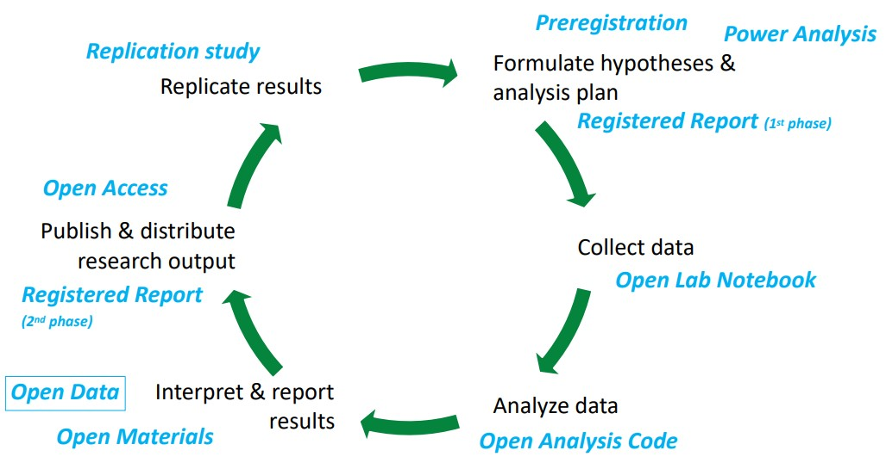
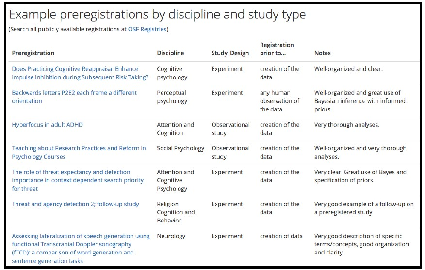

## Open Science in the research process

<!-- Insert blank lines -->
<br>

<div style="text-align: center;">
{width=750px}
</div>


::: footer
get all material here: [https://osf.io/zjrhu/](https://osf.io/zjrhu/)
:::

## Threats to research validity ...
### p-hacking & friends

| Threat                                                                                                | Remedy                                                         |
| ----------------------------------------------------------------------------------------------------- | -------------------------------------------------------------- |
| <span class="fragment" data-fragment-index="1">Switching of primary outcome to a variable that "works better"</span> | <span class="fragment" data-fragment-index="2">Publicly write down the primary outcome before data collection</span> |
| <span class="fragment" data-fragment-index="3">HARKing: "Hypothesizing after results are known"</span> | <span class="fragment" data-fragment-index="4">Publicly write down hypotheses before data collection</span> |
| <span class="fragment" data-fragment-index="5">Flexibility in data analysis (e.g., trying out different outlier exclusions to see which "work best")</span> | <span class="fragment" data-fragment-index="6">Specify exclusion rules and the full analysis plan before seeing the data</span> |


## Threats to research validity ...
### Biases

| Threat label          | Explanation                                                                                                           | Remedy                                                                |
| --------------------- | --------------------------------------------------------------------------------------------------------------------- | --------------------------------------------------------------------- |
| <span class="fragment" data-fragment-index="1">**Hindsight bias**</span> | <span class="fragment" data-fragment-index="2">Tendency to frame previous decisions or events as more predictable after the outcome is known (“I knew it all along”)</span> | <span class="fragment" data-fragment-index="3">Write down your hypotheses and analysis plans before you see the data</span> |
| <span class="fragment" data-fragment-index="4">**Confirmation bias**</span> | <span class="fragment" data-fragment-index="5">Tendency to seek out, interpret, favor and recall information in a way that supports one’s prior expectations</span> | <span class="fragment" data-fragment-index="6">Write down your decision rules before you see the data</span> |


## What is a preregistration?

> „The specification of a research design, hypotheses, and analysis plan prior to observing the outcomes of a study“

::: footer
Nosek & Lindsay (2018)
:::


## Distinguishing confirmatory from exploratory analyses

:::: {.columns}
::: {.column width='50%'}
**Confirmatory analysis**

- Number of hypothesis tests: Known.
- Error rate control: Possible.
- *p*-value: Meaningful.
:::

::: {.column width='50%'}
**Exploratory analysis**

- Number of hypothesis tests: Unknown.
- Error rate control: Impossible.
- *p*-value: "essentially uninterpretable".
:::
::::

::: footer
Wasserstein, R. L., & Lazar, N. A. (2016). The ASA Statement on p -Values: Context, Process, and Purpose. The American Statistician, 70(2), 129–133. [https://doi.org/10.1080/00031305.2016.1154108](https://doi.org/10.1080/00031305.2016.1154108)
:::


## Convince others that you did not engage in QRPs
### How can you convince a *skeptical* reader?

- Publish your preregistration openly
- Use a third-party platform that freezes the file (so that you cannot edit it later) with a timestamp
- Nullius in verba: The less trust is necessary, the more convincing.

. . . 

 Discuss: What challenge does a secondary data analysis (from an existing dataset) pose?

## Why do we preregister?
### Summary

1. **Don't do QRPs**: Safeguard ourselves from (unconscious) biases and QRPs
2. **Convince others that you did no QRPs**: Build your reputation (pre-diction instead of post-diction; transparency)
3. **Restrict your degrees of freedom**: Clearly distinguish confirmatory from exploratory results
4. **Intended side-effect**: We think more clearly about our design and data collection *before* we start collecting data &rarr; quality improvements.


# Special cases and their solutions

## "before data collection" - but if the data set is already there?

## Somebody will steal my idea!

--> Embargo

## Registered Report


# Elements of a preregistration

## Elements of a preregistration

**1. Hypotheses**
<div style="margin-bottom: -40px;margin-left: -10px;">
{width=200px}
</div>

::: {.smaller}
- Describe hypotheses as relationships between variables
- Describe shape of interaction effects
- Describe manipulation checks (or why they are not included)
:::

<div style="margin-bottom: -30px;">
{width=250px}
</div>
::: {.smaller}
- Figures / tables to describe interaction effects
- Rationales / theoretical frameworks to justify the hypotheses
:::


::: {.attribution style="font-size: 12px;"}
van t‘Veer & Giner-Sorolla (2016)
:::

## Elements of a preregistration

**2. Design**
<div style="margin-bottom: -40px;margin-left: -10px;">
{width=200px}
</div>

::: {.smaller}
- List, based on your hypotheses,
  - Independent variables (describe variable, all levels, between- or within-person?)
  - Dependent variables
  - Third variables (covariates, moderators, control variables etc.)
:::


::: {.attribution style="font-size: 12px;"}
van t‘Veer & Giner-Sorolla (2016)
:::


## Elements of a preregistration

**3. Planned sample**
<div style="margin-bottom: -40px;margin-left: -10px;">
{width=200px}
</div>

::: {.smaller}
- Pre-selection rules (e.g., age limits)
- Where, from whom, and how will the data be collected?
- Justify planned sample size (power analysis or Bayesia design analysis)
- Describe data collection termination rule
:::


::: {.attribution style="font-size: 12px;"}
van t‘Veer & Giner-Sorolla (2016), Schönbrodt & Wagenmakers (2017)
:::


## Elements of a preregistration

**4. Exclusion criteria**
<div style="margin-bottom: -40px;margin-left: -10px;">
{width=200px}
</div>

<div style="margin-bottom: -40px;">
::: {.smaller}
- Describe all anticipated exclusion criteria, e.g.
  - Missing, erroneous, overly consistent responses
  - Failing check-tests or suspicion probes
  - Demographic exclusions
  - Data-based outlier criteria
  - Method-based outlier criteria (e.g., too long response times)
:::
</div>

<div style="margin-bottom: -30px;">
{width=250px}
</div>
::: {.smaller}
- Set fail-save levels of exclusion at which whole study needs to be stopped,
altered, and restarted
:::


::: {.attribution style="font-size: 12px;"}
van t‘Veer & Giner-Sorolla (2016)
:::


## Elements of a preregistration

**5. Analysis plan**
<div style="margin-bottom: -40px;margin-left: -10px;">
{width=200px}
</div>

::: {.smaller}
- Describe statistical analyses that test hypotheses. For each, include
  - Relevant variables and how they are calculated
  - Statistical technique
  - Each variable‘s role in the technique (e.g., IV, DV, covariate, ...)
  - If covariates are used: Rationale for using them
  - If using techniques other than NHST, describe criteria and inputs toward making conclusions     about your hypotheses
:::


::: {.attribution style="font-size: 12px;"}
van t‘Veer & Giner-Sorolla (2016)
:::


## Elements of a preregistration

**5. Analysis plan**
<div style="margin-bottom: -30px;">
{width=250px}
</div>

::: {.smaller}
- Specify contingencies and assumptions, such as
  - Method of correcting for multiple testing
  - Method of missing data handling
  - Anticipated data transformations
  - Assumptions and assumption checks for analyses and alternative plans for data analysis if       assumptions are not met
:::


::: {.attribution style="font-size: 12px;"}
van t‘Veer & Giner-Sorolla (2016)
:::


## Elements of a preregistration

**6. Additional stuff**
<div style="margin-bottom: -30px;margin-left: -10px;">
{width=250px}
</div>

::: {.smaller}
- For exploratory analyses: "We don‘t have any hypotheses"
- Transparency statement: How will research output be shared?
- Conditional safeguards: What will happen if...?
:::


::: {.attribution style="font-size: 12px;"}
Lin & Green (2016)
:::


## Preregistration templates

[Recommended]{.hl}: 

- The **Preregistration for Quantitative Research in Psychology Template (PRP-QUANT)** was        developed in a joint effort by a task force composed of members of the APA, BPS, DGPs, the      COS, and ZPID.
- [https://prereg-psych.org/index.php/rrp/templates](https://prereg-psych.org/index.php/rrp/templates)


## Preregistration templates (alternatives)

::: {.smaller}
<div style="margin-top: 100px;">
- [van t‘Veer, A.E. & Giner-Sorolla, R. (2016)](https://pages.cs.wisc.edu/~jerryzhu/HAMLET/psyreplicability/van_'t_Veer&Giner-Sorolla2016.pdf)
- [aspredicted.org](https://aspredicted.org/)
- [Replication Recipe (for replication studies)](https://www.researchgate.net/publication/259090892_The_Replication_Recipe_What_Makes_for_a_Convincing_Replication)
- [BAM!!!Lab Study preregistration](https://osf.io/ghu7y)
- [OSF preregistration challenge](https://osf.io/jea94)
- [Happy Lab Preregistration (quite short)](https://osf.io/5k639)
- ...
</div>
:::


## A curated list of high quality preregistrations

::: {.smaller}
<div style="margin-top: 70px;">
- [https://osf.io/e6auq/wiki/Example%20Preregistrations/](https://osf.io/e6auq/wiki/Example%20Preregistrations/)
</div>
:::

<div style="text-align: center;">
{width=650px}
</div>


<!-- Footer insert below -->
```{r child="../../common/lastslide.qmd"}
```
