<!-- Timings

- Up to the "used car exercise": 30 min
- "used car exercise": 20 min overall
- Publication bias: 30 min (? not sure about that)
- p-hacking + honest errors: 60 min (including some p-hacker app demo)

 -->

## Licence

<br>

<p style="text-align:center;">
  
</p>

<div style="background-color: #f0f0f0; padding: 0.05em; border-radius: 2px; font-size: 0.6em;">
This work was originally created by [Felix Schönbrodt](https://www.nicebread.de/) under a CC-BY 4.0 [Creative Commons Attribution 4.0 International License](https://creativecommons.org/licenses/by/4.0/deed.en). This current work by Sarah von Grebmer zu Wolfsthurn, Malika Ihle and Felix Schönbrodt is licensed under a CC-BY-SA 4.0 [Creative Commons Attribution 4.0 International SA License](https://creativecommons.org/licenses/by-sa/4.0/deed.en). It permits unrestricted re-use, distribution, and reproduction in any medium, provided the original work is properly cited. If you remix, transform, or build upon the material, you must distribute your contributions under the same license as the original.
</div>

::: {.notes}
**Presenter Notes**: The Creative Commons Attribution–ShareAlike 4.0 license, or CC BY-SA 4.0, allows others to copy, share, and adapt a work in any medium, including for commercial purposes. These permissions are broad and cannot be withdrawn as long as the license terms are followed. The main requirement is attribution: users must give appropriate credit to the original creator, provide a link to the license, and clearly indicate whether any changes were made, without implying endorsement by the original author. In addition, the ShareAlike condition means that if someone modifies or builds upon the work, the resulting material must be distributed under the same CC BY-SA 4.0 license, or a compatible one. Finally, users are not allowed to apply legal or technical restrictions, such as DRM, that would prevent others from exercising these same rights.
:::


## Contribution statement

<br>

**Creator**: Von Grebmer zu Wolfsthurn, Sarah ({fig-alt="orcid logo"}
[0000-0002-6413-3895](https://orcid.org/0000-0002-6413-3895))

**Reviewer**: Schönbrodt, Felix ({fig-alt="orcid logo"}[0000-0002-8282-3910](https://orcid.org/0000-0002-8282-3910))

**Consultant**: Ihle, Malika ({fig-alt="orcid logo"} [0000-0002-3242-5981](https://orcid.org/0000-0002-3242-5981))

::: {.notes}
**Presenter Notes**: These are the **presenter notes**. You will a script for the presenter for every slide. In presentation mode, your audience will not be able to see these presenter notes, they are only visible to the presenter. 

**Instructor Notes**: There are also **instructor notes**. For some slides, there will be pedagogical tips, suggestions for activities and troubleshooting tips for issues your audience might run into. You can find these notes underneath the presenter notes.

**Acessibility Tips**: Where applicable, this is a space to add any tips you may have to facilitate the accessibility of your slides and activities. 
:::


## Threats to credible research - Intro Survey


::: {.notes}
**Presenter Notes**: Before we get started, I would like to  explore your previous knowledge around Open Research. Perhaps some of you have read the recommedations by UNESCO, perhaps some have never heard of the term Open Research before. On the following slides you will find some questions which aim to capture how much you know already. You can scan the QR code, which will take you to a survey tool where you can click your way through the questions. We will then briefly discuss the questions in the plenum. Some of these questions I will ask again towards the end of this session, to get an understanding of whether anything has changed in terms of your knowledge or understanding during this session. 

**Instructor Notes**:

- **Aim**: The pre-submodule survey serves to examine students' prior knowledge about the submodule's topic.

- Use free survey software such as Particify to establish the following questions (shown on separate slides).

- *Note*: This survey component does not work in an asynchronous setting.
:::

## Survey

**Based on your experience so far, how would you currently rate your trust in published scientific findings on a scale from 1 - 5?**

- 1 = trusting virtually **none** of the findings
- 2 = trusting only **some** findings
- 3 = trusting about **half** of the findings
- 4 = trusting the **majority** of the findings
- 5 = trusting virtually **all** findings
  
## Survey

**Based on your experience so far, which challenges to research trustworthiness do you see? Name a few keywords.**

Display Wordcloud answer. 

<!-- ## Survey


Note Felix: Diese Frage finde ich zu allgemein gestellt

**Based on your experience so far, which concepts do you connect to research more broadly?**

Display Wordcloud answer.  -->

## Survey

**What is your level of familiarity with Open Research practices in general (e.g., basic concepts, terminology, or tools)?**

a. I am unfamiliar with the concept of Open Research practices.

b. I have heard of them but I would not know how they apply to my work.

c. I have basic understanding and experience with Open Research practices in my own work/research/studies. 

d. I am very familiar with Open Research practices and routinely apply them in my daily work/research/study routines.


## Discussion of survey results

<br>

<div style="background-color: #f0f0f0; padding: 0.1em; border-radius: 5px; font-size: 1em; text-align: center;">
What do we see in the results?
</div>

::: {.notes}
**Presenter Notes**: Script for the slide here.

**Instructor Notes**:

- **Aim"**: Briefly examine the answers given to each question interactively with the group.

- Use visuals from the survey to highlight specific answers.
:::


<!-- 

NOTE Felix: Unnecessary filler slide.

## Where are we at?

**Previously**:

- Introduction to this module

<div style="background-color: #f0f0f0;">
**Up next**:

- Getting started: Current threats to credible research
- Diving into the solution
</div>


::: {.notes}
**Presenter Notes**: As a brief reminder of where we are currently at, so far we have tried to build a little community around this course and this class, to understand what brings people into this course and also to foster an understanding of shared interests and visions. We have then looked at a brief introduction to this module and what awaits us in broad terms. Today, however, we will look at some of the challenges that research is facing today, and what it means for research and trust in research more broadly. At the end we will touch upon a proposed solution, which we will look at in much more depth in the following session. Today's main aim is therefore to foster your understanding and knowledge of the problems, and analyze together with you how it could affect you as potential future researchers. 

**Instructor Notes**:

- **Aim**: Place the topic of the current submodule within a broader context.

- Remind students what you are working towards and what the bigger picture is.
:::

 -->

##  Your current understanding of key terms (6 min)
### Think - Pair - Share

- **Think** (2 min): For yourself: Write down a definition for those key terms: *Replicability*, *Replication*, *Reproduction*, *p-hacking*<br>[(without internet search - your current understanding)]{.smallnote}
- **Pair** (2 min): Discuss your definitions with your neighbour
- **Share** (2 min): Share your definitions with the larger group

::::: {.columns}
:::: {.column width="33%"}
:::{.timer #think1 seconds=120 starton=interaction size=67% sound=true}
::: 
::::
:::: {.column width="33%"}
:::{.timer #pair1 seconds=120 starton=interaction size=67% sound=true}
:::
::::
:::: {.column width="33%"}
:::{.timer #share1 seconds=120 starton=interaction size=67% sound=true}
:::
::::
:::::

::: {.callout-note title="Note - this is not a test!"}
These terms probably have not been covered in your courses yet. We just want to see what your current understanding of these terms is.
:::

## Covered in this session

- **Do** people **trust** in science?
- **Should** people **trust** in science? Replicability and reproducibilty
- Threats to replicability: **p-hacking, errors, and biases** in research


::: {.notes}
**Presenter Notes**: This slide provides an overview of the main topics we will cover in this session. Do not worry if some of these concepts make no sense to you at this point, we will get to all of them by the end of this session. We will begin by looking at research and the research cycle. We will look at how knowledge is produced, from forming a research question, through data collection and analysis, to publication and dissemination. Next, we will discuss trust in research and what it means. Trust is fundamental to science and research because it shapes how researchers trust each other’s work, how institutions make decisions based on evidence, and how society at large engages with scientific findings. We will then move on to replicability and reproducibility, two key concepts for assessing the robustness of research. We will clarify the difference between them and examine why the inability to replicate or reproduce results has become a major concern across many disciplines. Following that, we will learn about biases, inconsistencies, and mistakes in research. These issues are often unintentional but can arise from methodological choices, data handling, publication pressures, or systemic incentives. Recognizing these challenges helps us better understand where and why research can go wrong.

**Instructor Notes**: Add.
:::


## Learning goals


By the end of this session, learners will be able to: 

- **Define** and **distinguish** key terms related to research, including research cycle, trust in research, replicability, reproducibility, and open research
- **Recognize** different types of challenges in research: research biases, statistical insecurities, errors and where they can arise from
- **Analyze** research scenarios to identify potential research biases and questionable research practices
- **Reflect** on the current threats for research and on the need for alternative approaches to conducting research
  
::: {.notes}
**Presenter Notes**: Script for the slide here.

**Instructor Notes**:

- **Aim**: Formulate specific, action-oriented goals learning goals which are measurable and observable in line with Bloom's taxonomy [@andersonTaxonomyLearningTeaching2001; @bloom1955NormativeStudy1956]

- Place an emphasis on the **verbs** of the learning goals and choose verbs that align with the skills you want to develop or assess.
- Examples: 
  - Students will **describe** the process of photosynthesis or
  - Students will **construct** a diagram illustrating the process of photosynthesis
:::


<!-- ## Key terms and definitions - TO DO

- **Aim**: Introduce key terms and definitions that students will come across throughout the session.
<br>

- **Key Term 1**: Definition
- **Key Term 2**: Definition
- **Key Term 3**: Definition

::: {.notes}
**Presenter Notes**: Add script for slide here.

**Instructor  Notes**: Base yourself on conceptual change theory and examine existing concepts in relation to some key terms. Re-examine the formation of new concepts at the end of the lesson. 
::: 


-->

<!-- 

NOTE Felix: I think this very general introduction to "What is research / research cycle" can be safely skipped. Students typically know this already.

## Practical exercise 1


**Task**: Collect your thoughts with your neighbor.

<br>
<br> 

**What does "research" mean to you?**

::: {.notes}
**Presenter Notes**: Let's start from the beginning! What does research mean to you? What concepts to you connect with it? How would you describe it? Think about this for yourself for a few minutes, write down some notes. Then form pairs and discuss with your partner what they linked to this term. We will then share our ideas in the group.

**Instructor  Notes**: Use the think-pair-share method: Students write down for themselves for a minute what a definition of research could be, then pair with a neighbor to compare answers. Final answers are then discussed in the plenum. 
:::


## What is "research"?

<br>

<div style="background-color: #f0f0f0; font-size: 0.8em;">
"Research refers to a careful, well-defined (or redefined), objective, and **systematic method** of **search for knowledge**, or **formulation of a theory** that is driven by inquisitiveness for that which is unknown and useful on a particular aspect so as to make an original contribution to **expand the existing knowledge base**. Research involves the **formulation of hypothesis** or **proposition of solutions**, data analysis, and deductions; and ascertaining whether the conclusions fit the hypothesis. Research is a **process of creating, or formulating knowledge that does not yet exist.**"
</div>

<br>
<br>

::: footer
Deb, D., Dey, R., & Balas, V. E. (2018). Introduction: What is research? In *Engineering Research Methodology: A Practical Insight for Researchers* (pp. 1-7). Singapore: Springer Singapore.
:::

::: {.notes}
**Presenter Notes**: As was also evident from our discussions from the previous exercise, research can take many forms, therefore finding an all-encompassing description can be tricky. The work by Deb and colleauges (2018) describes research in the following way: Research is a careful, well-defined, objective, and systematic process rather than a random or unstructured activity. It involves a deliberate search for knowledge or the formulation of theories that aim to explain aspects of reality that are not yet fully understood. This process is driven by inquisitiveness and a desire to explore what is unknown, unresolved, or potentially useful, with the ultimate goal of making an original contribution that expands the existing body of knowledge. Research does not simply repeat what is already known; instead, it seeks to refine, extend, or generate new understanding.

Central to the research process is the formulation of hypotheses or the proposition of possible solutions to identified problems. These guide the direction of inquiry and determine the type of data that must be collected. Through systematic data analysis and logical deduction, researchers evaluate evidence to determine whether their conclusions support or contradict the initial hypotheses. This evaluative step is essential, as it ensures that findings are grounded in evidence and coherent reasoning. Ultimately, research is a creative and constructive endeavor that results in the creation or formulation of knowledge that did not previously exist, thereby contributing meaningfully to scholarly and scientific advancement. 

**Instructor  Notes**: Since this is a long block of text, take your time to integrate previous knowledge and ideas of learners with the defintion they are presented with. Acknowledge there is no "universal definition" of research, but rather an approach to generating new knowledge that can take many different shapes and forms.
:::


## The research cycle

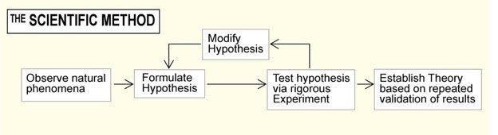


::: footer
[www.phdcomics.com](www.phdcomics.com)
:::


::: {.notes}
**Presenter Notes**: Let us walk through this diagram of the scientific process. This is basically a visual representation of what research can mean. As you can see, the stages are arranged in a clockwise cycle, emphasizing that science is continuous and iterative. We begin with Observation or the question. This is where something in the world prompts us to ask why or how it works, or we made an observation and wonder about a particular feature or consequence. Next, we move into researching the topic area. Here we gather existing knowledge, review what others have discovered, and refine our understanding of the problem. 

Based on what we learn, we develop a hypothesis. This is a testable explanation or prediction that we can investigate. Importantly, a testable hypothesis is a precise statement, derived from your original question. 

Then comes testing with an experiment. This is where we design procedures to measure, observe, and collect data in a controlled, systematic way.

After the experiment, we analyze the data. We look for patterns, compare results to our predictions, and determine whether the hypothesis holds up.

Finally, we report our fundings and conclusions, together with our approach. This could be through a written paper, a presentation, or sharing findings with a research team. Importantly, these conclusions often lead to new questions, sending us back to the first stage and continuing the cycle of discovery.

**Instructor  Notes**: Beware that this diagram does not yet highlight the cyclical nature of research. It also focuses only on the inductive steps, not the deductive ones. If asked about this, acknowledge the contribution and refer to the following slide. 
:::


## The research cycle

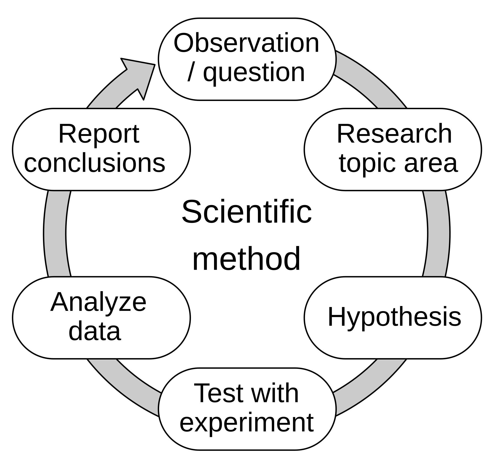


::: footer
DBR English greyscaler (Design-based research cycle)” by Sarah Zloklikovits, licensed under CC BY 4.0 — Wikimedia Commons.
:::

::: {.notes}
**Presenter Notes**: This is a similar diagram to the previous slide, but captures the cyclical nature of research much better. When we have written up our conclusions, we are likely left with more questions and additional observations we made in the process, leading to the start of a whole new research cycle.

**Instructor  Notes**: The diagram may imply that the stages are inherently following one another. When asked, add that the stages can overlap and that a research project can exist in multiple stages at once. For example, one can already start with writing up the methods in the final research report or publication, but the data analysis is not get concluded (this is acutally advised, but a topic for a later discussion).
:::


## Practical exercise 2

```{r}
# NOTE Felix: I would introduce the concept of phenomena here - first establish phenomena, then try to build theories that explain them.
```

**Task**: For the following "observation", map out the individual steps of the research cycle: <br>

<br> 
**"I wonder what happens to pasta when I cook it in *unsalted* water?"**


::: {.notes}
**Presenter Notes**: I want you to think about these different stages and steps of the research cycle with reference to a concrete example. Let us imagine that you had the impression that on some days, your pasta cooks much faster compared to other days. You wonder why this is. You believe that the most likely explanation for this observation could be the quantity of salt. You formulate your observation in the following way: I wonder what happens to my pasta when I cook it in unsalted water? Your task is to map out the individual steps of a hypothetical approach where you try to answer this question in a systematic way. Use the research cycle as your framework of reference.

**Instructor  Notes**: Allow 7-10 minutes for this task. A plausible working example:
  - Observation: I notice that pasta seems to cook faster when the water is salted. 
  
- Define the question: Does pasta cook faster in salted water?
  
- Research the topic area: What has been done before?
  
- Define hypothesis: Pasta will cook faster in salted water than in unsalted water. My outcome variable is cooking time in seconds.
  
- Test with experiment: Define the amount of pasta, amount of water, amount of salt, average heat and the pot to cook the pasta in. Measure cooking time with a watch. Repeat the experiment many times.
  
- Analyze data: Examine the data you collected and compare the cooking times between pasta cooked in salted vs. unsalted water. Define potential confounding factors. 
  
- Write up your statistical conclusion and answer your original question.
  
:::


-->


# Do people trust in research?

## What is public "trust" in research?

::: incremental
- "*Society trusts that scientific research results are an honest and accurate reflection of a researcher’s work.*" [(Committee on Science, Engineering and Public Policy 2009: ix)]{.smallnote}

- "*The public must be able to trust the science and scientific process informing public policy decisions.*" [(Obama 2009)]{.smallnote}
:::

::: footer
Resnik, D. B. (2011). Scientific research and the public trust. *Science and engineering ethics, 17*(3), 399-409.
:::

::: {.notes}
**Presenter Notes**: What do we mean by trust in research? In their paper, Resnik argues that maintaining public trust is essential for the scientific enterprise, and he highlights how U.S. policy leaders have emphasized this responsibility. For example, he references  the 2009 Committee on Science and Technology report, which highlights that the public expects science to be conducted responsibly and that preserving trust requires strong ethical norms, oversight, and systems that prevent misconduct. The part on "honest reflection of a researcher's work is particularly central here: society should be able to get a reliable and truthful insight into the methods and outcomes of the research process. They also cite President Obama’s 2009 statement on scientific integrity, which stresses that government science must be guided by facts, transparency, and freedom from political manipulation. Resnik uses this to illustrate that public trust in science and research is not automatic. Going even further, they argue that trust needs to be earned and protected, given that science and research play a critical role in informing policies relevant to the public. 

**Instructor  Notes**: Beware that depending on the background of your learners, trust can have many facets. At its core, trust refers to the confidence that research processes, findings, and actors are reliable, ethical, and credible. However, how this trust is understood and emphasized can vary by discipline and fields. One important dimension of trust relates to research methods. Across scientific disciplines, trust is built when appropriate methods are chosen, data are collected and analyzed rigorously, and decisions are clearly justified. In **experimental and quantitative fields**, this often involves standardized procedures, controls, and statistical robustness. In qualitative and interpretive disciplines, trust may instead be grounded in transparency, reflexivity, and the coherence of the research design. Another dimension is trust in researchers and research communities. This includes expectations of integrity, honesty, and adherence to ethical standards, as well as openness about limitations and potential conflicts of interest. In **research involving human participants or sensitive topics**, trust is closely linked to ethical responsibility and respect for participants. Trust also concerns research results and findings. This involves confidence that conclusions are supported by evidence and have not been distorted through selective reporting or questionable practices. Concepts such as replicability and reproducibility play a key role here, particularly in fields where results are expected to be independently verified. In **applied research areas such as medicine, engineering, or economics**, trust in findings is especially critical because research outcomes directly influence decisions, policies, and interventions. These dimensions are good to keep in mind when interacting with your learners.
:::


## Measuring trust in research

 Probe your prejudices: In which profession do you have the highest trust to tell the truth? And the lowest?

. . . 


[Data from 1,015 UK adults, 2024]{.smallnote}

::: footer
Sources: Veracity Index 2024, [Ipsos](https://www.ipsos.com/en%2Duk/ipsos%2Dveracity%2Dindex%2D2024); Seyd, B. (2025). What is trust (in science and scientists) and is it in crisis?. *Current Opinion in Psychology, 67*. [https://doi.org/10.1016/j.copsyc.2025.102201](https://doi.org/10.1016/j.copsyc.2025.102201)
:::

::: {.notes}
**Presenter Notes**: This chart shows results from the Ipsos Veracity Index 2024, which measures how much the UK public trusts different professions to tell the truth. The findings are based on a nationally representative sample of around 1,000 UK adults. Respondents were asked how much they trust people in each profession to tell the truth, and the chart reports the percentage who say they trust them (either “a great deal” or “a fair amount”).

Starting at the top, nurses are the most trusted profession, with very high trust levels. They are followed closely by engineers and doctors, and then teachers and professors. Scientists also score relatively high, just behind judges and museum curators. 
These top professions share a common theme: they are generally seen as skilled, evidence-based, and working in the public interest, which likely contributes to their high trust.
Moving to the middle of the chart, we see professions like police, judges, and business leaders, where trust is more moderate and mixed. At the lower end, journalists and advertising executives have relatively low trust levels.
Finally, politicians and government ministers are the least trusted, with a significant gap between them and the top-ranked professions.
:::


## Public trust in research
### German survey "Wissenschaftsbarometer"

"Wie sehr vertrauen Sie in Wissenschaft und Forschung?"

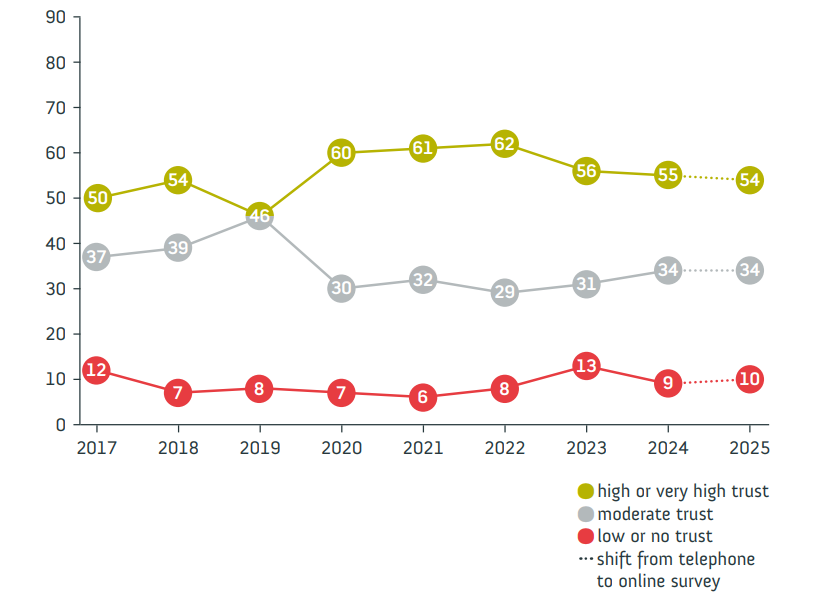{.img-full}

::: footer
Source: *Wissenschaft im
Dialog/Verian*: [www.sciencebarometer.com](www.sciencebarometer.com). Minimum of 1,000 respondents in each survey wave.
:::


::: {.notes}
**Presenter Notes**: Let us have a look at trust in research from the perspective of the general public. The Science Barometer is an annual survey of the German general public’s attitudes toward science and research. It has been conducted every year since 2014 by Wissenschaft im Dialog (WiD). It focuses on a number of different elements, such as the expectations towards science, the relevance of science but also the trustworthiness of research and science. It is conducted annually and targets the German-speaking population aged 14 and over living in private households in Germany. The survey was traditionally conducted over the phone, but in 2025 shifted to an online panel to enhance the reach. In this, the data collection was done via a computer-assisted web interviewing (CAWI) during a defined period (July 4–18, 2025) with 2,011 respondents participating.

As mentioned, one aspect they enquired about was people's trust in science. The results suggested the following: Trust in science and research remains stable. Also in 2025, slightly more than half of respondents indicate having high or very high trust in science and research (54 per cent). One in ten trusts science and research little or not at all. In the telephone reference survey, 53 per cent said they trusted science and seven per cent had little or no trust. As in previous years, it is primarily younger people who place a high level of trust in science and research: 68 per cent of those under 30 and 60 per cent of 30–39-year-olds indicate trusting science. Among the older age groups, it is between 46 and 48 per cent of respondents.

Important, there are clear differences in trust in science and research with regard to the respondents' formal education level. Among respondents with high formal education levels, 72 per cent this year express high or very high trust. This means this proportion is below 75 per cent for the first time since the outbreak of the coronavirus-pandemic, but is still higher than before 2020. For respondents with medium and low formal education levels, however, the level of trust has returned to the value before the
outbreak of the pandemic: 49 per cent of respondents with medium and 37 per cent of respondents with low formal education level indicate trusting science and research in 2025.

**Instructor Notes**: Highlight that while the results demonstrate that about half of the respondents had high or very high trust in research, the other half only had moderate, low or no trust in science. Highlight that one in two people from the respondents' sample did not trust science very much. 

As an additional good to know from *Seyd (2025)* to show that the percentages in Germany are comparable to the rest of the world: A recent 68-nation study found a positive distribution of people's trust in scientists, with a global mean of 3.62 on a 1 (low trust) to 5 (high trust) scale (Cologna et al., 2025), with no country showing a trust score below the mid-point of 3. A 32-country survey conducted by Ipsos in 2024 found on average that 56 % of people trusted scientists, while just 15 % expressed distrust. However, the same study highlighted substantial differences in trust between national populations. Thus, while 70 % of Argentinians and Indonesians expressed trust in scientists, just 43 % of Japanese did likewise; see also the Ipsos 2024 survey.

Share the website of the Science Barometer with this report if asked by your learners: [https://wissenschaft-im-dialog.de/documents/528/WIBA_2025_en_Web.pdf](https://wissenschaft-im-dialog.de/documents/528/WIBA_2025_en_Web.pdf)

:::


## Take aways from multiple international studies

- Trust in scientists remains **relatively high** in many countries
- Overall trust levels in research **remain stable**
- **But**: public **skepticism** about scientists' integrity and **transparency**


::: footer
Seyd, B. (2025). What is trust (in science and scientists) and is it in crisis?. *Current Opinion in Psychology, 67*. [https://doi.org/10.1016/j.copsyc.2025.102201](https://doi.org/10.1016/j.copsyc.2025.102201)
:::

<!-- 

This slide is a bit tangential - maybe move to a later stage?

## What is (academic) "trust" in research?

::: incremental
- Trust is **essential for effective collaboration** among researchers (includes co-authorship, peer review, data sharing, replication, teaching, mentoring, etc.). We operate under the assumption of good faith.

- Scientists reading published research trust that the **work was conducted as described**, that **all relevant methodological details** are **disclosed**, and that the data have **not been fabricated or falsified**.
:::

::: footer
Resnik, D. B. (2011). Scientific research and the public trust. *Science and engineering ethics, 17*(3), 399-409.
:::


::: {.notes}
**Presenter Notes**: When discussing the importance of trust in research by society, Resink highlights that trust is absolutely essential for effective collaboration in science. Researchers rely on one another in so many ways, e.g., co-authoring papers, reviewing each other’s work, sharing data, attempting replications, and even in day-to-day activities like teaching and mentoring. None of these collaborative practices would function smoothly without a basic level of confidence that everyone is acting with integrity.

Likewise, when scientists read published research, they trust that the study was carried out as the authors describe. They expect that all the important methodological details are reported transparently, so the work can be evaluated or repeated. And they assume that the data are genuine, or in other words that nothing has been fabricated, falsified, or manipulated; intentionally or unintentionally. Without this trust in the accuracy and honesty of the research record, the entire scientific research process becomes unstable and no longer credible.

**Instructor  Notes**: Emphasis that trust in research operates at multiple levels and that it may not be a yes/no issue but more of a multidimensional concept along different continuum. Trust is not automatic, and can be gradually lost, as we have for example seen during the COVID-19 pandemic or the Tuskegee Syphilis Study in the United States. In the latter, researchers did not ask participants for consent in the study and withheld treatment for participants. The case went to court, and study participants received a court settlement in 1974.
:::
-->


##  The used car dealer (10 min)
### aka. "Trust in a situation with asymmetric information"

:::: {.columns}
::: {.column width='60%'}
- Form two groups: the *buyers* and the *dealers*.
- Given the bad reputation of car dealers:
  - *Buyers*: What strategies could you use to ensure you are making a trustworthy purchase?
  - *Dealers*: What would convince buyers that you are not one of the bad apples and your car has *really* good quality?
- Discuss in groups; present your strategies

:::{.timer #cardealer seconds=600 starton=interaction size=30% sound=true}
::: 
:::

::: {.column width='40%'}
::: {style="height:64vh; display:flex; flex-direction:column; align-items:center; justify-content:flex-start; gap:0.3rem; overflow:hidden;"}
{style="max-height:26vh; width:100%; object-fit:contain;"}
{style="max-height:26vh; width:100%; object-fit:contain;"}
:::
:::
::::

::: footer
Inspired by Vazire, S. (2017). Quality Uncertainty Erodes Trust in Science. *Collabra: Psychology, 3(1)*, 1. <https://doi.org/10.1525/collabra.74>. Images from ChatGPT.
:::

::: {.notes}
**Presenter Notes**: Imagine you want to buy a used car from a salesman.
:::


## Used cars vs. science

- Parallel in science: product = manuscript; seller = author; buyer = reader

::: {.smallest .incremental}
> "When there are asymmetries in the information that the seller and the buyer have, the buyers cannot be certain about the quality of the products"
> 
> "by keeping vital information private – the raw data, the original design and analysis plan, the exploratory analyses that were conducted along the way to the final analysis authors are hiding valuable information and preventing consumers of their manuscript from being certain about its quality. Just like sellers of used cars keep things [...] from the buyers."
> 
> "For many non-scientists, learning that transparency is not the norm in science comes as a surprise. [...] it must seem obvious that **scientists should be held to a higher standard than used car salespeople**."
:::

::: footer
Quotes from Vazire, S. ([2017](https://doi.org/10.1525/collabra.74)).
:::


## A stark contrast?


:::: {.columns}
::: {.column width='50%'}
::: {.img-vcenter}
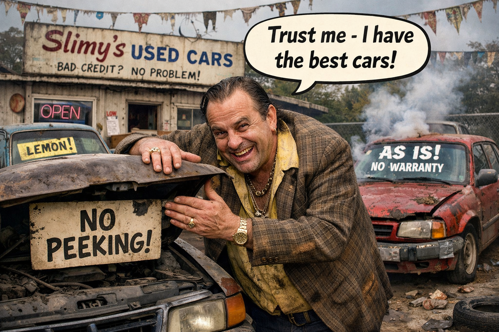{style="max-height:52vh; width:100%; object-fit:contain;"}
:::
:::

::: {.column width='50%'}
::: {.img-vcenter}
**Nullius in verba** ("take nobody's word for it")
{style="max-height:44vh; width:100%; object-fit:contain;"}
[*The motto of the Royal Society, the oldest scientific society in the world*]{.smaller}
:::
::: 
::::


::: footer
Royal Society logo by <a href="//commons.wikimedia.org/wiki/User:MostEpic" title="User:MostEpic">MostEpic</a> - <span class="int-own-work" lang="en">Own work</span>, <a href="https://creativecommons.org/licenses/by-sa/4.0" title="Creative Commons Attribution-Share Alike 4.0">CC BY-SA 4.0</a>, <a href="https://commons.wikimedia.org/w/index.php?curid=116754312">Link</a>; Car dealer by ChatGPT.
:::


<!-- 
Analogy too juicy?

## Another analogy ...

::: {.callout-box}
Real research : Journal Papers <br>
~<br>
Real sex : <span style="display:inline-block; width:5.6em;"></span>
:::

::: footer
Inspired by a Tweet from Daniel Lakens
:::

## Another analogy ...

::: {.callout-box}
Real research : Journal Papers <br>
~<br>
Real sex : Pornography
:::

{.img-full}

::: footer
Inspired by a Tweet from Daniel Lakens; Image from ChatGPT
:::

 -->

<!-- 
## Practical exercise 3


As a researcher, what can *you* do to make your pasta experiment **trustworthy**?

::: {.callout-tip}
Think about your approach when **formulating your hypothesis**, when **conducting** your experiment, when **analyzing your data**, when **writing up** your findings; but also about potential **confounding variables** or hurdles you could encounter during the research process. 
:::

::: {.notes}
**Presenter Notes**: Think about the discussions we just had about trust. Then connect it to the experiment that you just planned in the previous excercise. What steps do you think you can already take to make your own experiment more trustworthy?

**Instructor  Notes**: There are several possible answers, depending on the exact approach. Since Open Research practices are new to many at this stage, broader answers are completely acceptable for the purpose of this exercise. Some example answers could be:

- Plan the experiment well before starting
- Read the literature
- Document the steps carefully
- Carefully consider your methods
- Be transparent about your approach
- Check your work at different moments
- Get help and support
:::

-->

# Should we trust in science?

## Definitions of key terms
### Replicability and reproducibility

::: {.smaller .incremental}
- **Replicability**: The extent to which design, implementation, analysis, and reporting of a study enable a third party to repeat the study and assess its findings.
  - [Replicability is a property of the original study - it makes no statement about whether a replication has been attempted yet or whether that was successful or not.]{.note}
  - [Conceived as a continuum (hence the *extent* of replicability)]{.note}
- **Replication**: A study that repeats all or part of another study *including new data collection* and allows researchers to compare their findings. Can be successful or not successful.
- **Reproduction**: The act of re-computing some numerical results using the *original data* (with or without the original code)
- **Reproducibility**: The extent to which the results of an original study agree with those of replication or reproductionstudies.
:::

::: footer
Definitions of Replicability and Replication are from the iRISE glossary v2 by Voelkl et al. ([2025](https://osf.io/br9sp/files/nmwr3)). Note that no consensus about the meaning of these words exists - they are used differently in different disciplines.
:::

::: {.notes}
**Presenter Notes**: One way to check if you are on the right track with your approach and to assess the relibility and credibility of your pasta experiment is to consider replicability and reproducibility. 

**Instructor  Notes**: Make sure to spend enough time on this slide and provide an example scenario from the extra assignment at the end of the slide deck if you notice that the distinction between the terms remains too vague and/or abstract.
:::


## Definitions of key terms
### Prototypes of replication studies

::: {.incremental}
- **exact/direct replication**: (Virtually) Everything is inherited from the original study except the sample itself
- **close replication**: Similar to direct replication, but with some (necessary) modifications to the methods or procedures; e.g. translations
- **conceptual replication**: The same substantive research question is tested, but with different operationalizations
- **replication and extension**: Doing a direct replication and adding new elements (also called "direct+" replication)
:::

::: {.smallest}
Note: The terminology around replication varies between fields, and the boundaries between these types are blurry.
:::


## Definitions of key terms
### Better approach: Define exactly what changed/stayed identical

<!-- TODO: Link to our paper once it's ready. -->

A prototypical direct replication: 

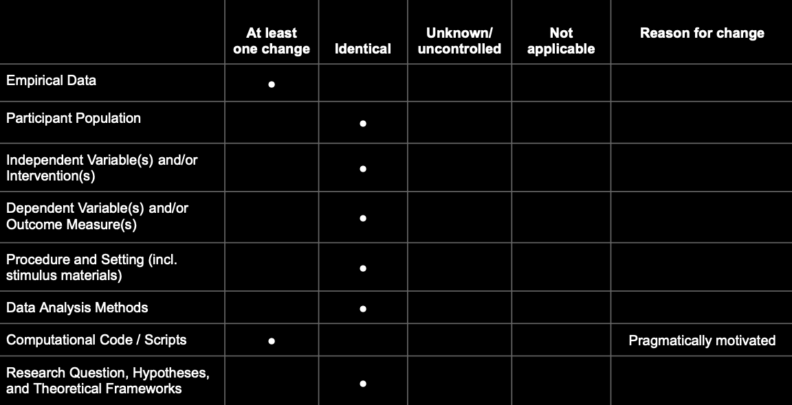{.img-full}


## Definitions of key terms
### Better approach: Define exactly what changed/stayed identical

A realistic example:

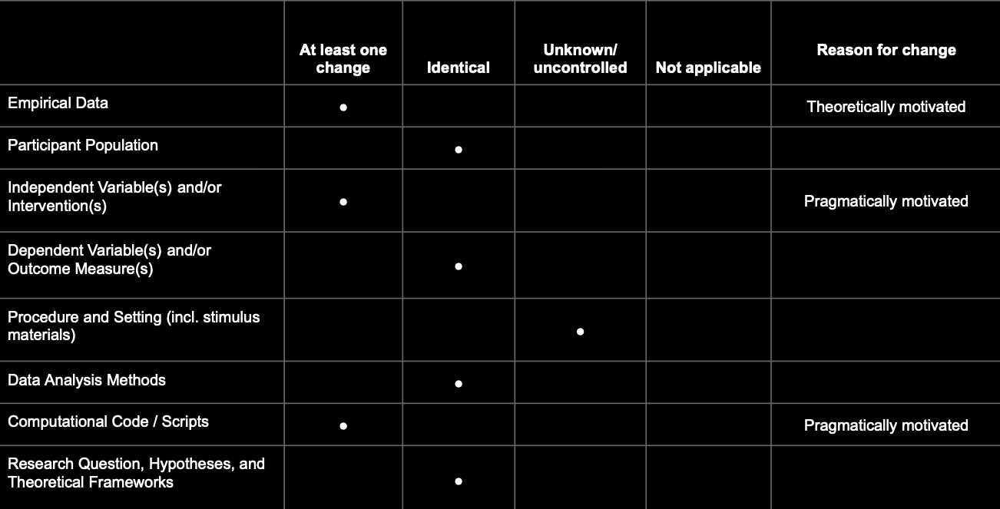{.img-full}

The qualifiers "direct", "conceptual", "close" etc. replications are prototypical configurations of this matrix.


## Definitions of key terms
### p-hacking and QRPs


- ***p*-hacking**: Tune your data analysis in a way that you achieve a significant p-value in situations where it would have been nonsignificant.
- **Questionable research practices (QRPs)**: Practices of data collection and data analysis that are not outright fraud, but also not really kosher.


::: {.notes}
**Presenter Notes**: We will move to another factor which contributes to the low reproducibility and replicability rates across fields: accidental p-hacking.  P-hacking is when researchers manipulate their data or analyses, intentionally or not, to get a statistically significant result (usually p < 0.05). In simple terms, it’s like trying many different tests, methods, or subsets of data until something looks significant, and then reporting only that “lucky” finding.
So, p-hacking is basically “data fishing” or “cherry-picking” results to make the research seem more impressive than it really is. It is important to highlight here at this point that p-hacking are considered questionable research practises, aka approaches which are not yet considered fraud by the scientific community, but are not considered "clean" either. 
:::


## Reproducibility Project:Psychology (RP:P, 2015)
### The first large-scale replication project in the field

:::incremental
- **Close/exact replications** of 100 studies from 3 top journals from psychology; aiming for high power (larger sample sizes than original studies)
- Different ways to judge **replication success**: evaluated based on effect sizes, *p*-values, subjective assessment of replication teams
- Contacted original study authors when necessary
- [Note: With today's understanding of the terms, the project should have been called "*Replicability* Project:Psychology"]{.note}
:::

TODO: Add new slide with results. Remove the callout box.

::: {.callout-important}
## What did they find?

*Large portion of replications produced weaker evidence for the original findings despite using materials provided by the original authors.*
:::

::: {.notes}
**Presenter Notes**: The Reproducibility Project by the Open Science Collaboration (2015) involved a large-scale, collaborative effort by over 270 researchers. They selected 100 experimental studies published between 2008 and 2012 in three top psychology journals: Psychological Science, Journal of Personality and Social Psychology, and Journal of Experimental Psychology: Learning, Memory, and Cognition.

For each study, they carefully reviewed the original materials, methods, and analyses, and often contacted the original authors for clarification or access to materials and protocols. Each replication aimed to match the original study’s sample size, experimental design, and analysis plan as closely as possible, while making only minimal changes when exact materials were unavailable. The replications were preregistered to specify hypotheses, design, and analysis before data collection, reducing bias and “researcher degrees of freedom." Data collection was conducted independently from the original research teams, often in multiple labs to ensure rigor. After data collection, they analyzed the results using the same statistical methods as the original studies to determine whether the findings could be reproduced. The project also evaluated effect sizes, not just statistical significance, to compare the magnitude of the original and replicated effects. **Only 39% of the replications produced statistically significant results, and the median effect size in replications was about half that of the original studies, highlighting the reproducibility challenges in psychology**.
:::

::: footer
Open Science Collaboration. (2015). Estimating the reproducibility of psychological science. *Science, 349*(6251), aac4716.
:::


## Reproducibility Project:Psychology (RP:P, 2015)
### Results


## Replication rates across disciplines
### Up to 2018

```{r, echo = F}
library(ggplot2)
library(stringr)

# Note Felix: Changed Exp. Phil. back to 78/22% as this is the p-value metric (consistent to the other projects).
# Prinz et al (2011; PHarmaceutical Research): Computed replication rate as: (3+5+14)/(22+43) (excluding "not applicable")
# Removed "Economics (43/57)", as these were Reproductions (moved to next slide on Reproduction successes)
# Added "Social Sciences"

# Sample data
df <- data.frame(
    Category = rep(
        c(
            "Psychology (n = 97)",
            "Social Sciences (n = 139)",
            "Cancer Research (n = 53)",
            "Pharmaceutical Research (n = 67)",
            "Experimental Economics (n = 16)",
            "Experimental Philosophy (n = 40)"
        ),
        each = 2
    ),
    Result = rep(
        c(
            "successfully replicated",
            "unsuccessfully replicated"
        ),
        times = 6
    ),
    Value = c(36, 64, 42, 58, 11, 89, 34, 66, 61, 39, 78, 22)
)

# Preserve order of bars on x-axis
df$Category <- factor(
    df$Category,
    levels = c(
        "Psychology (n = 97)",
        "Social Sciences (n = 139)",
        "Cancer Research (n = 53)",
        "Pharmaceutical Research (n = 67)",
        "Experimental Economics (n = 16)",
        "Experimental Philosophy (n = 40)"
    )
)

# Make stacking order explicit: unsuccessfully replicated on top, successfully on bottom.
df$Result <- factor(df$Result,
    levels = c(
        "unsuccessfully replicated",
        "successfully replicated"
    )
)

# Plot
ggplot(df, aes(x = Category, y = Value, fill = Result)) +
    geom_bar(stat = "identity") +
    geom_text(aes(label = paste0(Value, "%")), # use position_stack(vjust = 0.5) to center a label inside each segment
        position = position_stack(vjust = 0.5),
        color = "white",
        size = 5
    ) +
    labs(
        title = "",
        x = "",
        y = "Percentage (%)"
    ) +
    scale_fill_manual(
        values = c(
            "successfully replicated" = "darkgreen",
            "unsuccessfully replicated" = "darkred"
        ),
        labels = function(x) str_wrap(x, width = 12)
    ) + # wrap legend names
    theme_minimal() +
    scale_x_discrete(labels = function(x) str_wrap(x, width = 10)) + # to wrap text
    theme(
        axis.text.x = element_text(angle = 45, hjust = 1, size = 14),
        axis.text.y = element_text(size = 14),
        axis.title.x = element_text(size = 14),
        axis.title.y = element_text(size = 14),
        legend.text = element_text(size = 14)
    )
```


::: footer
Begley, C. G., & Ellis, L. M. (2012); Camerer et al (2016); Chang & Li (2015); Cova et al. (2018); Open Science Collaboration (2015); Social Science: Combined sample of systematically sampled projects (RPP, SSRP, EERP); Prinz, F., Schlange, T., & Asadullah, K. (2011); Protzko et al. (2023)
:::

::: {.notes}
**Presenter Notes**: Different studies looked at the replicability of findings. They provide us with interesting and probably alarming results about whether independent researchers can repeat the study using new data and get the same overall findings or conclusions. 

As you can see here, the dark red bars represents the percentage of studies which were not successfully replicated. Psychology is quite up there, about 64% of all studies we conduct do not replicate. What is equally as worrying, if not more, are that 89% of studies from cancer research do not replicate either. The "best" field really is experimental philosophy, so from this, they have the most robust and credible scientific approach. 

**Instructor  Notes**:  Keep in mind that a lot of aspects of these studies can be discussed in a critical light. Learners might point this out. For example: Were the studies selected randomly (or did they only select the studies that looked fishy from the start?). How do you even measure the "replicability“? Is simply looking for significance in the replications study sufficient or even useful? All of these are good points, and there is a whole emerging field that tackles these questions. It is called meta-science, and it takes a scientific view onto the scientific enterprise itself.
:::


## Replication rates in the social and behavioural sciences

**Tyner et al. (2026)**:

- Authors attempted **replications of 274 claims of positive results** from 164 quantitative papers (published between 2009 and 2018)
- **~55% of positive claims replicated successfully**

<style>
table {font-size: 0.60em;}
td:nth-child(2), td:nth-child(3) {
  text-align: center;
}
th:nth-child(2), th:nth-child(3) {
  text-align: center;
}
</style>

| Discipline         | Replication attempts (successful / total) | Percentage successful |
|------------------|-----------------------------------------|---------------------|
| Business          | 17 / 36                                 | 47.2%               |
| Economics         | 10.2 / 24                               | 42.5%               |
| Education         | 8.2 / 13                                | 63.1%               |
| Political science | 7.8 / 15                                | 52.0%               |
| Psychology        | 28.4 / 58                               | 49.0%               |
| Sociology         | 9.2 / 18                                | 51.1%               |


::: footer
Tyner, S. K., Abatayo, A. L., Dayley, M., et al. (2026). Investigating the replicability of the social and behavioural sciences. Nature. [https://doi.org/10.1038/s41586-025-10078-y](https://doi.org/10.1038/s41586-025-10078-y)
:::

::: {.notes}
**Presenter Notes**: 
- Authors attempted replications of 274 claims of positive results from 164 quantitative papers (published between 2009 and 2018) in social and behavioural sciences, including psychology, sociology, education, business, economics, and political science. 
- Original materials used when available
- ~55% of positive claims replicated successfully

*Notes:*  
- Papers are weighted combinations of claims, accounting for multiple claims per paper replicated in some cases.  
- The left column shows the number of successful replications out of total papers with replication attempts.
:::


## Not a recent issue

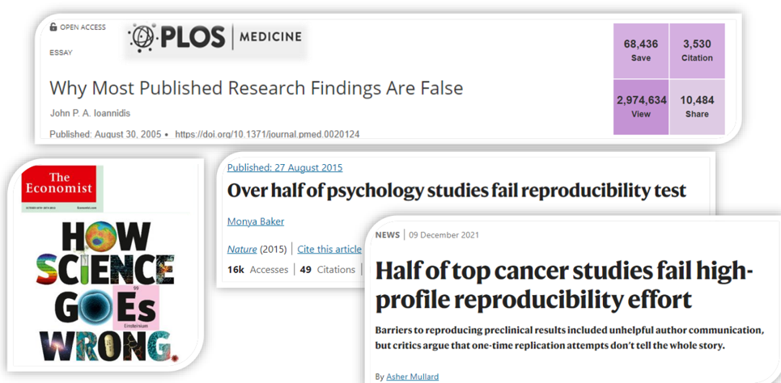


::: footer
Adapted from Dr. Malika Ihle: [https: https://osf.io/u3znx](https://osf.io/u3znx)
:::

::: {.notes}
**Presenter Notes**: Replication issues are not a new problem in research; they have existed across disciplines for decades. Historically, scientists have encountered difficulties when trying to repeat experiments, even when methods were clearly described. This has been seen in fields ranging from psychology and biology to medicine and economics. What is more recent is the systematic awareness and large-scale study of replication problems, often referred to as the “replication crisis.” Researchers today are documenting and quantifying these issues, but the underlying challenges, e.g., methodological complexity, variability, and human error, have been part of the research landscape for a long time.
:::


## Why did not more studies replicate?

<style>
/* Scope all styles to this slide only */
.bubble-slide {
  position: relative;
  min-height: 100%;
}

/* Bubble styling */
.bubble-slide .bubble {
  position: absolute;
  padding: 18px 26px;
  border-radius: 999px;
  color: white;
  font-weight: 700;
  font-size: 1.1em;
  text-align: center;
  white-space: nowrap;
  box-shadow: 0 4px 10px rgba(0,0,0,0.25);
}

/* Colors */
.bubble-slide .red    { background-color: #e74c3c; }
.bubble-slide .blue   { background-color: #3498db; }
.bubble-slide .green  { background-color: #2ecc71; }
.bubble-slide .purple { background-color: #9b59b6; }
.bubble-slide .orange { background-color: #e67e22; }
.bubble-slide .gray   { background-color: #808080; }
</style>

<div class="bubble-slide">
  <div class="bubble red" style="top: 10%; left: 10%;">human error</div>
  <div class="bubble blue" style="top: 25%; left: 60%;">lack of resources</div>
  <div class="bubble green" style="top: 40%; left: 20%;">cognitive bias</div>
  <div class="bubble purple" style="top: 50%; left: 45%;">publication pressure</div>
  <div class="bubble orange" style="top: 20%; left: 40%;">??</div>
  <div class="bubble gray" style="top: 65%; left: 5%;">lack of statistical knowledge</div>
</div>


::: {.notes}
**Presenter Notes**: The question now becomes: **Why did not more studies replicate?** Several factors contribute to these long-standing replication challenges. We will now have a closer look at some of these factors.

**Instructor  Notes**: Clearly state the switch into the origin for the replication challenges and get learners curious as to why not more studies replicated. 
:::


# Low power and low p(H1)


##  Live Poll

::: {.callout-box}
Given that in a given study $p < .05$: What is the probability that a real effect exists in the population ➙ $p(H_1|D)$?
:::


## False Discovery Rate 1

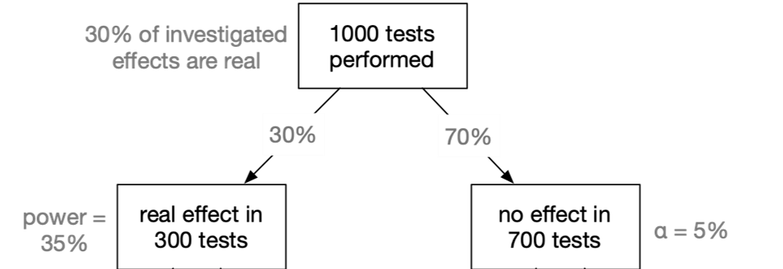

::: {.footer}
Nuzzo, R. (2014). Statistical errors. Nature. Colquhoun, D. (2014). An investigation of the false discovery rate and the misinterpretation of p-values. Royal Society Open Science, 1(3), 140216–140216. [http://doi.org/10.1073/pnas.1313476110](http://doi.org/10.1073/pnas.1313476110)
::: 


## False Discovery Rate 2
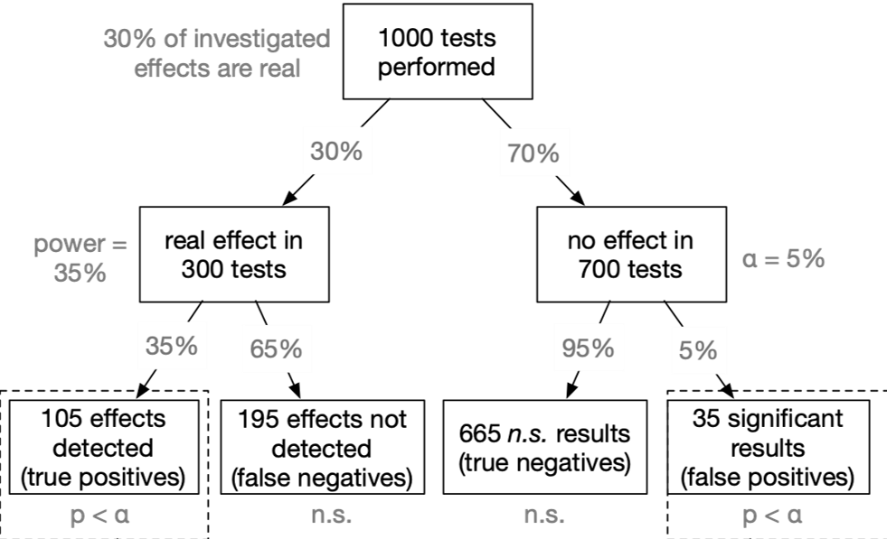

::: {.footer}
Nuzzo, R. (2014). Statistical errors. Nature. Colquhoun, D. (2014). An investigation of the false discovery rate and the misinterpretation of p-values. Royal Society Open Science, 1(3), 140216–140216. [http://doi.org/10.1073/pnas.1313476110](http://doi.org/10.1073/pnas.1313476110)
::: 


## False Discovery Rate 3
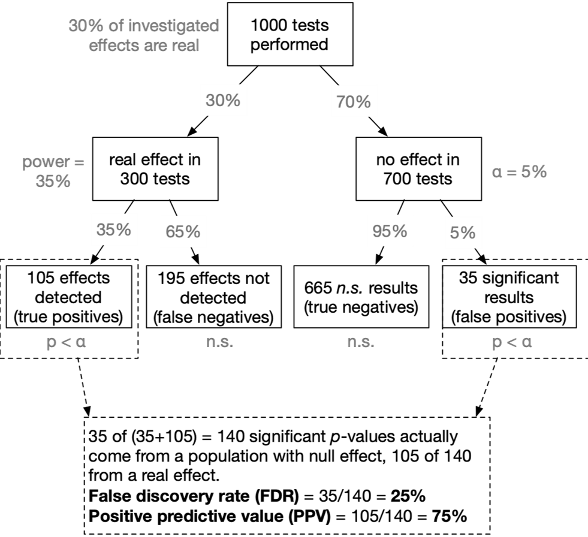


::: {.footer}
Nuzzo, R. (2014). Statistical errors. Nature. Colquhoun, D. (2014). An investigation of the false discovery rate and the misinterpretation of p-values. Royal Society Open Science, 1(3), 140216–140216. [http://doi.org/10.1073/pnas.1313476110](http://doi.org/10.1073/pnas.1313476110)
::: 


## Applied to neuroscience
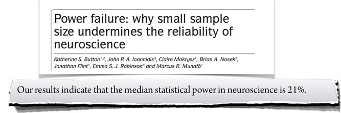

- Assumed that our tested hypothesis are true in 30% of all cases (which is a not too risky research scenario):
  - A typical neuroscience study must "fail" ($p > \alpha$) in 90% of all cases
  - In the most likely outcome of $p > .05$, we have no idea whether a) the effect does not exist, or b) we simply missed the effect. Virtually no knowledge has been gained.

::: {.footer}
Button, K. S., Ioannidis, J. P. A., Mokrysz, C., Nosek, B. A., Flint, J., Robinson, E. S. J., & Munafò, M. R. (2013). Power failure: why small sample size  undermines the reliability of neuroscience. Nat Rev Neurosci, 14(5), 365–376. doi:10.1038/nrn3475
::: 


## The evidential strength of underpowered studies

> "When a study is underpowered it most likely provides only weak inference. Even before a single participant is assessed, it is highly unlikely that an underpowered study provides an informative result."
>
> "Consequently, research unlikely to produce diagnostic outcomes is inefficient and can even be considered unethical. Why sacrifice people's time, animals' lives, and societies' resources on an experiment that is highly unlikely to be informative?"

::: footer
Schönbrodt, F. D. & Wagenmakers, E.-J. (2018). Bayes Factor Design Analysis: Planning for compelling evidence. *Psychonomic Bulletin & Review, 25*, 128-142. doi:10.3758/s13423-017-1230-y. [Open Access](https://osf.io/d4dcu/)
::: 


## Conclusion

Given that in a given study $p < .05$: What is the probability that a real effect exists in the population ➙ $p(H_1|D)$?


:::: {.columns}
::: {.column}
- → In the typical situation in psychology ($p(H_1)$ = 10%; power = 35%): The probability that a significant *p*-value indicates a true effect is only [44%]{.hl}.
- Try it out yourself! <https://shiny.psy.lmu.de/felix/PPV>
:::

::: {.column}
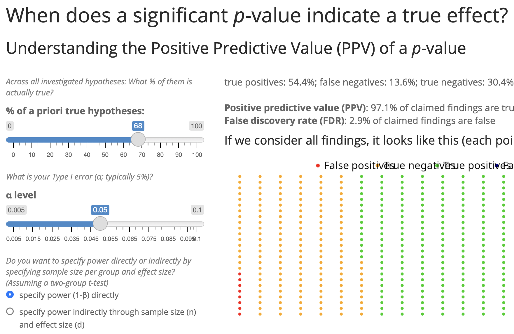{.ds}
:::
::::


# Career incentives in science

## How to become a professor?

::: {.incremental}
- What is the single most important thing you need to become a professor?
- Survey among N = 1453 psychology researchers, 66% were actually members of a professorship hiring committee
:::

::: {.fragment}
<div style="font-size: 0.9em;">
| **Actual (not desired) relevance in professorship hiring committees** | **Rank** |
|------------------------------------------------------------------|------|
| **Number** of peer-reviewed publications | 1 |
| Fit of research profile to the hiring department | 2 |
| Quality of research talks | 3 |
| **Number** of publications | 4 |
| Volume of acquired third party funding | 5 |
| **Number** of first authorships | 6 |
</div>
:::

::: footer
Abele-Brehm, A. E., & Bühner, M. (2016). Wer soll die Professur bekommen? *Psychologische Rundschau, 67*(4), 250–261. [http://doi.org/10.1026/0033-3042/a000335](http://doi.org/10.1026/0033-3042/a000335)
:::

::: {.notes}
**Presenter Notes**: There has been research which tried to look at this element of importance of published papers. This study by Abele-Brehm et al. (2016) looked at criteria in the hiring process and what the desired criteria are vs. which criteria candidates are selected on in real life. The growth of a scientific field depends on the people working in it. Choosing the right people for professorships is therefore very important. This study looks for the first time at how psychologists view the process of hiring professors. It explores how important they find different signs of suitability, how big the gap is between what they want and what actually matters in these procedures, and what they think about different ways of designing them.

A total of 3,784 members of the German Psychological Society (DGPs) were invited to take part in an online survey, and 1,453 answered at least some of the questions.

The take-home from this study was that among the top six criteria based on which candidates are selected. Three are about publications and first authorships. We have number of peer reviewed publications in the first spot, more generally number of publications in spot 4, and the number of first authorships, also indirectly connected to how much you published. So, based on this, we could say great, in order to advance in academia, all I need to do is to publish as many papers as possible, preferably where I am the first author.

**Instructor  Notes**: Highlight how quantity is rewarded of quality of the research.  
:::


## How to become a professor?

::: {.callout-important title="Publication Pressure"}
"Researchers are not rewarded for being right,
but rather for **publishing a lot**."
:::
  
::: {.callout-warning}
## Consequence: "Publish or Perish" culture
Researchers try to **publish as much as they can** and to outperform their peers [@schmidtCreatingSPACEEvolve2021].
:::

::: footer
Nelson, Simmons, & Simonsohn (2012); Nosek, Spies, Motyl (2012); Munafo (2016)
:::


::: {.notes}
**Presenter Notes**: First, we have the issue of publication pressure. Publications are currently *the* go-to measure of academic success. Papers help researchers being considered for permanent positions, for grants, and for becoming and remaining visible in the respective research fields. However, a consequence of published papers being so important is that researchers try to publish as much as they can. 

Why published papers are useful:

- Getting a **job** in academia
- Being awarded **grant money** for your research
- Being **visible** in the respective research field


**Instructor  Notes**: Check if learners are aware of the publication process in broad terms and check if they understand what *grants* means in this context.
:::


## OK, I need a lot of publications ...
### 🤔 How do I get lots of publications?

::: {.fragment}
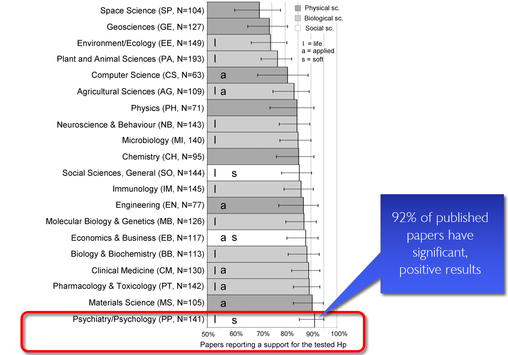{fig-align=center fig-alt="significant results" style="display:block; margin:auto; max-width:100%; max-height:50vh; width:auto; object-fit:contain;"}
:::

::: footer
Fanelli, D. (2010). “Positive” results increase down the hierarchy of the sciences. *PLOS ONE, 5*, e10068. [https://doi.org/10.1371/journal.pone.0010068](https://doi.org/10.1371/journal.pone.0010068)
:::


::: {.notes}
**Presenter Notes**: Following this logic, the next question immediately becomes: *well, if I need papers, how do I get papers published?* Turns out that journals love positive results. In other words, significant results. This study looked at published work across all these different fields, and found that in space science, about 75% of published papers had significant results. In other words, 75% of papers were able to confirm their tested hypothesis. Great right? Then we have statistics for many other research field, e.g., the field of psychology or psychiatry, which can be found all the way at he bottom of this graph. Psychology doing even better than space science, because in their papers, 92% of results are significant. Is that not great? 92% of their papers support the hypothesis researchers had generated. And clearly what this also means is that, if I want to get published in a psychological journal, all I need to do is bring significant, positive results. Seems easy enough, but how do we do that? 

**Instructor  Notes**: Depending on your learners, highlight the relevant field or a related field.  
:::


## Publication bias

"If my study *works*, I can publish it. *If it does not, let's hide it the drawer.*"

```{=html}

<div style="display: flex; align-items: flex-start; gap: 2em;">

  <!-- Left side: single image -->
  <div style="flex: 1; text-align: center;">
    
  </div>
  
```

  <!-- Right side: bullet points -->
  <div style="flex: 1;">
**Publication bias** happens when studies with *positive* or *significant* results are much more likely to be published than studies with negative or non-significant results.
  </div>

</div>

::: footer
Song, F., Hooper, L., & Loke, Y. K. (2013). Publication bias: what is it? How do we measure it? How do we avoid it?. *Open Access Journal of Clinical Trials*, 71-81. [https://doi.org/10.2147/OAJCT.S34419](https://doi.org/10.2147/OAJCT.S34419)
:::

::: {.notes}
**Presenter Notes**: The simplest way to obtain many papers with positive results is to, well, publish the papers with positive results. The logic behind it is: If my study works and the results are good (=positive) I can publish. If not, let's pretend the study never happened. This can be captured under the term *publication bias*. Publication bias happens when studies with positive or significant results are much more likely to be published than studies with negative or non-significant results.
:::


## Example publication bias

:::: {.columns}
::: {.column}
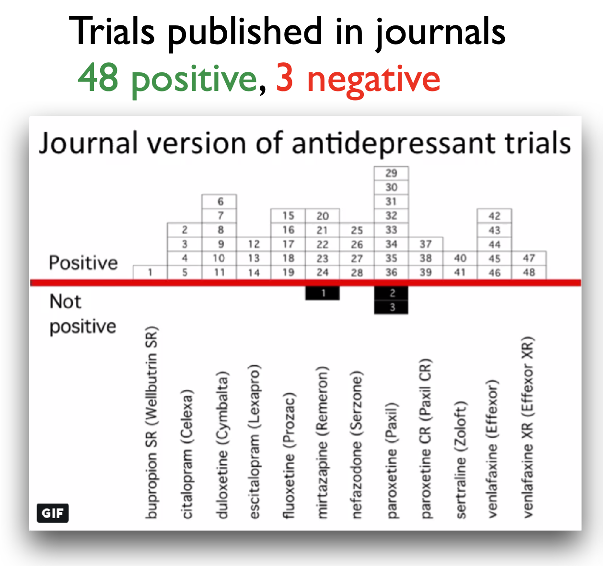{fig-align=center width=100%}
:::

::: {.column .fragment}
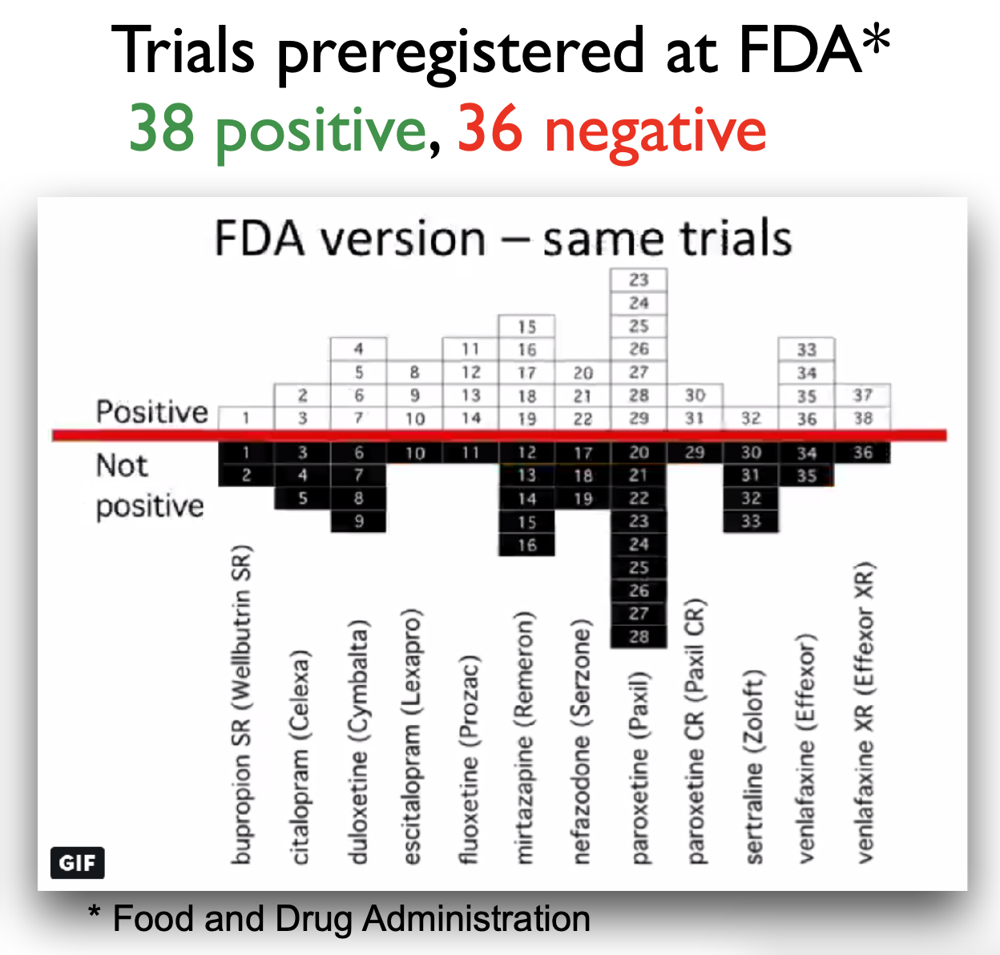{fig-align=center width=100%}
:::
::::


::: footer
Turner, E. H., Matthews, A. M., Linardatos, E., Tell, R. A., & Rosenthal, R. (2008). Selective publication of antidepressant trials and its influence on apparent efficacy. *New England Journal of Medicine, 358*(3), 252-260. [https://doi.org/10.1056/NEJMsa065779](https://doi.org/10.1056/NEJMsa065779)
:::

::: {.notes}
**Presenter Notes**: Turner and colleagues (2008) studied how selective publication bias affects research on antidepressant drugs. They compared antidepressant trials registered with the FDA to what was actually published in journals. They found that studies with positive results were much more likely to be published than those with negative or uncertain results. This made antidepressants seem more effective than they really were. Specifically, their analysis showed that about half of all FDA-registered trials did not show clear benefits, but almost all positive studies were published. In contrast, most negative studies were either not published at all or were written in a way that made the results look better than they were. This bias gave an inflated view of how well antidepressants work.

**Instructor Notes**: Additional details about the study and the conclusions: In this study, the authors obtained the archive of clinical trials for 12 antidepressant drugs submitted the the US Food and Drug Administration (FDA). In total, the trials involved more than 12000 patients. They performed a systematic search to identify which of these trials had been published in the literature. For those that were published, the compared the published versions and results with the versions and results in the FDA documentation. There were 74 FDA-registered trials. Of those, 38 trials showed postive effects of antidepressant drugs, 36 showed negative effects of antidepressant drugs. This is a 51% - 49% split of results: about half of the FDA-registered trials showed a positive effect of antidepressant drugs, the other half showed a negative effect of antidepressant drugs. 
37 of the 38 trials that showed positive effects were published in the literature, basically all of them except 1 trial. However, of the 36 trials that showed negative or no effects of antidepressant drugs, only 3 were published that included those exact findings. 22 of the 36 trials were not published at all, and the remaining 11 trials were published with the outcomes reframed in a more positive way. In the literature, in the end, we ended up with a total of 51 trials being published, 48 of which showed positive effects of antidepressant drugs on depression. That is 94% of this sample of papers. Only 6% (3 papers) showed a negative effect of antidepressant drugs on depression. As a consequence, those of us searching the literature for these papers, will get a distorted via of the effectiveness of antidepressants. Therefore, the authors were able to show a substantial publication bias in the antidepressant trial literature.
:::


## More than just publication bias

::: incremental

```{=html}

<div style="display: flex; align-items: flex-start; gap: 0.5em;">

  <!-- Left side: single image -->
  <div style="flex: 1; text-align: center;">
    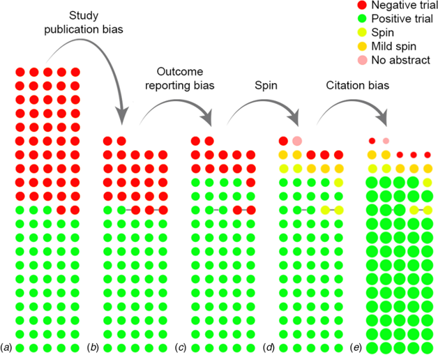
  </div>
  
```

  <!-- Right side: bullet points -->
  <div style="flex: 1; font-size:0.8em;">

  (a) All conducted studies
  (b) **Study publication bias**: non-publication of an entire study
  (c) **Outcome reporting bias**: non-publication of negative outcomes within a published article or switching the status of (non-significant) primary and (significant) secondary outcomes
  (d) **Spin**: authors conclude that the treatment is effective despite non-significant results on the primary outcome
  (e) **Citation bias**: Studies with positive results receive more citations than negative studies

  </div>

</div>
:::

::: footer
De Vries, Y. A., Roest, A. M., de Jonge, P., Cuijpers, P., Munafò, M. R., & Bastiaansen, J. A. (2018). The cumulative effect of reporting and citation biases on the apparent efficacy of treatments: the case of depression. *Psychological Medicine, 48*(15), 2453–2455. [https://doi.org/10.1017/S0033291718001873](https://doi.org/10.1017/S0033291718001873)
:::

::: {.notes}
**Presenter Notes**: This paper by de Vries and colleagues (2018) showed that there might be more than "just" publication bias at play. What we are looking at here in this graph is the following:

a) The authors assembled a cohort of 105 randomised controlled trials (RCTs) of antidepressant treatments for depression, drawn from the Food and Drug Administration (FDA) registration/trial-submission database (74 trials from an earlier study plus 31 newer ones).
They found that of these 105 trials: 53 (50%) trials were showed statistically significant positive effects of antidepressant treatments and 52 (50%) trials did not show a statistically positive effect of antidepressant treatment. 

b) They found that all of the trials with positive results, so a totlal of 53 trials, we then published. However, as you can see here, only about half of the trials with negative results were published. This represents the classical study publication bias we discussed previously. 

c) Of the trials that were published, something interesting happened to the ones with negative results. Upon publishing, some trials were published in a way that made them appear positive by omitting unfavourable outcomes, or by switching the designation of primary versus secondary outcomes.

d) You can see now how the number of published trials with negative outcomes are slowly decreasing. The next reduction of negative published trials comes from what we call spin.  For some trials, even when primary outcomes are non-significant, authors may write the abstract in a positive way. In other words, authors interpret statistically negative results in a more positive light than supported by the data. 

e) Finally, we also have citation bias, which is simply the phenomenon that studies with positive results get cited more, as you can see here by these different circles. The ones that come out very strongly are the ones that get cited more often, and you can see that all of those are the trials with positive results. In contrast, the ones with “spin results” or negative results, get cited much less often. In the study’s cohort, after accounting for publication and outcome-reporting biases, the remaining published positive studies tended to have higher visibility (more citations) than the published negative ones. 
The authors also note that positive trials were published in journals with higher median impact factor than negative ones (for antidepressants: 3.5 vs 2.4), which likely contributes to higher citations and visibility. 

**Instructor Notes**: This is a complex figure, take your time with walking learners through this step-by-step. 
:::


## Confirmation Bias
### a.k.a. "Thought so already" bias

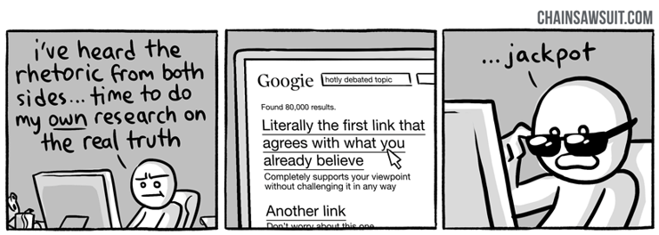{fig-align=center width=100% fig-alt="confirming your own beliefs"}

::: {.notes}
**Presenter Notes**: We are humans. And as humans, we often fall victims to our own inherent biases, sometimes or quite often without us noticing. Sometimes we cannot help but to feel like we just unlocked evidence or proof for something that we suspected all along. And it can be that it is true, or just that we stopped looking for more evidence and arguments as soon as we found the evidence that corresponded to our way of thinking. This is called the **confirmation bias**. Confirmation bias refers to the tendency to look for, interpret, or remember information in a way that confirms your pre-existing beliefs or expectations, while ignoring or downplaying evidence that contradicts them. In research, this can lead to selective attention to data, skewed analyses, or overconfident conclusions. For example; imagine a researcher believes that a new study technique helps students perform better. While analyzing results, they might focus on the small group of students who improved and overlook those whose performance stayed the same or worsened. Even unintentionally, this bias can make the findings seem stronger or more conclusive than they really are.
:::


## Hinsight Bias
### a.k.a. "I knew it" bias

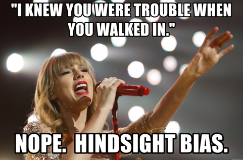{fig-align=center width=700% fig-alt="confirming your own beliefs"}

- The tendency to believe, after seeing the results of a study, that the outcome was obvious or predictable all along, even if it was not.

::: {.notes}
**Presenter Notes**: Another bias we are unconsciously struggling with in the research process is this **hindsight bias**.  It is the tendency to believe, after seeing the results of a study, that the outcome was obvious or predictable all along, even if it was not. For example: Imagine a study finds that people who exercise regularly have lower stress levels. After seeing the results, a researcher might think, “Of course, I knew exercise would reduce stress!” Even though before the study, this connection was not at all certain. Hindsight bias can make results seem more predictable than they really were, which can lead researchers or readers to overestimate the certainty of findings or ignore alternative explanations.
:::


## Practical exercise 4

**Task**: Match the bias to its description.

<div style="font-size:0.6em;">

| **Bias** | **Description** |
|------------|-----------------|
| **1.** Confirmation bias | **A.** Non-publication of negative outcomes within a paper, or switching non-significant primary outcomes with significant secondary ones.  |
| **2.** Spin | **B.** Studies with positive results receive more citations than negative studies.  |
| **3.** Study publication bias | **C.** After learning the outcome, believing “I knew it all along.” |
| **4.** Hindsight bias | **D.** Non-publication of an entire study (e.g., trials with null results never submitted). |
| **5.** Outcome reporting bias | **E.** Tendency to seek or interpret information in ways that confirm existing beliefs. |
| **6.** Citation bias | **F.** Authors conclude the treatment is effective despite non-significant primary outcomes.|

</div>


::: {.notes}
**Presenter Notes**: Time for another exercises, To consolidate the different biases a little, let's  atry and match the biases to their respective descriptions. Then we discuss in the group. 

**Instructor  Notes**: Solutions: 1E, 2F, 3D, 4C, 5A, 6B. Give about 5 minutes for this exercise and 2 minutes for discussing the correct results. 
:::


# Pre-break survey

::: {.notes}
**Presenter Notes**: Before we head into a short break, let us revise some concepts again and see where we are at.

**Instructor Notes**:

- **Aim**: This pre-break survey serves to examine students' current understanding of key concepts of the submodule

- Use free survey software such as particify or formR to establish the following questions (shown on separate slides)
:::


## Pre-break survey

**Based on what you learnt so far, how would you *now* rate your trust in published scientific findings on a scale from 1 - 5? (1 = not trusting any of the findings, 2 = trusting only some findings, 3 = trusting about half of the findings, 4 = trusting the majority of the findings, 5 = trusting all findings)**

a. 1

b. 2

c. 3

d. 4

e. 5

::: {.notes}
**Presenter Notes**: Coming back to the question from the beginning, what is your current trust in research with this information from the slides?
:::


## Pre-break survey

**What does *replicability* in research mean?**

a. Obtaining the same results using the original dataset and code

b. Obtaining consistent results when a new study collects new data using the same methods

c. Publishing results in more than one journal

d. Repeating the statistical analysis multiple times

::: {.notes}
**Instructor Notes**: The correct answer is b. 
:::


## Pre-break survey

**What is *publication bias* in research?**

a. The tendency for journals to publish studies only from well-known researchers

b. The requirement that all published studies must be peer-reviewed

c. The practice of publishing the same study in multiple journals

d. The tendency for studies with positive results to be published more often than studies with non-significant or negative results

::: {.notes}
**Instructor Notes**: The correct answer is d. 
:::


# Break! 15 minutes


## Post-break survey discussion

<br>

<div style="background-color: #f0f0f0; padding: 0.1em; border-radius: 5px; font-size: 1em; text-align: center;">

What do we see in the results?

</div>

::: {.notes}
**Presenter Notes**:  Add.

**Instructor Notes**:

- **Aim**: To clarify concepts and aspects that are not yet understood

- Highlight specific answers given during the survey
:::


<!-- 
Note Felix: At least for psych students, this excursus is not necessary.


## Excursus: Null-Hypothesis-Significance Testing

**Example**: Does the new drug "SniffStop" work better to decrease flu symptoms compared to the existing drug "CoughAway"?

::: incremental
- **H₀** = “the new drug is not better than the existing one.”
- Collect data from experiments and perform a statistical analysis to see if the evidence is strong enough to **reject H₀**
- **P-value** = how likely it is to see the results you got **if H₀ is true**.
  - A p-value of 0.05 means: “*There’s a 5% chance of seeing these results (or more extreme) if the null hypothesis is true.*”
:::

::: {.callout-important}
A *p*-value of 0.05 means that we accept a 5% chance that our results came about by pure luck (if the results were accidental, we would speak of a false positive result)
:::

::: {.notes}
**Presenter Notes**: Let us take a look at an example to understand null-hypothesis significance testing.

Imagine that we have developed a new drug called SniffStop. We want to know whether it reduces flu symptoms better than an existing drug called CoughAway. This is quite a classic scenario in  research: we are comparing a new treatment to the current standard.

In null-hypothesis significance testing, we always begin with what is called the null hypothesis, abbreviated as H₀. The null hypothesis represents the assumption of no effect or no difference. In our example, H₀ states that the new drug is not better than the existing one. In other words, there is no difference in the effect of SniffStop and CoughAway and they both work equally well in reducing flu symptoms. 

It is important to notice that we do not start by assuming the new drug works better. Instead, we start from a skeptical position. The burden of proof is on us to gather evidence strong enough to reject the null hypothesis.

To test H0, we collect data. For example, we might randomly assign patients to receive either SniffStop or CoughAway and then measure their flu symptoms over a certain period of time. After collecting the data, we perform a statistical analysis to determine whether the observed difference between the two groups is large enough that it would be unlikely to occur purely by chance.

This is where the p-value comes in. The p-value tells us how likely it would be to observe results like the ones we obtained if the null hypothesis were **true**. So in our case, it answers the question: if SniffStop is actually not better than CoughAway, how surprising are the results we observed?

For example, if we calculate a p-value of 0.05, this means there is a 5% chance of observing results this extreme (or more extreme) if the null hypothesis is true. In practical terms, if the two drugs were actually equally effective, we would see a difference this large only about 5 out of 100 times due to random variation alone.

Traditionally, if the p-value is below 0.05, we call the result statistically significant and reject the null hypothesis. However, it is crucial to understand what this does not mean. A p-value of 0.05 does not mean there is a 95% probability that the new drug works. It also does not prove that the null hypothesis is false. It simply indicates that the observed data would be relatively unlikely if the null hypothesis were true.

**Instructor  Notes**: Highlight for your learners that the basic logic of null-hypothesis significance testing is that we assume no effect, test how compatible our data are with that assumption, and decide whether the evidence is strong enough to reject it. **Skip this part** if your learners are familiar with null-hypothesis significance testing. 
:::


## Increasing your false positive rates can happen in the blink of an eye!

::: {.callout-warning}
Do **not** try the following at home.
:::

::: {.notes}
**Presenter Notes**: Accidental p-hacking can happen without much effort or without any intentions. What we will discuss on the following slides are different ways that p-hacking might happen.

**Instructor  Notes**: Stress that the following slides are not good scientific practice but are meant to illustrate how easy it can be to accidentally influence the p-value and therefore the interpretation of your analysis. Stress that you will present **bad** scientific practices. 
::: 

-->


# *p*-hacking and other problems

::: {.callout-warning}
Do **not** try the following at home.
:::


## "Hack" 1: Add *lots* of outcome variables

- For **two outcome variables**: False positive rate increases from 5% to **9.5%**
- For **five outcome variables** (and one-sided testing): False positive rate increases from 5% to **41%**

::: {.fragment}
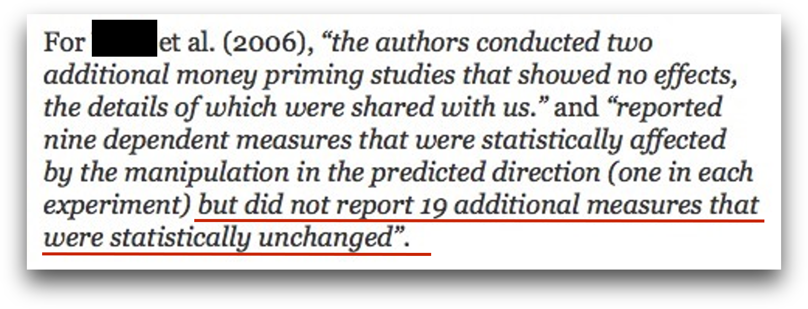{fig-align=center width=100% fig-alt="A researcher admits massive outcome switching in a blog post."}
:::

::: {.notes}
**Presenter Notes**: Let us say you designed an experiment, generated a hypothesis  and collected some data. Now you are analysising your data and are running a statistical test. When you run a statistical test, you’re checking whether your data could have happened just by random chance. If the p-value, which is the probability of getting your result if there’s really no effect, is less than 0.05, you say the result is “statistically significant.” That means there’s less than a 5% chance that the result happened by luck, assuming the null hypothesis is true. With a p-value below 0.05, you are saying, “I’m fairly confident this effect is real. There’s only about a 5% or a 1 in 20 chance that I incorrectly conclude that an effect or a difference between two conditions exists". In other words, it is the probability that I find a false positive. 

However, when you run multiple tests, each one carries its own 5% chance of producing a false positive, and these chances add up. As a result, the overall likelihood of finding at least one false positive across all tests, known as the family-wise error rate, becomes much higher than 5%. For example, if you test two outcome variables, each at the 5% significance level, the combined chance that at least one result is a false positive increases to about 9.5%. 

If you test five outcome variables, that overall false positive rate can rise dramatically, up to around 41% for one-sided tests.
In simple terms, the more outcomes you test, the greater your risk of finding a “significant” result purely by chance. So your chance of a false positive results is extremely high. I would therefore recommend including as many outcome variables as possible, you are sure to find a significant results for at least one of them. 

**Instructor  Notes**: Additional information for students: To reduce the false-positive rate, researchers often apply corrections, such as the Bonferroni adjustment, to keep the overall false positive rate close to the intended 5%.  
:::


## "Hack" 2: Run as many comparisons as possible

```{=html}

<div style="display: flex; align-items: flex-start; gap: 2em;">

  <!-- Left side: single image -->
  <div style="flex: 1; text-align: center;">
    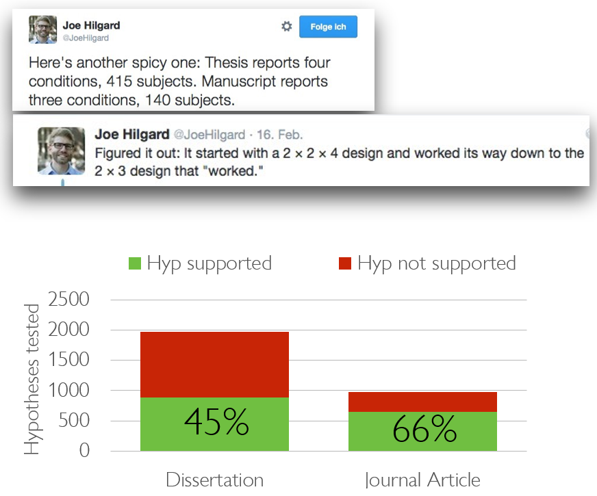
  </div>
  
```

  <!-- Right side: bullet points -->
  <div style="flex: 1;">

  - Run as many different comparisons on **different outcomes, subgroups, time windows** etc. as you can
  - **Only** report the comparisons that produced a statistically significant result


  </div>

</div>

::: footer
O’Boyle, E. H., Banks, G. C., & Gonzalez-Mulé, E. (2017). The Chrysalis Effect: How ugly initial results metamorphosize into beautiful articles. *Journal of Management, 43*(2), 376–399. [https://doi.org/10.1177/0149206314527133](https://doi.org/10.1177/0149206314527133)
:::


::: {.notes}
**Presenter Notes**: When you have more outcome variables, this often also means that you can run more statistical tests.
Each time you try another independent test at α = 0.05 you have a 5% chance of a Type I error for that test. If you perform many uncorrected tests, the chance that at least one will be (falsely) significant rises quickly. For example, doing 20 independent tests at α = 0.05 gives a probability of at least one false positive of1 − (1 − 0.05)²⁰ = 1 − 0.95²⁰ ≈ 0.6415 (≈64%). Therefore, the trick here is to just run as many comparisons as possible on different groups, different time windows, different subsections of your data, you will be guaranteed to find significant results. Then, of course, only report those comparisons that produced the significant result. Just run many more statistical tests and report only the ones you like. Easy, right? 

:::


## "Hack" 2: Run as many comparisons as possible
### Example: Subgroup Analyses

Research question: Do aggressive primes trigger aggressive behavior?

> "A second study in Turner, Layton, and Simons (1975) collects a larger sample of men
and women driving vehicles of all years. The design was a 2 (Rifle: present, absent) ×
2 (Bumper Sticker: "Vengeance", absent) design with 200 subjects."

➙ presumably, no effect … (yet! Do not give up so easily)

::: footer
Cited from Joe Hilgard’s excellent [blog post](http://crystalprisonzone.blogspot.com/2016/03/the-weapons-priming-effect.html) on the Weapon Priming Effect; Turner et al. (1975). Naturalistic studies of aggressive behavior: aggressive stimuli, victim visibility, and horn honking. JPSP, 31(6), 1098–1107.
:::


## "Hack" 2: Run as many comparisons as possible
### Example: Subgroup Analyses

> "They divide this further by driver's sex and by a median split on vehicle year. They
find that the Rifle/Vengeance condition increased honking relative to the other three, **but
only among newer-vehicle male drivers**, F(1, 129) = 4.03, [*p* = .047]{.hl}. But then they report
that the Rifle/Vengeance condition decreased honking among older-vehicle male
drivers, F(1, 129) = 5.23, [*p* = .024]{.hl}! No results were found among female drivers."

::: footer
Cited from Joe Hilgard’s excellent [blog post](http://crystalprisonzone.blogspot.com/2016/03/the-weapons-priming-effect.html) on the Weapon Priming Effect; Turner et al. (1975). Naturalistic studies of aggressive behavior: aggressive stimuli, victim visibility, and horn honking. JPSP, 31(6), 1098–1107.
:::


## "Hack" 3: Optional stopping

- Scenario: You collect a sample of *n*=60 and obtained a *p*-value of .07.
- "Trending towards significance"! **What is your intuition how to proceed?**

::: {.fragment}
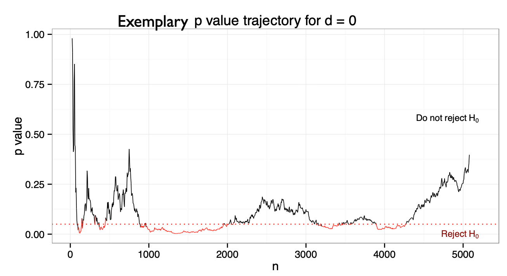{height=400px fig-align="center"}
:::

::: {.notes}
**Presenter Notes**: Another p-hacking strategy is called peeking or **optional stopping**. In other words, you start doing your analysis already before all data have been collected and perform multiple interim analyses “just to have a look”. With every interim analysis, you are, of course, increasing your chances of finding a false positive, or, what you would consider a “true” significant effect that is, unfortunately not true at all. 

You do not have to take my word for it that this practice can increase the false positive rates, but there have been some people who looked at this. Their work demonstrated that when researchers test interim results multiple times and stop data collection once a significant result appears, the false positive rate does not stay at 5%. Instead, this rate increases exponentially with each additional interim analysis. Even a modest number of repeated tests can double or triple the chance of declaring a false positive. This inflation occurs because each interim look introduces another opportunity for a random fluctuation to cross the significance threshold. In other words, you can move from a 5% chance of incorrectly concluding that there is an effect to an 11% chance with only one additional analyses. 

So, the moral of the story here is that you need to just do as many interim analyses as possible before you finish your data collection, and I guarantee you will obtain a significant results at some point. When you do, of course "there is no point in sticking to your original plan of minimum sample size, so to not waste time, you should also stop data collection immediately". 

**Instructor  Notes**: Explicitly highlight the sarcastic aspect of this slide, since there are large cultural differences in whether and how sarcasm is perceived as a linguistic cue and processed. Reframe this slide if you have the impression that the audience will not benefit from sarcasm.   
:::


## "Hack" 3: Optional stopping

::: {.incremental}
- Optional stopping: Collect an initial sample, analyze the results, add participants if the results are not significant
- But under $H_0$, the *p*-value is a random walk between 0 and 1, fluctuating forever.
- Eventually, it will "dip" below the critical threshold
- The false positive rate depends on the number of optional sample size increases:
    - One analysis: α = 5%
    - Two analyses: α = 11%
    - But with enough increases can be pushed to 100%!
:::

::: footer
Armitage, P., McPherson, C. K., & Rowe, B. C. (1969). Repeated significance tests on accumulating data. *Journal of the Royal Statistical Society. Series A (General), 132*, 235–244.
:::


## "Hack" 4: Drop participants you do not like


```{=html}

<div style="display: flex; align-items: flex-start; gap: 2em;">

  <!-- Left side: single image -->
  <div style="flex: 1; text-align: center;">
    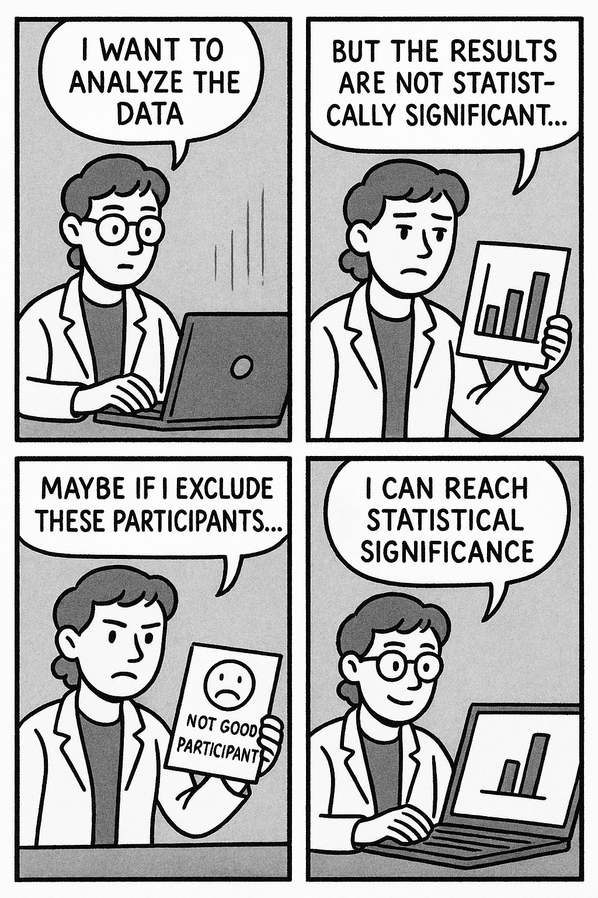
  </div>
  
```

  <!-- Right side: bullet points -->
  <div style="flex: 1;">

  - Selectively **exclude data/ outliers** after seeing the results until the results are satisfying (*aka until significance has been reached*)


  </div>

</div>

::: {.notes}
**Presenter Notes**: Another common form of p-hacking happens when researchers selectively remove outliers or participants from their dataset to make their results look more significant. In simple terms, an outlier is a data point that looks very different from the rest. This is maybe a participant who scored unusually high or low compared to the rest of the participants. Sometimes, removing outliers is justified, for example, if there was a clear measurement error. 
But in order to obtain significant results, you can also perform a first analysis, evaluate your p-values and think about excluding those participants that are just really, really biasing your data. Of course, this practice increases the chance of getting a “statistically significant” result by luck rather than truth, but at least, you have a statistically significant result. Some work by Simmons et al. showed that flexible data analysis decisions, including dropping outliers, could make almost any hypothesis appear statistically significant.  

**Instructor  Notes**: More information about Simmons et al. (2011): According to Simmons, Nelson, and Simonsohn (2011) in their paper “False-Positive Psychology” published in Psychological Science, even small and seemingly reasonable choices about including certain data from selected participants can dramatically increase the likelihood of finding a false positive result. In their experiments, they showed that flexible data analysis decisions, including dropping outliers, could make almost any hypothesis appear statistically significant.   
:::


## "Hack" 5: HARK-ing

- **H**ypothesizing **A**fter **R**esults are **K**nown = presenting an exploratory finding to match a hypothesis that was created only after analysing the results
- a.k.a. "The Texas sharpshooter fallacy"

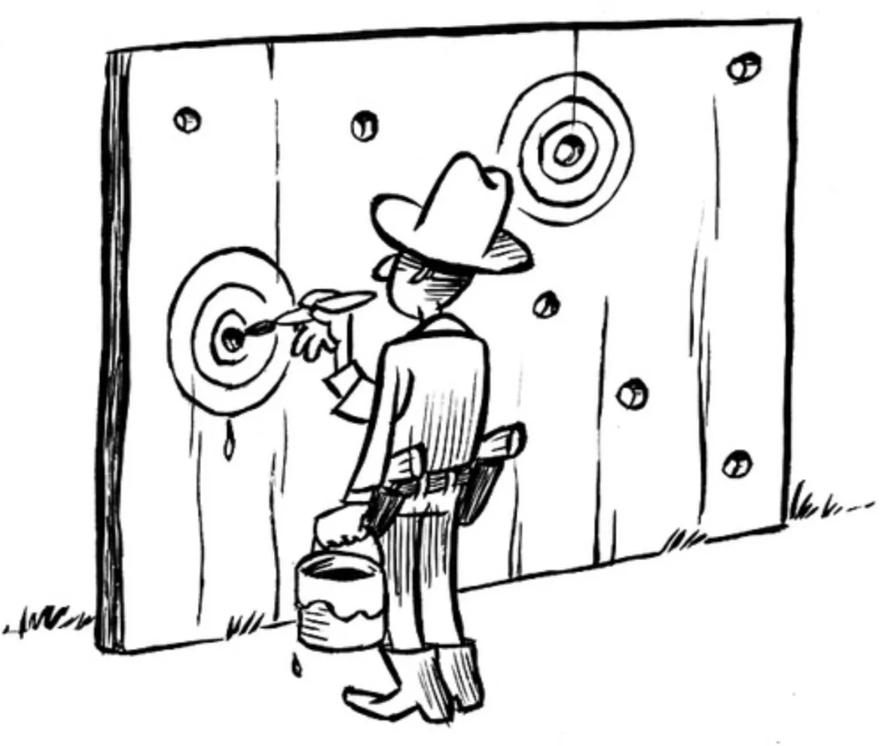

::: {.notes}
**Presenter Notes**: Let's talk about another so-called "hack". Note that once again, what I will say next is meant purely in a sarcastic way. This tip to obtain positive results is probably one of my favourites. What you do is the following: you look at your results first, and then come up with a hypothesis afterward. Just forget about the original hypothesis you had and that you tested for. For example: imagine a study testing several relationships between variables. Only one of them turns out significant. Instead of reporting that this was an unexpected result, the researcher rewrites the introduction to make it look like that was their original prediction.

Of course, this practice undermines the credibility of scientific findings because it blurs the line between prediction and explanation. It makes results seem more confirmatory than they really are and increases the risk of false theories being accepted. But, what is important is that at the end you have a positive result and a good story that you can tell to the journal, so I am sure that you will get accepted.
:::


## Combining these "hacks"

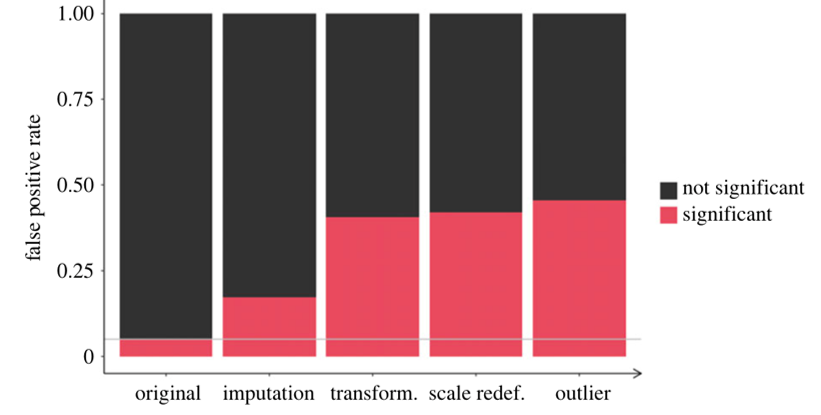{fig-align=center width=100% fig-alt="p-hacking and questionble research practises"}

- Combining some of these hacks (*aka questionable research practices*) can **raise false positive rates** from 5% to > 50%!
- With *p*-hacking, the logic of the p-value is **corrupted** and “*renders the reported p-values essentially uninterpretable.*”


::: footer
Stefan, A. M., & Schönbrodt, F. D. ([2023](https://doi.org/10.1098/rsos.220346)). Big little lies: A compendium and simulation of p-hacking strategies. *Royal Society Open Science, 10*(2), 220346. Wasserstein et al. ([2016](http://doi.org/10.1080/00031305.2016.1154108)). The ASA's statement on p-values: context, process, and purpose. American Statistician.
:::

::: {.notes}
**Presenter Notes**: Even seemingly minor practices, e.g.,  selectively reporting results, stopping data collection once a significant result appears, or testing multiple hypotheses without proper correction, can have a huge effect. When these practices are combined, they can inflate false positive rates dramatically, taking them from the expected 5% under proper statistical testing to over 50%. This means that more than half of the reported significant findings could be false alarms.

As a result, the logic of the p-value itself becomes corrupted. P-values are supposed to indicate the probability of observing the data if the null hypothesis is true. When questionable practices are used, this interpretation no longer holds. In other words, it renders reported p-values essentially uninterpretable, because they no longer reflect the true probability of the observed effect under rigorous, unbiased conditions.

**Instructor  Notes**: Add.  
:::


## A shocking report from an experienced researcher

<video controls playsinline width="1000">
  <source src="images/Researcher_p-hacking.mp4" type="video/mp4">
</video>


## A note to remember

::: {.callout-warning}
The so-called "hacks" on the past few slides represent **questionable research practices**. Do **not** try at home. 
:::

::: {.notes}
**Presenter Notes**: I want to be clear before we move on: the way the past slides were slide is deliberately sarcastic. It is meant to show  what can happen if researchers engage in questionable research practices, like p-hacking, but it’s **not a recommendation**.

**Instructor  Notes**: Stress this point again to potential cultural differences in terms of processing sarcasm. 
:::


## Practice *p*-hacking yourself
### with the P-Hacker App

<http://shinyapps.org/apps/p-hacker/>

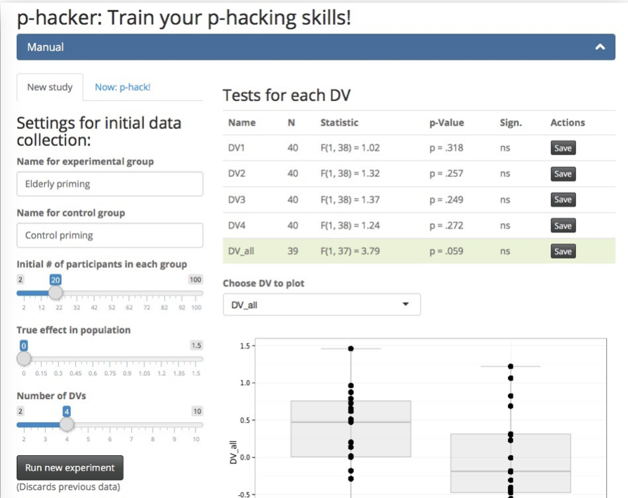{.ds .img-full}


## Practical exercise 5

:::incremental

**Scenario**: You are reviewing a study examining whether drinking white tea improves short-term memory, where the researchers report:

  - Hypothesis: *White tea improves memory test scores.*
  
  - Sample size: 28 participants per group (tea-drinkers vs. water-only-drinkers)
  
  - Results: 
    - Effect was “stronger in women” (*p* = 0.049)
    - Effect “even stronger when excluding two outliers” (*p* = 0.044)
    - No effect in men (*p* = 0.31)
    - Reaction time difference significant (*p* = 0.046)
  
  - Conclusion: *The results show that white tea reliably improves cognitive performance.*

**Which potential p-hacking strategies are at play here?**
:::

::: {.notes}
**Presenter Notes**: Let us get to work! I now have a task for you to reflect on different biases and/ or questionable research practises. Imagine that you are reviewing a study examining whether drinking white tea improves short-term memory. In the report, you read the information provided here. Which potential p-hacking strategies can you identify?

**Instructor  Notes**: Possible answers can include:

- Large number of uncorrected comparisons with selective reporting
- The conclusion variable does not match the original hypothesis
- Research question too vague and non-directional given the analysis
- Results report comparisons that are not specified in the research question
- Many p values bunching just below 0.05
- Lack of pre registration or analysis plan when claims are confirmatory
- Outcome variables added that were not specified in the hypothesis: e.g., reaction time
:::


## Practical exercise 5

**Scenario**: You are reviewing a study examining whether drinking white tea improves short-term memory, where the researchers report:

- Hypothesis: *White tea improves memory test scores.*

- Sample size: 28 participants per group (tea-drinkers vs. water-only-drinkers)

- Results: 
  - Effect was “stronger in **women**” (*p* = **0.049**)
  - Effect “even stronger when excluding two outliers” (*p* = **0.044**)
  - No effect in **men** (*p* = 0.31)
  - **Reaction time** difference significant (*p* = **0.046**)
  
- Conclusion: The results show that white tea reliably improves **cognitive performance**.


## Does this *actually* happen?

Come on. Surely not..? 😳

::: {.fragment}
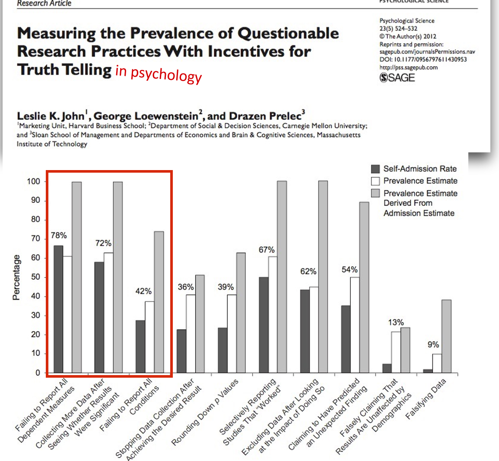{fig-alt="p-hacking and questionable research practices" height=400px fig-align="center"}
:::

::: footer
John, L. K., Loewenstein, G., & Prelec, D. (2012). Measuring the prevalence of questionable research practices with incentives for truth telling. *Psychological science, 23*(5), 524-532.
:::

::: {.notes}
**Presenter Notes**: At this point you might be thinking well ok, we heard that p-hacking can be accidental. Surely then that means it does not happen that often? Surely you can count the cases of this happening on one hand. John and colleagues surveyed over 2,000 psychologists about their involvement in questionable research practices. 

In this survey, they asked respondents if they had ever failed to report all outcome variables or they had ever collected more data after seeing that the collected data did not result in the significant results they wanted. The dark bar you see here are self-admissions rates, which for these two practices in particular are above 70%, which is extremely high. 

In their paper, they also used some estimation methods I won’t go into detail but just see that, well, over 70% are **telling** us that they engage in these practices, what would this percentage be in real life? This is what is shown in the light grey bar, which for these two practices specifically estimates the true percentage of engaging in these two practices at almost 100%, meaning that everyone has done this at some point in their research career. 

**Instructor  Notes**: Quoting the relevant part of the paper: "The impact of truth-telling incentives on self-admissions of questionable research practices was positive, and this impact was greater for practices that respondents judged to be less defensible. Combining three different estimation methods, we found that the percentage of respondents who have engaged in questionable practices was surprisingly high. This finding suggests that some questionable practices may constitute the prevailing research norm."
:::

 

## .. and across fields? {transition="fade" transition-speed="fast"}

- Survey among 6,813 academic researchers in The Netherlands: **Self-reported prevalence of fabrication and falsification in the last 3 years**

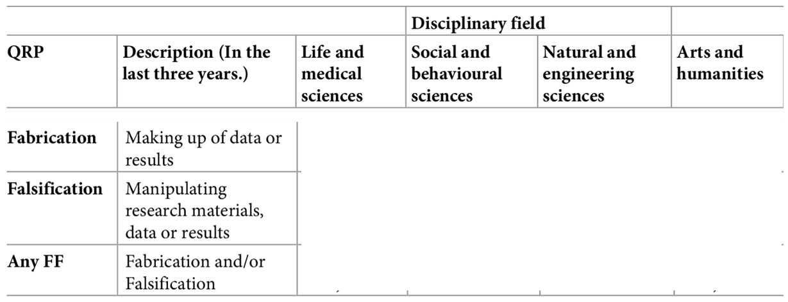{fig-align=center width=50% fig-alt="QRPs in psychology"}

::: footer
Gopalakrishna, G., ter Riet, G., Vink, G., Stoop, I., Wicherts, J. M., & Bouter, L. M. (2022). Prevalence of questionable research practices, research misconduct and their potential explanatory factors: A survey among academic researchers in The Netherlands. *PLOS ONE, 17*(2), e0263023. [https://doi.org/10.1371/journal.pone.0263023](https://doi.org/10.1371/journal.pone.0263023)
:::

::: {.notes}
**Presenter Notes**: So far, we focused on questionable research practices. Of course, there is also the next level, namely fabrication and falsification, which both constitute outright scientific misconduct. The authors conducted a large‑scale cross‑sectional survey (the National Survey on Research Integrity) targeting academic researchers across all disciplines and ranks in the Netherlands. Its aim was to estimate the prevalence of fabrication and falsification and a range of questionable research practices (QRPs) over the preceding three‑year period, and to examine factors potentially associated with higher or lower engagement in these behaviors. Over 6,800 researchers completed the survey. What are your guesses here on the percentages they found?

**Instructor  Notes**: Collect some guesses before moving on to showing the solution.   
:::


## .. and across fields? {transition="fade" transition-speed="fast"}

- Survey among 6,813 academic researchers in The Netherlands: **Self-reported prevalence of fabrication and falsification in the last 3 years**


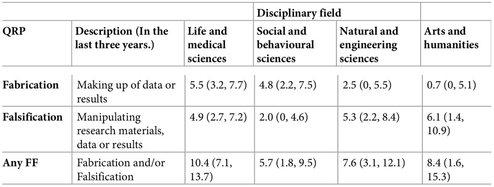{fig-align=center width=50% fig-alt="QRPs in psychology"}

::: footer
Gopalakrishna, G., ter Riet, G., Vink, G., Stoop, I., Wicherts, J. M., & Bouter, L. M. (2022). Prevalence of questionable research practices, research misconduct and their potential explanatory factors: A survey among academic researchers in The Netherlands. *PLOS ONE, 17*(2), e0263023. [https://doi.org/10.1371/journal.pone.0263023](https://doi.org/10.1371/journal.pone.0263023)
:::

::: {.notes}
**Presenter Notes**: The key findings from their study were quite shocking. The prevalence of **fabrication**, aka making up data, stands at about 4.3% (with a 95% confidence interval of 2.9 to 5.7%), while **falsification**, aka outright manipulating data, occurs at roughly 4.2% (95% CI 2.8 to 5.6%). These rates vary across disciplines: for example, medical fields tend to report higher rates, whereas arts and humanities report lower. Psychology shows a self-reported fabrication rate of nearly 5% and falsification around 2%, indicating it is somewhat in the middle range.

When it comes to questionable research practices, which include 11 types of behaviors assessed, the prevalence ranges widely. The least frequent QRPs occur in about 0.6% of respondents, while the most common QRP is reported by as many as 17.5% (95% CI 16.4 to 18.7%). Notably, over half of the respondents (51.3%) admitted to frequently engaging in at least one QRP in the past three years.

Further analysis reveals that junior researchers, such as PhD candidates, and male researchers have higher odds of frequently reporting at least one QRP. On the other hand, individuals who strongly subscribe to scientific norms, aka those that value honest research, and those who believe that peer reviewers are likely to detect misconduct show lower odds of engaging in misconduct or QRPs. Conversely, researchers who experience higher publication pressure are more likely to frequently engage in QRPs, with a 22% increase in odds (OR ~1.22, 95% CI 1.14 to 1.30).
:::


## (Un)Intentional? 

- Intentional?
  - "Evil researcher" who only cares about his/her career and not at all about truth-seeking?
  - „*We urge the social science community to redefine p-hacking as a series of deceptive research practices rather than ones that are merely questionable.*“ [(Craig et al., [2020](https://pure.port.ac.uk/ws/portalfiles/portal/18626575/COXa_2020_cright_RP_Using_retracted_journal_articles_in_psychology_to_understand_research_misconduct_in_the_social_sciences.pdf))]{.smallnote}

- Unintentional?
  - Lack of education/knowledge?
  - Wrong/uncritical standards of the field?
  - Pushed by supervisors, reviewers, or editors? ➙ [http://bulliedintobadscience.org/](http://bulliedintobadscience.org/)
  - **Simply being human?**
 - Distorting effects on the published record are probably comparable, but the ethical evaluations differs strongly.

::: {.notes}
**Presenter Notes**: Summarising from the previous slides I showed, we now know that questionable research practices and scientific misconduct are extremely prevalent and frequent. The question here is: why? Are we doing this **intentionally**, for example to publish more papers and to advance our careers? Because we don’t care about the truth and about producing good quality, reliable research? 

Or maybe this is all **unintentional**? Perhaps we did not fully know that some of things we learnt from our PIs or supervisors are considered bad practice? Maybe we are being convinced by supervisors? Maybe there are just unclear standards of what is considered “good quality research” in the field? Or maybe we are also just humans? We already talked about inherent biases, but perhaps we also just make mistakes or are unaware of our own weaknesses?
:::


##  Detecting *p*-hacking

Prof. Brian Wansink:

- distinguished Cornell social science professor
- executive director of the USDA's Center for Nutrition Policy and Promotion (2007 - 2009)

With your new background knowledge on *p*-hacking, read the blog post "[The Grad Student Who Never Said 'No'](https://web.archive.org/web/20170312041524/http:/www.brianwansink.com/phd-advice/the-grad-student-who-never-said-no)" by Brain Wansink.

(Read the blog post first, then some of the comments below, and then the Addendum I and II. Then you have the historical unfolding of the case.)

# Honest Errors

## Human errors and honest mistakes
### "90% Excel-Gate"

<style>
/* wrapper so styles don’t leak into other slides */
.overlap-slide {
  position: relative;
  width: 100%;
  height: 500px;   /* adjust as needed */
}

/* Image styling */
.overlap-slide img {
  position: absolute;
  width: 50%;      /* adjust size */
  border-radius: 8px;
  box-shadow: 0 6px 12px rgba(0,0,0,0.25);
}

/* slight rotation to make overlap nicer */
.overlap-slide .img3 { 
  top: 5%; 
  left: 5%; 
  transform: rotate(-3deg);
}

.overlap-slide .img2 { 
  top: 35%; 
  left: 1%; 
  transform: rotate(2deg);
}

.overlap-slide .img1 { 
  top: 2%; 
  left: 50%; 
  transform: rotate(-1deg);
}
</style>

<div class="overlap-slide">
  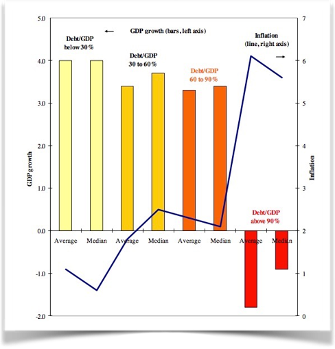
  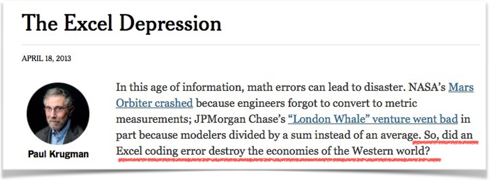
  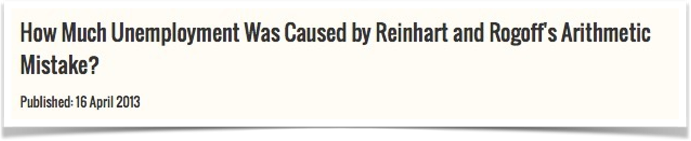
</div>


::: {.notes}
**Presenter Notes**: In their 2010 paper Growth in a Time of Debt, economists Carmen Reinhart and Kenneth Rogoff claimed that when government debt exceeds 90% of GDP, economic growth falls sharply. Their findings strongly influenced debates about austerity policies. However, in 2013, Thomas Herndon, Michael Ash, and Robert Pollin from the University of Massachusetts–Amherst re-examined the data and found serious flaws: an Excel coding error that excluded several countries. In essence, what had happened was that when using a formula, the authors had made a mistake when selecting the range of cells where to apply the formula too. In this, they  accidentally omitted some countries from the calculations. The conclusion was that for advanced economies, when the government gross debt exceeds about 90% of GDP, annual real GDP growth falls sharply. This conclusion informed policies in the respective countries.

**Instructor  Notes**: Details about the error: 
The omitted rows related to countries with high debt and growth (for example Belgium) that should have been part of the calculation.
Because of this omission, the reported average for the >90% debt category was around –0.1% growth. Once corrected, the average growth rate for high-debt countries rose from –0.1% to about +2.2%, showing no clear “90% tipping point.” The original authors later acknowledged the spreadsheet error and issued a correction.
:::


## Human errors and honest mistakes
### "90% Excel-Gate" - Lessons learned

::: {.callout-important}
The most important point of the story: The original authors **shared their raw data**, which made it possible to **correct** the honest mistake!
:::

::: {.notes}
**Presenter Notes**: The case became a landmark example of how data errors, selective reporting, and methodological choices can mislead economic policy, and of why transparency and replication are essential in research. Only because the data were available, the mistake could be found and corrected! 
:::


## Statistical errors

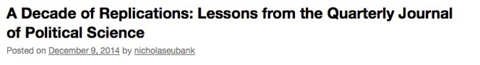{fig-align=center width=100% fig-alt="QRPs in psychology"}

::: {.incremental}
- Reproducible analysis **code and open data required** at submission - “in-house checking” in review process
- 54% of all submissions had results in the paper that **did not match** the computed results from the code
  - Wrong signs, wrong labeling of regression coefficients, errors in sample sizes, wrong descriptive stats
:::

::: footer
Eubank, N. (2016). Lessons from a decade of replications at the quarterly journal of political science. *PS: Political Science & Politics, 49*(2), 273-276 [https://doi.org/10.1017/S1049096516000196](https://doi.org/10.1017/S1049096516000196)
:::
  
::: {.notes}
**Presenter Notes**: This is an interesting paper which looked at code and data packages that were required at submission to the Quarterly Journal of Political Science. They took the analysis code that and the data that were submitted, reran the analysis and checked whether the results matched what was described in the paper. 

It finds that of the 24 empirical papers subjected to in-house replication review since September 2012, only four packages did not require any modifications. Most troubling, 14 packages (58%) had results in the paper that differed from those generated by the author’s own code. The authors identified a number of mistakes in the analysis scripts that were submitted and in the results that were published, for example that the wrong signs used for reporting, coefficients were labelled the wrong way, descriptive statistics were imprecise or incorrect.

Based on these experiences, this article presents a set of guidelines for authors and journals for improving the reliability and usability of replication packages.
:::


## Statistical inconsistencies

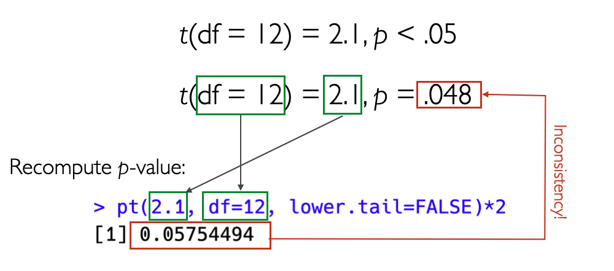{.img-full}


## Statistical inconsistencies

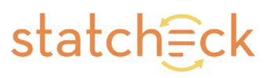{fig-align=center width=10% fig-alt="QRPs in psychology"}

::: {.incremental}
- Does the statistical conclusion change? ➙ „strong/gross inconsistency“
- Psychology:
  - 16,695 scanned papers with **statcheck tool** (Nuijten et al., 2015)
  - 50% of papers contain statistical inconsistencies
  - 13% contained **strong errors** (i.e., where the statistical conclusion changes). 
- Economics
  - 3,677 scanned papers with DORIS tool (Bruns et al., 2023) 
  - 36% of papers contain statistical inconsistencies
  - 15% contained strong errors (i.e., where the statistical conclusion changes). 
- Other fields (e.g. Sociology):
  - Not even (automatically) checkable, due to unstandardized reporting practices.
- … and these are only the [detected]{.hl} errors of [one]{.hl} type (stat. inconsistency)!
:::

::: footer
Nuijten et al. (2016). The prevalence of statistical reporting errors in psychology (1985–2013). *Behavior research methods, 48*(4), 1205-1226. [https://doi.org/10.3758/s13428-015-0664-2](https://doi.org/10.3758/s13428-015-0664-2). Bruns et al.(2023). Statistical reporting errors in economics [Preprint]. MetaArXiv. <https://doi.org/10.31222/osf.io/mbx62>
:::

::: {.notes}
**Presenter Notes**: Researchers have also examined how often published psychology papers contain statistical errors. Using the *Statcheck* tool (Nuijten et al., 2015), over 16,000 papers were automatically scanned to compare reported test statistics with their p-values. The results were worrying: about 50% of papers contained at least one statistical inconsistency, and around 13% had serious errors, meaning the reported statistical conclusion (for example, whether a result was “significant”) would actually change if calculated correctly.

More recent work by Crüwell et al. (2022) found that the numerical results in fewer than 30% of papers can be fully reproduced, even when all the information needed is available.

I want to point out here that these are only errors of the statistical type, other types of errors were not examined here. I think you see the picture that I am painting here and I am hoping to get across that these are some serious challenges to research. 
:::


## Reproducibility Success


- Crüwell et al. ([2022](https://journals.sagepub.com/doi/10.1177/09567976221140828)), Psychology: Numerical results of less than 30% of papers can be **reproduced**
- Krähmer et al. ([2026](https://doi.org/10.1177/09567976221140828)), Sociology:
  - Only 3% of authors share analysis code proactively
  - Upon request, 34% shared their code.
    - Of these, 51% were perfectly reproducible.
  - If non-shared cases are classified as non-reproducible, 18% of results reproduced.

::: footer
Krähmer, D., Schächtele, L., & Auspurg, K. ([2026](https://doi.org/10.1098/rsos.251997)).
Crüwell et al. ([2023](https://doi.org/10.1177/09567976221140828)).
:::

## What does this all mean?

<div style="background-color: #fff9c4; padding: 1em; border-radius: 10px; text-align: center; font-size: 1.2em;">
  **Bias + (maybe unintentional) *p*-hacking + human (honest) mistakes = untrustworthy research findings?**
</div>


::: {.callout-note}
- Published findings across fields to be viewed with **caution**?
- "We know" --> **"We *think* we know"**?
- More research to **verify** existing "truths"?
:::

::: {.notes}
**Presenter Notes**: Taking all of this together, where does this leave us? We have several elements which, as we have explored in the last few slides, contribute to non-robust research. We have different types of biases, accidential or not so accidental p-hacking, and we have the human component of just making mistakes from time to time in the process. What conclusions can we draw about research, then?

Perhaps there should be more caution around published papers across fields and we should not view findings as the ultimate truth, just because they were published? Perhaps we should also shift from "we know" to "we think we know" pending further investigations and perhaps pending replication? And finally, perhaps our efforts should also go into checking these so-called truths we think exist in the academic world and perform more replication studies?

**Instructor  Notes**: This is a critical reflection moment, give enough time between this slide and the next slide for learners to digest and integrate what they learned.   
:::


## A romanticized idea of research?

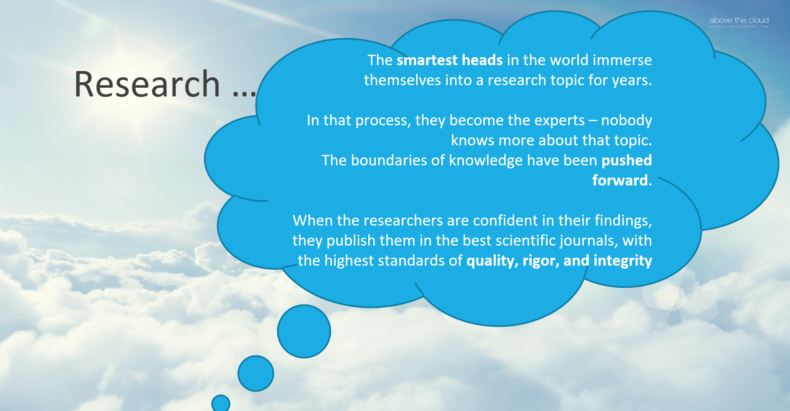

::: {.notes}
**Presenter Notes**: In other words, perhaps we have a romanticized view of research? Typically we think of research as something along the following lines: The smartest heads in the world immerse themselves into a research topic for years. In that process, they become the experts, nobody knows more about that topic.The boundaries of knowledge have been pushed forward. When the researchers are confident in their findings, they publish them in the best scientific journals, with the highest standards of quality, rigor, and integrity.

**Instructor  Notes**: Encourage a mental shift by contrasting how we used to think about research and the current status quo discussed over the past slides. Prepare the "stage" for a new approach to research and guide your learners towards the question of "but then how can we do research differently"?
:::


## Going even further: The perpetuating role of AI

<style>
/* wrapper so styles don’t leak into other slides */
.overlap-slide {
  position: relative;
  width: 100%;
  height: 500px;   /* adjust as needed */
}

/* Image styling */
.overlap-slide img {
  position: absolute;
  width: 50%;      /* adjust size */
  border-radius: 8px;
  box-shadow: 0 6px 12px rgba(0,0,0,0.25);
}

/* slight rotation to make overlap nicer */
.overlap-slide .img3 { 
  top: 1%; 
  left: 3%; 
  transform: rotate(-3deg);
}

.overlap-slide .img2 { 
  top: 35%; 
  left: 1%; 
  transform: rotate(2deg);
}

.overlap-slide .img1 { 
  top: 20%; 
  left: 45%; 
  transform: rotate(5deg);
}
</style>

<div class="overlap-slide">
  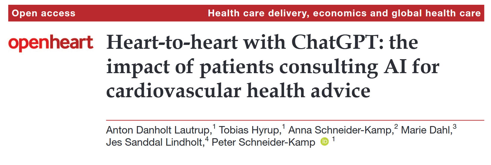
  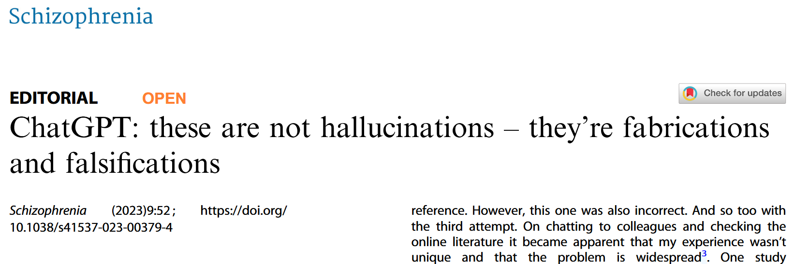
  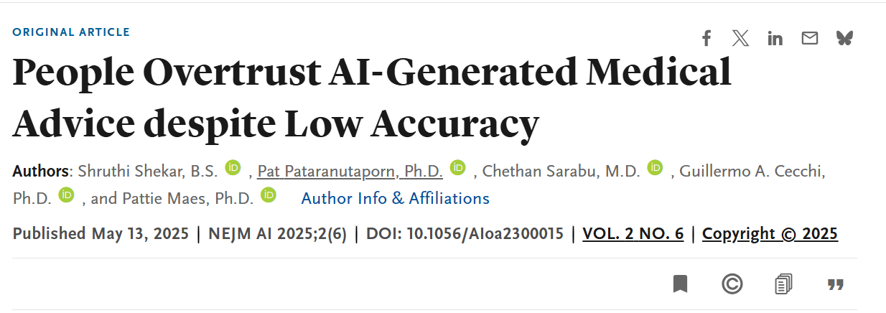
</div>

::: footer
Emsley, R. (2023). ChatGPT: These are not hallucinations - they’re fabrications and falsifications. *Schizophrenia, 9*(1), 52. Lautrupet al. (2023). Heart-to-heart with ChatGPT: the impact of patients consulting AI for cardiovascular health advice. *Open Heart, 10*(2). Shekar et al. (2025). People Overtrust AI-Generated Medical Advice despite Low Accuracy. *NEJM AI, 2*(6), AIoa2300015.
:::

::: {.notes}
**Presenter Notes**: Thinking about how mistakes happen, how accidental p-hacking happens, how there is pressure to publish positive results, how we are, to some extent, victims of our own biases without noticing, I think you get an image of the low credibility of research that is currently out there. Now we are also facing a new challenge in the wake of artificial intelligence. We know that ChatGPT and other large language models are routinely used by people to, for example, obtain medical advice. Given what we heard before, how accurate do you believe this information provided by the chatbots is? Papers demonstrate by now that the accuracy is low, yet people turn to ChatGPT for medical advice. We also know about so-called hallucinations of ChatGPT. Some researchers view this as the "modern" form of falsification and fabrication, just like we discussed in the context of scientific misconduct. But what if the research feeding into this advice that chatbots provide and the "papers" they are suggesting to you for your essay are already of low quality? Is AI then not simply distributing non-credible and flawed research, without the warning message that this might be the case?

**Instructor  Notes**: Bonus slide depending on the interest of your learners. 
:::


## 

:::: {.columns}
::: {.column width='50%'}
<div style="background: linear-gradient(180deg, #8f1200 0%, #3a0600 100%); color: white; border-radius: 28px; padding: 1.2em 1.1em; min-height: 62vh; text-align: center; box-shadow: 0 6px 10px rgba(0,0,0,0.25); font-size: 0.8em; line-height: 1.22;">
  <div style="font-size: 1.5em; font-weight: 700; margin-bottom: 0.6em;">Thesis:</div>
  <div>Our current incentives foster questionable research practices, which decrease the truth value of our shared knowledge.</div>
  <br>
  <div>What is good for the individual careers of researchers leads to a collective fiasko.</div>
  <br>
  <div>Researchers who do it right (i.e., high power, no QRPs, transparency) have a clear competitive disadvantage.</div>
</div>
:::

::: {.column width='50%'}
<div style="background: linear-gradient(180deg, #2a35b2 0%, #4a61e0 100%); color: white; border-radius: 28px; padding: 1.2em 1.1em; min-height: 62vh; text-align: center; box-shadow: 0 6px 10px rgba(0,0,0,0.25); font-size: 0.8em; line-height: 1.22;">
  <div style="font-size: 1.5em; font-weight: 700; margin-bottom: 0.6em;">Anti-Thesis:</div>
  <div>Society pays for us that we generate valid and robust knowledge.</div>
  <br><br>
  <div>Our incentives should be chosen in a way that they foster good science.</div>
  <br><br>
  <div>Researchers who do it right should be supported and promoted.</div>
</div>
:::
::::


## Now what?

{fig-align=center width=100% fig-alt="crossroads"}

::: footer
This image was taken from the [Geograph project collection](https://www.geograph.org.uk/). The copyright on this image is owned by Chris Martin and is licensed for reuse under the Creative Commons Attribution-ShareAlike 2.0 license.
:::

::: {.notes}
**Presenter Notes**: At this point, you might think that research is doomed. That perhaps humanity is doomed along with it.  Despite everything we talked about today, this could not be further from the truth. There are different approaches to research, which mitigate many of these challenges we discussed today. These approaches have the aim to raise scientific standards and the quality of research, so that society and researchers can trust the published work. 
:::


## A new way of doing research

<br>

<p style="text-align: center; font-size: 1.5em;">
**Open Research** <br>
*aka* <br>
**A scientific framework for the 21. century**
</p>

::: {.notes}
**Presenter Notes**: What I mean with this alternative approach is Open Research, which is a framework for how to do research in the 21st century. We will have the entire following session to dive deeper into what Open Research even means or how it can possibly make research more credible. The focus of the next session will all be about how Open Research can change the game. 

**Instructor  Notes**: Make the shift from describing the problem, threats and challenges of research to a more solution-focused framework of reference. 
:::


# To be continued ...

::: {.notes}
**Presenter Notes**: What exactly Open Research entails will be the focus of the following session. 
**Instructor Notes**: Emphasize that Open Research will be discussed in great detail in the upcoming session and that today's focus were on understanding the current problems in research. 

:::


## Reflection activity

<br>
<br>

<div style="background-color: #f0f0f0;">
**One-minute paper**: Imagine you would have to explain the current challenges in research you heard about today to a friend. Write down what you would say to them.
</div>


::: {.notes}
**Presenter Notes**: Wrapping things up: Imagine you would have to explain the current challenges in research you heard about today to a friend. Write down what you would say to them.

**Instructor Notes**: Ask for 2-3 volunteers willing to share their papers in class. Alternatively, have your learners either hand you in the pieces of paper they wrote this on, or ask your learners to send you their one-minute-papers by email. 
:::


## Take-home message

**What are you taking away from today?**


## Take-home message

**What are you taking away from today?**

::: {.callout-tip}
## Remember: There are solutions!
Research is **not "doomed" - on the contrary**. More on this in the *next* session!
:::


# Thanks! <br>
See you next class :)


## Additional exercises: Replicability and reproducibility

Decide whether each scenario in the following slides is an example of **reproducibility** or **replicability**. 

::: {.notes}
**Presenter Notes**: Add script for slide here. 
**Instructor  Notes**: Think pair share. 
:::


## Scenario 1

<br>
<br>

**A computational neuroscientist reruns a published fMRI analysis using the original dataset and Python scripts to verify the reported brain activation patterns.**

::: {.notes}
**Presenter Notes**: Add script for slide here. 
**Instructor  Notes**: Correct answer: Reproducibility
:::


## Scenario 2

<br>
<br>

**An environmental scientist repeats a field experiment on soil nutrient levels using the same sampling protocol at a different site.**

::: {.notes}
**Presenter Notes**: Add script for slide here. 
**Instructor  Notes**: Correct answer: Replicability
:::


## Scenario 3

<br>
<br>

**A linguist reanalyzes a corpus of historical texts using the same annotation guidelines and code to verify reported patterns of syntactic structures.**

::: {.notes}
**Presenter Notes**: Add script for slide here. 
**Instructor  Notes**: Correct answer: Reproducibility
:::


## Scenario 4

<br>
<br>

**A psychology lab replicates a social behavior experiment using new participants from a different cultural background.**


::: {.notes}
**Presenter Notes**: Add script for slide here. 
**Instructor  Notes**: Correct answer: Replicability
:::


## Psychology: The Replication Database by FORRT

- Collects replication results across different psychological fields
- Provide detailed overview of the original findings and the replication outcomes

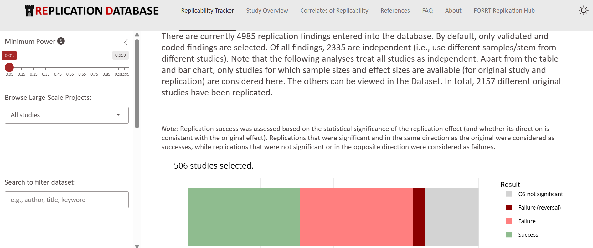{fig-align=center width=100% fig-alt="An image of the landing page of the FORRT Replication database"}


::: footer
**FORRT Replication Database** ([https://forrt-replications.shinyapps.io/fred_explorer/](https://forrt-replications.shinyapps.io/fred_explorer/))
:::


