```{r}
#| include: false
library(ggplot2)
library(ggimage)
library(pwr)
source("functions.R")
```

::: {style="line-height: 1.2;"}
{fig-align="center" height=150px}
:::

::: {.smallest style="margin-top: -40px"}
Simonsohn, U., Nelson, L. D., & Simmons, J. P. (2014). P-curve: A key to the file-drawer. *Journal of Experimental Psychology: General, 143*, 534-547.
:::

::: {style="margin-top: -10px"}
{fig-align="center" height=150px}
::: 

::: {.smallest style="margin-top: -40px"}
Simonsohn, U., Nelson, L. D., & Simmons, J. P. (2014). p-Curve and Effect Size: Correcting for Publication Bias Using Only Significant Results. *Perspectives on Psychological Science, 9*, 666–681.
:::

::: {style="margin-top: -10px"}
{fig-align="center" height=150px}
:::

::: {.smallest style="margin-top: -40px"}
Simonsohn, U., Simmons, J. P., & Nelson, L. D. (2015). Better P-curves: Making P-curve analysis more robust to errors, fraud, and ambitious P-hacking, a Reply to Ulrich and Miller (2015). *Journal of Experimental Psychology: General, 144*, 1146–1152. doi:10.1037/xge0000104
:::

## The ***p*** distribution {transition="slide-in fade-out"}

* Given a certain statistical power (or, effect size + sample size), the distribution of ***p***-values has a certain shape.
* Under the H₀, the ***p***-curve is uniformly distributed. That means, each ***p***-value is equally likely.

```{r}
#| echo: false
#| warning: false
#| message: false
print(plot_h0(stage = 1))
```

## The ***p*** distribution {transition="fade-in fade-out"}
### Null effect

* Running a study without a real effect is like drawing a random ***p***-value from this distribution

```{r}
#| echo: false
#| warning: false
#| message: false
print(plot_h0(stage = 2))
```

## The ***p*** distribution {transition="fade-in slide-out"}
### Null effect

* Running a study without a real effect is like drawing a random p-value from this distribution
* 5% of all p-values are <5%.

```{r}
#| echo: false
#| warning: false
#| message: false
print(plot_h0(stage = 3))
```

## ***p***-curve {transition="slide-in fade-out"}
### Effect size > 0

* With increasing power, the ***p***-curve gets more positively skewed

```{r}
#| echo: false
#| warning: false
#| message: false
print(pcurve_plot(.10, ymax = 8, sig.region = TRUE))
```

## ***p***-curve {transition="fade-in fade-out"}
### Effect size > 0

* With increasing power, the ***p***-curve gets more positively skewed

```{r}
#| echo: false
#| warning: false
#| message: false
print(pcurve_plot(.35, ymax = 12, sig.region = TRUE, label = "35 % power\n(average in psychology)"))
```

## ***p***-curve {transition="fade-in slide-out"}
### Effect size > 0

* With increasing power, the ***p***-curve gets more positively skewed

```{r}
#| echo: false
#| warning: false
#| message: false
print(pcurve_plot(.80, ymax = 30, sig.region = TRUE))
```

---

::: {style="line-height: 1.2;"}
{fig-align="center" height="200px"}
:::

::: {style="margin-top: -50px; text-align: center;"}
{fig-align="center" height="450px"}
:::

::: {style="margin-top: -50px; text-align: center;"}
<http://rpsychologist.com/d3/pdist>
:::

## Elderly priming p-values
### 60% power

```{r}
#| echo: false
#| warning: false
#| message: false
print(plot_special_2(example = TRUE))
```

## Publication bias

* Only results with ***p*** < .05 pass the journals' "**significance filter**”
* Journals' selection, or pre-emptive self-selection: "This won't get published, I don't even try."
* Result: Selective & biased picture in the literature

```{r}
#| echo: false
#| warning: false
#| message: false
print(plot_special_2(publication_bias = TRUE))
```

## Elderly priming ***p***-values
### <http://p-curve.com/>

::: {.column width="27%"}
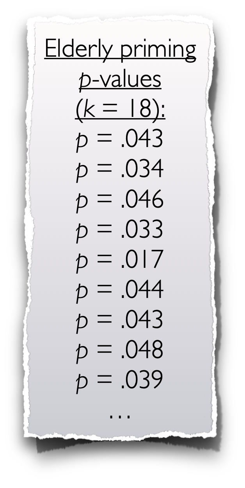
:::

::: {.column width="55%"}
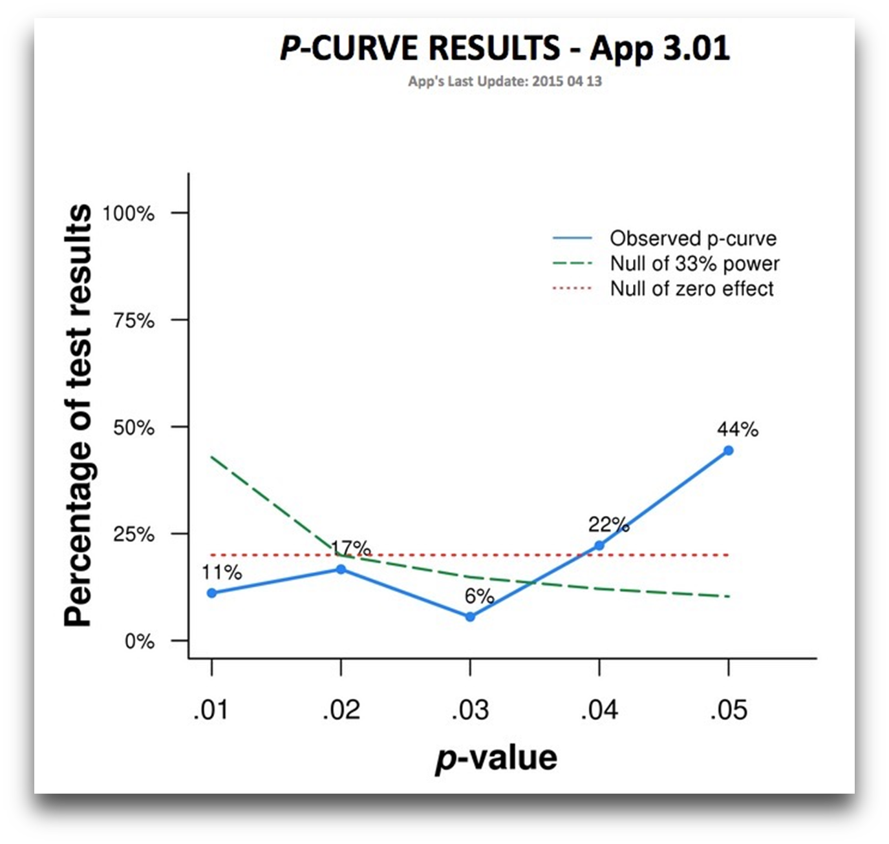
:::

---

::: {style="line-height: 1.2;"}
{fig-align="center" width="70%"}
:::

::: {.smallest style="margin-top: -40px"}
"<mark>*It may seem that the existence of 33 supportive published studies is enough to conclude that there is an effect of expansive versus contractive posture on psychological outcomes.*</mark>"
:::

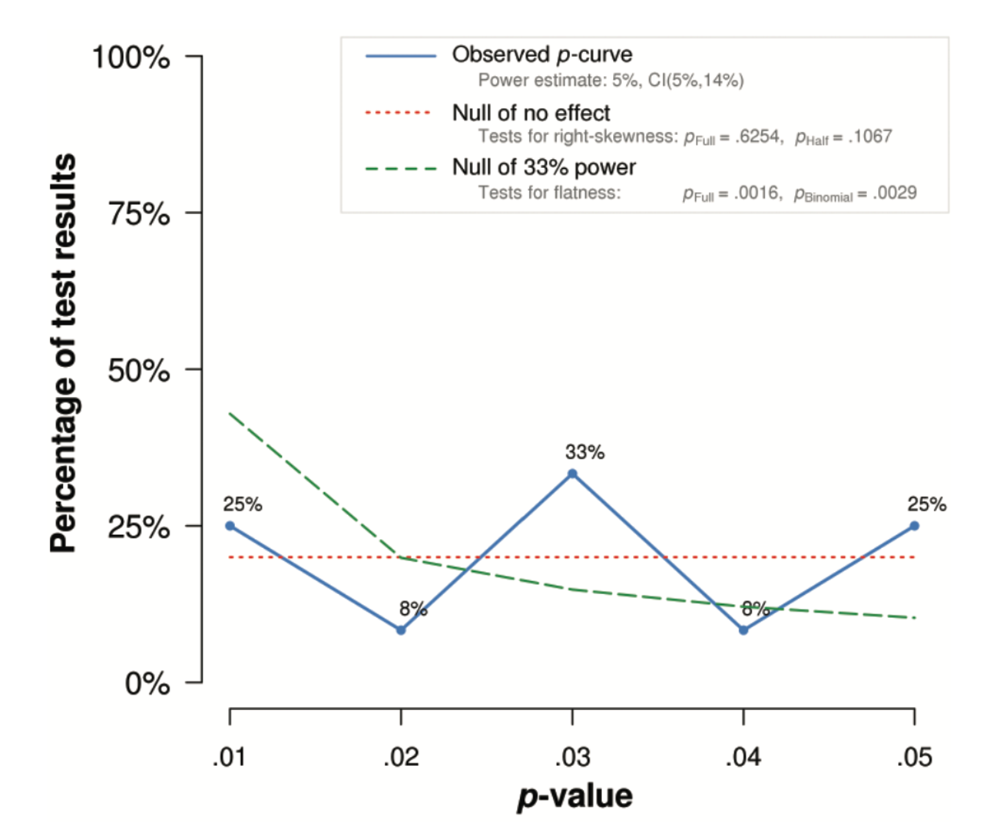{fig-align="center" width=45%}

::: {.smallest style="margin-top: -40px; text-align: center;"}
***p***-curve analysis of 24 significant studies
:::

## Evidential value of what?

* The evidential value of the **set** of studies is examined
  * All conclusion from ***p***-curve are about the analyzed set of studies - no inference on single study possible.
  * E.g., one can say that a set is probably ***p***-hacked - but not which of these studies has been hacked!
* "A right-skewed ***p***-curve does not imply all studies have evidential value, just as a significant difference across conditions does not imply that all observations were influenced by the manipulation."

## Unit of analysis

* Multiple studies on one **effect** (ideally, direct replications): What is the evidential value of this effect?
* Multiple studies from one first **author**: Does person X publish in general studies with evidential value? Or is pure publication bias and/or p-hacking an explanation for this set of studies?
* Compare studies from specific **journals**, or between **research fields**: Which journal/ research field publishes a stronger evidential value?

## Steps of a ***p***-curve

1. Identify researchers’ stated hypothesis and study design 
2. Identify the statistical result testing the stated hypothesis 
3. Report the statistical results of interest
4. (Recompute the precise ***p***-value(s) based on reported test statistics) ➙ done by the app
5. Report robustness results

## Which ***p***-values are selected?

* Included p values must meet three criteria: 
  1. test the hypothesis of interest,
    * not a manipulation check, etc.
  2. have a uniform distribution under the null
    * this usually has to be assumed
  3. be statistically independent of other ***p***-values in ***p***-curve.
    * Several, correlated DVs: Only take one
    * Rule of thumb: Only take one ***p***-value per sample

## Disclosure table

* Hacking a p-curve? Easy: only include results that look fishy to you, or drop strong studies
* Goal: Minimize subjectivity
* Define an a-priori inclusion rule
* Do a robustness analysis: Compute ***p***-curve with alternative selection ➙ same results?
* Report all selected test statistics in a disclosure table:

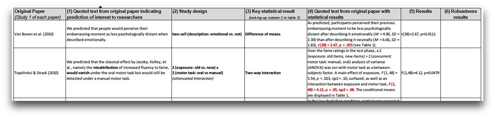{fig-align="center"}

## Inclusion rule

* The rule should be set in advanced, before statistical results are analyzed, and disclosed in the paper.
* Examples (from p-curve.com)
  * The yearly top-5 most cited articles in the Quarterly Research Journal 1984-1989.
  * All studies published in 2009 with wine as a manipulation and simulated driving behavior as a dependent variable. 
  * The most recent 10 articles published by proctologist Giordano Armani. 
  * Clinicaltrials.gov registered studies examining antidepressants among teenagers.
* More examples:
  * If multiple DVs are reported, always take the first.
  * We analyzed the last 20 publications from this research group.
  * We analyzed the first hundred papers with more than two studies from the 2008 volume of journal XYZ.

## Practical issues

* How many ***p***-values minimum?
  * No clear guidelines; tentative suggestion: at least 5; more is better
  * Power of ***p***-curve's statistical tests depends on # of entered ***p***-values
* Beware of strange patterns: Maybe not captured by statistical tests of slope. Visual inspection of ***p***-curve!

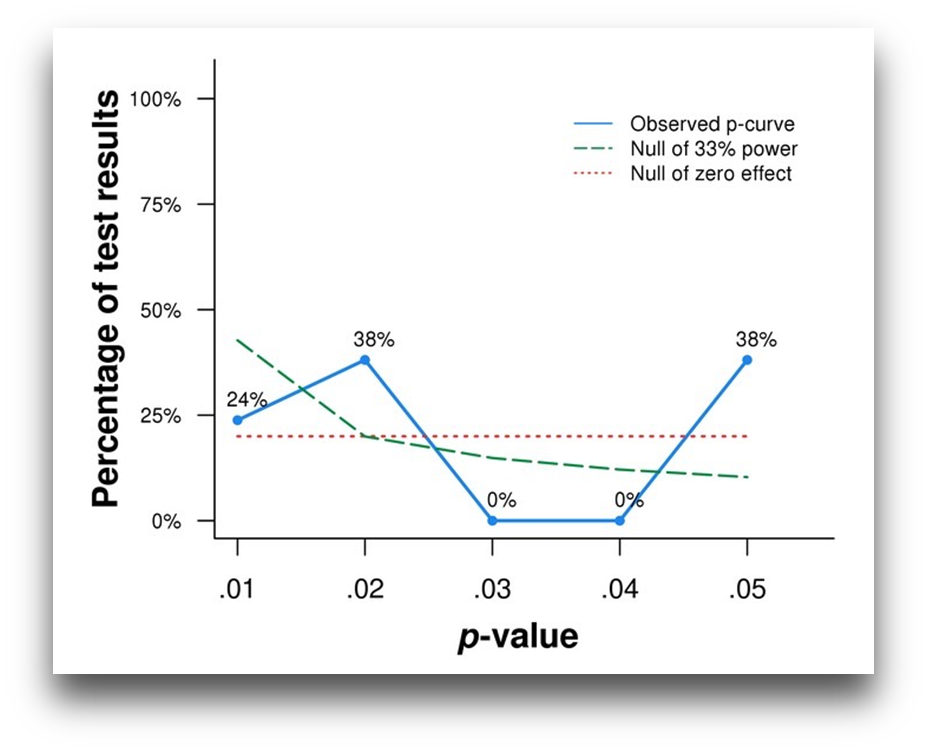{fig-align="center"}

## Interactions: 
### Which ***p***-values to include?

* Attenuation predicted: include only interaction term
  * "Always sweat more in summer, but less so when indoors."
* Reversal of direction predicted: include both simple slopes (but not interaction term)
  * "Sweat more in summer than winter when outdoors, but more in winter than in summer when indoors"

<http://p-curve.com/guide.pdf>

## Application:
### Compare two journals

* Journal of Personality and Social Psychology JPSP (impact factor: 4.736)
* Journal of Applied Social Psychology JASP (impact factor: 1.006)

{fig-align="center"}

* Bachelor thesis by Anna Bittner
* 112 resp. 113 hand-coded focal effects from the 2013 issues of both journals (starting in January)

## JPSP vs. JASP:
### ***p***-curve

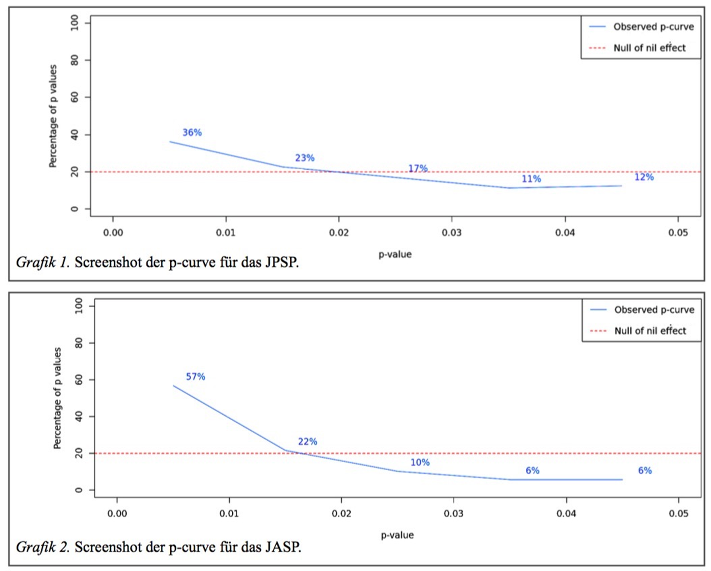{fig-align="center"}

::: {.smaller style="text-align: center;"}
**JPSP**: estimated average power: **30%**  
**JASP**: estimated average power: **91%**
:::

---

:::: {.columns style="display: flex; align-items: center;"}

::: {.column width="35%"}
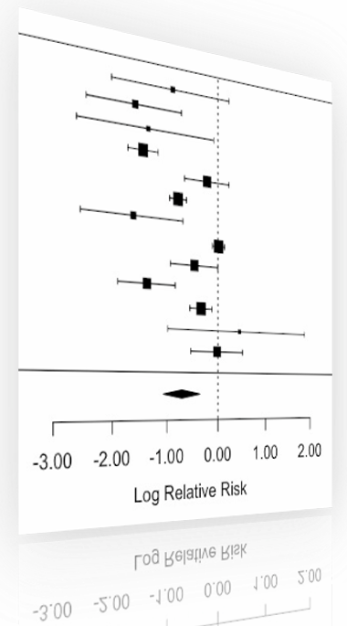
:::

::: {.column width="65%"}
<div style=" font-size: 60px;">
But meta-analyses reveal the truth! (Do they?)
</div>
:::

::::

---

:::{style="margin-top: -40px"}
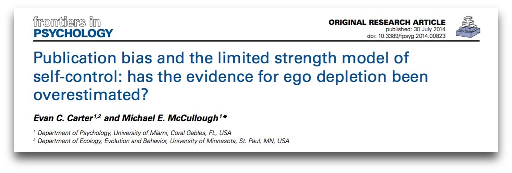{fig-align="center" width=60%}
:::

:::{style="margin-top: -50px"}
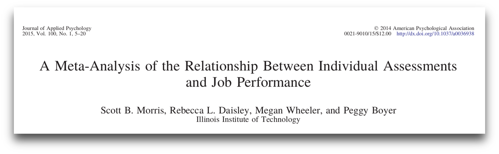{fig-align="center" width=60%}
:::

:::{style="margin-top: -50px"}
{fig-align="center" width=60%}
:::

---

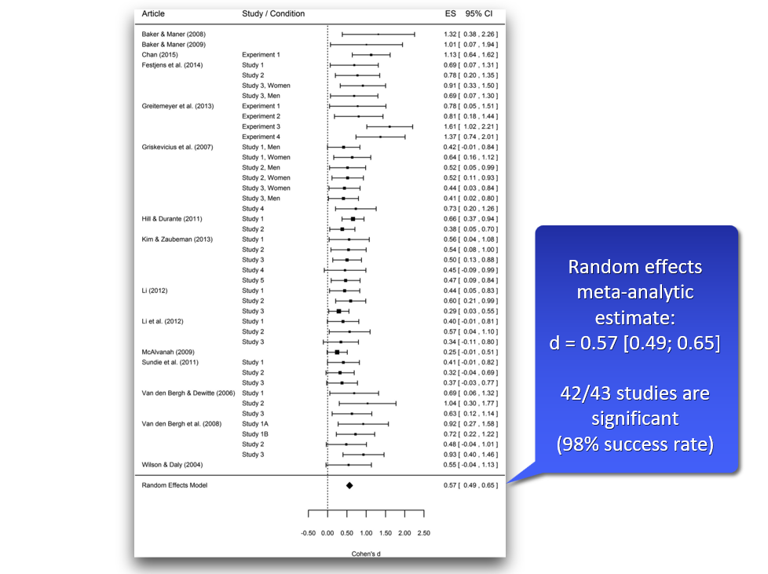{fig-align="center"}

## True H₁ samples: 
### d = 0.5

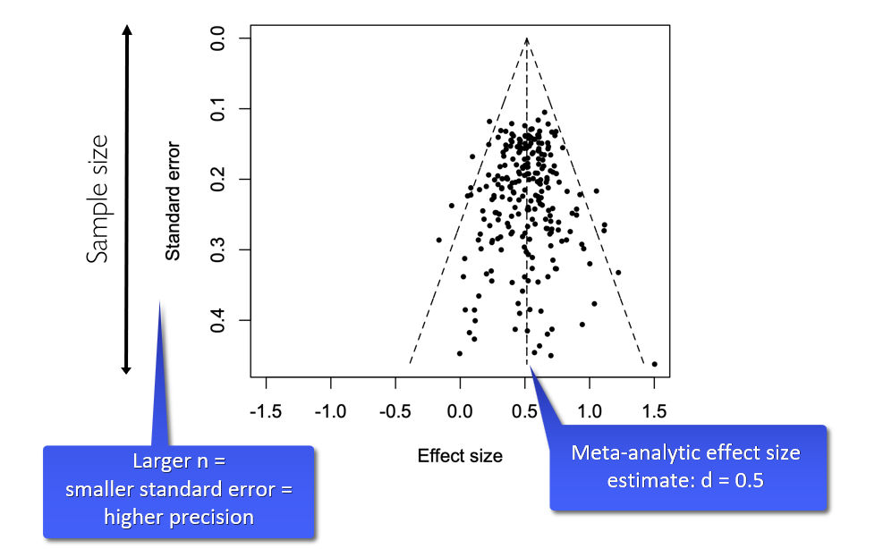

## True H₁ samples:
### d = 0.5

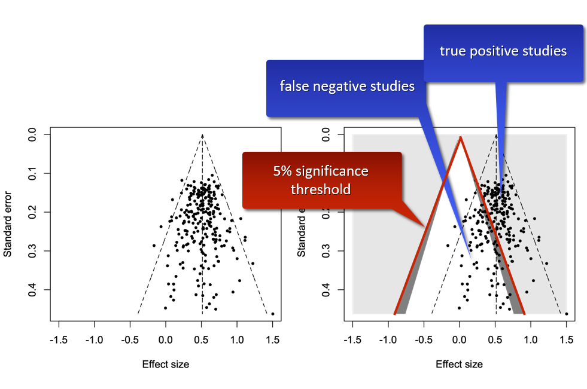{fig-align="center"}

## True H₀ samples

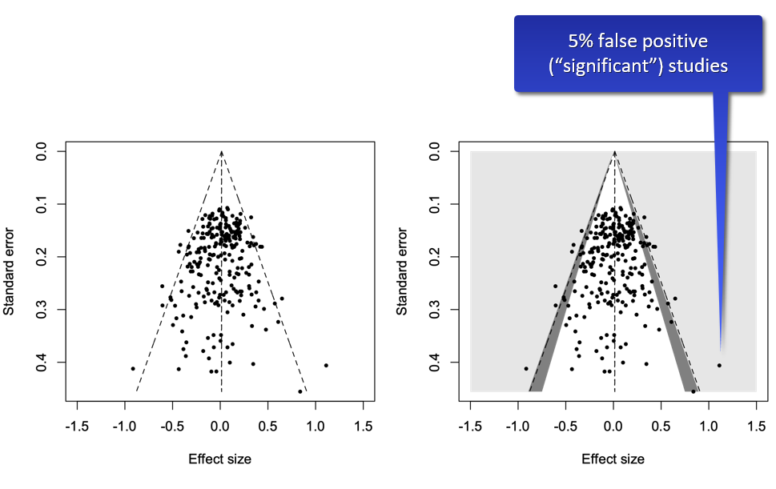{fig-align="center"}

## True H₀ + publication bias

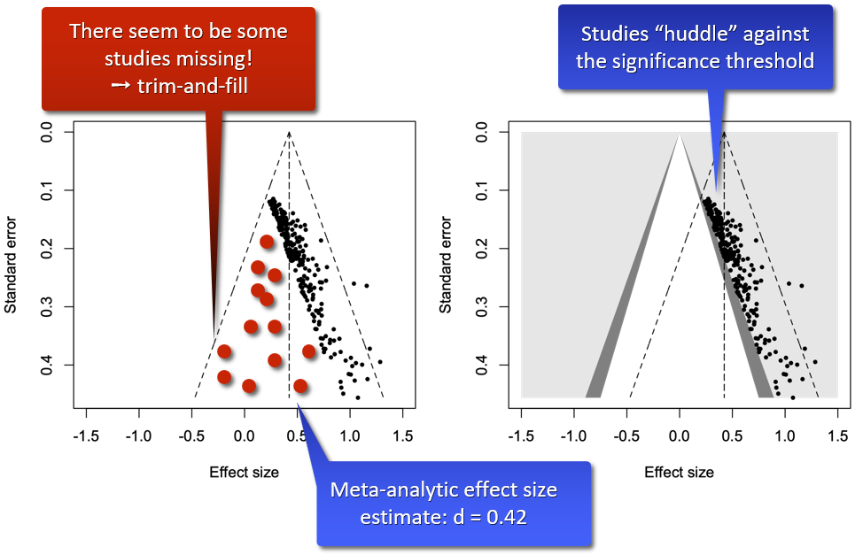{fig-align="center"}

## True H₀ + publication bias

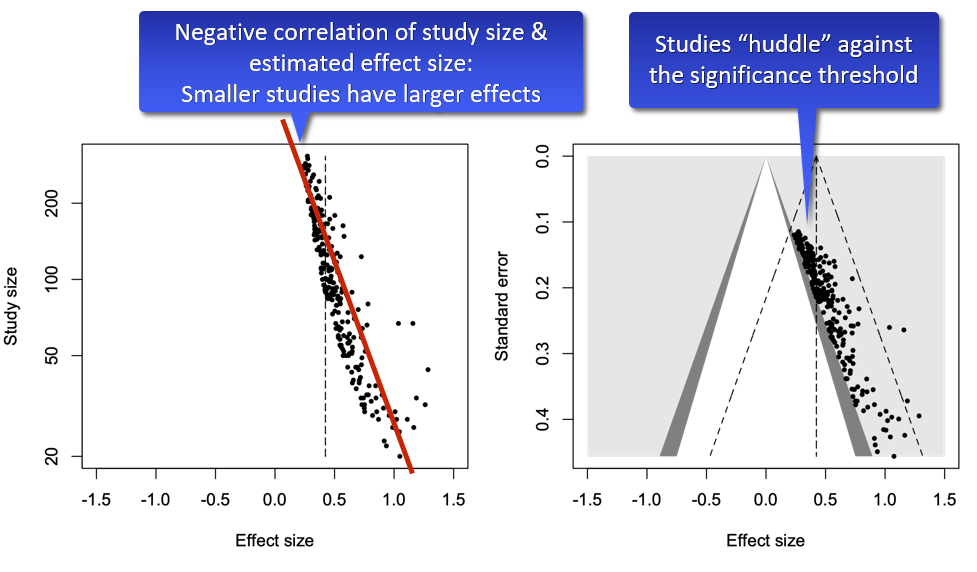{fig-align="center"}

## Begg & Mazumdar test

* Begg & Mazumdar’s test for publication bias:Rank correlation between effect and its precision (i.e., standard error of effect size)
  * Alternatively: Rank correlation between effect size and sample size
* Significant negative correlation = sign of publication bias
* Good Type I error control (i.e., false alarms at nominal, say, 5% level)
* Low power (i.e., no significant correlation is not necessarily a good sign for no publication bias)

:::: aside
::: {.smaller}
Begg, C. B., & Mazumdar, M. (1994). Operating characteristics of a rank correlation test for publication bias. Biometrics, 50(4), 1088. <http://doi.org/10.2307/2533446>
:::
::::

## JPSP vs. JASP: ***R-index & TIVA***

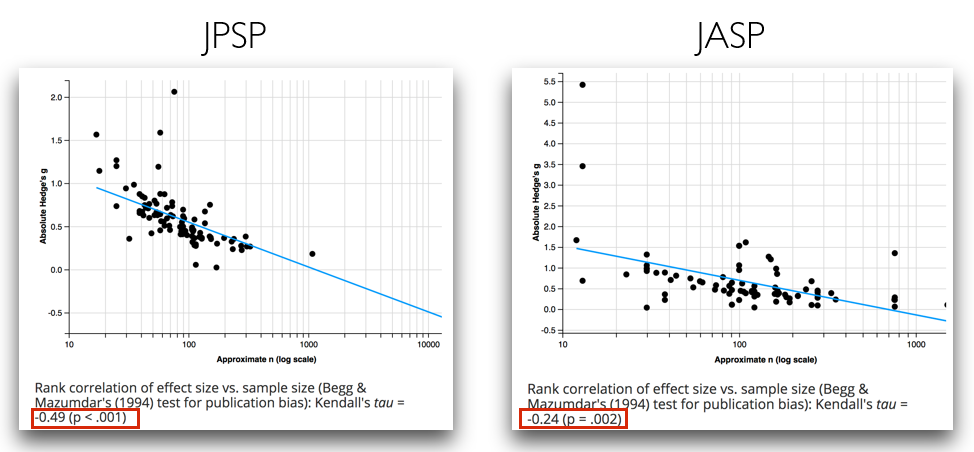{fig-align="center"}

{fig-align="center" height="130px"}

## Egger's regression test

:::: {.columns}

::: {.column width="50%"}
* If slope of regression line ≠ zero (with ***p*** < .10): indication of publication bias
* Same idea like Begg & Mazumdar, but "probably more powerful" in detection of bias
:::

::: {.column width="50%"}
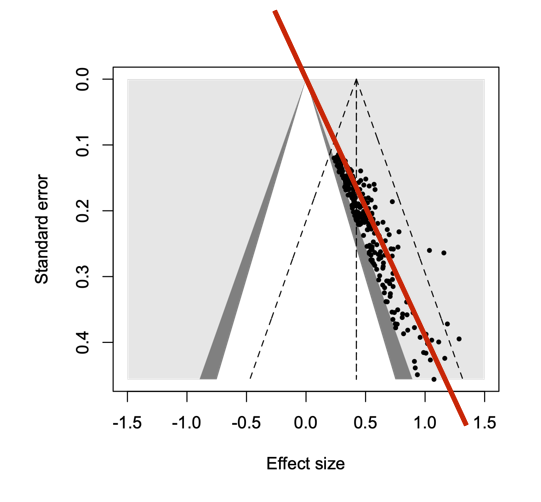{style="margin-top: -1.5em;"}
:::

::::

## Extending Egger's test: PET

:::: {.columns}

::: {.column width="50%"}
* Use Egger's regression line, but do not focus on slope, but on the ***intercept***!
* What is the expected ES at maximum precision (i.e., zero SE)?
* Intercept = estimate for true underlying effect correct for small-study effects
* PET = precision effect test
:::

::: {.column width="50%"}
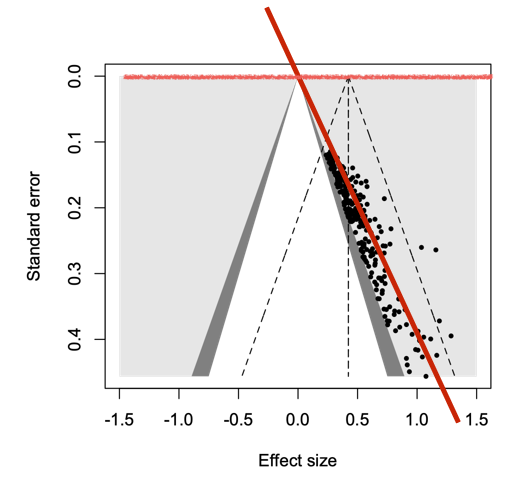{style="margin-top: -1.5em;"}
:::

::::

:::: aside
::: {.smaller}
Stanley, T. D., & Doucouliagos, H. (2013). Meta-regression approximations to reduce publication selection bias. Research Synthesis Methods, 5(1), 60–78. 
<http://doi.org/10.1002/jrsm.1095>
:::
::::

## PET-PEESE
### (Stanley & Doucou)

::: {.smallest}
* PEESE = precision-effect estimate with standard error ➙ effect size is regressed on the variance rather than standard error
* As in PET: Intercept is interpreted as estimate of true effect
* Simulation studies show: PET underestimates if true effect is non-zero, PEESE overestimates if true effect is zero.
* ➙ Suggestion: If PET intercept is not significant with p > .05, (i.e.: corrected ES does not differ from zero), use the PET intercept as estimate. If PET intercept significantly differs from zero, use PEESE intercept as estimate.
* No real theoretical foundation - just the ad-hoc solution that worked best.
:::

```{r}
#| eval: false
#| echo: true
# R Code
PET = lm(d~se, weights = 1/v)
PEESE = lm(d~se^2, weights = 1/v)
```

:::: aside

::: {.smallest}
Appendix of Carter, E. C., & McCullough, M. E. (2014). Publication bias and the limited strength model of self-control: has the evidence for ego depletion been overestimated? Personality and Social Psychology, 5, 823.

Stanley, T. D., & Doucouliagos, H. (2013). Meta-regression approximations to reduce publication selection bias. Research Synthesis Methods, 5(1), 60–78. 
<http://doi.org/10.1002/jrsm.1095>
:::

::::

---

:::{style="margin-top: -40px"}
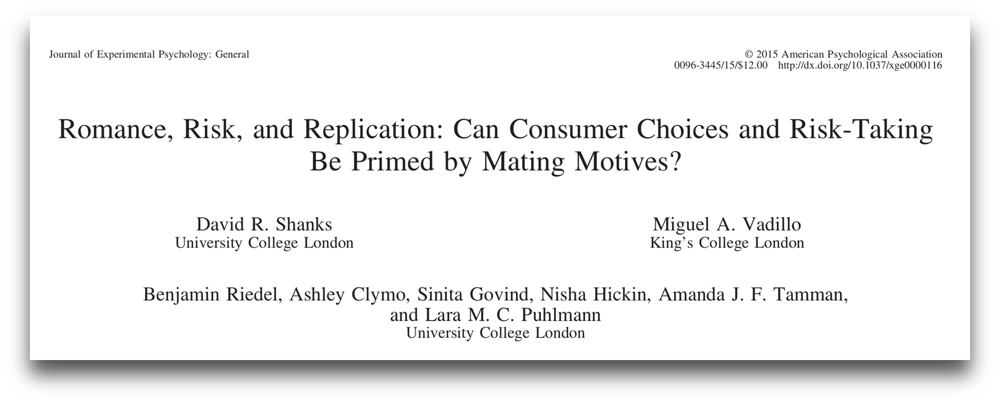{fig-align="center" height="250px"}
:::

:::{style="margin-top: -50px"}
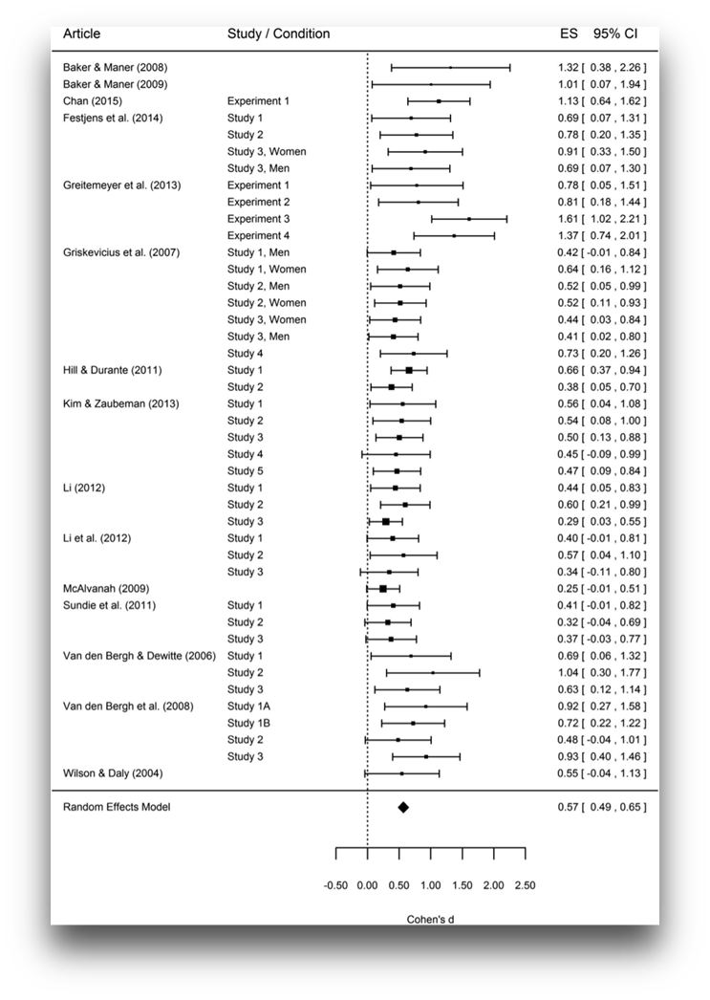{fig-align="center" height="450px"}
:::

## {transition="slide-in fade-out"}

:::{style="margin-top: -40px"}
{fig-align="center" height="250px"}
:::

:::{style="margin-top: -60px"}
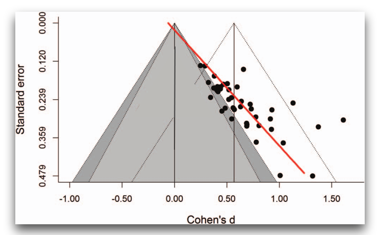{fig-align="center" height="400px"}
:::

## {transition="fade-in slide-out"}

:::{style="margin-top: -40px"}
{fig-align="center" height="250px"}
:::

:::{style="margin-top: -60px"}
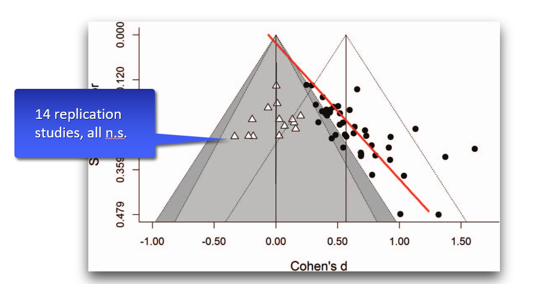{fig-align="center" height="400px"}
:::

---

:::{style="margin-top: -40px"}
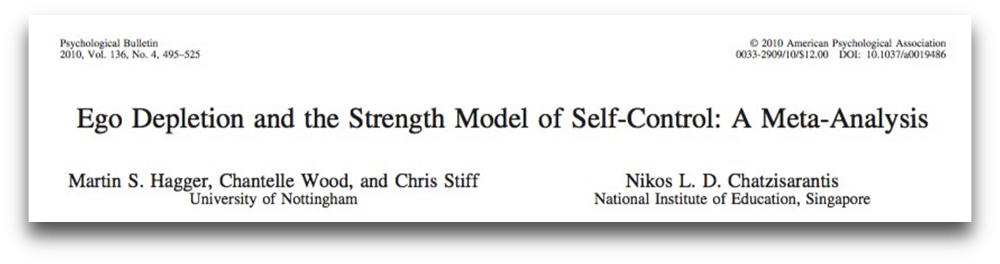{fig-align="center"}
:::

:::{style="margin-top: -70px"}
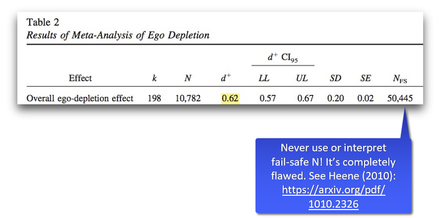{fig-align="center"}
:::

---

:::{style="margin-top: -40px"}
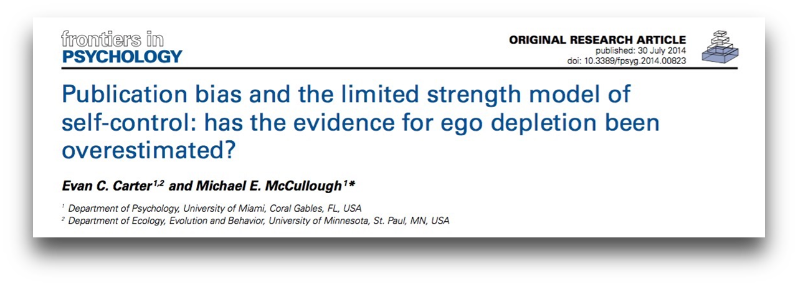{fig-align="center" height="250px"}
:::

::: {.smallest style="margin-top: -40px"}
"Instead, we believe our results are best interpreted as demonstrating that the current <mark>*evidence for the depletion effect is not convincing, despite the hundreds of experiments that have examined it.*</mark>"
:::

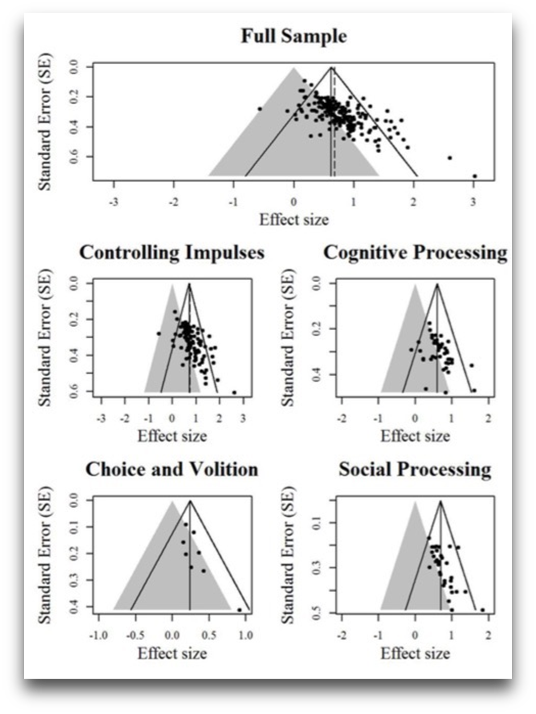{fig-align="center" height="350px"}

---

:::{style="margin-top: -40px"}
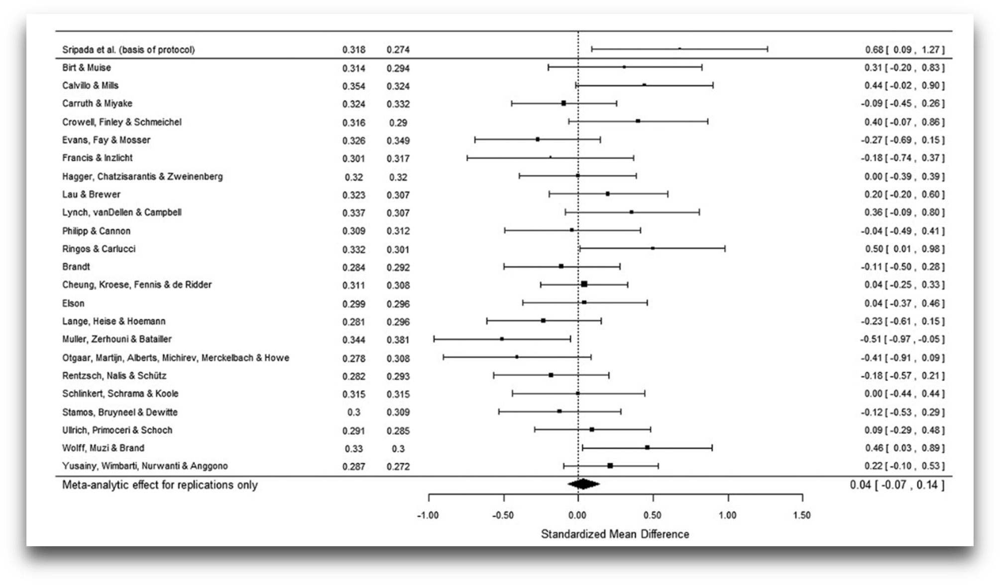{fig-align="center" height="400px"}
:::

:::{style="margin-top: -50px"}
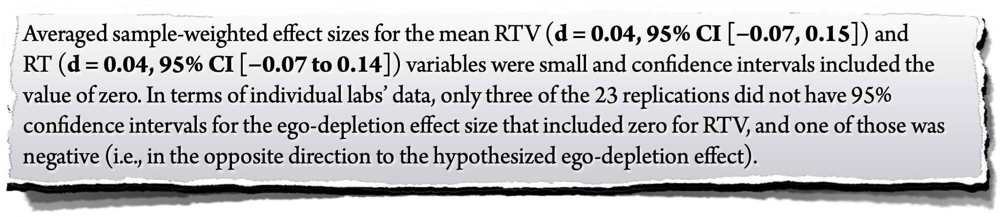{fig-align="center" height="200px"}
:::

:::: aside
::: {.smaller}
Hagger, M. S., & Chatzisarantis, N. L. D. (2016). A Multilab Preregistered Replication of the Ego-Depletion Effect. 
Perspectives on Psychological Science, 11(4), 546–573. 
<http://doi.org/10.1177/1745691616652873>
:::
::::

## {transition="slide-in fade-out"}

:::{style="margin-top: 150px"}
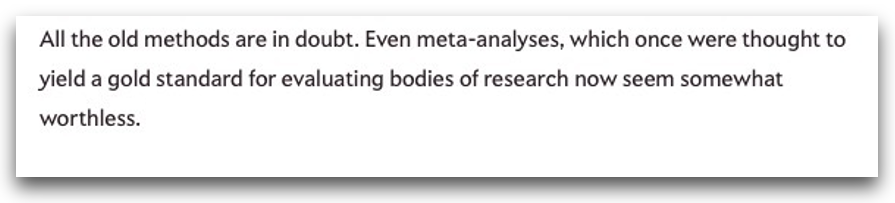{fig-align="center"}
:::

:::: aside
::: {.smaller style="overflow-wrap: anywhere;"}
<http://www.slate.com/articles/health_and_science/cover_story/2016/03/ego_depletion_an_influential_theory_in_psychology_may_have_just_been_debunked.single.html>
:::
::::

## {transition="fade-in slide-out"}

:::{style="margin-top: 150px"}
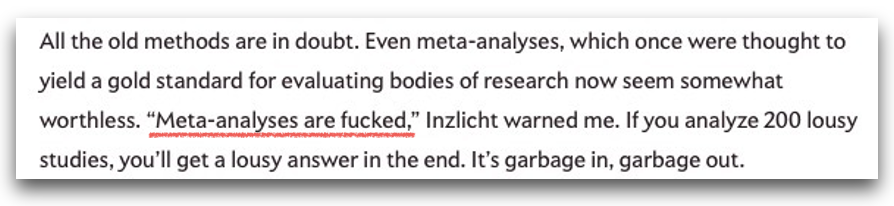{fig-align="center"}
:::

:::: aside
::: {.smaller style="overflow-wrap: anywhere;"}
<http://www.slate.com/articles/health_and_science/cover_story/2016/03/ego_depletion_an_influential_theory_in_psychology_may_have_just_been_debunked.single.html>
:::
::::

---

:::{style="margin-top: -40px"}
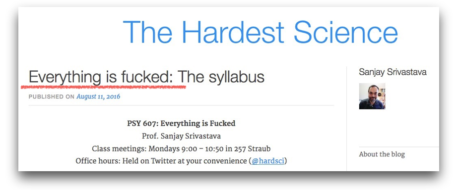{fig-align="center" height="250px"}
:::

:::{style="margin-top: -60px"}
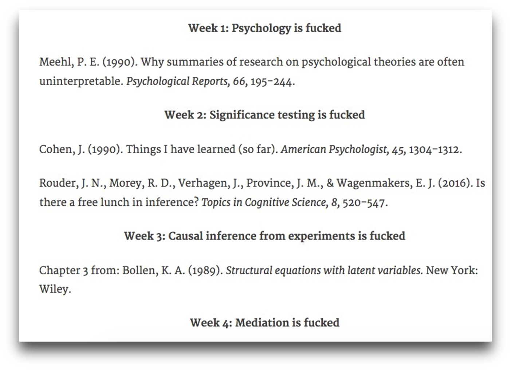{fig-align="center" height="400px"}
:::

:::: aside
::: {.smaller}
<https://hardsci.wordpress.com/2016/08/11/everything-is-fucked-the-syllabus/>
:::
::::

## Practice with p-checker

<http://shinyapps.org/apps/p-checker/>

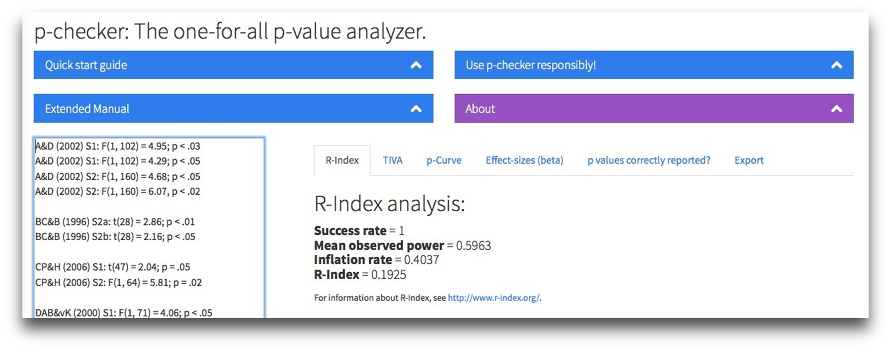{fig-align="center"}

---

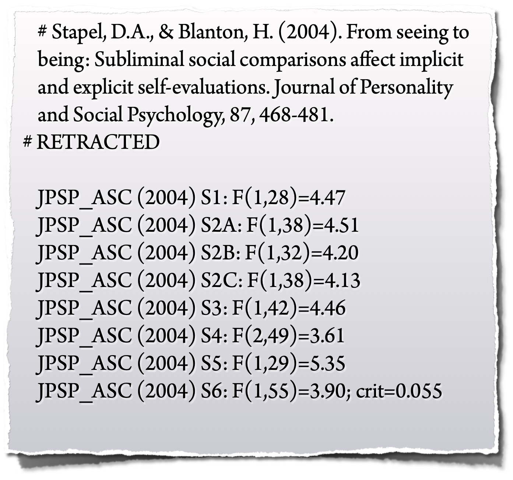{fig-align="center"}

## "A tale of two papers"
### by Michael Inzlicht

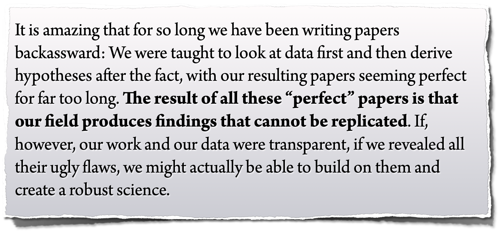{fig-align="center"}

:::: aside
::: {.smaller}
<http://sometimesimwrong.typepad.com/wrong/2015/11/guest-post-a-tale-of-two-papers.html>
:::
::::

## "A tale of two papers"
### by Michael Inzlicht

::: {style="margin-top: -40px;"}
:::: {.columns}

::: {.column width="25%"}
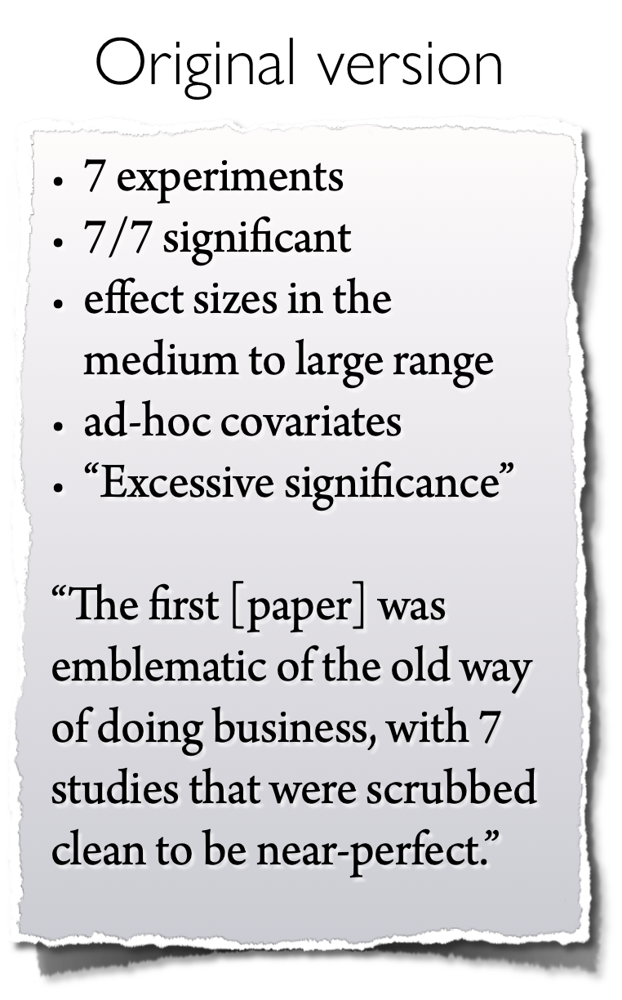
:::

::: {.column width="25%"}
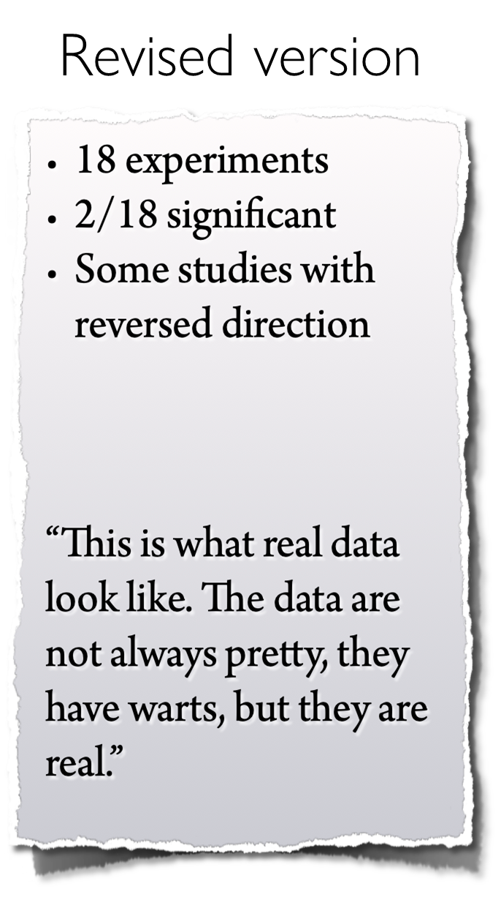
:::

::: {.column width="25%"}
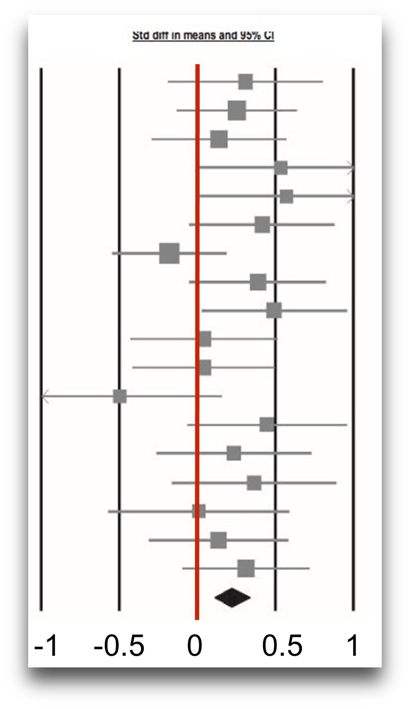
:::

::::
:::

:::: aside
::: {.smaller}
<http://sometimesimwrong.typepad.com/wrong/2015/11/guest-post-a-tale-of-two-papers.html>

Tuk, M. A., Zhang, K., & Sweldens, S. (2015). The Propagation of Self-Control: Self-Control in One Domain Simultaneously Improves Self-Control in Other 
Domains. Journal of Experimental Psychology: General, 144, 639–654. <http://doi.org/10.1037/xge0000065>
:::
::::

---

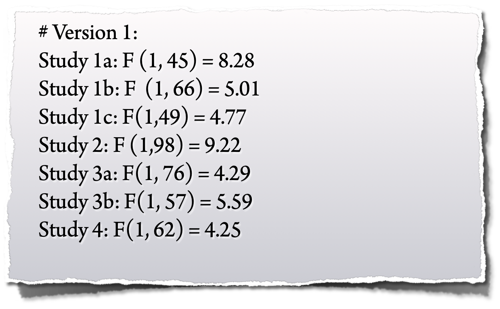

## Informed skepticism
### (“detection of Don’ts”)

* We have indicators which allow to evaluate the credibility and evidential value of a line of research
* ***p***-curve, R-index/ excess significance, TIVA, meta-regression techniques
* None of these techniques is perfect - but look out for (converging) **red flags** 
* Use these flags for informed skepticism (not for a "witch hunt" or "replication police")

## Red flags

::: {style="margin-top: -40px;"}
{height="100px"}
:::

::: {style="margin-top: -20px;"}
* Sweeping claims, counterintuitive, and shocking results
* Most ***p*** values are in the range of .03 – .05
  * ***p***-curve is not right-skewed
  * TIVA: Smaller variance of ***p***-values than expected
* A highly cited result, but no direct replications have been published so far
* Too good to be true
  * R-index < 40% / “Excess significance”
  * Biased meta-analysis: Asymmetric funnel plot
:::

:::: aside
::: {.smaller}
<http://www.nicebread.de/in-the-era-of-repligate-what-are-valid-cues-for-the-trustworthiness-of-a-study/>
:::
::::

## (Possibly) Invalid flags

::: {style="margin-top: -40px;"}
{height="100px"}
:::

::: {style="margin-top: -20px;"}
* Impact factor of journal
* The author’s h-index
* Meta-analyses
  * Garbage-in, garbage-out: Meta-analyses of a biased literature produce biased results. 
  * Typical correction methods do not work well. Jury is still out for new developments such as PET-PEESE.
  * When looking at meta-analyses, at least one has to check whether and how it was corrected for publication bias. Trim-&-Fill does ***not*** work well.
:::

:::: aside
::: {.smaller}
<http://www.nicebread.de/in-the-era-of-repligate-what-are-valid-cues-for-the-trustworthiness-of-a-study/>
:::
::::

## Green flags

::: {style="margin-top: -40px;"}
{height="100px"}
:::

::: {.smaller style="margin-top: -20px;"}
* Pre-registration
* High Power
  * Larger samples, within-designs
* Independent high-power replications
* Open Data and Open Material
  * Willingness to share research data is related to the strength of the evidence and the quality of reporting of statistical results (Wicherts, Bakker, & Molenaar, 2011)
  * Quarterly Journal of Political Science:  54% of papers “had results in the paper that differed from those generated by the author’s own code” ➙ a well prepared data set and analysis code should be a validity indicator
* Using the "[21 Word Solution](http://c.ymcdn.com/sites/www.spsp.org/resource/resmgr/dialogue/dialogue_26%282%29.pdf)" of Simmons, Nelson, & Simonsohn (2012)
:::

:::: aside
::: {.smaller}
<http://www.nicebread.de/in-the-era-of-repligate-what-are-valid-cues-for-the-trustworthiness-of-a-study/>
:::
::::
