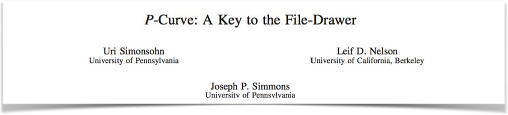
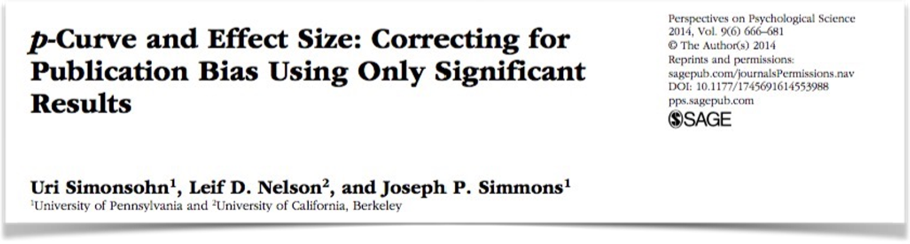
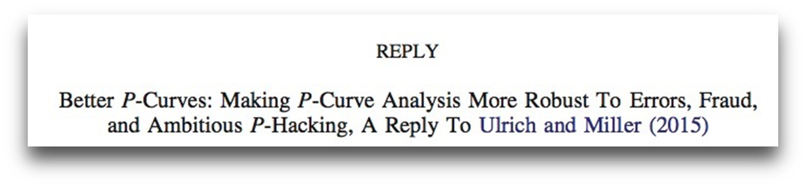
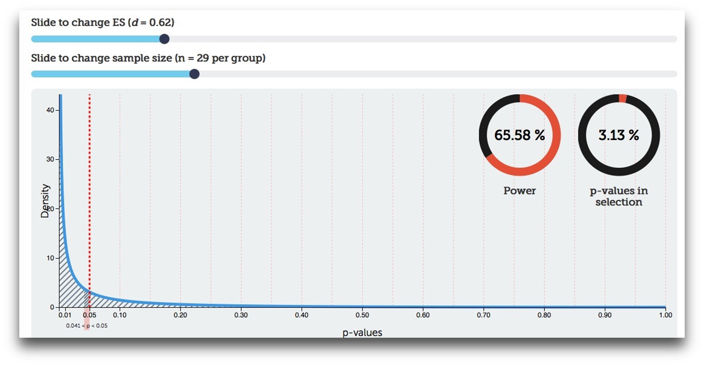

```{r}
#| include: false
library(ggplot2)
library(pwr)
source("functions.R")
```

::: {style="line-height: 1.2;"}
{fig-align="center" height=150px}

::: {.smaller style="margin-top: -40px"}
Simonsohn, U., Nelson, L. D., & Simmons, J. P. (2014). P-curve: A key to the file-drawer. *Journal of Experimental Psychology: General, 143*, 534-547.

::: {style="margin-top: -10px"}
{fig-align="center" height=150px}

::: {.smaller style="margin-top: -40px"}
Simonsohn, U., Nelson, L. D., & Simmons, J. P. (2014). p-Curve and Effect Size: Correcting for Publication Bias Using Only Significant Results. *Perspectives on Psychological Science, 9*, 666–681.

::: {style="margin-top: -10px"}
{fig-align="center" height=150px}

::: {.smaller style="margin-top: -40px"}
Simonsohn, U., Simmons, J. P., & Nelson, L. D. (2015). Better P-curves: Making P-curve analysis more robust to errors, fraud, and ambitious P-hacking, a Reply to Ulrich and Miller (2015). *Journal of Experimental Psychology: General, 144*, 1146–1152. doi:10.1037/xge0000104

:::
:::
:::
:::
:::
:::

## The ***p*** distribution

* Given a certain statistical power (or, effect size + sample size), the distribution of ***p***-values has a certain shape.
* Under the H₀, the ***p***-curve is uniformly distributed. That means, each ***p***-value is equally likely.

```{r}
#| echo: false
#| warning: false
#| message: false
print(plot_h0(stage = 1))
```

## The ***p*** distribution - null effect

* Running a study without a real effect is like drawing a random ***p***-value from this distribution

```{r}
#| echo: false
#| warning: false
#| message: false
print(plot_h0(stage = 2))
```

## The ***p*** distribution - null effect

* Running a study without a real effect is like drawing a random p-value from this distribution
* 5% of all p-values are <5%.

```{r}
#| echo: false
#| warning: false
#| message: false
print(plot_h0(stage = 3))
```

## ***p***-curve: Effect size > 0

* With increasing power, the ***p***-curve gets more positively skewed

```{r}
#| echo: false
#| warning: false
#| message: false
print(pcurve_plot(.10, ymax = 8, sig.region = TRUE))
```

## ***p***-curve: Effect size > 0

* With increasing power, the ***p***-curve gets more positively skewed

```{r}
#| echo: false
#| warning: false
#| message: false
print(pcurve_plot(.35, ymax = 12, sig.region = TRUE, label = "35 % power\n(average in psychology)"))
```

## ***p***-curve: Effect size > 0

* With increasing power, the ***p***-curve gets more positively skewed

```{r}
#| echo: false
#| warning: false
#| message: false
print(pcurve_plot(.80, ymax = 30, sig.region = TRUE))
```

---

::: {style="line-height: 1.2;"}
{fig-align="center" height="200px"}

::: {style="margin-top: -50px; text-align: center;"}
{fig-align="center" height="450px"}

::: {style="margin-top: -50px; text-align: center;"}
<http://rpsychologist.com/d3/pdist>

:::
:::
:::